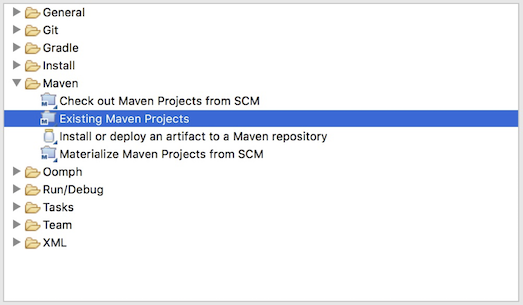

## **Pobierz Aspose.Slides z GitHub**
Wszystkie przykłady Aspose.Slides dla Javy są hostowane na [Github](https://github.com/aspose-slides/Aspose.Slides-for-Java). Możesz sklonować repozytorium używając swojego ulubionego klienta Github lub pobrać plik ZIP z [tutaj](https://codeload.github.com/aspose-slides/Aspose.Slides-for-Java/zip/master).

Rozpakuj zawartość pliku ZIP do dowolnego folderu na swoim komputerze. Wszystkie przykłady znajdują się w folderze **Examples**.


## **Importuj Przykłady do IDE**
Projekt używa systemu budowania Maven. Każde nowoczesne IDE może łatwo otworzyć lub zaimportować projekt oraz jego zależności. Poniżej pokazujemy, jak używać popularnych IDE do budowania i uruchamiania przykładów.

### **IntelliJ IDEA**
Kliknij menu **File** i wybierz **Open**. Przejdź do folderu projektu i wybierz plik **pom.xml**.


Projekt zostanie otwarty i zależności zostaną pobrane automatycznie. Z zakładki Project przeglądaj przykłady w folderze **src/main/java**. Aby uruchomić przykład, kliknij prawym przyciskiem na pliku i wybierz "Run ..", przykład zostanie wykonany, a wynik zostanie wyświetlony w wbudowanym oknie konsoli.


### **Eclipse**
Kliknij menu **File** i wybierz **Import**. Wybierz **Maven** - Existing Maven Projects.



Przejdź do folderu, który sklonowałeś lub pobrałeś z GitHub i wybierz plik **pom.xml**. Projekt zostanie otwarty i zależności zostaną pobrane automatycznie. Z zakładki Package Explorer przeglądaj przykłady w folderze **src/main/java**. Aby uruchomić przykład, kliknij prawym przyciskiem na pliku i wybierz **Run As** - **Java Application**, przykład zostanie wykonany, a wynik zostanie wyświetlony w wbudowanym oknie konsoli.


### **NetBeans**
Kliknij menu **File** i wybierz **Open Project**. Przejdź do folderu, który sklonowałeś lub pobrałeś z GitHub. Ikona folderu **Examples** pokaże, że jest to projekt Maven. Wybierz Examples i otwórz go.


Projekt zostanie otwarty i zależności zostaną pobrane automatycznie. Z zakładki Projects przeglądaj przykłady w **source packages**. Aby uruchomić przykład, kliknij prawym przyciskiem na pliku i wybierz **Run File**, przykład zostanie wykonany, a wynik zostanie wyświetlony w wbudowanym oknie konsoli.


## **Dodaj bibliotekę Aspose.Slides do lokalnego repozytorium Maven**
Kiedy importujesz projekt **Aspose.Slides Examples** do IDE, Maven automatycznie pobiera plik JAR aspose.slides z [Aspose Maven Repository](https://releases.aspose.com/java/repo/com/aspose/). Jeśli nie masz dostępu do internetu, możesz ręcznie dodać plik JAR do swojego lokalnego repozytorium.

### **mvn install**
Pobierz [aspose.slides](https://releases.aspose.com/java/repo/com/aspose/aspose-slides/), wypakuj go i skopiuj plik aspose.slides-version.jar w inne miejsce, na przykład na dysk C. Wykonaj następujące polecenie:

```
mvn install:install-file
    - Dfile=c:\aspose.slides-version.jar
    - DgroupId=com.aspose
    - DartifactId=aspose-slides
    - Dversion={version}
    - Dpackaging=jar
```

Teraz plik JAR **aspose.slides** został skopiowany do twojego lokalnego repozytorium Maven.

### **pom.xml**
Po instalacji wystarczy zadeklarować współrzędne **aspose.slides** w pliku pom.xml. Dodaj następujące repozytorium w zakładce repositories i zależność w zakładce dependencies.

``` xml
<repository>
    <id>AsposeJavaAPI</id>
    <name>Aspose Java API</name>
    <url>https://releases.aspose.com/java/repo/</url>
</repository>

<dependency>
    <groupId>com.aspose</groupId>
    <artifactId>aspose-slides</artifactId>
    <version>25.12</version>
    <classifier>jdk16</classifier>
</dependency>
```

### **Done**
Zbuduj projekt, teraz plik JAR **aspose.slides** może być pobrany z twojego lokalnego repozytorium Maven.

## **Współtwórz**
Jeśli chcesz dodać lub ulepszyć przykład, zachęcamy do wkładu w projekt. Wszystkie przykłady i projekty demonstracyjne w tym repozytorium są open source i mogą być swobodnie używane w twoich własnych aplikacjach.

Aby współtworzyć, możesz stworzyć fork repozytorium, edytować kod źródłowy i złożyć Pull Request. Przejrzymy zmiany i, jeśli będą przydatne, włączymy je do repozytorium.