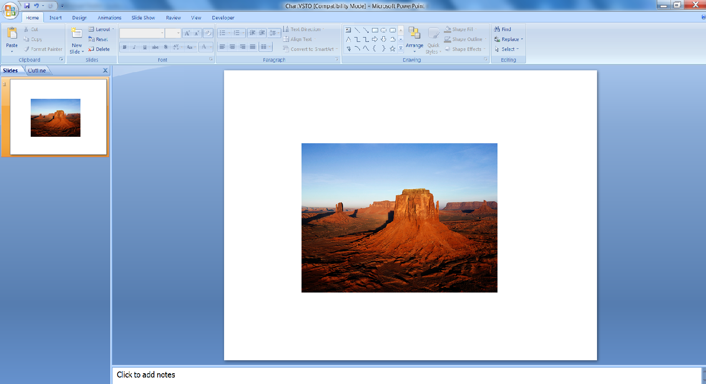

{} 

Ramki obrazu są stosowane do kształtów lub obrazów w programie Microsoft PowerPoint, aby otaczać obrazy w prezentacji. Ten artykuł pokazuje, jak programowo utworzyć ramkę obrazu i zastosować na niej animację, używając najpierw [VSTO 2008](/slides/pl/net/adding-picture-frame-with-animation/) a następnie [Aspose.Slides for .NET](/slides/pl/net/adding-picture-frame-with-animation/). Najpierw pokażemy, jak zastosować ramkę i animację przy użyciu VSTO 2008. Następnie pokażemy, jak wykonać te same kroki przy użyciu Aspose.Slides for .NET.

{} 
## **Dodawanie ramek obrazu z animacją**
Poniższe przykłady kodu tworzą prezentację ze slajdem, dodają obraz z ramką i stosują do niego animację.
### **Przykład VSTO 2008**
Korzystając z VSTO 2008, wykonaj następujące kroki:

1. Utwórz prezentację.
1. Dodaj pusty slajd.
1. Dodaj kształt obrazu do slajdu.
1. Zastosuj animację do obrazu.
1. Zapisz prezentację na dysku.

**Prezentacja wynikowa, utworzona przy użyciu VSTO** 




```c#
//Tworzenie pustej prezentacji
PowerPoint.Presentation pres = Globals.ThisAddIn.Application.Presentations.Add(Microsoft.Office.Core.MsoTriState.msoFalse);

//Dodaj pusty slajd
PowerPoint.Slide sld = pres.Slides.Add(1, PowerPoint.PpSlideLayout.ppLayoutBlank);

//Dodaj ramkę obrazu
PowerPoint.Shape PicFrame = sld.Shapes.AddPicture(@"D:\Aspose Data\Desert.jpg",
Microsoft.Office.Core.MsoTriState.msoTriStateMixed,
Microsoft.Office.Core.MsoTriState.msoTriStateMixed, 150, 100, 400, 300);

//Nakładanie animacji na ramkę obrazu
PicFrame.AnimationSettings.EntryEffect = Microsoft.Office.Interop.PowerPoint.PpEntryEffect.ppEffectBoxIn;

//Zapisywanie prezentacji
pres.SaveAs("d:\\ VSTOAnim.ppt", PowerPoint.PpSaveAsFileType.ppSaveAsPresentation,
Microsoft.Office.Core.MsoTriState.msoFalse);
```


### **Przykład Aspose.Slides for .NET**
Korzystając z Aspose.Slides for .NET, wykonaj następujące kroki:

1. Utwórz prezentację.
1. Uzyskaj dostęp do pierwszego slajdu.
1. Dodaj obraz do kolekcji obrazów.
1. Dodaj kształt obrazu do slajdu.
1. Zastosuj animację do obrazu.
1. Zapisz prezentację na dysku.

**Prezentacja wynikowa, utworzona przy użyciu Aspose.Slides** 


```c#
using Aspose.Slides;
using Aspose.Slides.Animation;
using Aspose.Slides.Export;

// Utwórz pustą prezentację
using (Presentation pres = new Presentation())
{
    // Uzyskaj dostęp do pierwszego slajdu
    ISlide slide = pres.Slides[0];

    // Dodaj obraz do kolekcji obrazów prezentacji
    IImage image = Images.FromFile("aspose.jpg");
    IPPImage ppImage = pres.Images.AddImage(image);
    image.Dispose();

    // Dodaj ramkę obrazu, której wysokość i szerokość odpowiadają wysokości i szerokości obrazu
    IPictureFrame pictureFrame = slide.Shapes.AddPictureFrame(ShapeType.Rectangle, 50, 150, ppImage.Width, ppImage.Height, ppImage);

    // Pobierz główną sekwencję animacji slajdu
    ISequence sequence = pres.Slides[0].Timeline.MainSequence;

    // Dodaj efekt animacji Przelot z lewej do ramki obrazu
    IEffect effect = sequence.AddEffect(pictureFrame, EffectType.Fly, EffectSubtype.Left, EffectTriggerType.OnClick);

    // Zapisz prezentację
    pres.Save("AsposeAnim.ppt", SaveFormat.Ppt);
}
```