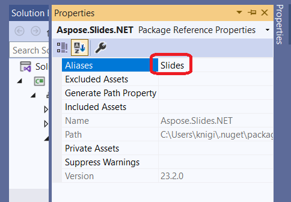

## **Wprowadzenie**

Od wersji [Aspose.Slides 23.2](https://www.nuget.org/packages/Aspose.Slides.NET/23.2.0) wsparcie dla .NET6 zostało wprowadzone. Szczególnością tego wsparcia jest to, że .NET6 nie obsługuje już System.Drawing.Common w systemie Linux ([breaking change](https://learn.microsoft.com/en-us/dotnet/core/compatibility/core-libraries/6.0/system-drawing-common-windows-only)) i Slides implementuje ten podsystem graficzny samodzielnie jako komponent C++.

Aspose.Slides dla .NET teraz działa bez zależności od GDI/libgdiplus na:
* Windows
* Linux

Obsługa _MacOS_ jest w trakcie.

## **Używanie Slides dla .NET 6 w AWS i Azure**

.NET6 jest preferowaną wersją dla Aspose.Slides używanego w chmurze (AWS, Azure lub inne rozwiązania chmurowe).

Wcześniej, gdy Aspose.Slides był używany na hoście Linux, konieczne było zainstalowanie dodatkowych zależności (libgdiplus), co często było niewygodne lub niepraktyczne (np. przy użyciu [AWS Lambda](https://aws.amazon.com/lambda)). Dzięki Slides dla .NET6 te zależności nie są już potrzebne, więc wdrażanie jest znacznie prostsze.

Kolejną kwestią są problemy, które występowały, gdy Aspose.Slides był używany w rozwiązaniu chmurowym z hostem Windows. Na przykład, [Azure Functions](https://learn.microsoft.com/en-us/azure/azure-functions/functions-overview) mają ograniczenia dla procesu i powodują problemy podczas operacji eksportu PDF (zobacz [ten](https://github.com/projectkudu/kudu/wiki/Azure-Web-App-sandbox#unsupported-frameworks)). Użycie Aspose.Slides dla .NET6 rozwiązuje ten problem.

## **Używanie pakietu System.Drawing.Common i klas Slides dla .NET 6 (błąd CS0433: typ istnieje zarówno w Slides, jak i w System.Drawing.Common)**

Czasami w projekcie muszą być używane zarówno zależności System.Drawing, jak i Slides dla .NET6 (np. gdy projekt .NET6 zależy od innych pakietów, które z kolei zależą od System.Drawing). Może to powodować takie błędy:

* CS0433: The type 'Image' exists in both 'Aspose.Slides, Version=23.2.0.0, Culture=neutral, PublicKeyToken=716fcc553a201e56' and 'System.Drawing.Common, Version=6.0.0.0
* CS0433: The type 'Graphics' exists in both 'Aspose.Slides, Version=23.2.0.0, Culture=neutral, PublicKeyToken=716fcc553a201e56' and 'System.Drawing.Common, Version=6.0.0.0

W takim przypadku możesz użyć [extern alias](https://learn.microsoft.com/en-us/dotnet/csharp/language-reference/keywords/extern-alias) dla Aspose.Slides (wersja starsza niż 24.8):
1) Wybierz zestaw Aspose.Slides z zależności projektu, a następnie kliknij **Properties**.
  
2) Ustaw alias (np. „Slides”).
  

Teraz typy z System.Drawing.Common będą używane domyślnie. Alias zewnętrznego zestawu powinien być określony tam, gdzie potrzebne są typy Aspose.Slides.

```c#
extern alias Slides;
using Slides::Aspose.Slides;
```

Pełny przykład:

```c#
extern alias Slides;
using Slides::Aspose.Slides;

static Slides::System.Drawing.Image GetThumbnail(Presentation pres)
{
    return pres.Slides[0].GetThumbnail();
}
```

Od wersji 24.8 przestarzałe publiczne API z zależnościami od System.Drawing zostało usunięte. W odniesieniu do powyższego przykładu kodu, możesz uzyskać obraz slajdu w następujący sposób.

```cs
static Aspose.Slides.IImage GetThumbnail(Presentation presentation)
{
    return presentation.Slides[0].GetImage();
}
```
Nowe API jest opisane bardziej szczegółowo w [Modern API](/slides/pl/net/modern-api/).