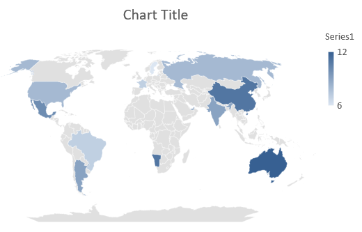

## **Przegląd**

Ten artykuł zawiera kompleksowy przewodnik, jak tworzyć i dostosowywać wykresy przy użyciu Aspose.Slides for .NET. Nauczysz się programowo dodawać wykres do slajdu, wypełniać go danymi oraz stosować różne opcje formatowania, aby spełnić konkretne wymagania projektowe. W całym artykule szczegółowe przykłady kodu ilustrują każdy krok, od inicjalizacji prezentacji i obiektu wykresu po konfigurowanie serii, osi i legend. Postępując zgodnie z tym przewodnikiem, zdobędziesz solidną wiedzę na temat integracji dynamicznego generowania wykresów w aplikacjach .NET, usprawniając proces tworzenia prezentacji opartych na danych.

## **Utwórz wykres**

Wykresy pomagają szybko wizualizować dane i uzyskać wnioski, które nie są od razu oczywiste w tabeli lub arkuszu kalkulacyjnym.

**Dlaczego tworzyć wykresy?**

* zagregować, skondensować lub podsumować duże ilości danych na jednym slajdzie w prezentacji;
* uwidocznić wzorce i trendy w danych;
* wywnioskować kierunek i dynamikę danych w czasie lub w odniesieniu do określonej jednostki miary;
* wykrywać wartości odstające, aberracje, odchylenia, błędy i nielogiczne dane;
* komunikować lub prezentować złożone dane.

W programie PowerPoint wykresy można tworzyć za pomocą funkcji *Wstaw*, która udostępnia szablony do projektowania wielu typów wykresów. Korzystając z Aspose.Slides, możesz tworzyć zarówno standardowe wykresy (oparte na popularnych typach) jak i wykresy niestandardowe.

{} 
Użyj wyliczenia [ChartType](https://reference.aspose.com/slides/pl/net/aspose.slides.charts/charttype/) w przestrzeni nazw [Aspose.Slides.Charts](https://reference.aspose.com/slides/pl/net/aspose.slides.charts/). Wartości w tym wyliczeniu odpowiadają różnym typom wykresów.
{} 

### **Utwórz wykresy kolumnowe grupowane**

Ta sekcja wyjaśnia, jak tworzyć wykresy kolumnowe grupowane przy użyciu Aspose.Slides for .NET. Nauczysz się inicjalizować prezentację, dodawać wykres i dostosowywać jego elementy, takie jak tytuł, dane, serie, kategorie oraz stylizację. Postępuj zgodnie z poniższymi krokami, aby zobaczyć, jak generowany jest standardowy wykres kolumnowy grupowany:

1. Utwórz instancję klasy [Presentation](https://reference.aspose.com/slides/pl/net/aspose.slides/presentation).
1. Uzyskaj odwołanie do slajdu, używając jego indeksu.
1. Dodaj wykres z pewnymi danymi i określ typ `ChartType.ClusteredColumn`.
1. Dodaj tytuł do wykresu.
1. Uzyskaj dostęp do arkusza danych wykresu.
1. Wyczyść wszystkie domyślne serie i kategorie.
1. Dodaj nowe serie i kategorie.
1. Dodaj nowe dane wykresu dla serii wykresu.
1. Zastosuj kolor wypełnienia do serii wykresu.
1. Dodaj etykiety do serii wykresu.
1. Zapisz zmodyfikowaną prezentację jako plik PPTX.

Ten kod C# demonstruje, jak utworzyć wykres kolumnowy grupowany:

```c#
// Utwórz instancję klasy Presentation.
using (Presentation presentation = new Presentation())
{
    // Uzyskaj dostęp do pierwszego slajdu.
    ISlide slide = presentation.Slides[0];

    // Dodaj wykres kolumnowy grupowany z domyślnymi danymi.
    IChart chart = slide.Shapes.AddChart(ChartType.ClusteredColumn, 20, 20, 500, 300);

    // Ustaw tytuł wykresu.
    chart.ChartTitle.AddTextFrameForOverriding("Sample Title");
    chart.ChartTitle.TextFrameForOverriding.TextFrameFormat.CenterText = NullableBool.True;
    chart.ChartTitle.Height = 20;
    chart.HasTitle = true;

    // Ustaw, aby pierwsza seria pokazywała wartości.
    chart.ChartData.Series[0].Labels.DefaultDataLabelFormat.ShowValue = true;

    // Ustaw indeks arkusza danych wykresu.
    int worksheetIndex = 0;

    // Pobierz skoroszyt danych wykresu.
    IChartDataWorkbook workbook = chart.ChartData.ChartDataWorkbook;

    // Usuń domyślnie wygenerowane serie i kategorie.
    chart.ChartData.Series.Clear();
    chart.ChartData.Categories.Clear();

    // Dodaj nowe serie.
    chart.ChartData.Series.Add(workbook.GetCell(worksheetIndex, 0, 1, "Series 1"), chart.Type);
    chart.ChartData.Series.Add(workbook.GetCell(worksheetIndex, 0, 2, "Series 2"), chart.Type);

    // Dodaj nowe kategorie.
    chart.ChartData.Categories.Add(workbook.GetCell(worksheetIndex, 1, 0, "Category 1"));
    chart.ChartData.Categories.Add(workbook.GetCell(worksheetIndex, 2, 0, "Category 2"));
    chart.ChartData.Categories.Add(workbook.GetCell(worksheetIndex, 3, 0, "Category 3"));

    // Pobierz pierwszą serię wykresu.
    IChartSeries series = chart.ChartData.Series[0];

    // Wypełnij dane serii.
    series.DataPoints.AddDataPointForBarSeries(workbook.GetCell(worksheetIndex, 1, 1, 20));
    series.DataPoints.AddDataPointForBarSeries(workbook.GetCell(worksheetIndex, 2, 1, 50));
    series.DataPoints.AddDataPointForBarSeries(workbook.GetCell(worksheetIndex, 3, 1, 30));

    // Ustaw kolor wypełnienia dla serii.
    series.Format.Fill.FillType = FillType.Solid;
    series.Format.Fill.SolidFillColor.Color = Color.Red;

    // Pobierz drugą serię wykresu.
    series = chart.ChartData.Series[1];

    // Wypełnij dane serii.
    series.DataPoints.AddDataPointForBarSeries(workbook.GetCell(worksheetIndex, 1, 2, 30));
    series.DataPoints.AddDataPointForBarSeries(workbook.GetCell(worksheetIndex, 2, 2, 10));
    series.DataPoints.AddDataPointForBarSeries(workbook.GetCell(worksheetIndex, 3, 2, 60));

    // Ustaw kolor wfillnienia dla serii.
    series.Format.Fill.FillType = FillType.Solid;
    series.Format.Fill.SolidFillColor.Color = Color.Green;

    // Ustaw pierwszą etykietę, aby wyświetlała nazwę kategorii.
    IDataLabel label = series.DataPoints[0].Label;
    label.DataLabelFormat.ShowCategoryName = true;

    label = series.DataPoints[1].Label;
    label.DataLabelFormat.ShowSeriesName = true;

    // Ustaw serię, aby wyświetlała wartość dla trzeciej etykiety.
    label = series.DataPoints[2].Label;
    label.DataLabelFormat.ShowValue = true;
    label.DataLabelFormat.ShowSeriesName = true;
    label.DataLabelFormat.Separator = "/";

    // Zapisz prezentację na dysku jako plik PPTX.
    presentation.Save("AsposeChart_out.pptx", SaveFormat.Pptx);
}
```

Wynik:


### **Utwórz wykresy punktowe**

Wykresy punktowe (znane również jako wykresy rozproszenia lub wykresy x-y) są często używane do sprawdzania wzorców lub demonstrowania korelacji między dwoma zmiennymi.

Użyj wykresu punktowego, gdy:

* Masz sparowane dane liczbowe.
* Masz dwie zmienne, które dobrze ze sobą współgrają.
* Chcesz ustalić, czy dwie zmienne są ze sobą powiązane.
* Masz zmienną niezależną, która ma wiele wartości dla zmiennej zależnej.

Ten kod C# pokazuje, jak utworzyć wykres punktowy z różnymi seriami znaczników:

```c#
// Utwórz instancję klasy Presentation.
using (Presentation presentation = new Presentation())
{
    // Uzyskaj dostęp do pierwszego slajdu.
    ISlide slide = presentation.Slides[0];

    // Utwórz domyślny wykres punktowy.
    IChart chart = slide.Shapes.AddChart(ChartType.ScatterWithSmoothLines, 20, 20, 500, 300);

    // Ustaw indeks arkusza danych wykresu.
    int worksheetIndex = 0;

    // Pobierz skoroszyt danych wykresu.
    IChartDataWorkbook workbook = chart.ChartData.ChartDataWorkbook;

    // Usuń domyślną serię.
    chart.ChartData.Series.Clear();

    // Dodaj nowe serie.
    chart.ChartData.Series.Add(workbook.GetCell(worksheetIndex, 1, 1, "Series 1"), chart.Type);
    chart.ChartData.Series.Add(workbook.GetCell(worksheetIndex, 1, 3, "Series 2"), chart.Type);

    // Pobierz pierwszą serię wykresu.
    IChartSeries series = chart.ChartData.Series[0];

    // Dodaj nowy punkt (1:3) do serii.
    series.DataPoints.AddDataPointForScatterSeries(workbook.GetCell(worksheetIndex, 2, 1, 1), workbook.GetCell(worksheetIndex, 2, 2, 3));

    // Dodaj nowy punkt (2:10).
    series.DataPoints.AddDataPointForScatterSeries(workbook.GetCell(worksheetIndex, 3, 1, 2), workbook.GetCell(worksheetIndex, 3, 2, 10));

    // Zmień typ serii.
    series.Type = ChartType.ScatterWithStraightLinesAndMarkers;

    // Zmień znacznik serii wykresu.
    series.Marker.Size = 10;
    series.Marker.Symbol = MarkerStyleType.Star;

    // Pobierz drugą serię wykresu.
    series = chart.ChartData.Series[1];

    // Dodaj nowy punkt (5:2) do serii wykresu.
    series.DataPoints.AddDataPointForScatterSeries(workbook.GetCell(worksheetIndex, 2, 3, 5), workbook.GetCell(worksheetIndex, 2, 4, 2));

    // Dodaj nowy punkt (3:1).
    series.DataPoints.AddDataPointForScatterSeries(workbook.GetCell(worksheetIndex, 3, 3, 3), workbook.GetCell(worksheetIndex, 3, 4, 1));

    // Dodaj nowy punkt (2:2).
    series.DataPoints.AddDataPointForScatterSeries(workbook.GetCell(worksheetIndex, 4, 3, 2), workbook.GetCell(worksheetIndex, 4, 4, 2));

    // Dodaj nowy punkt (5:1).
    series.DataPoints.AddDataPointForScatterSeries(workbook.GetCell(worksheetIndex, 5, 3, 5), workbook.GetCell(worksheetIndex, 5, 4, 1));

    // Zmień znacznik serii wykresu.
    series.Marker.Size = 10;
    series.Marker.Symbol = MarkerStyleType.Circle;

    // Zapisz prezentację na dysku jako plik PPTX.
    presentation.Save("AsposeChart_out.pptx", SaveFormat.Pptx);
}
```

Wynik:


### **Utwórz wykresy kołowe**

Wykresy kołowe najlepiej służą do przedstawiania zależności część-całość w danych, szczególnie gdy dane zawierają etykiety kategoryczne z wartościami liczbowymi. Jednak jeśli Twoje dane zawierają wiele części lub etykiet, rozważ użycie wykresu słupkowego.

1. Utwórz instancję klasy [Presentation](https://reference.aspose.com/slides/pl/net/aspose.slides/presentation).
1. Uzyskaj odwołanie do slajdu, używając jego indeksu.
1. Dodaj wykres z domyślnymi danymi i określ typ `ChartType.Pie`.
1. Uzyskaj dostęp do skoroszytu danych wykresu ([IChartDataWorkbook](https://reference.aspose.com/slides/pl/net/aspose.slides.charts/ichartdataworkbook/)).
1. Wyczyść domyślne serie i kategorie.
1. Dodaj nowe serie i kategorie.
1. Dodaj nowe dane wykresu dla serii wykresu.
1. Dodaj nowe punkty do wykresu i zastosuj niestandardowe kolory do sektorów wykresu kołowego.
1. Ustaw etykiety dla serii.
1. Włącz linie prowadzące dla etykiet serii.
1. Ustaw kąt obrotu wykresu kołowego.
1. Zapisz zmodyfikowaną prezentację jako plik PPTX.

```c#
// Utwórz instancję klasy Presentation.
using (Presentation presentation = new Presentation())
{
    // Uzyskaj dostęp do pierwszego slajdu.
    ISlide slide = presentation.Slides[0];

    // Dodaj wykres z domyślnymi danymi.
    IChart chart = slide.Shapes.AddChart(ChartType.Pie, 20, 20, 500, 300);

    // Ustaw tytuł wykresu.
    chart.ChartTitle.AddTextFrameForOverriding("Sample Title");
    chart.ChartTitle.TextFrameForOverriding.TextFrameFormat.CenterText = NullableBool.True;
    chart.ChartTitle.Height = 20;
    chart.HasTitle = true;

    // Ustaw pierwszą serię, aby wyświetlała wartości.
    chart.ChartData.Series[0].Labels.DefaultDataLabelFormat.ShowValue = true;

    // Ustaw indeks arkusza danych wykresu.
    int worksheetIndex = 0;

    // Pobierz skoroszyt danych wykresu.
    IChartDataWorkbook workbook = chart.ChartData.ChartDataWorkbook;

    // Usuń domyślnie wygenerowane serie i kategorie.
    chart.ChartData.Series.Clear();
    chart.ChartData.Categories.Clear();

    // Dodaj nowe kategorie.
    chart.ChartData.Categories.Add(workbook.GetCell(0, 1, 0, "1st Qtr"));
    chart.ChartData.Categories.Add(workbook.GetCell(0, 2, 0, "2nd Qtr"));
    chart.ChartData.Categories.Add(workbook.GetCell(0, 3, 0, "3rd Qtr"));

    // Dodaj nowe serie.
    IChartSeries series = chart.ChartData.Series.Add(workbook.GetCell(0, 0, 1, "Series 1"), chart.Type);

    // Wypełnij dane serii.
    series.DataPoints.AddDataPointForPieSeries(workbook.GetCell(worksheetIndex, 1, 1, 20));
    series.DataPoints.AddDataPointForPieSeries(workbook.GetCell(worksheetIndex, 2, 1, 50));
    series.DataPoints.AddDataPointForPieSeries(workbook.GetCell(worksheetIndex, 3, 1, 30));

    // Ustaw kolor sektora.
    chart.ChartData.SeriesGroups[0].IsColorVaried = true;

    IChartDataPoint point = series.DataPoints[0];
    point.Format.Fill.FillType = FillType.Solid;
    point.Format.Fill.SolidFillColor.Color = Color.Cyan;

    // Ustaw obramowanie sektora.
    point.Format.Line.FillFormat.FillType = FillType.Solid;
    point.Format.Line.FillFormat.SolidFillColor.Color = Color.Gray;
    point.Format.Line.Width = 3.0;
    point.Format.Line.Style = LineStyle.ThinThick;
    point.Format.Line.DashStyle = LineDashStyle.LargeDash;

    IChartDataPoint point1 = series.DataPoints[1];
    point1.Format.Fill.FillType = FillType.Solid;
    point1.Format.Fill.SolidFillColor.Color = Color.Brown;

    // Ustaw obramowanie sektora.
    point1.Format.Line.FillFormat.FillType = FillType.Solid;
    point1.Format.Line.FillFormat.SolidFillColor.Color = Color.Blue;
    point1.Format.Line.Width = 3.0;
    point1.Format.Line.Style = LineStyle.Single;
    point1.Format.Line.DashStyle = LineDashStyle.LargeDashDot;

    IChartDataPoint point2 = series.DataPoints[2];
    point2.Format.Fill.FillType = FillType.Solid;
    point2.Format.Fill.SolidFillColor.Color = Color.Coral;

    // Ustaw obramowanie sektora.
    point2.Format.Line.FillFormat.FillType = FillType.Solid;
    point2.Format.Line.FillFormat.SolidFillColor.Color = Color.Red;
    point2.Format.Line.Width = 2.0;
    point2.Format.Line.Style = LineStyle.ThinThin;
    point2.Format.Line.DashStyle = LineDashStyle.LargeDashDotDot;

    // Utwórz niestandardowe etykiety dla każdej kategorii w nowej serii.
    IDataLabel label1 = series.DataPoints[0].Label;

    label1.DataLabelFormat.ShowValue = true;

    IDataLabel label2 = series.DataPoints[1].Label;
    label2.DataLabelFormat.ShowValue = true;
    label2.DataLabelFormat.ShowLegendKey = true;
    label2.DataLabelFormat.ShowPercentage = true;

    IDataLabel label3 = series.DataPoints[2].Label;
    label3.DataLabelFormat.ShowSeriesName = true;
    label3.DataLabelFormat.ShowPercentage = true;

    // Ustaw serię, aby wyświetlała linie prowadzące na wykresie.
    series.Labels.DefaultDataLabelFormat.ShowLeaderLines = true;

    // Ustaw kąt obrotu sektorów wykresu kołowego.
    chart.ChartData.SeriesGroups[0].FirstSliceAngle = 180;

    // Zapisz prezentację na dysku jako plik PPTX.
    presentation.Save("PieChart_out.pptx", SaveFormat.Pptx);
}
```

Wynik:


### **Utwórz wykresy liniowe**

Wykresy liniowe (znane również jako wykresy liniowe) są najlepsze w sytuacjach, gdy chcesz przedstawić zmiany wartości w czasie. Używając wykresu liniowego, możesz jednocześnie porównywać dużą ilość danych, śledzić zmiany i trendy w czasie, podkreślać anomalie w seriach danych i wiele więcej.

1. Utwórz instancję klasy [Presentation](https://reference.aspose.com/slides/pl/net/aspose.slides/presentation).
1. Uzyskaj odwołanie do slajdu, używając jego indeksu.
1. Dodaj wykres z domyślnymi danymi i określ typ `ChartType.Line`.
1. Uzyskaj dostęp do skoroszytu danych wykresu ([IChartDataWorkbook](https://reference.aspose.com/slides/pl/net/aspose.slides.charts/ichartdataworkbook/)).
1. Wyczyść domyślne serie i kategorie.
1. Dodaj nowe serie i kategorie.
1. Dodaj nowe dane wykresu dla serii wykresu.
1. Zapisz zmodyfikowaną prezentację jako plik PPTX.

```c#
using (Presentation presentation = new Presentation())
{
    IChart lineChart = presentation.Slides[0].Shapes.AddChart(ChartType.Line, 20, 20, 500, 300);

    presentation.Save("lineChart.pptx", SaveFormat.Pptx);
}
```

Domyślnie punkty na wykresie liniowym są połączone prostymi ciągłymi liniami. Jeśli chcesz, aby punkty były połączone kreskami, możesz określić preferowany typ kreski w następujący sposób:

```c#
foreach (IChartSeries series in lineChart.ChartData.Series)
{
    series.Format.Line.DashStyle = LineDashStyle.Dash;
}
```

Wynik:


### **Utwórz wykresy mapy drzewa**

Wykresy mapy drzewa są najlepsze do danych sprzedażowych, gdy chcesz pokazać względny rozmiar kategorii danych i szybko zwrócić uwagę na pozycje, które są dużymi contribującymi elementami w każdej kategorii.

1. Utwórz instancję klasy [Presentation](https://reference.aspose.com/slides/pl/net/aspose.slides/presentation).
1. Uzyskaj odwołanie do slajdu, używając jego indeksu.
1. Dodaj wykres z domyślnymi danymi i określ typ `ChartType.Treemap`.
1. Uzyskaj dostęp do skoroszytu danych wykresu ([IChartDataWorkbook](https://reference.aspose.com/slides/pl/net/aspose.slides.charts/ichartdataworkbook/)).
1. Wyczyść domyślne serie i kategorie.
1. Dodaj nowe serie i kategorie.
1. Dodaj nowe dane wykresu dla serii wykresu.
1. Zapisz zmodyfikowaną prezentację jako plik PPTX.

```c#
using (Presentation presentation = new Presentation())
{
    IChart chart = presentation.Slides[0].Shapes.AddChart(ChartType.Treemap, 20, 20, 500, 300);
    chart.ChartData.Categories.Clear();
    chart.ChartData.Series.Clear();

    IChartDataWorkbook workbook = chart.ChartData.ChartDataWorkbook;
    workbook.Clear(0);

    // Gałąź 1
    IChartCategory leaf = chart.ChartData.Categories.Add(workbook.GetCell(0, "C1", "Leaf1"));
    leaf.GroupingLevels.SetGroupingItem(1, "Stem1");
    leaf.GroupingLevels.SetGroupingItem(2, "Branch1");

    chart.ChartData.Categories.Add(workbook.GetCell(0, "C2", "Leaf2"));

    leaf = chart.ChartData.Categories.Add(workbook.GetCell(0, "C3", "Leaf3"));
    leaf.GroupingLevels.SetGroupingItem(1, "Stem2");

    chart.ChartData.Categories.Add(workbook.GetCell(0, "C4", "Leaf4"));

    // Gałąź 2
    leaf = chart.ChartData.Categories.Add(workbook.GetCell(0, "C5", "Leaf5"));
    leaf.GroupingLevels.SetGroupingItem(1, "Stem3");
    leaf.GroupingLevels.SetGroupingItem(2, "Branch2");

    chart.ChartData.Categories.Add(workbook.GetCell(0, "C6", "Leaf6"));

    leaf = chart.ChartData.Categories.Add(workbook.GetCell(0, "C7", "Leaf7"));
    leaf.GroupingLevels.SetGroupingItem(1, "Stem4");

    chart.ChartData.Categories.Add(workbook.GetCell(0, "C8", "Leaf8"));

    IChartSeries series = chart.ChartData.Series.Add(ChartType.Treemap);
    series.Labels.DefaultDataLabelFormat.ShowCategoryName = true;
    series.DataPoints.AddDataPointForTreemapSeries(workbook.GetCell(0, "D1", 4));
    series.DataPoints.AddDataPointForTreemapSeries(workbook.GetCell(0, "D2", 5));
    series.DataPoints.AddDataPointForTreemapSeries(workbook.GetCell(0, "D3", 3));
    series.DataPoints.AddDataPointForTreemapSeries(workbook.GetCell(0, "D4", 6));
    series.DataPoints.AddDataPointForTreemapSeries(workbook.GetCell(0, "D5", 9));
    series.DataPoints.AddDataPointForTreemapSeries(workbook.GetCell(0, "D6", 9));
    series.DataPoints.AddDataPointForTreemapSeries(workbook.GetCell(0, "D7", 4));
    series.DataPoints.AddDataPointForTreemapSeries(workbook.GetCell(0, "D8", 3));

    series.ParentLabelLayout = ParentLabelLayoutType.Overlapping;

    presentation.Save("Treemap.pptx", SaveFormat.Pptx);
}
```

Wynik:


### **Utwórz wykresy giełdowe**

Wykresy giełdowe służą do wyświetlania danych finansowych, takich jak ceny otwarcia, maksimum, minimum i zamknięcia, pomagając analizować trendy rynkowe i zmienność. Dostarczają niezbędnych informacji o wynikach akcji, wspierając inwestorów i analityków w podejmowaniu świadomych decyzji.

1. Utwórz instancję klasy [Presentation](https://reference.aspose.com/slides/pl/net/aspose.slides/presentation).
1. Uzyskaj odwołanie do slajdu, używając jego indeksu.
1. Dodaj wykres z domyślnymi danymi i określ typ `ChartType.OpenHighLowClose`.
1. Uzyskaj dostęp do skoroszytu danych wykresu ([IChartDataWorkbook](https://reference.aspose.com/slides/pl/net/aspose.slides.charts/ichartdataworkbook/)).
1. Wyczyść domyślne serie i kategorie.
1. Dodaj nowe serie i kategorie.
1. Dodaj nowe dane wykresu dla serii wykresu.
1. Określ format HiLowLines.
1. Zapisz zmodyfikowaną prezentację jako plik PPTX.

```c#
using (Presentation presentation = new Presentation())
{
    IChart chart = presentation.Slides[0].Shapes.AddChart(ChartType.OpenHighLowClose, 20, 20, 500, 300, false);

    IChartDataWorkbook workbook = chart.ChartData.ChartDataWorkbook;

    chart.ChartData.Categories.Add(workbook.GetCell(0, 1, 0, "A"));
    chart.ChartData.Categories.Add(workbook.GetCell(0, 2, 0, "B"));
    chart.ChartData.Categories.Add(workbook.GetCell(0, 3, 0, "C"));

    chart.ChartData.Series.Add(workbook.GetCell(0, 0, 1, "Open"), chart.Type);
    chart.ChartData.Series.Add(workbook.GetCell(0, 0, 2, "High"), chart.Type);
    chart.ChartData.Series.Add(workbook.GetCell(0, 0, 3, "Low"), chart.Type);
    chart.ChartData.Series.Add(workbook.GetCell(0, 0, 4, "Close"), chart.Type);

    IChartSeries series = chart.ChartData.Series[0];
    series.DataPoints.AddDataPointForStockSeries(workbook.GetCell(0, 1, 1, 72));
    series.DataPoints.AddDataPointForStockSeries(workbook.GetCell(0, 2, 1, 25));
    series.DataPoints.AddDataPointForStockSeries(workbook.GetCell(0, 3, 1, 38));

    series = chart.ChartData.Series[1];
    series.DataPoints.AddDataPointForStockSeries(workbook.GetCell(0, 1, 2, 172));
    series.DataPoints.AddDataPointForStockSeries(workbook.GetCell(0, 2, 2, 57));
    series.DataPoints.AddDataPointForStockSeries(workbook.GetCell(0, 3, 2, 57));

    series = chart.ChartData.Series[2];
    series.DataPoints.AddDataPointForStockSeries(workbook.GetCell(0, 1, 3, 12));
    series.DataPoints.AddDataPointForStockSeries(workbook.GetCell(0, 2, 3, 12));
    series.DataPoints.AddDataPointForStockSeries(workbook.GetCell(0, 3, 3, 13));

    series = chart.ChartData.Series[3];
    series.DataPoints.AddDataPointForStockSeries(workbook.GetCell(0, 1, 4, 25));
    series.DataPoints.AddDataPointForStockSeries(workbook.GetCell(0, 2, 4, 38));
    series.DataPoints.AddDataPointForStockSeries(workbook.GetCell(0, 3, 4, 50));

    chart.ChartData.SeriesGroups[0].UpDownBars.HasUpDownBars = true;
    chart.ChartData.SeriesGroups[0].HiLowLinesFormat.Line.FillFormat.FillType = FillType.Solid;

    foreach (IChartSeries ser in chart.ChartData.Series)
    {
        ser.Format.Line.FillFormat.FillType = FillType.NoFill;
    }

    chart.Axes.VerticalAxis.MinorGridLinesFormat.Line.FillFormat.FillType = FillType.NoFill;

    presentation.Save("Stock-chart.pptx", SaveFormat.Pptx);
}
```

Wynik:


### **Utwórz wykresy pudełkowe i wąsowe**

Wykresy pudełkowe i wąsowe służą do wyświetlania rozkładu danych poprzez podsumowanie kluczowych miar statystycznych, takich jak mediana, kwartyle i potencjalne wartości odstające. Są szczególnie przydatne w analizie danych eksploracyjnych i badaniach statystycznych, aby szybko zrozumieć zmienność danych i zidentyfikować anomalie.

1. Utwórz instancję klasy [Presentation](https://reference.aspose.com/slides/pl/net/aspose.slides/presentation).
1. Uzyskaj odwołanie do slajdu, używając jego indeksu.
1. Dodaj wykres z domyślnymi danymi i określ typ `ChartType.BoxAndWhisker`.
1. Uzyskaj dostęp do skoroszytu danych wykresu ([IChartDataWorkbook](https://reference.aspose.com/slides/pl/net/aspose.slides.charts/ichartdataworkbook/)).
1. Wyczyść domyślne serie i kategorie.
1. Dodaj nowe serie i kategorie.
1. Dodaj nowe dane wykresu dla serii wykresu.
1. Zapisz zmodyfikowaną prezentację jako plik PPTX.

```c#
using (Presentation presentation = new Presentation())
{
    IChart chart = presentation.Slides[0].Shapes.AddChart(ChartType.BoxAndWhisker, 20, 20, 500, 300);
    chart.ChartData.Categories.Clear();
    chart.ChartData.Series.Clear();

    IChartDataWorkbook workbook = chart.ChartData.ChartDataWorkbook;
    workbook.Clear(0);

    chart.ChartData.Categories.Add(workbook.GetCell(0, "A1", "Category 1"));
    chart.ChartData.Categories.Add(workbook.GetCell(0, "A2", "Category 2"));
    chart.ChartData.Categories.Add(workbook.GetCell(0, "A3", "Category 3"));
    chart.ChartData.Categories.Add(workbook.GetCell(0, "A4", "Category 4"));
    chart.ChartData.Categories.Add(workbook.GetCell(0, "A5", "Category 5"));
    chart.ChartData.Categories.Add(workbook.GetCell(0, "A6", "Category 6"));

    IChartSeries series = chart.ChartData.Series.Add(ChartType.BoxAndWhisker);

    series.QuartileMethod = QuartileMethodType.Exclusive;
    series.ShowMeanLine = true;
    series.ShowMeanMarkers = true;
    series.ShowInnerPoints = true;
    series.ShowOutlierPoints = true;

    series.DataPoints.AddDataPointForBoxAndWhiskerSeries(workbook.GetCell(0, "B1", 15));
    series.DataPoints.AddDataPointForBoxAndWhiskerSeries(workbook.GetCell(0, "B2", 41));
    series.DataPoints.AddDataPointForBoxAndWhiskerSeries(workbook.GetCell(0, "B3", 16));
    series.DataPoints.AddDataPointForBoxAndWhiskerSeries(workbook.GetCell(0, "B4", 10));
    series.DataPoints.AddDataPointForBoxAndWhiskerSeries(workbook.GetCell(0, "B5", 23));
    series.DataPoints.AddDataPointForBoxAndWhiskerSeries(workbook.GetCell(0, "B6", 16));

    presentation.Save("BoxAndWhisker.pptx", SaveFormat.Pptx);
}
```

### **Utwórz wykresy lejkowe**

Wykresy lejkowe służą do wizualizacji procesów, które obejmują kolejne etapy, przy czym wolumen danych maleje w miarę przechodzenia z jednego kroku do następnego. Są szczególnie przydatne do analizy współczynników konwersji, identyfikacji wąskich gardeł i śledzenia efektywności procesów sprzedaży lub marketingu.

1. Utwórz instancję klasy [Presentation](https://reference.aspose.com/slides/pl/net/aspose.slides/presentation).
1. Uzyskaj odwołanie do slajdu, używając jego indeksu.
1. Dodaj wykres z domyślnymi danymi i określ typ `ChartType.Funnel`.
1. Zapisz zmodyfikowaną prezentację jako plik PPTX.

```c#
using (Presentation presentation = new Presentation("test.pptx"))
{
    IChart chart = presentation.Slides[0].Shapes.AddChart(ChartType.Funnel, 50, 50, 500, 400);
    chart.ChartData.Categories.Clear();
    chart.ChartData.Series.Clear();

    IChartDataWorkbook workbook = chart.ChartData.ChartDataWorkbook;
    workbook.Clear(0);

    chart.ChartData.Categories.Add(workbook.GetCell(0, "A1", "Category 1"));
    chart.ChartData.Categories.Add(workbook.GetCell(0, "A2", "Category 2"));
    chart.ChartData.Categories.Add(workbook.GetCell(0, "A3", "Category 3"));
    chart.ChartData.Categories.Add(workbook.GetCell(0, "A4", "Category 4"));
    chart.ChartData.Categories.Add(workbook.GetCell(0, "A5", "Category 5"));
    chart.ChartData.Categories.Add(workbook.GetCell(0, "A6", "Category 6"));

    IChartSeries series = chart.ChartData.Series.Add(ChartType.Funnel);

    series.DataPoints.AddDataPointForFunnelSeries(workbook.GetCell(0, "B1", 50));
    series.DataPoints.AddDataPointForFunnelSeries(workbook.GetCell(0, "B2", 100));
    series.DataPoints.AddDataPointForFunnelSeries(workbook.GetCell(0, "B3", 200));
    series.DataPoints.AddDataPointForFunnelSeries(workbook.GetCell(0, "B4", 300));
    series.DataPoints.AddDataPointForFunnelSeries(workbook.GetCell(0, "B5", 400));
    series.DataPoints.AddDataPointForFunnelSeries(workbook.GetCell(0, "B6", 500));

    presentation.Save("Funnel.pptx", SaveFormat.Pptx);
}
```

Wynik:


### **Utwórz wykresy promieniste**

Wykresy promieniste służą do wizualizacji danych hierarchicznych, wyświetlając poziomy jako koncentryczne pierścienie. Pomagają zobrazować zależności część-całość i są idealne do reprezentacji zagnieżdżonych kategorii i podkategorii w przejrzystym, kompaktowym formacie.

1. Utwórz instancję klasy [Presentation](https://reference.aspose.com/slides/pl/net/aspose.slides/presentation).
1. Uzyskaj odwołanie do slajdu, używając jego indeksu.
1. Dodaj wykres z domyślnymi danymi i określ typ `ChartType.Sunburst`.
1. Zapisz zmodyfikowaną prezentację jako plik PPTX.

```c#
using (Presentation presentation = new Presentation())
{
    IChart chart = presentation.Slides[0].Shapes.AddChart(ChartType.Sunburst, 20, 20, 500, 300);
    chart.ChartData.Categories.Clear();
    chart.ChartData.Series.Clear();

    IChartDataWorkbook workbook = chart.ChartData.ChartDataWorkbook;
    workbook.Clear(0);

    // Gałąź 1
    IChartCategory leaf = chart.ChartData.Categories.Add(workbook.GetCell(0, "C1", "Leaf1"));
    leaf.GroupingLevels.SetGroupingItem(1, "Stem1");
    leaf.GroupingLevels.SetGroupingItem(2, "Branch1");

    chart.ChartData.Categories.Add(workbook.GetCell(0, "C2", "Leaf2"));

    leaf = chart.ChartData.Categories.Add(workbook.GetCell(0, "C3", "Leaf3"));
    leaf.GroupingLevels.SetGroupingItem(1, "Stem2");

    chart.ChartData.Categories.Add(workbook.GetCell(0, "C4", "Leaf4"));

    // Gałąź 2
    leaf = chart.ChartData.Categories.Add(workbook.GetCell(0, "C5", "Leaf5"));
    leaf.GroupingLevels.SetGroupingItem(1, "Stem3");
    leaf.GroupingLevels.SetGroupingItem(2, "Branch2");

    chart.ChartData.Categories.Add(workbook.GetCell(0, "C6", "Leaf6"));

    leaf = chart.ChartData.Categories.Add(workbook.GetCell(0, "C7", "Leaf7"));
    leaf.GroupingLevels.SetGroupingItem(1, "Stem4");

    chart.ChartData.Categories.Add(workbook.GetCell(0, "C8", "Leaf8"));

    IChartSeries series = chart.ChartData.Series.Add(ChartType.Sunburst);
    series.Labels.DefaultDataLabelFormat.ShowCategoryName = true;
    series.DataPoints.AddDataPointForSunburstSeries(workbook.GetCell(0, "D1", 4));
    series.DataPoints.AddDataPointForSunburstSeries(workbook.GetCell(0, "D2", 5));
    series.DataPoints.AddDataPointForSunburstSeries(workbook.GetCell(0, "D3", 3));
    series.DataPoints.AddDataPointForSunburstSeries(workbook.GetCell(0, "D4", 6));
    series.DataPoints.AddDataPointForSunburstSeries(workbook.GetCell(0, "D5", 9));
    series.DataPoints.AddDataPointForSunburstSeries(workbook.GetCell(0, "D6", 9));
    series.DataPoints.AddDataPointForSunburstSeries(workbook.GetCell(0, "D7", 4));
    series.DataPoints.AddDataPointForSunburstSeries(workbook.GetCell(0, "D8", 3));

    presentation.Save("Sunburst.pptx", SaveFormat.Pptx);
}
```

Wynik:


### **Utwórz wykresy histogramu**

Wykresy histogramu służą do przedstawiania rozkładu danych liczbowych poprzez grupowanie wartości w przedziały lub kosze. Są szczególnie przydatne do identyfikacji wzorców danych, takich jak częstość, skośność i rozproszenie, oraz do wykrywania wartości odstających w zbiorze danych.

1. Utwórz instancję klasy [Presentation](https://reference.aspose.com/slides/pl/net/aspose.slides/presentation).
1. Uzyskaj odwołanie do slajdu, używając jego indeksu.
1. Dodaj wykres z pewnymi danymi i określ typ `ChartType.Histogram`.
1. Uzyskaj dostęp do skoroszytu danych wykresu ([IChartDataWorkbook](https://reference.aspose.com/slides/pl/net/aspose.slides.charts/ichartdataworkbook/)).
1. Wyczyść domyślne serie i kategorie.
1. Dodaj nowe serie i kategorie.
1. Zapisz zmodyfikowaną prezentację jako plik PPTX.

```c#
using (Presentation presentation = new Presentation())
{
    IChart chart = presentation.Slides[0].Shapes.AddChart(ChartType.Histogram, 20, 20, 500, 300);
    chart.ChartData.Categories.Clear();
    chart.ChartData.Series.Clear();

    IChartDataWorkbook workbook = chart.ChartData.ChartDataWorkbook;
    workbook.Clear(0);

    IChartSeries series = chart.ChartData.Series.Add(ChartType.Histogram);
    series.DataPoints.AddDataPointForHistogramSeries(workbook.GetCell(0, "A1", 15));
    series.DataPoints.AddDataPointForHistogramSeries(workbook.GetCell(0, "A2", -41));
    series.DataPoints.AddDataPointForHistogramSeries(workbook.GetCell(0, "A3", 16));
    series.DataPoints.AddDataPointForHistogramSeries(workbook.GetCell(0, "A4", 10));
    series.DataPoints.AddDataPointForHistogramSeries(workbook.GetCell(0, "A5", -23));
    series.DataPoints.AddDataPointForHistogramSeries(workbook.GetCell(0, "A6", 16));

    chart.Axes.HorizontalAxis.AggregationType = AxisAggregationType.Automatic;

    presentation.Save("Histogram.pptx", SaveFormat.Pptx);
}
```

Wynik:


### **Utwórz wykresy radarowe**

Wykresy radarowe służą do wyświetlania danych wielowymiarowych w dwuwymiarowym formacie, umożliwiając łatwe porównanie kilku zmiennych jednocześnie. Są szczególnie przydatne do identyfikacji wzorców, mocnych i słabych stron w różnych miarach wydajności lub atrybutach.

1. Utwórz instancję klasy [Presentation](https://reference.aspose.com/slides/pl/net/aspose.slides/presentation).
1. Uzyskaj odwołanie do slajdu, używając jego indeksu.
1. Dodaj wykres z domyślnymi danymi i określ typ `ChartType.Radar`.
1. Zapisz zmodyfikowaną prezentację jako plik PPTX.

```c#
using (Presentation presentation = new Presentation())
{
    presentation.Slides[0].Shapes.AddChart(ChartType.Radar, 20, 20, 500, 300);
    presentation.Save("Radar-chart.pptx", SaveFormat.Pptx);
}
```

Wynik:


### **Utwórz wykresy wielokategorialne**

Wykresy wielokategorialne służą do wyświetlania danych obejmujących więcej niż jedną grupę kategorią, umożliwiając jednoczesne porównywanie wartości w wielu wymiarach. Są szczególnie przydatne, gdy trzeba analizować trendy i zależności w złożonych, wielowarstwowych zestawach danych.

1. Utwórz instancję klasy [Presentation](https://reference.aspose.com/slides/pl/net/aspose.slides/presentation).
1. Uzyskaj odwołanie do slajdu, używając jego indeksu.
1. Dodaj wykres z domyślnymi danymi i określ typ `ChartType.ClusteredColumn`.
1. Uzyskaj dostęp do skoroszytu danych wykresu ([IChartDataWorkbook](https://reference.aspose.com/slides/pl/net/aspose.slides.charts/ichartdataworkbook/)).
1. Wyczyść domyślne serie i kategorie.
1. Dodaj nowe serie i kategorie.
1. Dodaj nowe dane wykresu dla serii wykresu.
1. Zapisz zmodyfikowaną prezentację jako plik PPTX.

```c#
using (Presentation presentation = new Presentation())
{
    ISlide slide = presentation.Slides[0];

    IChart chart = presentation.Slides[0].Shapes.AddChart(ChartType.ClusteredColumn, 20, 20, 500, 300);
    chart.ChartData.Series.Clear();
    chart.ChartData.Categories.Clear();

    IChartDataWorkbook workbook = chart.ChartData.ChartDataWorkbook;
    workbook.Clear(0);

    int worksheetIndex = 0;

    IChartCategory category = chart.ChartData.Categories.Add(workbook.GetCell(0, "c2", "A"));
    category.GroupingLevels.SetGroupingItem(1, "Group1");
    category = chart.ChartData.Categories.Add(workbook.GetCell(0, "c3", "B"));

    category = chart.ChartData.Categories.Add(workbook.GetCell(0, "c4", "C"));
    category.GroupingLevels.SetGroupingItem(1, "Group2");
    category = chart.ChartData.Categories.Add(workbook.GetCell(0, "c5", "D"));

    category = chart.ChartData.Categories.Add(workbook.GetCell(0, "c6", "E"));
    category.GroupingLevels.SetGroupingItem(1, "Group3");
    category = chart.ChartData.Categories.Add(workbook.GetCell(0, "c7", "F"));

    category = chart.ChartData.Categories.Add(workbook.GetCell(0, "c8", "G"));
    category.GroupingLevels.SetGroupingItem(1, "Group4");
    category = chart.ChartData.Categories.Add(workbook.GetCell(0, "c9", "H"));

    // Dodaj serię.
    IChartSeries series = chart.ChartData.Series.Add(workbook.GetCell(0, "D1", "Series 1"), ChartType.ClusteredColumn);

    series.DataPoints.AddDataPointForBarSeries(workbook.GetCell(worksheetIndex, "D2", 10));
    series.DataPoints.AddDataPointForBarSeries(workbook.GetCell(worksheetIndex, "D3", 20));
    series.DataPoints.AddDataPointForBarSeries(workbook.GetCell(worksheetIndex, "D4", 30));
    series.DataPoints.AddDataPointForBarSeries(workbook.getCell(worksheetIndex, "D5", 40));
    series.DataPoints.AddDataPointForBarSeries(workbook.getCell(worksheetIndex, "D6", 50));
    series.DataPoints.AddDataPointForBarSeries(workbook.getCell(worksheetIndex, "D7", 60));
    series.DataPoints.AddDataPointForBarSeries(workbook.getCell(worksheetIndex, "D8", 70));
    series.DataPoints.AddDataPointForBarSeries(workbook.getCell(worksheetIndex, "D9", 80));

    // Zapisz prezentację z wykresem.
    presentation.Save("AsposeChart_out.pptx", SaveFormat.Pptx);
}
```

Wynik:


### **Utwórz wykresy mapowe**

Wykresy mapowe służą do wizualizacji danych geograficznych poprzez mapowanie informacji na konkretne lokalizacje, takie jak kraje, stany lub miasta. Są szczególnie przydatne do analizy trendów regionalnych, danych demograficznych i rozkładów przestrzennych w przejrzysty i wizualnie atrakcyjny sposób.

```c#
using (Presentation presentation = new Presentation())
{
    IChart chart = presentation.Slides[0].Shapes.AddChart(ChartType.Map, 20, 20, 500, 300);
    presentation.Save("mapChart.pptx", SaveFormat.Pptx);
}
```

Wynik:



### **Utwórz wykresy kombinowane**

Wykres kombinowany (lub wykres combo) łączy dwa lub więcej typów wykresów w jednym grafie. Ten wykres pozwala podkreślić, porównać lub przeanalizować różnice między dwoma lub więcej zestawami danych, pomagając zidentyfikować zależności między nimi.


Poniższy kod C# pokazuje, jak utworzyć powyższy wykres kombinowany w prezentacji PowerPoint:

```c#
private static void CreateComboChart()
{
    using (Presentation presentation = new Presentation())
    {
        IChart chart = CreateChartWithFirstSeries(presentation.Slides[0]);

        AddSecondSeriesToChart(chart);
        AddThirdSeriesToChart(chart);

        SetPrimaryAxesFormat(chart);
        SetSecondaryAxesFormat(chart);

        presentation.Save("combo-chart.pptx", SaveFormat.Pptx);
    }
}

private static IChart CreateChartWithFirstSeries(ISlide slide)
{
    IChart chart = slide.Shapes.AddChart(ChartType.ClusteredColumn, 50, 50, 600, 400);

    // Ustawia tytuł wykresu
    chart.HasTitle = true;
    chart.ChartTitle.AddTextFrameForOverriding("Chart Title");
    chart.ChartTitle.Overlay = false;
    IPortionFormat portionFormat = 
       chart.ChartTitle.TextFrameForOverriding.Paragraphs[0].ParagraphFormat.DefaultPortionFormat;
    portionFormat.FontBold = NullableBool.False;
    portionFormat.FontHeight = 18f;

    // Ustawia legendę wykresu
    chart.Legend.Position = LegendPositionType.Bottom;
    chart.Legend.TextFormat.PortionFormat.FontHeight = 12f;

    // Usuwa domyślnie wygenerowane serie i kategorie
    chart.ChartData.Series.Clear();
    chart.ChartData.Categories.Clear();

    int worksheetIndex = 0;
    IChartDataWorkbook workbook = chart.ChartData.ChartDataWorkbook;

    // Dodaje nowe kategorie
    chart.ChartData.Categories.Add(workbook.GetCell(worksheetIndex, 1, 0, "Category 1"));
    chart.ChartData.Categories.Add(workbook.GetCell(worksheetIndex, 2, 0, "Category 2"));
    chart.ChartData.Categories.Add(workbook.GetCell(worksheetIndex, 3, 0, "Category 3"));
    chart.ChartData.Categories.Add(workbook.GetCell(worksheetIndex, 4, 0, "Category 4"));

    // Dodaje pierwszą serię
    IChartSeries series = chart.ChartData.Series.Add(
        workbook.GetCell(worksheetIndex, 0, 1, "Series 1"), chart.Type);

    series.ParentSeriesGroup.Overlap = -25;
    series.ParentSeriesGroup.GapWidth = 220;

    series.DataPoints.AddDataPointForBarSeries(workbook.GetCell(worksheetIndex, 1, 1, 4.3));
    series.DataPoints.AddDataPointForBarSeries(workbook.GetCell(worksheetIndex, 2, 1, 2.5));
    series.DataPoints.AddDataPointForBarSeries(workbook.GetCell(worksheetIndex, 3, 1, 3.5));
    series.DataPoints.AddDataPointForBarSeries(workbook.GetCell(worksheetIndex, 4, 1, 4.5));

    return chart;
}

private static void AddSecondSeriesToChart(IChart chart)
{
    IChartDataWorkbook workbook = chart.ChartData.ChartDataWorkbook;
    const int worksheetIndex = 0;

    IChartSeries series = chart.ChartData.Series.Add(
        workbook.GetCell(worksheetIndex, 0, 2, "Series 2"), ChartType.ClusteredColumn);

    series.ParentSeriesGroup.Overlap = -25;
    series.ParentSeriesGroup.GapWidth = 220;

    series.DataPoints.AddDataPointForBarSeries(workbook.GetCell(worksheetIndex, 1, 2, 2.4));
    series.DataPoints.AddDataPointForBarSeries(workbook.GetCell(worksheetIndex, 2, 2, 4.4));
    series.DataPoints.AddDataPointForBarSeries(workbook.GetCell(worksheetIndex, 3, 2, 1.8));
    series.DataPoints.AddDataPointForBarSeries(workbook.GetCell(worksheetIndex, 4, 2, 2.8));
}

private static void AddThirdSeriesToChart(IChart chart)
{
    IChartDataWorkbook workbook = chart.ChartData.ChartDataWorkbook;
    const int worksheetIndex = 0;

    IChartSeries series = chart.ChartData.Series.Add(
        workbook.GetCell(worksheetIndex, 0, 3, "Series 3"), ChartType.Line);

    series.DataPoints.AddDataPointForLineSeries(workbook.GetCell(worksheetIndex, 1, 3, 2.0));
    series.DataPoints.AddDataPointForLineSeries(workbook.GetCell(worksheetIndex, 2, 3, 2.0));
    series.DataPoints.AddDataPointForLineSeries(workbook.GetCell(worksheetIndex, 3, 3, 3.0));
    series.DataPoints.AddDataPointForLineSeries(workbook.GetCell(worksheetIndex, 4, 3, 5.0));

    series.PlotOnSecondAxis = true;
}

private static void SetPrimaryAxesFormat(IChart chart)
{
    // Ustawia oś poziomą
    IAxis horizontalAxis = chart.Axes.HorizontalAxis;
    horizontalAxis.TextFormat.PortionFormat.FontHeight = 12f;
    horizontalAxis.Format.Line.FillFormat.FillType = FillType.NoFill;

    SetAxisTitle(horizontalAxis, "X Axis");

    // Ustawia oś pionową
    IAxis verticalAxis = chart.Axes.VerticalAxis;
    verticalAxis.TextFormat.PortionFormat.FontHeight = 12f;
    verticalAxis.Format.Line.FillFormat.FillType = FillType.NoFill;

    SetAxisTitle(verticalAxis, "Y Axis 1");

    // Ustawia kolor głównych linii kratki pionowej
    ILineFillFormat majorGridLinesFormat = verticalAxis.MajorGridLinesFormat.Line.FillFormat;
    majorGridLinesFormat.FillType = FillType.Solid;
    majorGridLinesFormat.SolidFillColor.Color = Color.FromArgb(217, 217, 217);
}

private static void SetSecondaryAxesFormat(IChart chart)
{
    // Ustawia drugorzędną oś poziomą
    IAxis secondaryHorizontalAxis = chart.Axes.SecondaryHorizontalAxis;
    secondaryHorizontalAxis.Position = AxisPositionType.Bottom;
    secondaryHorizontalAxis.CrossType = CrossesType.Maximum;
    secondaryHorizontalAxis.IsVisible = false;
    secondaryHorizontalAxis.MajorGridLinesFormat.Line.FillFormat.FillType = FillType.NoFill;
    secondaryHorizontalAxis.MinorGridLinesFormat.Line.FillFormat.FillType = FillType.NoFill;

    // Ustawia drugorzędną oś pionową
    IAxis secondaryVerticalAxis = chart.Axes.SecondaryVerticalAxis;
    secondaryVerticalAxis.Position = AxisPositionType.Right;
    secondaryVerticalAxis.TextFormat.PortionFormat.FontHeight = 12f;
    secondaryVerticalAxis.Format.Line.FillFormat.FillType = FillType.NoFill;
    secondaryVerticalAxis.MajorGridLinesFormat.Line.FillFormat.FillType = FillType.NoFill;
    secondaryVerticalAxis.MinorGridLinesFormat.Line.FillFormat.FillType = FillType.NoFill;

    SetAxisTitle(secondaryVerticalAxis, "Y Axis 2");
}

private static void SetAxisTitle(IAxis axis, string axisTitle)
{
    axis.HasTitle = true;
    axis.Title.Overlay = false;
    IPortionFormat titlePortionFormat =
        axis.Title.AddTextFrameForOverriding(axisTitle).Paragraphs[0].ParagraphFormat.DefaultPortionFormat;
    titlePortionFormat.FontBold = NullableBool.False;
    titlePortionFormat.FontHeight = 12f;
}
```

## **Aktualizuj wykresy**

Aspose.Slides for .NET umożliwia aktualizację wykresów PowerPoint poprzez modyfikację danych wykresu, formatowania i stylizacji. Ta funkcjonalność upraszcza proces utrzymywania prezentacji na bieżąco z dynamiczną treścią i zapewnia, że wykresy dokładnie odzwierciedlają aktualne dane oraz standardy wizualne.

1. Zainstaluj klasę [Presentation](https://reference.aspose.com/slides/pl/net/aspose.slides/presentation), która reprezentuje prezentację zawierającą wykres.
1. Uzyskaj odwołanie do slajdu, używając jego indeksu.
1. Przejdź przez wszystkie kształty, aby znaleźć wykres.
1. Uzyskaj dostęp do arkusza danych wykresu.
1. Modyfikuj serie danych wykresu, zmieniając wartości serii.
1. Dodaj nową serię i wypełnij jej dane.
1. Zapisz zmodyfikowaną prezentację jako plik PPTX.

```c#
const string chartName = "My chart";

// Utwórz instancję klasy Presentation, która reprezentuje plik PPTX.
using (Presentation presentation = new Presentation("ExistingChart.pptx"))
{
    // Uzyskaj dostęp do pierwszego slajdu.
    ISlide slide = presentation.Slides[0];

    foreach (IShape shape in slide.Shapes)
    {
        if (shape is IChart chart && chart.Name == chartName)
        {
            // Ustaw indeks arkusza danych wykresu.
            int worksheetIndex = 0;

            // Pobierz skoroszyt danych wykresu.
            IChartDataWorkbook workbook = chart.ChartData.ChartDataWorkbook;

            // Zmień nazwy kategorii wykresu.
            workbook.GetCell(worksheetIndex, 1, 0, "Modified Category 1");
            workbook.GetCell(worksheetIndex, 2, 0, "Modified Category 2");

            // Pobierz pierwszą serię wykresu.
            IChartSeries series = chart.ChartData.Series[0];

            // Zaktualizuj dane serii.
            workbook.GetCell(worksheetIndex, 0, 1, "New_Series 1"); // Modyfikowanie nazwy serii.
            series.DataPoints[0].Value.Data = 90;
            series.DataPoints[1].Value.Data = 123;
            series.DataPoints[2].Value.Data = 44;

            // Pobierz drugą serię wykresu.
            series = chart.ChartData.Series[1];

            // Zaktualizuj dane serii.
            workbook.GetCell(worksheetIndex, 0, 2, "New_Series 2"); // Modyfikowanie nazwy serii.
            series.DataPoints[0].Value.Data = 23;
            series.DataPoints[1].Value.Data = 67;
            series.DataPoints[2].Value.Data = 99;

            // Dodaj nową serię.
            series = chart.ChartData.Series.Add(workbook.GetCell(worksheetIndex, 0, 3, "Series 3"), chart.Type);

            // Wypełnij dane serii.
            series.DataPoints.AddDataPointForBarSeries(workbook.GetCell(worksheetIndex, 1, 3, 20));
            series.DataPoints.AddDataPointForBarSeries(workbook.GetCell(worksheetIndex, 2, 3, 50));
            series.DataPoints.AddDataPointForBarSeries(workbook.GetCell(worksheetIndex, 3, 3, 30));

            chart.Type = ChartType.ClusteredCylinder;
        }
    }

    // Zapisz prezentację z wykresem.
    presentation.Save("AsposeChartModified_out.pptx", SaveFormat.Pptx);
}
```

## **Ustaw zakres danych dla wykresu**

Aspose.Slides for .NET zapewnia elastyczność definiowania określonego zakresu danych z arkusza jako źródła danych dla wykresu. Oznacza to, że możesz bezpośrednio mapować fragment arkusza na wykres, kontrolując, które komórki przyczyniają się do serii i kategorii wykresu. W rezultacie łatwo aktualizujesz i synchronizujesz wykresy z najnowszymi zmianami danych w arkuszu, zapewniając, że prezentacje PowerPoint odzwierciedlają aktualne i dokładne informacje.

1. Zainstaluj klasę [Presentation](https://reference.aspose.com/slides/pl/net/aspose.slides/presentation), która reprezentuje prezentację zawierającą wykres.
1. Uzyskaj odwołanie do slajdu, używając jego indeksu.
1. Przejdź przez wszystkie kształty, aby znaleźć wykres.
1. Uzyskaj dostęp do danych wykresu i ustaw zakres.
1. Zapisz zmodyfikowaną prezentację jako plik PPTX.

```c#
const string chartName = "My chart";

// Utwórz instancję klasy Presentation, która reprezentuje plik PPTX.
using (Presentation presentation = new Presentation("ExistingChart.pptx"))
{
    // Uzyskaj dostęp do pierwszego slajdu.
    ISlide slide = presentation.Slides[0];

    foreach (IShape shape in slide.Shapes)
    {
        if (shape is IChart chart && chart.Name == chartName)
        {
            chart.ChartData.SetRange("Sheet1!A1:B4");
        }
    }

    presentation.Save("SetDataRange_out.pptx", SaveFormat.Pptx);
}
```

## **Użyj domyślnych znaczników w wykresach**

Kiedy używasz domyślnych znaczników w wykresach, każda seria wykresu automatycznie otrzymuje inny domyślny symbol znacznika.

```c#
using (Presentation presentation = new Presentation())
{
    ISlide slide = presentation.Slides[0];
    IChart chart = slide.Shapes.AddChart(ChartType.LineWithMarkers, 10, 10, 400, 400);

    chart.ChartData.Series.Clear();
    chart.ChartData.Categories.Clear();

    IChartDataWorkbook workbook = chart.ChartData.ChartDataWorkbook;

    IChartSeries series = chart.ChartData.Series.Add(workbook.GetCell(0, 0, 1, "Series 1"), chart.Type);

    chart.ChartData.Categories.Add(workbook.GetCell(0, 1, 0, "C1"));
    series.DataPoints.AddDataPointForLineSeries(workbook.GetCell(0, 1, 1, 24));

    chart.ChartData.Categories.Add(workbook.GetCell(0, 2, 0, "C2"));
    series.DataPoints.AddDataPointForLineSeries(workbook.GetCell(0, 2, 1, 23));

    chart.ChartData.Categories.Add(workbook.GetCell(0, 3, 0, "C3"));
    series.DataPoints.AddDataPointForLineSeries(workbook.GetCell(0, 3, 1, -10));

    chart.ChartData.Categories.Add(workbook.GetCell(0, 4, 0, "C4"));
    series.DataPoints.AddDataPointForLineSeries(workbook.GetCell(0, 4, 1, null));

    IChartSeries series2 = chart.ChartData.Series.Add(workbook.GetCell(0, 0, 2, "Series 2"), chart.Type);

    // Wypełnij dane serii.
    series2.DataPoints.AddDataPointForLineSeries(workbook.GetCell(0, 1, 2, 30));
    series2.DataPoints.AddDataPointForLineSeries(workbook.GetCell(0, 2, 2, 10));
    series2.DataPoints.AddDataPointForLineSeries(workbook.GetCell(0, 3, 2, 60));
    series2.DataPoints.AddDataPointForLineSeries(workbook.GetCell(0, 4, 2, 40));

    chart.HasLegend = true;
    chart.Legend.Overlay = false;

    presentation.Save("DefaultMarkersInChart.pptx", SaveFormat.Pptx);
}
```

## **FAQ**

**Jakie typy wykresów są obsługiwane przez Aspose.Slides for .NET?**

Aspose.Slides for .NET obsługuje szeroką gamę typów wykresów, w tym słupkowe, liniowe, kołowe, powierzchniowe, punktowe, histogramy, radarowe i wiele innych. Ta elastyczność pozwala wybrać najbardziej odpowiedni typ wykresu do potrzeb wizualizacji danych.

**Jak dodać nowy wykres do slajdu?**

Aby dodać wykres, najpierw tworzysz instancję klasy [Presentation](https://reference.aspose.com/slides/pl/net/aspose.slides/presentation), pobierasz żądany slajd przy użyciu jego indeksu, a następnie wywołujesz metodę dodawania wykresu, określając typ wykresu oraz początkowe dane. Proces ten integruje wykres bezpośrednio w prezentacji.

**Jak mogę zaktualizować dane wyświetlane w wykresie?**

Możesz zaktualizować dane wykresu, uzyskując dostęp do jego skoroszytu danych ([IChartDataWorkbook](https://reference.aspose.com/slides/pl/net/aspose.slides.charts/ichartdataworkbook/)), usuwając domyślne serie i kategorie, a następnie dodając własne dane. Pozwala to programowo odświeżyć wykres, aby odzwierciedlał najnowsze dane.

**Czy można dostosować wygląd wykresu?**

Tak, Aspose.Slides for .NET oferuje rozbudowane opcje personalizacji. Możesz modyfikować kolory, czcionki, etykiety, legendy i inne elementy formatowania, aby dostosować wygląd wykresu do konkretnych wymagań projektowych.