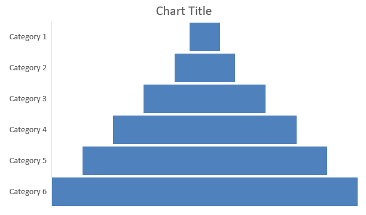

## **Przegląd**

Ten artykuł zawiera kompleksowy przewodnik, jak tworzyć i dostosowywać wykresy przy użyciu Aspose.Slides for .NET. Dowiesz się, jak programowo dodać wykres do slajdu, wypełnić go danymi oraz zastosować różne opcje formatowania, aby spełnić konkretne wymagania projektowe. W całym artykule szczegółowe przykłady kodu ilustrują każdy krok, od inicjalizacji prezentacji i obiektu wykresu po konfigurowanie serii, osi i legend. Postępując zgodnie z tym przewodnikiem, zdobędziesz solidne zrozumienie, jak integrować dynamiczne generowanie wykresów w aplikacjach .NET, usprawniając proces tworzenia prezentacji opartych na danych.

## **Tworzenie wykresu**

Wykresy pomagają szybko zwizualizować dane i uzyskać wnioski, które nie są od razu oczywiste w tabeli lub arkuszu kalkulacyjnym.

**Dlaczego tworzyć wykresy?**

Korzystając z wykresów, możesz:

* zagregować, skondensować lub podsumować duże ilości danych na jednym slajdzie w prezentacji;
* uwidocznić wzorce i trendy w danych;
* wywnioskować kierunek i dynamikę danych w czasie lub w odniesieniu do określonej jednostki miary;
* wykrywać odchylenia, anomalie, błędy i nielogiczne dane;
* przekazywać lub prezentować skomplikowane informacje.

W programie PowerPoint można tworzyć wykresy za pomocą funkcji *Wstaw*, która oferuje szablony do projektowania wielu typów wykresów. Korzystając z Aspose.Slides, możesz tworzyć zarówno standardowe wykresy (oparte na popularnych typach) jak i wykresy niestandardowe.

{} 
Użyj wyliczenia [ChartType](https://reference.aspose.com/slides/pl/net/aspose.slides.charts/charttype/) z przestrzeni nazw [Aspose.Slides.Charts](https://reference.aspose.com/slides/pl/net/aspose.slides.charts/). Wartości w tym wyliczeniu odpowiadają różnym typom wykresów.
{} 

### **Tworzenie wykresów słupkowych grupowanych**

W tej sekcji wyjaśniono, jak tworzyć wykresy słupkowe grupowane przy użyciu Aspose.Slides for .NET. Nauczysz się inicjalizować prezentację, dodać wykres i dostosować jego elementy, takie jak tytuł, dane, serie, kategorie i styl. Postępuj zgodnie z poniższymi krokami, aby zobaczyć, jak generowany jest standardowy wykres słupkowy grupowany:

1. Utwórz instancję klasy [Presentation](https://reference.aspose.com/slides/pl/net/aspose.slides/presentation).
1. Pobierz odwołanie do slajdu, używając jego indeksu.
1. Dodaj wykres z danymi i określ typ `ChartType.ClusteredColumn`.
1. Dodaj tytuł wykresu.
1. Uzyskaj dostęp do arkusza danych wykresu.
1. Wyczyść wszystkie domyślne serie i kategorie.
1. Dodaj nowe serie i kategorie.
1. Dodaj nowe dane wykresu dla serii.
1. Zastosuj kolor wypełnienia dla serii wykresu.
1. Dodaj etykiety do serii wykresu.
1. Zapisz zmodyfikowaną prezentację jako plik PPTX.

Poniższy kod C# pokazuje, jak utworzyć wykres słupkowy grupowany:

```c#
using System.Drawing;
using Aspose.Slides;
using Aspose.Slides.Charts;
using Aspose.Slides.Export;

// Instantiate the Presentation class.
using (Presentation presentation = new Presentation())
{
    // Access the first slide.
    ISlide slide = presentation.Slides[0];

    // Add a clustered column chart with its default data.
    IChart chart = slide.Shapes.AddChart(ChartType.ClusteredColumn, 20, 20, 500, 300);

    // Set the chart title.
    chart.ChartTitle.AddTextFrameForOverriding("Sample Title");
    chart.ChartTitle.TextFrameForOverriding.TextFrameFormat.CenterText = NullableBool.True;
    chart.ChartTitle.Height = 20;
    chart.HasTitle = true;

    // Set the index of the chart data sheet.
    int worksheetIndex = 0;

    // Get the chart data workbook.
    IChartDataWorkbook workbook = chart.ChartData.ChartDataWorkbook;

    // Delete the default generated series and categories.
    chart.ChartData.Series.Clear();
    chart.ChartData.Categories.Clear();

    // Add new series.
    chart.ChartData.Series.Add(workbook.GetCell(worksheetIndex, 0, 1, "Series 1"), chart.Type);
    chart.ChartData.Series.Add(workbook.GetCell(worksheetIndex, 0, 2, "Series 2"), chart.Type);

    // Add new categories.
    chart.ChartData.Categories.Add(workbook.GetCell(worksheetIndex, 1, 0, "Category 1"));
    chart.ChartData.Categories.Add(workbook.GetCell(worksheetIndex, 2, 0, "Category 2"));
    chart.ChartData.Categories.Add(workbook.GetCell(worksheetIndex, 3, 0, "Category 3"));

    // Get the first chart series.
    IChartSeries series = chart.ChartData.Series[0];

    // Populate the series data.
    series.DataPoints.AddDataPointForBarSeries(workbook.GetCell(worksheetIndex, 1, 1, 20));
    series.DataPoints.AddDataPointForBarSeries(workbook.GetCell(worksheetIndex, 2, 1, 50));
    series.DataPoints.AddDataPointForBarSeries(workbook.GetCell(worksheetIndex, 3, 1, 30));

    // Set the fill color for the series.
    series.Format.Fill.FillType = FillType.Solid;
    series.Format.Fill.SolidFillColor.Color = Color.Red;

    // Get the second chart series.
    series = chart.ChartData.Series[1];

    // Populate the series data.
    series.DataPoints.AddDataPointForBarSeries(workbook.GetCell(worksheetIndex, 1, 2, 30));
    series.DataPoints.AddDataPointForBarSeries(workbook.GetCell(worksheetIndex, 2, 2, 10));
    series.DataPoints.AddDataPointForBarSeries(workbook.GetCell(worksheetIndex, 3, 2, 60));

    // Set the fill color for the series.
    series.Format.Fill.FillType = FillType.Solid;
    series.Format.Fill.SolidFillColor.Color = Color.Green;

    // Set the first label to show the category name.
    IDataLabel label = series.DataPoints[0].Label;
    label.DataLabelFormat.ShowCategoryName = true;

    label = series.DataPoints[1].Label;
    label.DataLabelFormat.ShowSeriesName = true;

    // Set the series to show the value for the third label.
    label = series.DataPoints[2].Label;
    label.DataLabelFormat.ShowValue = true;
    label.DataLabelFormat.ShowSeriesName = true;
    label.DataLabelFormat.Separator = "/";

    // Save the presentation to disk as a PPTX file.
    presentation.Save("AsposeChart_out.pptx", SaveFormat.Pptx);
}
```

Wynik:


### **Tworzenie wykresów punktowych**

Wykresy punktowe (znane także jako wykresy rozproszenia lub wykresy x‑y) są często używane do wykrywania wzorców lub demonstrowania korelacji pomiędzy dwiema zmiennymi.

Użyj wykresu punktowego, gdy:

* Masz sparowane dane liczbowe.
* Masz dwie zmienne, które dobrze ze sobą współgrają.
* Chcesz określić, czy dwie zmienne są ze sobą powiązane.
* Masz zmienną niezależną, która ma wiele wartości dla zmiennej zależnej.

Poniższy kod C# pokazuje, jak utworzyć wykres punktowy z różnymi seriami znaczników:

```c#
using Aspose.Slides;
using Aspose.Slides.Charts;
using Aspose.Slides.Export;

// Utwórz instancję klasy Presentation.
using (Presentation presentation = new Presentation())
{
    // Dostęp do pierwszego slajdu.
    ISlide slide = presentation.Slides[0];

    // Utwórz domyślny wykres punktowy.
    IChart chart = slide.Shapes.AddChart(ChartType.ScatterWithSmoothLines, 20, 20, 500, 300);

    // Ustaw indeks arkusza danych wykresu.
    int worksheetIndex = 0;

    // Pobierz skoroszyt danych wykresu.
    IChartDataWorkbook workbook = chart.ChartData.ChartDataWorkbook;

    // Usuń domyślną serię.
    chart.ChartData.Series.Clear();

    // Dodaj nowe serie.
    chart.ChartData.Series.Add(workbook.GetCell(worksheetIndex, 1, 1, "Series 1"), chart.Type);
    chart.ChartData.Series.Add(workbook.GetCell(worksheetIndex, 1, 3, "Series 2"), chart.Type);

    // Pobierz pierwszą serię wykresu.
    IChartSeries series = chart.ChartData.Series[0];

    // Dodaj nowy punkt (1:3) do serii.
    series.DataPoints.AddDataPointForScatterSeries(workbook.GetCell(worksheetIndex, 2, 1, 1), workbook.GetCell(worksheetIndex, 2, 2, 3));

    // Dodaj nowy punkt (2:10).
    series.DataPoints.AddDataPointForScatterSeries(workbook.GetCell(worksheetIndex, 3, 1, 2), workbook.GetCell(worksheetIndex, 3, 2, 10));

    // Zmień typ serii.
    series.Type = ChartType.ScatterWithStraightLinesAndMarkers;

    // Zmień znacznik serii wykresu.
    series.Marker.Size = 10;
    series.Marker.Symbol = MarkerStyleType.Star;

    // Pobierz drugą serię wykresu.
    series = chart.ChartData.Series[1];

    // Dodaj nowy punkt (5:2) do serii wykresu.
    series.DataPoints.AddDataPointForScatterSeries(workbook.GetCell(worksheetIndex, 2, 3, 5), workbook.GetCell(worksheetIndex, 2, 4, 2));

    // Dodaj nowy punkt (3:1).
    series.DataPoints.AddDataPointForScatterSeries(workbook.GetCell(worksheetIndex, 3, 3, 3), workbook.GetCell(worksheetIndex, 3, 4, 1));

    // Dodaj nowy punkt (2:2).
    series.DataPoints.AddDataPointForScatterSeries(workbook.GetCell(worksheetIndex, 4, 3, 2), workbook.GetCell(worksheetIndex, 4, 4, 2));

    // Dodaj nowy punkt (5:1).
    series.DataPoints.AddDataPointForScatterSeries(workbook.GetCell(worksheetIndex, 5, 3, 5), workbook.GetCell(worksheetIndex, 5, 4, 1));

    // Zmień znacznik serii wykresu.
    series.Marker.Size = 10;
    series.Marker.Symbol = MarkerStyleType.Circle;

    // Zapisz prezentację na dysk jako plik PPTX.
    presentation.Save("AsposeChart_out.pptx", SaveFormat.Pptx);
}
```

Wynik:


### **Tworzenie wykresów kołowych**

Wykresy kołowe najlepiej służą do prezentacji stosunku części do całości w danych, zwłaszcza gdy dane zawierają etykiety kategoryczne z wartościami liczbowymi. Jeśli jednak Twoje dane zawierają wiele części lub etykiet, rozważ użycie wykresu słupkowego.

1. Utwórz instancję klasy [Presentation](https://reference.aspose.com/slides/pl/net/aspose.slides/presentation).
1. Pobierz odwołanie do slajdu, używając jego indeksu.
1. Dodaj wykres z domyślnymi danymi i określ typ `ChartType.Pie`.
1. Uzyskaj dostęp do skoroszytu danych wykresu ([IChartDataWorkbook](https://reference.aspose.com/slides/pl/net/aspose.slides.charts/ichartdataworkbook/)).
1. Wyczyść domyślne serie i kategorie.
1. Dodaj nowe serie i kategorie.
1. Dodaj nowe dane wykresu dla serii.
1. Dodaj nowe punkty do wykresu i zastosuj niestandardowe kolory do sektorów wykresu kołowego.
1. Ustaw etykiety dla serii.
1. Włącz linie poprowadzenia dla etykiet serii.
1. Ustaw kąt obrotu wykresu kołowego.
1. Zapisz zmodyfikowaną prezentację jako plik PPTX.

Poniższy kod C# pokazuje, jak utworzyć wykres kołowy:

```c#
using System.Drawing;
using Aspose.Slides;
using Aspose.Slides.Charts;
using Aspose.Slides.Export;

// Utwórz instancję klasy Presentation.
using (Presentation presentation = new Presentation())
{
    // Uzyskaj dostęp do pierwszego slajdu.
    ISlide slide = presentation.Slides[0];

    // Dodaj wykres z domyślnymi danymi.
    IChart chart = slide.Shapes.AddChart(ChartType.Pie, 20, 20, 500, 300);

    // Ustaw tytuł wykresu.
    chart.ChartTitle.AddTextFrameForOverriding("Sample Title");
    chart.ChartTitle.TextFrameForOverriding.TextFrameFormat.CenterText = NullableBool.True;
    chart.ChartTitle.Height = 20;
    chart.HasTitle = true;

    // Ustaw pierwszą serię, aby wyświetlała wartości.
    chart.ChartData.Series[0].Labels.DefaultDataLabelFormat.ShowValue = true;

    // Ustaw indeks arkusza danych wykresu.
    int worksheetIndex = 0;

    // Pobierz skoroszyt danych wykresu.
    IChartDataWorkbook workbook = chart.ChartData.ChartDataWorkbook;

    // Usuń domyślne wygenerowane serie i kategorie.
    chart.ChartData.Series.Clear();
    chart.ChartData.Categories.Clear();

    // Dodaj nowe kategorie.
    chart.ChartData.Categories.Add(workbook.GetCell(0, 1, 0, "1st Qtr"));
    chart.ChartData.Categories.Add(workbook.GetCell(0, 2, 0, "2nd Qtr"));
    chart.ChartData.Categories.Add(workbook.GetCell(0, 3, 0, "3rd Qtr"));

    // Dodaj nowe serie.
    IChartSeries series = chart.ChartData.Series.Add(workbook.GetCell(0, 0, 1, "Series 1"), chart.Type);

    // Wypełnij dane serii.
    series.DataPoints.AddDataPointForPieSeries(workbook.GetCell(worksheetIndex, 1, 1, 20));
    series.DataPoints.AddDataPointForPieSeries(workbook.GetCell(worksheetIndex, 2, 1, 50));
    series.DataPoints.AddDataPointForPieSeries(workbook.GetCell(worksheetIndex, 3, 1, 30));

    // Ustaw kolor sektora.
    chart.ChartData.SeriesGroups[0].IsColorVaried = true;

    IChartDataPoint point = series.DataPoints[0];
    point.Format.Fill.FillType = FillType.Solid;
    point.Format.Fill.SolidFillColor.Color = Color.Cyan;

    // Ustaw obramowanie sektora.
    point.Format.Line.FillFormat.FillType = FillType.Solid;
    point.Format.Line.FillFormat.SolidFillColor.Color = Color.Gray;
    point.Format.Line.Width = 3.0;
    point.Format.Line.Style = LineStyle.ThinThick;
    point.Format.Line.DashStyle = LineDashStyle.LargeDash;

    IChartDataPoint point1 = series.DataPoints[1];
    point1.Format.Fill.FillType = FillType.Solid;
    point1.Format.Fill.SolidFillColor.Color = Color.Brown;

    // Ustaw obramowanie sektora.
    point1.Format.Line.FillFormat.FillType = FillType.Solid;
    point1.Format.Line.FillFormat.SolidFillColor.Color = Color.Blue;
    point1.Format.Line.Width = 3.0;
    point1.Format.Line.Style = LineStyle.Single;
    point1.Format.Line.DashStyle = LineDashStyle.LargeDashDot;

    IChartDataPoint point2 = series.DataPoints[2];
    point2.Format.Fill.FillType = FillType.Solid;
    point2.Format.Fill.SolidFillColor.Color = Color.Coral;

    // Ustaw obramowanie sektora.
    point2.Format.Line.FillFormat.FillType = FillType.Solid;
    point2.Format.Line.FillFormat.SolidFillColor.Color = Color.Red;
    point2.Format.Line.Width = 2.0;
    point2.Format.Line.Style = LineStyle.ThinThin;
    point2.Format.Line.DashStyle = LineDashStyle.LargeDashDotDot;

    // Utwórz własne etykiety dla każdej kategorii w nowej serii.
    IDataLabel label1 = series.DataPoints[0].Label;

    label1.DataLabelFormat.ShowValue = true;

    IDataLabel label2 = series.DataPoints[1].Label;
    label2.DataLabelFormat.ShowValue = true;
    label2.DataLabelFormat.ShowLegendKey = true;
    label2.DataLabelFormat.ShowPercentage = true;

    IDataLabel label3 = series.DataPoints[2].Label;
    label3.DataLabelFormat.ShowSeriesName = true;
    label3.DataLabelFormat.ShowPercentage = true;

    // Ustaw serię, aby wyświetlała linie prowadzące w wykresie.
    series.Labels.DefaultDataLabelFormat.ShowLeaderLines = true;

    // Ustaw kąt obrotu sektorów wykresu kołowego.
    chart.ChartData.SeriesGroups[0].FirstSliceAngle = 180;

    // Zapisz prezentację na dysku jako plik PPTX.
    presentation.Save("PieChart_out.pptx", SaveFormat.Pptx);
}
```

Wynik:


### **Tworzenie wykresów liniowych**

Wykresy liniowe (znane także jako wykresy liniowe) są najlepsze w sytuacjach, gdy chcesz pokazać zmiany wartości w czasie. Dzięki wykresowi liniowemu możesz jednocześnie porównać dużą ilość danych, śledzić zmiany i trendy w czasie, podkreślać anomalie w seriach danych i nie tylko.

1. Utwórz instancję klasy [Presentation](https://reference.aspose.com/slides/pl/net/aspose.slides/presentation).
1. Pobierz odwołanie do slajdu, używając jego indeksu.
1. Dodaj wykres z domyślnymi danymi i określ typ `ChartType.Line`.
1. Uzyskaj dostęp do skoroszytu danych wykresu ([IChartDataWorkbook](https://reference.aspose.com/slides/pl/net/aspose.slides.charts/ichartdataworkbook/)).
1. Wyczyść domyślne serie i kategorie.
1. Dodaj nowe serie i kategorie.
1. Dodaj nowe dane wykresu dla serii.
1. Zapisz zmodyfikowaną prezentację jako plik PPTX.

Poniższy kod C# pokazuje, jak utworzyć wykres liniowy:

```c#
using Aspose.Slides;
using Aspose.Slides.Charts;
using Aspose.Slides.Export;

using (Presentation presentation = new Presentation())
{
    IChart lineChart = presentation.Slides[0].Shapes.AddChart(ChartType.Line, 20, 20, 500, 300);

    presentation.Save("lineChart.pptx", SaveFormat.Pptx);
}
```

Domyślnie punkty na wykresie liniowym są łączone prostymi, ciągłymi liniami. Jeśli chcesz, aby punkty były łączone kreskami, możesz określić preferowany typ kreski w następujący sposób:

```c#
using Aspose.Slides;
using Aspose.Slides.Charts;

using (Presentation presentation = new Presentation())
{
    IChart lineChart = presentation.Slides[0].Shapes.AddChart(ChartType.Line, 20, 20, 500, 300);

    foreach (IChartSeries series in lineChart.ChartData.Series)
    {
        series.Format.Line.DashStyle = LineDashStyle.Dash;
    }
}
```

Wynik:


### **Tworzenie wykresów mapy drzewa**

Wykresy mapy drzewa są najlepsze dla danych sprzedażowych, gdy chcesz pokazać względny rozmiar kategorii danych i szybko zwrócić uwagę na elementy, które wnoszą największy wkład w każdej kategorii.

1. Utwórz instancję klasy [Presentation](https://reference.aspose.com/slides/pl/net/aspose.slides/presentation).
1. Pobierz odwołanie do slajdu, używając jego indeksu.
1. Dodaj wykres z domyślnymi danymi i określ typ `ChartType.Treemap`.
1. Uzyskaj dostęp do skoroszytu danych wykresu ([IChartDataWorkbook](https://reference.aspose.com/slides/pl/net/aspose.slides.charts/ichartdataworkbook/)).
1. Wyczyść domyślne serie i kategorie.
1. Dodaj nowe serie i kategorie.
1. Dodaj nowe dane wykresu dla serii.
1. Zapisz zmodyfikowaną prezentację jako plik PPTX.

Poniższy kod C# pokazuje, jak utworzyć wykres mapy drzewa:

```c#
using Aspose.Slides;
using Aspose.Slides.Charts;
using Aspose.Slides.Export;

using (Presentation presentation = new Presentation())
{
    IChart chart = presentation.Slides[0].Shapes.AddChart(ChartType.Treemap, 20, 20, 500, 300);
    chart.ChartData.Categories.Clear();
    chart.ChartData.Series.Clear();

    IChartDataWorkbook workbook = chart.ChartData.ChartDataWorkbook;
    workbook.Clear(0);

    // Gałąź 1
    IChartCategory leaf = chart.ChartData.Categories.Add(workbook.GetCell(0, "C1", "Leaf1"));
    leaf.GroupingLevels.SetGroupingItem(1, "Stem1");
    leaf.GroupingLevels.SetGroupingItem(2, "Branch1");

    chart.ChartData.Categories.Add(workbook.GetCell(0, "C2", "Leaf2"));

    leaf = chart.ChartData.Categories.Add(workbook.GetCell(0, "C3", "Leaf3"));
    leaf.GroupingLevels.SetGroupingItem(1, "Stem2");

    chart.ChartData.Categories.Add(workbook.GetCell(0, "C4", "Leaf4"));

    // Gałąź 2
    leaf = chart.ChartData.Categories.Add(workbook.GetCell(0, "C5", "Leaf5"));
    leaf.GroupingLevels.SetGroupingItem(1, "Stem3");
    leaf.GroupingLevels.SetGroupingItem(2, "Branch2");

    chart.ChartData.Categories.Add(workbook.GetCell(0, "C6", "Leaf6"));

    leaf = chart.ChartData.Categories.Add(workbook.GetCell(0, "C7", "Leaf7"));
    leaf.GroupingLevels.SetGroupingItem(1, "Stem4");

    chart.ChartData.Categories.Add(workbook.GetCell(0, "C8", "Leaf8"));

    IChartSeries series = chart.ChartData.Series.Add(ChartType.Treemap);
    series.Labels.DefaultDataLabelFormat.ShowCategoryName = true;
    series.DataPoints.AddDataPointForTreemapSeries(workbook.GetCell(0, "D1", 4));
    series.DataPoints.AddDataPointForTreemapSeries(workbook.GetCell(0, "D2", 5));
    series.DataPoints.AddDataPointForTreemapSeries(workbook.GetCell(0, "D3", 3));
    series.DataPoints.AddDataPointForTreemapSeries(workbook.GetCell(0, "D4", 6));
    series.DataPoints.AddDataPointForTreemapSeries(workbook.GetCell(0, "D5", 9));
    series.DataPoints.AddDataPointForTreemapSeries(workbook.GetCell(0, "D6", 9));
    series.DataPoints.AddDataPointForTreemapSeries(workbook.GetCell(0, "D7", 4));
    series.DataPoints.AddDataPointForTreemapSeries(workbook.GetCell(0, "D8", 3));

    series.ParentLabelLayout = ParentLabelLayoutType.Overlapping;

    presentation.Save("Treemap.pptx", SaveFormat.Pptx);
}
```

Wynik:


### **Tworzenie wykresów giełdowych**

Wykresy giełdowe służą do wyświetlania danych finansowych, takich jak ceny otwarcia, maksymalne, minimalne i zamknięcia, pomagając analizować trendy rynkowe i zmienność. Dostarczają istotnych informacji o wynikach akcji, wspierając inwestorów i analityków w podejmowaniu świadomych decyzji.

1. Utwórz instancję klasy [Presentation](https://reference.aspose.com/slides/pl/net/aspose.slides/presentation).
1. Pobierz odwołanie do slajdu, używając jego indeksu.
1. Dodaj wykres z domyślnymi danymi i określ typ `ChartType.OpenHighLowClose`.
1. Uzyskaj dostęp do skoroszytu danych wykresu ([IChartDataWorkbook](https://reference.aspose.com/slides/pl/net/aspose.slides.charts/ichartdataworkbook/)).
1. Wyczyść domyślne serie i kategorie.
1. Dodaj nowe serie i kategorie.
1. Dodaj nowe dane wykresu dla serii.
1. Określ format HiLowLines.
1. Zapisz zmodyfikowaną prezentację jako plik PPTX.

Poniższy kod C# pokazuje, jak utworzyć wykres giełdowy:

```c#
using Aspose.Slides;
using Aspose.Slides.Charts;
using Aspose.Slides.Export;

using (Presentation presentation = new Presentation())
{
    IChart chart = presentation.Slides[0].Shapes.AddChart(ChartType.OpenHighLowClose, 20, 20, 500, 300, false);

    IChartDataWorkbook workbook = chart.ChartData.ChartDataWorkbook;

    chart.ChartData.Categories.Add(workbook.GetCell(0, 1, 0, "A"));
    chart.ChartData.Categories.Add(workbook.GetCell(0, 2, 0, "B"));
    chart.ChartData.Categories.Add(workbook.GetCell(0, 3, 0, "C"));

    chart.ChartData.Series.Add(workbook.GetCell(0, 0, 1, "Open"), chart.Type);
    chart.ChartData.Series.Add(workbook.GetCell(0, 0, 2, "High"), chart.Type);
    chart.ChartData.Series.Add(workbook.GetCell(0, 0, 3, "Low"), chart.Type);
    chart.ChartData.Series.Add(workbook.GetCell(0, 0, 4, "Close"), chart.Type);

    IChartSeries series = chart.ChartData.Series[0];
    series.DataPoints.AddDataPointForStockSeries(workbook.GetCell(0, 1, 1, 72));
    series.DataPoints.AddDataPointForStockSeries(workbook.GetCell(0, 2, 1, 25));
    series.DataPoints.AddDataPointForStockSeries(workbook.GetCell(0, 3, 1, 38));

    series = chart.ChartData.Series[1];
    series.DataPoints.AddDataPointForStockSeries(workbook.GetCell(0, 1, 2, 172));
    series.DataPoints.AddDataPointForStockSeries(workbook.GetCell(0, 2, 2, 57));
    series.DataPoints.AddDataPointForStockSeries(workbook.GetCell(0, 3, 2, 57));

    series = chart.ChartData.Series[2];
    series.DataPoints.AddDataPointForStockSeries(workbook.GetCell(0, 1, 3, 12));
    series.DataPoints.AddDataPointForStockSeries(workbook.GetCell(0, 2, 3, 12));
    series.DataPoints.AddDataPointForStockSeries(workbook.GetCell(0, 3, 3, 13));

    series = chart.ChartData.Series[3];
    series.DataPoints.AddDataPointForStockSeries(workbook.GetCell(0, 1, 4, 25));
    series.DataPoints.AddDataPointForStockSeries(workbook.GetCell(0, 2, 4, 38));
    series.DataPoints.AddDataPointForStockSeries(workbook.GetCell(0, 3, 4, 50));

    chart.ChartData.SeriesGroups[0].UpDownBars.HasUpDownBars = true;
    chart.ChartData.SeriesGroups[0].HiLowLinesFormat.Line.FillFormat.FillType = FillType.Solid;

    foreach (IChartSeries ser in chart.ChartData.Series)
    {
        ser.Format.Line.FillFormat.FillType = FillType.NoFill;
    }

    chart.Axes.VerticalAxis.MinorGridLinesFormat.Line.FillFormat.FillType = FillType.NoFill;

    presentation.Save("Stock-chart.pptx", SaveFormat.Pptx);
}
```

Wynik:


### **Tworzenie wykresów skrzynkowych i wąsów**

Wykresy skrzynkowe i wąsów służą do wyświetlania rozkładu danych poprzez podsumowanie kluczowych miar statystycznych, takich jak mediana, kwartyle i potencjalne obserwacje odstające. Są szczególnie przydatne w analizie eksploracyjnej i badaniach statystycznych, umożliwiając szybkie zrozumienie zmienności danych i identyfikację anomalii.

1. Utwórz instancję klasy [Presentation](https://reference.aspose.com/slides/pl/net/aspose.slides/presentation).
1. Pobierz odwołanie do slajdu, używając jego indeksu.
1. Dodaj wykres z domyślnymi danymi i określ typ `ChartType.BoxAndWhisker`.
1. Uzyskaj dostęp do skoroszytu danych wykresu ([IChartDataWorkbook](https://reference.aspose.com/slides/pl/net/aspose.slides.charts/ichartdataworkbook/)).
1. Wyczyść domyślne serie i kategorie.
1. Dodaj nowe serie i kategorie.
1. Dodaj nowe dane wykresu dla serii.
1. Zapisz zmodyfikowaną prezentację jako plik PPTX.

Poniższy kod C# pokazuje, jak utworzyć wykres skrzynkowy i wąsowy:

```c#
using Aspose.Slides;
using Aspose.Slides.Charts;
using Aspose.Slides.Export;

using (Presentation presentation = new Presentation())
{
    IChart chart = presentation.Slides[0].Shapes.AddChart(ChartType.BoxAndWhisker, 20, 20, 500, 300);
    chart.ChartData.Categories.Clear();
    chart.ChartData.Series.Clear();

    IChartDataWorkbook workbook = chart.ChartData.ChartDataWorkbook;
    workbook.Clear(0);

    chart.ChartData.Categories.Add(workbook.GetCell(0, "A1", "Category 1"));
    chart.ChartData.Categories.Add(workbook.GetCell(0, "A2", "Category 2"));
    chart.ChartData.Categories.Add(workbook.GetCell(0, "A3", "Category 3"));
    chart.ChartData.Categories.Add(workbook.GetCell(0, "A4", "Category 4"));
    chart.ChartData.Categories.Add(workbook.GetCell(0, "A5", "Category 5"));
    chart.ChartData.Categories.Add(workbook.GetCell(0, "A6", "Category 6"));

    IChartSeries series = chart.ChartData.Series.Add(ChartType.BoxAndWhisker);

    series.QuartileMethod = QuartileMethodType.Exclusive;
    series.ShowMeanLine = true;
    series.ShowMeanMarkers = true;
    series.ShowInnerPoints = true;
    series.ShowOutlierPoints = true;

    series.DataPoints.AddDataPointForBoxAndWhiskerSeries(workbook.GetCell(0, "B1", 15));
    series.DataPoints.AddDataPointForBoxAndWhiskerSeries(workbook.GetCell(0, "B2", 41));
    series.DataPoints.AddDataPointForBoxAndWhiskerSeries(workbook.GetCell(0, "B3", 16));
    series.DataPoints.AddDataPointForBoxAndWhiskerSeries(workbook.GetCell(0, "B4", 10));
    series.DataPoints.AddDataPointForBoxAndWhiskerSeries(workbook.GetCell(0, "B5", 23));
    series.DataPoints.AddDataPointForBoxAndWhiskerSeries(workbook.GetCell(0, "B6", 16));

    presentation.Save("BoxAndWhisker.pptx", SaveFormat.Pptx);
}
```

### **Tworzenie wykresów lejkowych**

Wykresy lejkowe służą do wizualizacji procesów składających się z kolejnych etapów, w których objętość danych maleje w miarę przechodzenia z jednego kroku do następnego. Są szczególnie pomocne przy analizie wskaźników konwersji, identyfikacji wąskich gardeł oraz monitorowaniu efektywności procesów sprzedaży lub marketingu.

1. Utwórz instancję klasy [Presentation](https://reference.aspose.com/slides/pl/net/aspose.slides/presentation).
1. Pobierz odwołanie do slajdu, używając jego indeksu.
1. Dodaj wykres z domyślnymi danymi i określ typ `ChartType.Funnel`.
1. Zapisz zmodyfikowaną prezentację jako plik PPTX.

Poniższy kod C# pokazuje, jak utworzyć wykres lejkowy:

```c#
using Aspose.Slides;
using Aspose.Slides.Charts;
using Aspose.Slides.Export;

using (Presentation presentation = new Presentation("test.pptx"))
{
    IChart chart = presentation.Slides[0].Shapes.AddChart(ChartType.Funnel, 50, 50, 500, 400);
    chart.ChartData.Categories.Clear();
    chart.ChartData.Series.Clear();

    IChartDataWorkbook workbook = chart.ChartData.ChartDataWorkbook;
    workbook.Clear(0);

    chart.ChartData.Categories.Add(workbook.GetCell(0, "A1", "Category 1"));
    chart.ChartData.Categories.Add(workbook.GetCell(0, "A2", "Category 2"));
    chart.ChartData.Categories.Add(workbook.GetCell(0, "A3", "Category 3"));
    chart.ChartData.Categories.Add(workbook.GetCell(0, "A4", "Category 4"));
    chart.ChartData.Categories.Add(workbook.GetCell(0, "A5", "Category 5"));
    chart.ChartData.Categories.Add(workbook.GetCell(0, "A6", "Category 6"));

    IChartSeries series = chart.ChartData.Series.Add(ChartType.Funnel);

    series.DataPoints.AddDataPointForFunnelSeries(workbook.GetCell(0, "B1", 50));
    series.DataPoints.AddDataPointForFunnelSeries(workbook.GetCell(0, "B2", 100));
    series.DataPoints.AddDataPointForFunnelSeries(workbook.GetCell(0, "B3", 200));
    series.DataPoints.AddDataPointForFunnelSeries(workbook.GetCell(0, "B4", 300));
    series.DataPoints.AddDataPointForFunnelSeries(workbook.GetCell(0, "B5", 400));
    series.DataPoints.AddDataPointForFunnelSeries(workbook.GetCell(0, "B6", 500));

    presentation.Save("Funnel.pptx", SaveFormat.Pptx);
}
```

Wynik:



### **Tworzenie wykresów promieniowych**

Wykresy promieniowe służą do wizualizacji danych hierarchicznych, przedstawiając poziomy jako koncentryczne pierścienie. Pomagają zilustrować relacje część‑całość i są idealne do przedstawiania zagnieżdżonych kategorii i podkategorii w przejrzystym, kompaktowym formacie.

1. Utwórz instancję klasy [Presentation](https://reference.aspose.com/slides/pl/net/aspose.slides/presentation).
1. Pobierz odwołanie do slajdu, używając jego indeksu.
1. Dodaj wykres z domyślnymi danymi i określ typ `ChartType.Sunburst`.
1. Zapisz zmodyfikowaną prezentację jako plik PPTX.

Poniższy kod C# pokazuje, jak utworzyć wykres promieniowy:

```c#
using Aspose.Slides;
using Aspose.Slides.Charts;
using Aspose.Slides.Export;

using (Presentation presentation = new Presentation())
{
    IChart chart = presentation.Slides[0].Shapes.AddChart(ChartType.Sunburst, 20, 20, 500, 300);
    chart.ChartData.Categories.Clear();
    chart.ChartData.Series.Clear();

    IChartDataWorkbook workbook = chart.ChartData.ChartDataWorkbook;
    workbook.Clear(0);

    // Gałąź 1
    IChartCategory leaf = chart.ChartData.Categories.Add(workbook.GetCell(0, "C1", "Leaf1"));
    leaf.GroupingLevels.SetGroupingItem(1, "Stem1");
    leaf.GroupingLevels.SetGroupingItem(2, "Branch1");

    chart.ChartData.Categories.Add(workbook.GetCell(0, "C2", "Leaf2"));

    leaf = chart.ChartData.Categories.Add(workbook.GetCell(0, "C3", "Leaf3"));
    leaf.GroupingLevels.SetGroupingItem(1, "Stem2");

    chart.ChartData.Categories.Add(workbook.GetCell(0, "C4", "Leaf4"));

    // Gałąź 2
    leaf = chart.ChartData.Categories.Add(workbook.GetCell(0, "C5", "Leaf5"));
    leaf.GroupingLevels.SetGroupingItem(1, "Stem3");
    leaf.GroupingLevels.SetGroupingItem(2, "Branch2");

    chart.ChartData.Categories.Add(workbook.GetCell(0, "C6", "Leaf6"));

    leaf = chart.ChartData.Categories.Add(workbook.GetCell(0, "C7", "Leaf7"));
    leaf.GroupingLevels.SetGroupingItem(1, "Stem4");

    chart.ChartData.Categories.Add(workbook.GetCell(0, "C8", "Leaf8"));

    IChartSeries series = chart.ChartData.Series.Add(ChartType.Sunburst);
    series.Labels.DefaultDataLabelFormat.ShowCategoryName = true;
    series.DataPoints.AddDataPointForSunburstSeries(workbook.GetCell(0, "D1", 4));
    series.DataPoints.AddDataPointForSunburstSeries(workbook.GetCell(0, "D2", 5));
    series.DataPoints.AddDataPointForSunburstSeries(workbook.GetCell(0, "D3", 3));
    series.DataPoints.AddDataPointForSunburstSeries(workbook.GetCell(0, "D4", 6));
    series.DataPoints.AddDataPointForSunburstSeries(workbook.GetCell(0, "D5", 9));
    series.DataPoints.AddDataPointForSunburstSeries(workbook.GetCell(0, "D6", 9));
    series.DataPoints.AddDataPointForSunburstSeries(workbook.GetCell(0, "D7", 4));
    series.DataPoints.AddDataPointForSunburstSeries(workbook.GetCell(0, "D8", 3));

    presentation.Save("Sunburst.pptx", SaveFormat.Pptx);
}
```

Wynik:


### **Tworzenie wykresów histogramu**

Histogramy służą do przedstawiania rozkładu danych liczbowych poprzez grupowanie wartości w przedziały (kosze). Są szczególnie użyteczne przy identyfikacji wzorców, takich jak częstotliwość, skośność i rozproszenie, oraz przy wykrywaniu wartości odstających w zestawie danych.

1. Utwórz instancję klasy [Presentation](https://reference.aspose.com/slides/pl/net/aspose.slides/presentation).
1. Pobierz odwołanie do slajdu, używając jego indeksu.
1. Dodaj wykres z danymi i określ typ `ChartType.Histogram`.
1. Uzyskaj dostęp do skoroszytu danych wykresu ([IChartDataWorkbook](https://reference.aspose.com/slides/pl/net/aspose.slides.charts/ichartdataworkbook/)).
1. Wyczyść domyślne serie i kategorie.
1. Dodaj nowe serie i kategorie.
1. Zapisz zmodyfikowaną prezentację jako plik PPTX.

Poniższy kod C# pokazuje, jak utworzyć wykres histogramu:

```c#
using Aspose.Slides;
using Aspose.Slides.Charts;
using Aspose.Slides.Export;

using (Presentation presentation = new Presentation())
{
    IChart chart = presentation.Slides[0].Shapes.AddChart(ChartType.Histogram, 20, 20, 500, 300);
    chart.ChartData.Categories.Clear();
    chart.ChartData.Series.Clear();

    IChartDataWorkbook workbook = chart.ChartData.ChartDataWorkbook;
    workbook.Clear(0);

    IChartSeries series = chart.ChartData.Series.Add(ChartType.Histogram);
    series.DataPoints.AddDataPointForHistogramSeries(workbook.GetCell(0, "A1", 15));
    series.DataPoints.AddDataPointForHistogramSeries(workbook.GetCell(0, "A2", -41));
    series.DataPoints.AddDataPointForHistogramSeries(workbook.GetCell(0, "A3", 16));
    series.DataPoints.AddDataPointForHistogramSeries(workbook.GetCell(0, "A4", 10));
    series.DataPoints.AddDataPointForHistogramSeries(workbook.GetCell(0, "A5", -23));
    series.DataPoints.AddDataPointForHistogramSeries(workbook.GetCell(0, "A6", 16));

    chart.Axes.HorizontalAxis.AggregationType = AxisAggregationType.Automatic;

    presentation.Save("Histogram.pptx", SaveFormat.Pptx);
}
```

Wynik:


### **Tworzenie wykresów radarowych**

Wykresy radarowe służą do prezentacji danych wielowymiarowych w dwuwymiarowym formacie, umożliwiając jednoczesne porównanie kilku zmiennych. Są szczególnie przydatne do identyfikacji wzorców, mocnych i słabych stron w różnych miarach wydajności lub atrybutach.

1. Utwórz instancję klasy [Presentation](https://reference.aspose.com/slides/pl/net/aspose.slides/presentation).
1. Pobierz odwołanie do slajdu, używając jego indeksu.
1. Dodaj wykres z danymi i określ typ `ChartType.Radar`.
1. Zapisz zmodyfikowaną prezentację jako plik PPTX.

Poniższy kod C# pokazuje, jak utworzyć wykres radarowy:

```c#
using Aspose.Slides;
using Aspose.Slides.Charts;
using Aspose.Slides.Export;

using (Presentation presentation = new Presentation())
{
    presentation.Slides[0].Shapes.AddChart(ChartType.Radar, 20, 20, 500, 300);
    presentation.Save("Radar-chart.pptx", SaveFormat.Pptx);
}
```

Wynik:


### **Tworzenie wykresów wielokategorialnych**

Wykresy wielokategorialne służą do prezentacji danych, które obejmują więcej niż jedną grupę kategorialną, umożliwiając porównanie wartości w wielu wymiarach jednocześnie. Są szczególnie przydatne, gdy trzeba analizować trendy i zależności w złożonych, wielowarstwowych zestawach danych.

1. Utwórz instancję klasy [Presentation](https://reference.aspose.com/slides/pl/net/aspose.slides/presentation).
1. Pobierz odwołanie do slajdu, używając jego indeksu.
1. Dodaj wykres z domyślnymi danymi i określ typ `ChartType.ClusteredColumn`.
1. Uzyskaj dostęp do skoroszytu danych wykresu ([IChartDataWorkbook](https://reference.aspose.com/slides/pl/net/aspose.slides.charts/ichartdataworkbook/)).
1. Wyczyść domyślne serie i kategorie.
1. Dodaj nowe serie i kategorie.
1. Dodaj nowe dane wykresu dla serii.
1. Zapisz zmodyfikowaną prezentację jako plik PPTX.

Poniższy kod C# pokazuje, jak utworzyć wykres wielokategorialny:

```c#
using Aspose.Slides;
using Aspose.Slides.Charts;
using Aspose.Slides.Export;

using (Presentation presentation = new Presentation())
{
    ISlide slide = presentation.Slides[0];

    IChart chart = presentation.Slides[0].Shapes.AddChart(ChartType.ClusteredColumn, 20, 20, 500, 300);
    chart.ChartData.Series.Clear();
    chart.ChartData.Categories.Clear();

    IChartDataWorkbook workbook = chart.ChartData.ChartDataWorkbook;
    workbook.Clear(0);

    int worksheetIndex = 0;

    IChartCategory category = chart.ChartData.Categories.Add(workbook.GetCell(0, "c2", "A"));
    category.GroupingLevels.SetGroupingItem(1, "Group1");
    category = chart.ChartData.Categories.Add(workbook.GetCell(0, "c3", "B"));

    category = chart.ChartData.Categories.Add(workbook.GetCell(0, "c4", "C"));
    category.GroupingLevels.SetGroupingItem(1, "Group2");
    category = chart.ChartData.Categories.Add(workbook.GetCell(0, "c5", "D"));

    category = chart.ChartData.Categories.Add(workbook.GetCell(0, "c6", "E"));
    category.GroupingLevels.SetGroupingItem(1, "Group3");
    category = chart.ChartData.Categories.Add(workbook.GetCell(0, "c7", "F"));

    category = chart.ChartData.Categories.Add(workbook.GetCell(0, "c8", "G"));
    category.GroupingLevels.SetGroupingItem(1, "Group4");
    category = chart.ChartData.Categories.Add(workbook.GetCell(0, "c9", "H"));

    // Dodaj serię.
    IChartSeries series = chart.ChartData.Series.Add(workbook.GetCell(0, "D1", "Series 1"), ChartType.ClusteredColumn);

    series.DataPoints.AddDataPointForBarSeries(workbook.GetCell(worksheetIndex, "D2", 10));
    series.DataPoints.AddDataPointForBarSeries(workbook.GetCell(worksheetIndex, "D3", 20));
    series.DataPoints.AddDataPointForBarSeries(workbook.GetCell(worksheetIndex, "D4", 30));
    series.DataPoints.AddDataPointForBarSeries(workbook.GetCell(worksheetIndex, "D5", 40));
    series.DataPoints.AddDataPointForBarSeries(workbook.GetCell(worksheetIndex, "D6", 50));
    series.DataPoints.AddDataPointForBarSeries(workbook.GetCell(worksheetIndex, "D7", 60));
    series.DataPoints.AddDataPointForBarSeries(workbook.GetCell(worksheetIndex, "D8", 70));
    series.DataPoints.AddDataPointForBarSeries(workbook.GetCell(worksheetIndex, "D9", 80));

    // Save the presentation with the chart.
    presentation.Save("AsposeChart_out.pptx", SaveFormat.Pptx);
}
```

Wynik:


### **Tworzenie wykresów mapowych**

Wykresy mapowe służą do wizualizacji danych geograficznych poprzez mapowanie informacji na konkretne lokalizacje, takie jak kraje, stany czy miasta. Są szczególnie przydatne przy analizie trendów regionalnych, danych demograficznych oraz rozkładów przestrzennych w sposób przejrzysty i atrakcyjny wizualnie.

Poniższy kod C# pokazuje, jak utworzyć wykres mapowy:

```c#
using Aspose.Slides;
using Aspose.Slides.Charts;
using Aspose.Slides.Export;

using (Presentation presentation = new Presentation())
{
    IChart chart = presentation.Slides[0].Shapes.AddChart(ChartType.Map, 20, 20, 500, 300);
    presentation.Save("mapChart.pptx", SaveFormat.Pptx);
}
```

Wynik:


{} 
Powyższy obrazek przedstawia zapisany plik prezentacji otwarty w programie PowerPoint. Aspose.Slides zapisuje wykres mapowy i jego dane poprawnie, ale sam nie rysuje wykresów mapowych: gdy slajd zawierający taki wykres jest renderowany do obrazu lub konwertowany na PDF lub SVG, obszar wykresu pozostaje pusty. Inne kształty na tym samym slajdzie nie są dotknięte.
{} 

### **Tworzenie wykresów kombinowanych**

Wykres kombinowany (lub wykres combo) łączy dwa lub więcej typów wykresów w jednym diagramie. Dzięki temu wykresowi możesz podkreślić, porównać lub zbadać różnice między dwoma lub większą liczbą zestawów danych, pomagając zidentyfikować zależności między nimi.


Poniższy kod C# pokazuje, jak utworzyć kombinowany wykres przedstawiony powyżej w prezentacji PowerPoint:

```c#
using System.Drawing;
using Aspose.Slides;
using Aspose.Slides.Charts;
using Aspose.Slides.Export;

private static void CreateComboChart()
{
    using (Presentation presentation = new Presentation())
    {
        IChart chart = CreateChartWithFirstSeries(presentation.Slides[0]);

        AddSecondSeriesToChart(chart);
        AddThirdSeriesToChart(chart);

        SetPrimaryAxesFormat(chart);
        SetSecondaryAxesFormat(chart);

        presentation.Save("combo-chart.pptx", SaveFormat.Pptx);
    }
}

private static IChart CreateChartWithFirstSeries(ISlide slide)
{
    IChart chart = slide.Shapes.AddChart(ChartType.ClusteredColumn, 50, 50, 600, 400);

    // Ustawia tytuł wykresu
    chart.HasTitle = true;
    chart.ChartTitle.AddTextFrameForOverriding("Chart Title");
    chart.ChartTitle.Overlay = false;
    IPortionFormat portionFormat = 
       chart.ChartTitle.TextFrameForOverriding.Paragraphs[0].ParagraphFormat.DefaultPortionFormat;
    portionFormat.FontBold = NullableBool.False;
    portionFormat.FontHeight = 18f;

    // Ustawia legendę wykresu
    chart.Legend.Position = LegendPositionType.Bottom;
    chart.Legend.TextFormat.PortionFormat.FontHeight = 12f;

    // Usuwa domyślnie wygenerowane serie i kategorie
    chart.ChartData.Series.Clear();
    chart.ChartData.Categories.Clear();

    int worksheetIndex = 0;
    IChartDataWorkbook workbook = chart.ChartData.ChartDataWorkbook;

    // Dodaje nowe kategorie
    chart.ChartData.Categories.Add(workbook.GetCell(worksheetIndex, 1, 0, "Category 1"));
    chart.ChartData.Categories.Add(workbook.GetCell(worksheetIndex, 2, 0, "Category 2"));
    chart.ChartData.Categories.Add(workbook.GetCell(worksheetIndex, 3, 0, "Category 3"));
    chart.ChartData.Categories.Add(workbook.GetCell(worksheetIndex, 4, 0, "Category 4"));

    // Dodaj pierwszą serię
    IChartSeries series = chart.ChartData.Series.Add(
        workbook.GetCell(worksheetIndex, 0, 1, "Series 1"), chart.Type);

    series.ParentSeriesGroup.Overlap = -25;
    series.ParentSeriesGroup.GapWidth = 220;

    series.DataPoints.AddDataPointForBarSeries(workbook.GetCell(worksheetIndex, 1, 1, 4.3));
    series.DataPoints.AddDataPointForBarSeries(workbook.GetCell(worksheetIndex, 2, 1, 2.5));
    series.DataPoints.AddDataPointForBarSeries(workbook.GetCell(worksheetIndex, 3, 1, 3.5));
    series.DataPoints.AddDataPointForBarSeries(workbook.GetCell(worksheetIndex, 4, 1, 4.5));

    return chart;
}

private static void AddSecondSeriesToChart(IChart chart)
{
    IChartDataWorkbook workbook = chart.ChartData.ChartDataWorkbook;
    const int worksheetIndex = 0;

    IChartSeries series = chart.ChartData.Series.Add(
        workbook.GetCell(worksheetIndex, 0, 2, "Series 2"), ChartType.ClusteredColumn);

    series.ParentSeriesGroup.Overlap = -25;
    series.ParentSeriesGroup.GapWidth = 220;

    series.DataPoints.AddDataPointForBarSeries(workbook.GetCell(worksheetIndex, 1, 2, 2.4));
    series.DataPoints.AddDataPointForBarSeries(workbook.GetCell(worksheetIndex, 2, 2, 4.4));
    series.DataPoints.AddDataPointForBarSeries(workbook.GetCell(worksheetIndex, 3, 2, 1.8));
    series.DataPoints.AddDataPointForBarSeries(workbook.GetCell(worksheetIndex, 4, 2, 2.8));
}

private static void AddThirdSeriesToChart(IChart chart)
{
    IChartDataWorkbook workbook = chart.ChartData.ChartDataWorkbook;
    const int worksheetIndex = 0;

    IChartSeries series = chart.ChartData.Series.Add(
        workbook.GetCell(worksheetIndex, 0, 3, "Series 3"), ChartType.Line);

    series.DataPoints.AddDataPointForLineSeries(workbook.GetCell(worksheetIndex, 1, 3, 2.0));
    series.DataPoints.AddDataPointForLineSeries(workbook.GetCell(worksheetIndex, 2, 3, 2.0));
    series.DataPoints.AddDataPointForLineSeries(workbook.GetCell(worksheetIndex, 3, 3, 3.0));
    series.DataPoints.AddDataPointForLineSeries(workbook.GetCell(worksheetIndex, 4, 3, 5.0));

    series.PlotOnSecondAxis = true;
}

private static void SetPrimaryAxesFormat(IChart chart)
{
    // Ustawia oś poziomą
    IAxis horizontalAxis = chart.Axes.HorizontalAxis;
    horizontalAxis.TextFormat.PortionFormat.FontHeight = 12f;
    horizontalAxis.Format.Line.FillFormat.FillType = FillType.NoFill;

    SetAxisTitle(horizontalAxis, "X Axis");

    // Ustawia oś pionową
    IAxis verticalAxis = chart.Axes.VerticalAxis;
    verticalAxis.TextFormat.PortionFormat.FontHeight = 12f;
    verticalAxis.Format.Line.FillFormat.FillType = FillType.NoFill;

    SetAxisTitle(verticalAxis, "Y Axis 1");

    // Ustawia kolor głównych linii siatki pionowej
    ILineFillFormat majorGridLinesFormat = verticalAxis.MajorGridLinesFormat.Line.FillFormat;
    majorGridLinesFormat.FillType = FillType.Solid;
    majorGridLinesFormat.SolidFillColor.Color = Color.FromArgb(217, 217, 217);
}

private static void SetSecondaryAxesFormat(IChart chart)
{
    // Ustawia drugą oś poziomą
    IAxis secondaryHorizontalAxis = chart.Axes.SecondaryHorizontalAxis;
    secondaryHorizontalAxis.Position = AxisPositionType.Bottom;
    secondaryHorizontalAxis.CrossType = CrossesType.Maximum;
    secondaryHorizontalAxis.IsVisible = false;
    secondaryHorizontalAxis.MajorGridLinesFormat.Line.FillFormat.FillType = FillType.NoFill;
    secondaryHorizontalAxis.MinorGridLinesFormat.Line.FillFormat.FillType = FillType.NoFill;

    // Ustawia drugą oś pionową
    IAxis secondaryVerticalAxis = chart.Axes.SecondaryVerticalAxis;
    secondaryVerticalAxis.Position = AxisPositionType.Right;
    secondaryVerticalAxis.TextFormat.PortionFormat.FontHeight = 12f;
    secondaryVerticalAxis.Format.Line.FillFormat.FillType = FillType.NoFill;
    secondaryVerticalAxis.MajorGridLinesFormat.Line.FillFormat.FillType = FillType.NoFill;
    secondaryVerticalAxis.MinorGridLinesFormat.Line.FillFormat.FillType = FillType.NoFill;

    SetAxisTitle(secondaryVerticalAxis, "Y Axis 2");
}

private static void SetAxisTitle(IAxis axis, string axisTitle)
{
    axis.HasTitle = true;
    axis.Title.Overlay = false;
    IPortionFormat titlePortionFormat =
        axis.Title.AddTextFrameForOverriding(axisTitle).Paragraphs[0].ParagraphFormat.DefaultPortionFormat;
    titlePortionFormat.FontBold = NullableBool.False;
    titlePortionFormat.FontHeight = 12f;
}
```

## **Aktualizacja wykresów**

Aspose.Slides for .NET umożliwia aktualizację wykresów PowerPoint poprzez modyfikację danych wykresu, formatowania i stylu. Funkcjonalność ta upraszcza utrzymywanie prezentacji w aktualnym stanie przy użyciu dynamicznej treści i zapewnia, że wykresy dokładnie odzwierciedlają bieżące dane oraz standardy wizualne.

1. Zainicjuj klasę [Presentation](https://reference.aspose.com/slides/pl/net/aspose.slides/presentation), reprezentującą prezentację zawierającą wykres.
1. Pobierz odwołanie do slajdu, używając jego indeksu.
1. Przejrzyj wszystkie kształty, aby znaleźć wykres.
1. Uzyskaj dostęp do arkusza danych wykresu.
1. Zmodyfikuj serię danych wykresu, zmieniając wartości serii.
1. Dodaj nową serię i wypełnij ją danymi.
1. Zapisz zmodyfikowaną prezentację jako plik PPTX.

Poniższy kod C# pokazuje, jak zaktualizować wykres:

```c#
using Aspose.Slides;
using Aspose.Slides.Charts;
using Aspose.Slides.Export;

const string chartName = "My chart";

// Utwórz instancję klasy Presentation, która reprezentuje plik PPTX.
using (Presentation presentation = new Presentation("ExistingChart.pptx"))
{
    // Uzyskaj dostęp do pierwszego slajdu.
    ISlide slide = presentation.Slides[0];

    foreach (IShape shape in slide.Shapes)
    {
        if (shape is IChart chart && chart.Name == chartName)
        {
            // Ustaw indeks arkusza danych wykresu.
            int worksheetIndex = 0;

            // Pobierz skoroszyt danych wykresu.
            IChartDataWorkbook workbook = chart.ChartData.ChartDataWorkbook;

            // Zmień nazwy kategorii wykresu.
            workbook.GetCell(worksheetIndex, 1, 0, "Modified Category 1");
            workbook.GetCell(worksheetIndex, 2, 0, "Modified Category 2");

            // Pobierz pierwszą serię wykresu.
            IChartSeries series = chart.ChartData.Series[0];

            // Zaktualizuj dane serii.
            workbook.GetCell(worksheetIndex, 0, 1, "New_Series 1"); // Modyfikowanie nazwy serii.
            series.DataPoints[0].Value.Data = 90;
            series.DataPoints[1].Value.Data = 123;
            series.DataPoints[2].Value.Data = 44;

            // Pobierz drugą serię wykresu.
            series = chart.ChartData.Series[1];

            // Zaktualizuj dane serii.
            workbook.GetCell(worksheetIndex, 0, 2, "New_Series 2"); // Modyfikowanie nazwy serii.
            series.DataPoints[0].Value.Data = 23;
            series.DataPoints[1].Value.Data = 67;
            series.DataPoints[2].Value.Data = 99;

            // Dodaj nową serię.
            series = chart.ChartData.Series.Add(workbook.GetCell(worksheetIndex, 0, 3, "Series 3"), chart.Type);

            // Wypełnij dane serii.
            series.DataPoints.AddDataPointForBarSeries(workbook.GetCell(worksheetIndex, 1, 3, 20));
            series.DataPoints.AddDataPointForBarSeries(workbook.GetCell(worksheetIndex, 2, 3, 50));
            series.DataPoints.AddDataPointForBarSeries(workbook.GetCell(worksheetIndex, 3, 3, 30));

            chart.Type = ChartType.ClusteredCylinder;
        }
    }

    // Zapisz prezentację z wykresem.
    presentation.Save("AsposeChartModified_out.pptx", SaveFormat.Pptx);
}
```

## **Ustawienie zakresu danych dla wykresu**

Aspose.Slides for .NET zapewnia elastyczność definiowania konkretnego zakresu danych z arkusza jako źródła danych wykresu. Oznacza to, że możesz bezpośrednio mapować wybrany fragment arkusza na wykres, kontrolując, które komórki przyczyniają się do serii i kategorii wykresu. W rezultacie łatwo aktualizujesz i synchronizujesz wykresy ze zmianami danych w arkuszu, zapewniając, że prezentacje PowerPoint odzwierciedlają aktualne i dokładne informacje.

1. Zainicjuj klasę [Presentation](https://reference.aspose.com/slides/pl/net/aspose.slides/presentation), reprezentującą prezentację zawierającą wykres.
1. Pobierz odwołanie do slajdu, używając jego indeksu.
1. Przejrzyj wszystkie kształty, aby znaleźć wykres.
1. Uzyskaj dostęp do danych wykresu i ustaw zakres.
1. Zapisz zmodyfikowaną prezentację jako plik PPTX.

Poniższy kod C# pokazuje, jak ustawić zakres danych dla wykresu:

```c#
using Aspose.Slides;
using Aspose.Slides.Charts;
using Aspose.Slides.Export;

const string chartName = "My chart";

// Utwórz instancję klasy Presentation, która reprezentuje plik PPTX.
using (Presentation presentation = new Presentation("ExistingChart.pptx"))
{
    // Uzyskaj dostęp do pierwszego slajdu.
    ISlide slide = presentation.Slides[0];

    foreach (IShape shape in slide.Shapes)
    {
        if (shape is IChart chart && chart.Name == chartName)
        {
            chart.ChartData.SetRange("Sheet1!A1:B4");
        }
    }

    presentation.Save("SetDataRange_out.pptx", SaveFormat.Pptx);
}
```

## **Używanie domyślnych znaczników w wykresach**

Kiedy używasz domyślnych znaczników w wykresach, każda seria wykresu automatycznie otrzymuje inny domyślny symbol znacznika.

Poniższy kod C# pokazuje, jak automatycznie ustawić znacznik serii wykresu:

```c#
using Aspose.Slides;
using Aspose.Slides.Charts;
using Aspose.Slides.Export;

using (Presentation presentation = new Presentation())
{
    ISlide slide = presentation.Slides[0];
    IChart chart = slide.Shapes.AddChart(ChartType.LineWithMarkers, 10, 10, 400, 400);

    chart.ChartData.Series.Clear();
    chart.ChartData.Categories.Clear();

    IChartDataWorkbook workbook = chart.ChartData.ChartDataWorkbook;

    IChartSeries series = chart.ChartData.Series.Add(workbook.GetCell(0, 0, 1, "Series 1"), chart.Type);

    chart.ChartData.Categories.Add(workbook.GetCell(0, 1, 0, "C1"));
    series.DataPoints.AddDataPointForLineSeries(workbook.GetCell(0, 1, 1, 24));

    chart.ChartData.Categories.Add(workbook.GetCell(0, 2, 0, "C2"));
    series.DataPoints.AddDataPointForLineSeries(workbook.GetCell(0, 2, 1, 23));

    chart.ChartData.Categories.Add(workbook.GetCell(0, 3, 0, "C3"));
    series.DataPoints.AddDataPointForLineSeries(workbook.GetCell(0, 3, 1, -10));

    chart.ChartData.Categories.Add(workbook.GetCell(0, 4, 0, "C4"));
    series.DataPoints.AddDataPointForLineSeries(workbook.GetCell(0, 4, 1, null));

    IChartSeries series2 = chart.ChartData.Series.Add(workbook.GetCell(0, 0, 2, "Series 2"), chart.Type);

    // Wypełnij dane serii.
    series2.DataPoints.AddDataPointForLineSeries(workbook.GetCell(0, 1, 2, 30));
    series2.DataPoints.AddDataPointForLineSeries(workbook.GetCell(0, 2, 2, 10));
    series2.DataPoints.AddDataPointForLineSeries(workbook.GetCell(0, 3, 2, 60));
    series2.DataPoints.AddDataPointForLineSeries(workbook.GetCell(0, 4, 2, 40));

    chart.HasLegend = true;
    chart.Legend.Overlay = false;

    presentation.Save("DefaultMarkersInChart.pptx", SaveFormat.Pptx);
}
```

## **FAQ**

**Jakie typy wykresów są obsługiwane przez Aspose.Slides for .NET?**

Aspose.Slides for .NET obsługuje szeroką gamę typów wykresów, w tym słupkowe, liniowe, kołowe, obszarowe, rozproszenia, histogramy, radarowe i wiele innych. Ta elastyczność pozwala wybrać najodpowiedniejszy typ wykresu do potrzeb wizualizacji danych.

**Jak dodać nowy wykres do slajdu?**

Aby dodać wykres, najpierw tworzysz instancję klasy [Presentation](https://reference.aspose.com/slides/pl/net/aspose.slides/presentation), pobierasz żądany slajd przy użyciu jego indeksu, a następnie wywołujesz metodę dodającą wykres, podając typ wykresu oraz początkowe dane. Proces ten wstawia wykres bezpośrednio do prezentacji.

**Jak mogę zaktualizować dane wyświetlane w wykresie?**

Możesz zaktualizować dane wykresu, uzyskując dostęp do jego skoroszytu danych ([IChartDataWorkbook](https://reference.aspose.com/slides/pl/net/aspose.slides.charts/ichartdataworkbook/)), usuwając domyślne serie i kategorie, a następnie dodając własne dane. Umożliwia to programowe odświeżenie wykresu, aby odzwierciedlał najnowsze informacje.

**Czy można dostosować wygląd wykresu?**

Tak, Aspose.Slides for .NET oferuje rozbudowane możliwości dostosowywania. Możesz modyfikować kolory, czcionki, etykiety, legendy i inne elementy formatowania, aby dopasować wygląd wykresu do określonych wymagań projektowych.