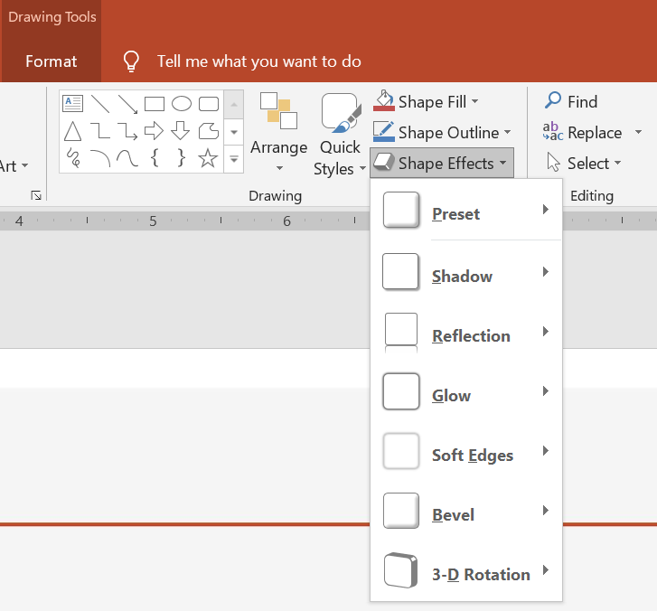

## **Wprowadzenie**

Chociaż efekty w PowerPoint można wykorzystać, aby wyróżnić kształt, różnią się one od [wypełnień](/slides/pl/net/shape-formatting/#gradient-fill) lub konturów. Korzystając z efektów PowerPoint, możesz tworzyć przekonujące odbicia kształtu, rozpraszać poświatę kształtu itp.



PowerPoint udostępnia sześć efektów, które można zastosować do kształtów. Możesz zastosować jeden lub więcej efektów do kształtu.

Niektóre kombinacje efektów wyglądają lepiej niż inne. Z tego powodu PowerPoint posiada opcje w sekcji **Preset**. Opcje Preset to w zasadzie znane, dobrze wyglądające kombinacje dwóch lub więcej efektów. Dzięki wyborowi presetu nie musisz marnować czasu na testowanie lub łączenie różnych efektów, aby znaleźć dobrą kombinację.

Aspose.Slides udostępnia właściwości i metody w klasie [EffectFormat](https://reference.aspose.com/slides/pl/net/aspose.slides/effectformat/), które umożliwiają zastosowanie tych samych efektów do kształtów w prezentacjach PowerPoint.

## **Zastosowanie efektu cienia**

Aby zastosować efekt cienia do kształtu w Aspose.Slides dla .NET, możesz łatwo dostosować parametry takie jak kolor, promień rozmycia i kierunek. Dzięki temu twoje kształty będą wyglądały bardziej dynamicznie i profesjonalnie, dodając głębi i uwagi. Korzystając z prostych fragmentów kodu, możesz zastosować te efekty do wielu kształtów, zwiększając ogólną atrakcyjność wizualną swoich prezentacji.

Poniższy kod C# pokazuje, jak zastosować [efekt zewnętrznego cienia](https://reference.aspose.com/slides/pl/net/aspose.slides/effectformat/outershadoweffect/) do prostokąta:

```c#
using var presentation = new Presentation();
var slide = presentation.Slides[0];

var shape = slide.Shapes.AddAutoShape(ShapeType.RoundCornerRectangle, 20, 20, 200, 100);

shape.EffectFormat.EnableOuterShadowEffect();
shape.EffectFormat.OuterShadowEffect.ShadowColor.Color = Color.DarkGray;
shape.EffectFormat.OuterShadowEffect.Distance = 10;
shape.EffectFormat.OuterShadowEffect.Direction = 45;

presentation.Save("shadow_effect.pptx", SaveFormat.Pptx);
```


## **Zastosowanie efektu odbicia**

Aby zastosować efekt odbicia w Aspose.Slides dla .NET, możesz dodać lustrzane odbicie do kształtów, dostosowując parametry takie jak odległość, przezroczystość i rozmiar. Ten efekt podnosi estetykę twoich prezentacji, nadając kształtom bardziej wykończony i elegancki wygląd. Jest łatwy do wdrożenia przy użyciu prostego kodu, umożliwiając szybkie zastosowanie w wielu elementach dla spójnego projektu.

Poniższy kod C# pokazuje, jak zastosować [efekt odbicia](https://reference.aspose.com/slides/pl/net/aspose.slides/effectformat/reflectioneffect/) do kształtu:

```c#
using var presentation = new Presentation();
var slide = presentation.Slides[0];

var shape = slide.Shapes.AddAutoShape(ShapeType.RoundCornerRectangle, 20, 20, 200, 100);

shape.EffectFormat.EnableReflectionEffect();
shape.EffectFormat.ReflectionEffect.RectangleAlign = RectangleAlignment.Bottom;
shape.EffectFormat.ReflectionEffect.Direction = 90;
shape.EffectFormat.ReflectionEffect.Distance = 40;
shape.EffectFormat.ReflectionEffect.BlurRadius = 2;

presentation.Save("reflection_effect.pptx", SaveFormat.Pptx);
```


## **Zastosowanie efektu poświaty**

Aby zastosować efekt poświaty do kształtu w Aspose.Slides dla .NET, możesz dodać miękką, świetlną aurę wokół kształtów, dostosowując właściwości takie jak kolor i rozmiar. Ten efekt pomaga wyróżnić kształty i dodaje atrakcyjny, przyciągający uwagę element wizualny do twojej prezentacji. Jest łatwy do wdrożenia przy minimalnym kodzie, poprawiając ogólny wygląd slajdów.

Poniższy kod C# pokazuje, jak zastosować [efekt poświaty](https://reference.aspose.com/slides/pl/net/aspose.slides/effectformat/gloweffect/) do kształtu:

```c#
using var presentation = new Presentation();
var slide = presentation.Slides[0];

var shape = slide.Shapes.AddAutoShape(ShapeType.RoundCornerRectangle, 20, 20, 200, 100);

shape.EffectFormat.EnableGlowEffect();
shape.EffectFormat.GlowEffect.Color.Color = Color.Magenta;
shape.EffectFormat.GlowEffect.Radius = 15;

presentation.Save("glow_effect.pptx", SaveFormat.Pptx);
```


## **Zastosowanie efektu miękkich krawędzi**

Aby zastosować efekt miękkich krawędzi w Aspose.Slides dla .NET, możesz stworzyć płynne, rozmyte przejście wokół krawędzi kształtu. Ten efekt dodaje subtelniejszy i bardziej wyrafinowany wygląd, idealny dla projektów wymagających delikatnego, łagodnego wyglądu. Możesz łatwo dostosować parametry takie jak promień, aby uzyskać pożądany efekt w różnych kształtach w swojej prezentacji.

Poniższy kod C# pokazuje, jak zastosować [miękkie krawędzie](https://reference.aspose.com/slides/pl/net/aspose.slides/effectformat/softedgeeffect/) do kształtu:

```c#
using var presentation = new Presentation();
var slide = presentation.Slides[0];

var shape = slide.Shapes.AddAutoShape(ShapeType.RoundCornerRectangle, 20, 20, 200, 150);

shape.EffectFormat.EnableSoftEdgeEffect();
shape.EffectFormat.SoftEdgeEffect.Radius = 8;

presentation.Save("soft_edges_effect.pptx", SaveFormat.Pptx);
```


## **FAQ**

**Czy mogę zastosować wiele efektów do tego samego kształtu?**

Tak, możesz łączyć różne efekty, takie jak cień, odbicie i poświata, na jednym kształcie, aby uzyskać bardziej dynamiczny wygląd.

**Jakie kształty mogę poddać efektom?**

Możesz zastosować efekty do różnych kształtów, w tym autokształtów, wykresów, tabel, obrazów, obiektów SmartArt, obiektów OLE i innych.

**Czy mogę zastosować efekty do grupowanych kształtów?**

Tak, możesz zastosować efekty do grupowanych kształtów. Efekt zostanie zastosowany do całej grupy.