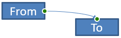

## **Przegląd**

Łącznik jest linią, która może pozostać przyłączona do dwóch kształtów, gdy którykolwiek z nich się przemieszcza. Jego końce łączą się z miejscami połączeń, przedstawionymi jako zielone kropki w programie PowerPoint. Niektóre zgięte i zakrzywione łączniki udostępniają również punkty regulacji, przedstawione jako pomarańczowe kropki, które kontrolują pozycję poszczególnych segmentów łącznika.

Aspose.Slides reprezentuje łączniki za pomocą interfejsu [IConnector](https://reference.aspose.com/slides/pl/net/aspose.slides/iconnector/) . Możesz je tworzyć, łączyć ich końce z kształtami, wybierać miejsca połączeń, zmieniać ich trasę oraz modyfikować geometrie łączników, które posiadają punkty regulacji.

## **Typy łączników**

Wyliczenie [ShapeType](https://reference.aspose.com/slides/pl/net/aspose.slides/shapetype/) zawiera gotowe ustawienia łączników prostych, zgiętych i zakrzywionych. Poniższa tabela przedstawia dostępne geometrie łączników oraz liczbę punktów regulacji zdefiniowaną dla każdego presetu.

| Łącznik | Obraz | Liczba punktów regulacji |
|---|---|---|
| `ShapeType.Line` |  | 0 |
| `ShapeType.StraightConnector1` |  | 0 |
| `ShapeType.BentConnector2` |  | 0 |
| `ShapeType.BentConnector3` |  | 1 |
| `ShapeType.BentConnector4` |  | 2 |
| `ShapeType.BentConnector5` |  | 3 |
| `ShapeType.CurvedConnector2` |  | 0 |
| `ShapeType.CurvedConnector3` |  | 1 |
| `ShapeType.CurvedConnector4` |  | 2 |
| `ShapeType.CurvedConnector5` |  | 3 |

Liczba i znaczenie punktów regulacji są częścią wybranego presetu łącznika. Nie zakładaj, że dwa różne typy łączników udostępniają taką samą strukturę kolekcji.

## **Połącz dwa kształty**

Użyj [IShapeCollection.AddConnector](https://reference.aspose.com/slides/pl/net/aspose.slides/ishapecollection/addconnector/) aby dodać łącznik i przypisz jego właściwości [StartShapeConnectedTo](https://reference.aspose.com/slides/pl/net/aspose.slides/connector/startshapeconnectedto/) oraz [EndShapeConnectedTo](https://reference.aspose.com/slides/pl/net/aspose.slides/connector/endshapeconnectedto/). Po przyłączeniu obu końcówek, [IConnector.Reroute](https://reference.aspose.com/slides/pl/net/aspose.slides/iconnector/reroute/) wybiera najkrótszą trasę między kształtami.

Poniższy przykład łączy elipsę i prostokąt za pomocą zgiętego łącznika:

```csharp
using Aspose.Slides;
using Aspose.Slides.Export;

using var presentation = new Presentation();
var slide = presentation.Slides[0];

var ellipse = slide.Shapes.AddAutoShape(ShapeType.Ellipse, 40, 80, 120, 80);
var rectangle = slide.Shapes.AddAutoShape(ShapeType.Rectangle, 320, 240, 140, 80);
var connector = slide.Shapes.AddConnector(ShapeType.BentConnector2, 0, 0, 10, 10);

connector.StartShapeConnectedTo = ellipse;
connector.EndShapeConnectedTo = rectangle;
connector.Reroute();

presentation.Save("connected-shapes.pptx", SaveFormat.Pptx);
```

{}
Wywołanie `Reroute` może zmienić wartości [StartShapeConnectionSiteIndex](https://reference.aspose.com/slides/pl/net/aspose.slides/connector/startshapeconnectionsiteindex/) oraz [EndShapeConnectionSiteIndex](https://reference.aspose.com/slides/pl/net/aspose.slides/connector/endshapeconnectionsiteindex/). Przypisz konkretne miejsca połączeń po zmianie trasy, jeśli te miejsca mają pozostać stałe.
{}

## **Wybierz miejsce połączenia**

Każdy łączony kształt zgłasza liczbę swoich miejsc połączeń za pomocą [ConnectionSiteCount](https://reference.aspose.com/slides/pl/net/aspose.slides/shape/connectionsitecount/). Zweryfikuj wybrany indeks miejsca (liczony od zera) przed przypisaniem go końcowi łącznika; liczba miejsc zależy od geometrii kształtu.

Ten przykład przyłącza łącznik do konkretnego miejsca na elipsie, jeśli takie miejsce istnieje:

```csharp
using System;
using Aspose.Slides;
using Aspose.Slides.Export;

using var presentation = new Presentation();
var slide = presentation.Slides[0];

var ellipse = slide.Shapes.AddAutoShape(ShapeType.Ellipse, 40, 80, 120, 80);
var rectangle = slide.Shapes.AddAutoShape(ShapeType.Rectangle, 320, 240, 140, 80);
var connector = slide.Shapes.AddConnector(ShapeType.BentConnector3, 0, 0, 10, 10);

connector.StartShapeConnectedTo = ellipse;
connector.EndShapeConnectedTo = rectangle;

uint preferredSiteIndex = 2;
if (preferredSiteIndex < ellipse.ConnectionSiteCount)
{
    connector.StartShapeConnectionSiteIndex = preferredSiteIndex;
}
else
{
    Console.WriteLine($"The ellipse has only {ellipse.ConnectionSiteCount} connection sites.");
}

presentation.Save("specific-connection-site.pptx", SaveFormat.Pptx);
```

## **Regulacja punktu łącznika**

Łączniki posiadające punkty regulacji udostępniają je poprzez [IGeometryShape.Adjustments](https://reference.aspose.com/slides/pl/net/aspose.slides/igeometryshape/adjustments/). Przejrzyj każdy [IAdjustValue](https://reference.aspose.com/slides/pl/net/aspose.slides/iadjustvalue/) i sprawdź jego [Type](https://reference.aspose.com/slides/pl/net/aspose.slides/adjustvalue/type/) przed zmianą jego [RawValue](https://reference.aspose.com/slides/pl/net/aspose.slides/adjustvalue/rawvalue/). Ogólne zasady identyfikowania regulacji w presetach kształtów opisano w [Shape Manipulation](/slides/pl/net/shape-manipulations/).

Liczba, kolejność, znaczenie i dopuszczalny zakres wartości regulacji łącznika zależą od wybranego presetu łącznika. Właściwość `Type` jest tylko do odczytu, natomiast wartość regulacji można modyfikować. Właściwość tylko do odczytu [Name](https://reference.aspose.com/slides/pl/net/aspose.slides/adjustvalue/name/) dostarcza dodatkowej identyfikacji, gdy łącznik zawiera więcej niż jedną regulację tego samego typu semantycznego.

### **Obejście przeszkody**

W poniższym układzie łącznik `BentConnector5` między dwoma kształtami przechodzi przez trzeci kształt:


Ten kod tworzy łącznik napotykający przeszkodę:

```csharp
using System.Drawing;
using Aspose.Slides;
using Aspose.Slides.Export;

using var presentation = new Presentation();
var slide = presentation.Slides[0];

slide.Shapes.AddAutoShape(ShapeType.Rectangle, 300, 150, 150, 75);
var sourceShape = slide.Shapes.AddAutoShape(ShapeType.Rectangle, 500, 400, 100, 50);
var targetShape = slide.Shapes.AddAutoShape(ShapeType.Rectangle, 100, 100, 70, 30);
var connector = slide.Shapes.AddConnector(ShapeType.BentConnector5, 20, 20, 400, 300);

connector.LineFormat.EndArrowheadStyle = LineArrowheadStyle.Triangle;
connector.LineFormat.FillFormat.FillType = FillType.Solid;
connector.LineFormat.FillFormat.SolidFillColor.Color = Color.Black;
connector.StartShapeConnectedTo = sourceShape;
connector.EndShapeConnectedTo = targetShape;
connector.StartShapeConnectionSiteIndex = 2;

presentation.Save("connector-obstruction.pptx", SaveFormat.Pptx);
```

Przesunięcie pionowego zgięcia zmienia trasę tak, aby łącznik omijał przeszkodę:


Zamiast zakładać, że indeks w kolekcji `1` zawsze oznacza pionowe zgięcie, ten przykład wyszukuje `ConnectorBendPositionY` i zmienia go tylko wtedy, gdy oczekiwany typ semantyczny jest obecny:

```csharp
using System;
using System.Drawing;
using Aspose.Slides;
using Aspose.Slides.Export;

using var presentation = new Presentation();
var slide = presentation.Slides[0];

slide.Shapes.AddAutoShape(ShapeType.Rectangle, 300, 150, 150, 75);
var sourceShape = slide.Shapes.AddAutoShape(ShapeType.Rectangle, 500, 400, 100, 50);
var targetShape = slide.Shapes.AddAutoShape(ShapeType.Rectangle, 100, 100, 70, 30);
var connector = slide.Shapes.AddConnector(ShapeType.BentConnector5, 20, 20, 400, 300);

connector.LineFormat.EndArrowheadStyle = LineArrowheadStyle.Triangle;
connector.LineFormat.FillFormat.FillType = FillType.Solid;
connector.LineFormat.FillFormat.SolidFillColor.Color = Color.Black;
connector.StartShapeConnectedTo = sourceShape;
connector.EndShapeConnectedTo = targetShape;
connector.StartShapeConnectionSiteIndex = 2;

IAdjustValue? verticalBend = null;
for (var adjustmentIndex = 0; adjustmentIndex < connector.Adjustments.Count; adjustmentIndex++)
{
    var adjustment = connector.Adjustments[adjustmentIndex];
    Console.WriteLine($"{adjustment.Name}: {adjustment.Type}, raw value = {adjustment.RawValue}");
    if (adjustment.Type == ShapeAdjustmentType.ConnectorBendPositionY)
    {
        verticalBend = adjustment;
        break;
    }
}

if (verticalBend is null)
{
    Console.WriteLine("The connector does not expose a vertical bend adjustment.");
}
else
{
    verticalBend.RawValue = 60000;
    presentation.Save("connector-obstruction-fixed.pptx", SaveFormat.Pptx);
}
```

`BentConnector5` posiada dwa ustawienia `ConnectorBendPositionX` oraz jedno `ConnectorBendPositionY`. Jeśli potrzebny typ występuje więcej niż raz, sprawdź właściwość `Name` i znaną geometrię tego presetu przed wybraniem konkretnego elementu. Jeśli regulacja zwraca `ShapeAdjustmentType.Custom`, traktuj jej znaczenie i zakres jako specyficzne dla presetu i nie zmieniaj jej, dopóki nie znasz odpowiedniej umowy.

## **Powiązanie wartości regulacji z geometrią łącznika**

Dla zgiętych łączników wartości regulacji mogą być użyte do oszacowania pozycji poszczególnych segmentów. Obliczenia te są specyficzne dla danego presetu łącznika:

- `BentConnector4` zazwyczaj udostępnia jedną regulację `ConnectorBendPositionX` i jedną `ConnectorBendPositionY`.
- Dla tych pozycji zgięcia wyrażenie `RawValue / 100000f` daje ułamek szerokości lub wysokości ramki łącznika używany w poniższych przykładach.
- Ramka łącznika może być obrócona lub odbita, więc współrzędne ramki muszą być przekształcone przed porównaniem z współrzędnymi slajdu.

Poniższe przykłady najpierw używają `Type` do identyfikacji regulacji. Nie traktują indeksów kolekcji jako przenośnych identyfikatorów.

### **Łącznik nieobrócony**

Początkowy układ zawiera dwa kształty tekstowe połączone `BentConnector4`:


Ten przykład przegląda łącznik i pobiera jego regulacje poziomego oraz pionowego zgięcia:

```csharp
using System;
using System.Drawing;
using Aspose.Slides;

using var presentation = new Presentation();
var slide = presentation.Slides[0];

var sourceShape = slide.Shapes.AddAutoShape(ShapeType.Rectangle, 100, 100, 60, 25);
sourceShape.TextFrame.Text = "From";
var targetShape = slide.Shapes.AddAutoShape(ShapeType.Rectangle, 500, 100, 60, 25);
targetShape.TextFrame.Text = "To";
var connector = slide.Shapes.AddConnector(ShapeType.BentConnector4, 20, 20, 400, 300);

connector.LineFormat.EndArrowheadStyle = LineArrowheadStyle.Triangle;
connector.LineFormat.FillFormat.FillType = FillType.Solid;
connector.LineFormat.FillFormat.SolidFillColor.Color = Color.Crimson;
connector.LineFormat.Width = 3;
connector.StartShapeConnectedTo = sourceShape;
connector.StartShapeConnectionSiteIndex = 3;
connector.EndShapeConnectedTo = targetShape;
connector.EndShapeConnectionSiteIndex = 2;

for (var adjustmentIndex = 0; adjustmentIndex < connector.Adjustments.Count; adjustmentIndex++)
{
    var adjustment = connector.Adjustments[adjustmentIndex];
    Console.WriteLine($"{adjustment.Name}: {adjustment.Type}, raw value = {adjustment.RawValue}");
}
```

Aby zmienić oba zgięcia, znajdź każdy oczekiwany typ i modyfikuj wartości dopiero po odnalezieniu obu:

```csharp
using System;
using Aspose.Slides;
using Aspose.Slides.Export;

using var presentation = new Presentation();
var slide = presentation.Slides[0];

var sourceShape = slide.Shapes.AddAutoShape(ShapeType.Rectangle, 100, 100, 60, 25);
var targetShape = slide.Shapes.AddAutoShape(ShapeType.Rectangle, 500, 100, 60, 25);
var connector = slide.Shapes.AddConnector(ShapeType.BentConnector4, 20, 20, 400, 300);
connector.StartShapeConnectedTo = sourceShape;
connector.StartShapeConnectionSiteIndex = 3;
connector.EndShapeConnectedTo = targetShape;
connector.EndShapeConnectionSiteIndex = 2;

IAdjustValue? horizontalBend = null;
IAdjustValue? verticalBend = null;
for (var adjustmentIndex = 0; adjustmentIndex < connector.Adjustments.Count; adjustmentIndex++)
{
    var adjustment = connector.Adjustments[adjustmentIndex];
    if (adjustment.Type == ShapeAdjustmentType.ConnectorBendPositionX)
    {
        horizontalBend = adjustment;
    }
    else if (adjustment.Type == ShapeAdjustmentType.ConnectorBendPositionY)
    {
        verticalBend = adjustment;
    }
}

if (horizontalBend is null || verticalBend is null)
{
    Console.WriteLine("The connector does not expose the expected bend adjustments.");
}
else
{
    horizontalBend.RawValue += 20000;
    verticalBend.RawValue += 200000;
    presentation.Save("connector-adjusted.pptx", SaveFormat.Pptx);
}
```

Wynikiem jest łącznik, którego poziome i pionowe segmenty zostały przesunięte:


Gdy typy semantyczne są znane, ich wartości można przeliczyć na współrzędne ramki łącznika. Ten przykład rysuje cienki prostokąt nad pionowym segmentem sterowanym przez dwie regulacje zgięcia:

```csharp
using System;
using Aspose.Slides;
using Aspose.Slides.Export;

using var presentation = new Presentation();
var slide = presentation.Slides[0];

var sourceShape = slide.Shapes.AddAutoShape(ShapeType.Rectangle, 100, 100, 60, 25);
var targetShape = slide.Shapes.AddAutoShape(ShapeType.Rectangle, 500, 100, 60, 25);
var connector = slide.Shapes.AddConnector(ShapeType.BentConnector4, 20, 20, 400, 300);
connector.StartShapeConnectedTo = sourceShape;
connector.StartShapeConnectionSiteIndex = 3;
connector.EndShapeConnectedTo = targetShape;
connector.EndShapeConnectionSiteIndex = 2;

IAdjustValue? horizontalBend = null;
IAdjustValue? verticalBend = null;
for (var adjustmentIndex = 0; adjustmentIndex < connector.Adjustments.Count; adjustmentIndex++)
{
    var adjustment = connector.Adjustments[adjustmentIndex];
    if (adjustment.Type == ShapeAdjustmentType.ConnectorBendPositionX)
    {
        horizontalBend = adjustment;
    }
    else if (adjustment.Type == ShapeAdjustmentType.ConnectorBendPositionY)
    {
        verticalBend = adjustment;
    }
}

if (horizontalBend is null || verticalBend is null)
{
    Console.WriteLine("The connector does not expose the expected bend adjustments.");
}
else
{
    var x = connector.X + connector.Width * horizontalBend.RawValue / 100000f;
    var y = connector.Y;
    var height = connector.Height * verticalBend.RawValue / 100000f;
    slide.Shapes.AddAutoShape(ShapeType.Rectangle, x, y, 1, height);
    presentation.Save("connector-segment-guide.pptx", SaveFormat.Pptx);
}
```

Kształt pomocniczy oznacza obliczony segment:


### **Obrócony lub odbity łącznik**

Gdy ta sama geometria łącznika jest ustawiona pionowo, wartości [Frame](https://reference.aspose.com/slides/pl/net/aspose.slides/ishape/frame/), [FlipH](https://reference.aspose.com/slides/pl/net/aspose.slides/shapeframe/fliph/), i [FlipV](https://reference.aspose.com/slides/pl/net/aspose.slides/shapeframe/flipv/) wpływają na przekształcenie współrzędnych ramki łącznika na współrzędne slajdu.

Ten przykład tworzy i reguluje pionowo ustawiony łącznik:

```csharp
using System;
using System.Drawing;
using Aspose.Slides;
using Aspose.Slides.Export;

using var presentation = new Presentation();
var slide = presentation.Slides[0];

var sourceShape = slide.Shapes.AddAutoShape(ShapeType.Rectangle, 100, 100, 60, 25);
sourceShape.TextFrame.Text = "From";
var targetShape = slide.Shapes.AddAutoShape(ShapeType.Rectangle, 100, 400, 60, 25);
targetShape.TextFrame.Text = "To 1";
var connector = slide.Shapes.AddConnector(ShapeType.BentConnector4, 20, 20, 400, 300);

connector.LineFormat.EndArrowheadStyle = LineArrowheadStyle.Triangle;
connector.LineFormat.FillFormat.FillType = FillType.Solid;
connector.LineFormat.FillFormat.SolidFillColor.Color = Color.MediumAquamarine;
connector.LineFormat.Width = 3;
connector.StartShapeConnectedTo = sourceShape;
connector.StartShapeConnectionSiteIndex = 2;
connector.EndShapeConnectedTo = targetShape;
connector.EndShapeConnectionSiteIndex = 3;

for (var adjustmentIndex = 0; adjustmentIndex < connector.Adjustments.Count; adjustmentIndex++)
{
    var adjustment = connector.Adjustments[adjustmentIndex];
    if (adjustment.Type == ShapeAdjustmentType.ConnectorBendPositionX)
    {
        adjustment.RawValue += 20000;
    }
    else if (adjustment.Type == ShapeAdjustmentType.ConnectorBendPositionY)
    {
        adjustment.RawValue += 200000;
    }
}

presentation.Save("vertical-connector-adjusted.pptx", SaveFormat.Pptx);
```

Skorygowany łącznik wyświetla się pionowo między kształtami:


Dla dowolnego kąta obrotu `alpha` obróć punkt ramki łącznika `(x, y)` wokół środka ramki `(x0, y0)`:

`X = (x - x0) * cos(alpha) - (y - y0) * sin(alpha) + x0`

`Y = (x - x0) * sin(alpha) + (y - y0) * cos(alpha) + y0`

Poniższy kod obsługuje orientację 90 stopni używaną w tym przykładzie i rysuje czerwoną prowadnicę nad odpowiednim segmentem łącznika:

```csharp
using System;
using System.Drawing;
using Aspose.Slides;
using Aspose.Slides.Export;

using var presentation = new Presentation();
var slide = presentation.Slides[0];

var sourceShape = slide.Shapes.AddAutoShape(ShapeType.Rectangle, 100, 100, 60, 25);
var targetShape = slide.Shapes.AddAutoShape(ShapeType.Rectangle, 100, 400, 60, 25);
var connector = slide.Shapes.AddConnector(ShapeType.BentConnector4, 20, 20, 400, 300);
connector.StartShapeConnectedTo = sourceShape;
connector.StartShapeConnectionSiteIndex = 2;
connector.EndShapeConnectedTo = targetShape;
connector.EndShapeConnectionSiteIndex = 3;

IAdjustValue? horizontalBend = null;
IAdjustValue? verticalBend = null;
for (var adjustmentIndex = 0; adjustmentIndex < connector.Adjustments.Count; adjustmentIndex++)
{
    var adjustment = connector.Adjustments[adjustmentIndex];
    if (adjustment.Type == ShapeAdjustmentType.ConnectorBendPositionX)
    {
        horizontalBend = adjustment;
    }
    else if (adjustment.Type == ShapeAdjustmentType.ConnectorBendPositionY)
    {
        verticalBend = adjustment;
    }
}

if (horizontalBend is null || verticalBend is null)
{
    Console.WriteLine("The connector does not expose the expected bend adjustments.");
}
else
{
    horizontalBend.RawValue += 20000;
    verticalBend.RawValue += 200000;

    var x = connector.X;
    var y = connector.Y;
    if (connector.Frame.FlipH == NullableBool.True)
    {
        x += connector.Width;
    }
    if (connector.Frame.FlipV == NullableBool.True)
    {
        y += connector.Height;
    }

    x += connector.Width * horizontalBend.RawValue / 100000f;
    var rotatedX = connector.Frame.CenterX - y + connector.Frame.CenterY;
    var rotatedY = x - connector.Frame.CenterX + connector.Frame.CenterY;
    var segmentWidth = connector.Height * verticalBend.RawValue / 100000f;
    var guide = slide.Shapes.AddAutoShape(ShapeType.Rectangle, rotatedX, rotatedY, segmentWidth, 1);
    guide.LineFormat.FillFormat.FillType = FillType.Solid;
    guide.LineFormat.FillFormat.SolidFillColor.Color = Color.Red;

    presentation.Save("rotated-connector-segment-guide.pptx", SaveFormat.Pptx);
}
```

Czerwona prowadnica oznacza obliczony segment po przekształceniu współrzędnych:


Te wzory opisują presety użyte w przykładach, a nie uniwersalny model łącznika. Zweryfikuj typy regulacji, orientację ramki i zakresy wartości przed zastosowaniem tych samych obliczeń do innego presetu.

## **Znajdź kąt kierunku łącznika**

Kierunek prostego łącznika można obliczyć na podstawie jego szerokości i wysokości, uwzględniając poziome i pionowe odbicia. Poniższy przykład podaje kąt w stopniach w kierunku zgodnym z ruchem wskazówek zegara od dodatniej osi poziomej w współrzędnych slajdu:

```csharp
using System;
using Aspose.Slides;

using var presentation = new Presentation();
var slide = presentation.Slides[0];
var connector = slide.Shapes.AddConnector(ShapeType.StraightConnector1, 100, 100, 200, 100);

var flipH = connector.Frame.FlipH == NullableBool.True;
var flipV = connector.Frame.FlipV == NullableBool.True;
var deltaX = connector.Width * (flipH ? -1 : 1);
var deltaY = connector.Height * (flipV ? -1 : 1);
var angle = Math.Atan2(deltaY, deltaX) * 180.0 / Math.PI;

if (angle < 0)
{
    angle += 360;
}

Console.WriteLine($"Connector direction: {angle:F2} degrees");
```

## **FAQ**

**Jak mogę sprawdzić, czy łącznik może się przyłączyć do kształtu?**

Sprawdź właściwość `ConnectionSiteCount` kształtu. Dodatnia wartość oznacza, że kształt udostępnia miejsca połączeń. Zweryfikuj wybrany indeks miejsca przed przypisaniem go którejkolwiek końcówce łącznika.

**Czy mogę zidentyfikować regulację łącznika po indeksie w kolekcji?**

Indeks ma sens tylko dla znanego presetu łącznika i układu kolekcji. Przed modyfikacją wartości sprawdź `IAdjustValue.Type`, a gdy ten sam typ semantyczny występuje wielokrotnie, użyj `IAdjustValue.Name` jako dodatkowej informacji.

**Co się dzieje, gdy połączony kształt zostanie usunięty?**

Odpowiednia końcówka łącznika zostaje odłączona. Łącznik pozostaje na slajdzie i może zostać usunięty, przekształcony w wolną linię lub ponownie przyłączony do innego kształtu.

**Czy powiązania łączników są zachowywane przy kopiowaniu slajdu?**

Powiązania są zazwyczaj zachowywane, gdy połączone kształty są kopiowane razem ze slajdem. Jeśli łącznik zostanie skopiowany bez jednego z docelowych kształtów, dotknięta końcówka musi być ponownie przyłączona.