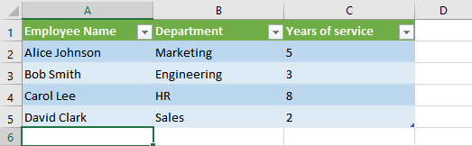

## **Wprowadzenie**

Prezentacje PowerPoint to potężny sposób wyświetlania i przekazywania informacji. Często są używane w połączeniu z skoroszytami Excel, gdzie Excel służy jako doskonałe źródło danych strukturalnych, a PowerPoint wyróżnia się wizualizacją tych danych dla odbiorcy.

Wiele praktycznych scenariuszy wymaga łączenia Excela i PowerPointa: korespondencja seryjna, wypełnianie tabel danych, generowanie jednego slajdu na rekord danych (generowanie slajdów wsadowych), tworzenie materiałów szkoleniowych oraz konsolidacja wielu raportów Excel w jednej prezentacji, aby wymienić tylko niektóre.

Do tej pory implementacja takich funkcji przy użyciu API Aspose.Slides wymagała korzystania z rozwiązań zewnętrznych, takich jak Aspose.Cells. Choć te narzędzia są solidne, mogą być zbyt skomplikowane i kosztowne dla użytkowników, którzy potrzebują jedynie podstawowej funkcjonalności integracji danych.

## **Jak to działa**

Aby ułatwić pracę z danymi Excel i uczynić ją bardziej płynną, Aspose.Slides wprowadziło nowe klasy do odczytu danych z skoroszytów Excel oraz importowania ich zawartości do prezentacji. Ta funkcja otwiera potężne nowe możliwości dla użytkowników API, którzy chcą wykorzystać Excel jako źródło danych w swoich przepływach pracy z prezentacjami.

Nowa funkcjonalność jest przeznaczona do ogólnego dostępu do danych i nie jest zintegrowana z modelem DOM dokumentu prezentacji (Presentation Document Object Model). Oznacza to, że *nie umożliwia edycji ani zapisu plików Excel* — jej jedynym celem jest otwieranie skoroszytów i nawigowanie po ich zawartości w celu pobrania danych komórek.

W sercu tej funkcji znajduje się nowa klasa [ExcelDataWorkbook](https://reference.aspose.com/slides/pl/net/aspose.slides.excel/exceldataworkbook/). Klasa ta umożliwia załadowanie skoroszytu Excel z pliku lokalnego lub strumienia. Po załadowaniu udostępnia kilka przeciążeń metody [GetCell](https://reference.aspose.com/slides/pl/net/aspose.slides.excel/exceldataworkbook/getcell/), które można używać do pobierania konkretnych komórek według ich pozycji (np. indeksy wiersza i kolumny lub nazwy zakresów).

Każde wywołanie [GetCell](https://reference.aspose.com/slides/pl/net/aspose.slides.excel/exceldataworkbook/getcell/) zwraca instancję klasy [ExcelDataCell](https://reference.aspose.com/slides/pl/net/aspose.slides.excel/exceldatacell/). Obiekt ten reprezentuje pojedynczą komórkę w skoroszycie Excel i zapewnia dostęp do jej wartości w prosty i intuicyjny sposób.

#### **Import wykresu Excel**

Następnym krokiem rozszerzenia funkcjonalności jest klasa [ExcelWorkbookImporter](https://reference.aspose.com/slides/pl/net/aspose.slides.import/excelworkbookimporter/). Ta klasa narzędziowa zapewnia funkcjonalność importowania zawartości ze skoroszytu Excel do prezentacji. Zawiera kilka przeciążeń metody [AddChartFromWorkbook](https://reference.aspose.com/slides/pl/net/aspose.slides.import/excelworkbookimporter/addchartfromworkbook/), które pomagają pobrać wybrany wykres z określonego skoroszytu Excel i dodać go na koniec podanej kolekcji kształtów w określonych współrzędnych.

#### **Import tabeli Excel**

Klasa [ExcelWorkbookImporter](https://reference.aspose.com/slides/pl/net/aspose.slides.import/excelworkbookimporter/) zawiera również kilka przeciążeń metody [AddTableFromWorkbook](https://reference.aspose.com/slides/pl/net/aspose.slides.import/excelworkbookimporter/addtablefromworkbook/). Metody te umożliwiają import określonego zakresu komórek z określonego arkusza i dodanie go jako tabeli na koniec podanej kolekcji kształtów w określonych współrzędnych.

W skrócie, jest to lekka i prosta API do odczytu danych Excel — dokładnie to, czego wielu deweloperów potrzebuje, bez narzutu pełnej biblioteki przetwarzania arkuszy kalkulacyjnych.

## **Zacznijmy kodować**

### **Przykład scenariusza korespondencji seryjnej**

W poniższym przykładzie zaimplementujemy prosty scenariusz korespondencji seryjnej, generując wiele prezentacji na podstawie danych przechowywanych w skoroszycie Excel.

Aby rozpocząć, potrzebujemy dwóch rzeczy:
1. Skoroszyt Excel zawierający dane


2. Szablon prezentacji PowerPoint


```csharp
// Załaduj skoroszyt Excel z danymi pracowników.
ExcelDataWorkbook workbook = new ExcelDataWorkbook("TemplateData.xlsx");
int worksheetIndex = 0;

// Załaduj szablon prezentacji.
using Presentation templatePresentation = new Presentation("PresentationTemplate.pptx");

// Przejdź przez wiersze Excela (z wyłączeniem nagłówka w wierszu 0).
for (int rowIndex = 1; rowIndex <= 4; rowIndex++)
{
    // Utwórz nową prezentację dla każdego rekordu pracownika.
    using Presentation employeePresentation = new Presentation();

    // Usuń domyślny pusty slajd.
    employeePresentation.Slides.RemoveAt(0);

    // Sklonuj slajd szablonu do nowej prezentacji.
    ISlide slide = employeePresentation.Slides.AddClone(templatePresentation.Slides[0]);

    // Pobierz akapity z docelowego kształtu (zakładając, że używany jest indeks kształtu 1).
    IParagraphCollection paragraphs = (slide.Shapes[1] as IAutoShape).TextFrame.Paragraphs;

    // Zastąp znaczniki danymi z Excela.
    string employeeName = workbook.GetCell(worksheetIndex, rowIndex, 0).Value.ToString();
    IPortion namePortion = paragraphs[0].Portions[0];
    namePortion.Text = namePortion.Text.Replace("{{EmployeeName}}", employeeName);

    string department = workbook.GetCell(worksheetIndex, rowIndex, 1).Value.ToString();
    IPortion departmentPortion = paragraphs[1].Portions[0];
    departmentPortion.Text = departmentPortion.Text.Replace("{{Department}}", department);

    string yearsOfService = workbook.GetCell(worksheetIndex, rowIndex, 2).Value.ToString();
    IPortion yearsPortion = paragraphs[2].Portions[0];
    yearsPortion.Text = yearsPortion.Text.Replace("{{YearsOfService}}", yearsOfService);

    // Zapisz spersonalizowaną prezentację do osobnego pliku.
    employeePresentation.Save($"{employeeName} Report.pptx", SaveFormat.Pptx);
}
```


### **Przykład tabeli Excel**

W drugim przykładzie po prostu kopiujemy dane z tabeli Excel i wyświetlamy je na slajdzie PowerPoint w bardziej atrakcyjnej wizualnie formie.

W tym przykładzie ponownie używamy tego samego skoroszytu Excel z pierwszego przykładu, który zawiera prostą tabelę pracowników.

```csharp
// Załaduj skoroszyt Excel zawierający dane pracowników.
ExcelDataWorkbook workbook = new ExcelDataWorkbook("TemplateData.xlsx");
int worksheetIndex = 0;

// Utwórz nową prezentację PowerPoint.
using Presentation presentation = new Presentation();

// Dodaj kształt tabeli do pierwszego slajdu.
ITable table = presentation.Slides[0].Shapes.AddTable(
    50, 200,
    new double[] { 200, 200, 200 },
    new double[] { 30, 30, 30, 30, 30 }
);

// Wypełnij tabelę PowerPoint danymi ze skoroszytu Excel.
for (int rowIndex = 0; rowIndex < 5; rowIndex++)
{
    for (int columnIndex = 0; columnIndex < 3; columnIndex++)
    {
        string cellValue = workbook.GetCell(worksheetIndex, rowIndex, columnIndex).Value.ToString();
        table[columnIndex, rowIndex].TextFrame.Text = cellValue;
    }
}

// Zapisz wygenerowaną prezentację do pliku.
presentation.Save("Table.pptx", SaveFormat.Pptx);
```


### **Przykład importu wykresu Excel**

W tym przykładzie importujemy wykres z pierwszego arkusza skoroszytu Excel użytego w poprzednim przykładzie. Wykres będzie połączony z zewnętrznym skoroszytem w powstałej prezentacji.

Najpierw dodajemy wykres kołowy do skoroszytu Excel na podstawie tabeli pracowników.


```csharp
// Utwórz nową prezentację PowerPoint.
using Presentation presentation = new Presentation();

// Pobierz kolekcję kształtów pierwszego slajdu.
IShapeCollection shapes = presentation.Slides[0].Shapes;

// Zaimportuj wykres o nazwie "Chart 1" z pierwszego arkusza skoroszytu i dodaj go do kolekcji kształtów.
ExcelWorkbookImporter.AddChartFromWorkbook(shapes, 10, 10, "TemplateData.xlsx", "Sheet1", "Chart 1", false);

// Zapisz wynikową prezentację do pliku.
presentation.Save("Chart.pptx", SaveFormat.Pptx);
```


### **Przykład importu wszystkich wykresów Excel**

Wyobraźmy sobie, że masz skoroszyt Excel pełen wykresów i musisz zaimportować je wszystkie do prezentacji. Każdy wykres powinien zostać umieszczony na nowym slajdzie.

Poniższy kod iteruje po wszystkich arkuszach w źródłowym pliku Excel, wyodrębnia wykresy z każdego arkusza i dodaje każdy wykres do osobnego slajdu przy użyciu układu pustego slajdu. W powstałej prezentacji zostaną osadzone jedynie dane wykresu, a nie cały skoroszyt.

```csharp
// Załaduj skoroszyt Excel zawierający dane pracowników.
ExcelDataWorkbook workbook = new ExcelDataWorkbook("ExcelWithCharts.xlsx");

// Utwórz nową prezentację PowerPoint.
using Presentation presentation = new Presentation();

// Pobierz układ pustego slajdu.
ILayoutSlide blankLayout = presentation.LayoutSlides.GetByType(SlideLayoutType.Blank);

// Pobierz nazwy wszystkich arkuszy zawartych w skoroszycie Excel.
IList<string> worksheetNames = workbook.GetWorksheetNames();

foreach (var name in worksheetNames)
{
    // Pobierz słownik mapujący indeksy wykresów na nazwy wykresów dla arkusza.
    IDictionary<int, string> worksheetCharts = workbook.GetChartsFromWorksheet(name);
    foreach (var chart in worksheetCharts)
    {
        // Dodaj nowy slajd używając układu pustego.
        ISlide slide = presentation.Slides.AddEmptySlide(blankLayout);

        // Zaimportuj wybrany wykres ze skoroszytu Excel do kolekcji kształtów slajdu.
        ExcelWorkbookImporter.AddChartFromWorkbook(slide.Shapes, 10, 10, workbook, name, chart.Key, false);
    }
}

// Zapisz wynikową prezentację do pliku.
presentation.Save("Charts.pptx", SaveFormat.Pptx);
```

### **Przykład importu tabeli Excel**

W tym przykładzie importujemy sformatowaną tabelę z arkusza Excel bezpośrednio do prezentacji PowerPoint.

Źródłowy arkusz Excel zawiera sformatowaną tabelę z danymi pracowników:



```csharp
// Utwórz nową prezentację PowerPoint.
using Presentation presentation = new Presentation();

// Pobierz kolekcję kształtów pierwszego slajdu.
IShapeCollection shapes = presentation.Slides[0].Shapes;

// Zaimportuj tabelę z pierwszego arkusza skoroszytu i dodaj ją do kolekcji kształtów.
ExcelWorkbookImporter.AddTableFromWorkbook(shapes, 10, 10, "TemplateData.xlsx", "Sheet1", "A1:C5");

// Zapisz wynikową prezentację do pliku.
presentation.Save("FormattedTable.pptx", SaveFormat.Pptx);
```


## **Podsumowanie**

Ten mechanizm, dostępny bezpośrednio w Aspose.Slides, łączy pracę z danymi Excel i prezentacjami w jednym miejscu. Umożliwia tworzenie slajdów z wykresami wizualnymi oraz danymi prezentowanymi jako tabele Excel — bez dodatkowych bibliotek czy skomplikowanych integracji.