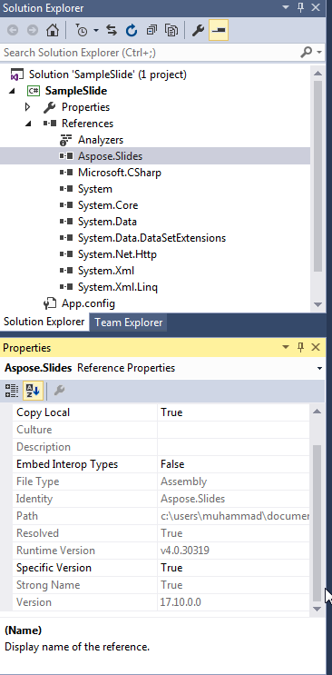
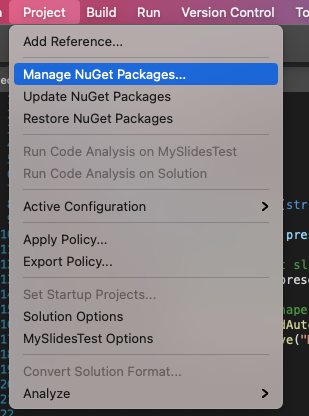

## **Przegląd**

Ten artykuł wyjaśnia, jak zainstalować Aspose.Slides dla .NET w systemach Windows i macOS. Skupia się na instalacji opartej na NuGet i pokazuje, jak dodać bibliotekę do projektu Visual Studio, zarówno przez Menedżera pakietów NuGet, jak i konsolę Menedżera pakietów w systemie Windows. Opisuje również, jak zaktualizować pakiet oraz zainstalować wersje wstępne, gdy jest to potrzebne.

## **Windows**
NuGet zapewnia najłatwiejszą drogę do pobierania i instalacji interfejsów API Aspose dla .NET na komputerach PC.

### **Metoda 1: Instalacja lub aktualizacja Aspose.Slides z Menedżera pakietów NuGet**

1. Otwórz Microsoft Visual Studio. 
2. Utwórz prostą aplikację konsolową lub otwórz istniejący projekt. 
3. Przejdź do **Tools** > **NuGet package manager**.
4. W sekcji **Browse** wyszukaj *Aspose Slides* w polu tekstowym. 
{}
5. Kliknij **Aspose.Slides.NET**, a następnie kliknij **Install**. 
   * Jeśli chcesz zaktualizować Aspose.Slides — zakładając, że już ją zainstalowano — kliknij **Update** zamiast tego. 

Wybrany interfejs API zostaje pobrany i dodany jako odwołanie w Twoim projekcie.

### **Metoda 2: Instalacja lub aktualizacja Aspose.Slides przy użyciu konsoli Menedżera pakietów**

Tak odwołujesz się do [Aspose.Slides API](https://www.nuget.org/packages/Aspose.Slides.NET/) za pośrednictwem konsoli menedżera pakietów:

1. Otwórz Microsoft Visual Studio. 
2. Utwórz prostą aplikację konsolową lub otwórz istniejący projekt. 
3. Przejdź do **Tools** > **Library Package Manager** > **Package Manager Console**. 

4. Uruchom następujące polecenie: `Install-Package Aspose.Slides.NET` 

Najbardziej aktualna pełna wersja zostaje zainstalowana w Twojej aplikacji. 

* Alternatywnie, możesz dodać przyrostek `-prerelease` do polecenia, aby określić, że ma zostać zainstalowana także najnowsza wersja (włącznie z poprawkami). 

Wskazówka **Installing Aspose.Slides.NET** pojawia się w dolnej części okna. 

Po zakończeniu pobierania powinieneś zobaczyć komunikaty potwierdzające. 

Jeśli nie znasz [Aspose EULA](https://about.aspose.com/legal/eula), możesz chcieć przeczytać licencję podaną pod tym adresem URL. 

W aplikacji powinieneś zobaczyć, że Aspose.Slides został pomyślnie dodany i odwołany. 

W konsoli Menedżera pakietów możesz uruchomić polecenie `Update-Package Aspose.Slides.NET`, aby sprawdzić dostępność aktualizacji pakietu Aspose.Slides. Aktualizacje (jeśli zostaną znalezione) są instalowane automatycznie. Możesz także użyć przyrostka `-prerelease`, aby zaktualizować najnowszą wersję.

#### **Rozważania przy uruchamianiu w środowisku serwera współdzielonego**
Zalecamy, aby wszystkie komponenty Aspose .NET były uruchamiane z zestawem uprawnień **Full Trust**, ponieważ komponenty Aspose czasami muszą uzyskać dostęp do ustawień rejestru i plików znajdujących się poza wirtualnym katalogiem — na przykład, gdy komponenty Aspose muszą odczytywać czcionki. 

Ponadto komponenty Aspose.NET opierają się na podstawowych klasach systemu .NET — a niektóre z tych klas również wymagają uprawnień **Full Trust** w określonych przypadkach.

Dostawcy usług internetowych, którzy hostują wiele aplikacji od różnych firm, zazwyczaj wymuszają poziom zabezpieczeń Medium Trust. W przypadku .NET 2.0 taki poziom zabezpieczeń może powodować ograniczenia wpływające na działanie Aspose.Slides:

- **RegistryPermission** nie jest dostępny. Oznacza to, że nie możesz uzyskać dostępu do rejestru, co jest wymagane do wyliczania zainstalowanych czcionek podczas renderowania dokumentów.
- **FileIOPermission** jest ograniczony. Oznacza to, że możesz uzyskać dostęp jedynie do plików w hierarchii wirtualnego katalogu aplikacji. Może to także oznaczać, że czcionki nie będą odczytywane podczas operacji eksportu. 

Z powyższych powodów zdecydowanie zalecamy uruchamianie Aspose.Slides z uprawnieniami **Full Trust**. Jeśli używasz **Medium Trust**, możesz napotkać niezgodności — niektóre funkcje biblioteki (np. renderowanie) mogą nie działać przy wykonywaniu określonych zadań. 

## **macOS**

NuGet zapewnia najłatwiejszą drogę do pobierania i instalacji Aspose.Slides dla .NET na komputerach Mac. 

**Wymagania wstępne**

Przestrzeń nazw `System.Drawing` działa inaczej w systemie macOS, dlatego musisz zainstalować mono-libgdiplus. 

> W .NET 5 i wcześniejszych wersjach pakiet NuGet [System.Drawing.Common](https://www.nuget.org/packages/System.Drawing.Common/) działa na Windows, Linux i macOS. Jednak istnieją pewne różnice platformowe. Na Linuxie i macOS funkcjonalność GDI+ jest implementowana przez bibliotekę [libgdiplus](https://www.mono-project.com/docs/gui/libgdiplus/). Biblioteka ta nie jest domyślnie instalowana w większości dystrybucji Linuxa i nie obsługuje całej funkcjonalności GDI+ dostępnej w Windows i macOS. Istnieją także platformy, na których libgdiplus w ogóle nie jest dostępny. Aby używać typów z pakietu System.Drawing.Common na Linuxie i macOS, musisz osobno zainstalować libgdiplus. Po więcej informacji zobacz [Install .NET on Linux](https://docs.microsoft.com/en-us/dotnet/core/install/linux) lub [Install .NET on macOS](https://docs.microsoft.com/en-us/dotnet/core/install/macos#libgdiplus).s

Aby osobno zainstalować mono-libgdiplus na swoim Macu, zobacz [ten artykuł](https://docs.microsoft.com/en-us/dotnet/core/install/macos#libgdiplus) w dokumentacji .NET. 

### **Instalacja Aspose.Slides**

1. Otwórz Visual Studio. 
2. Utwórz prostą aplikację konsolową lub otwórz istniejący projekt.
3. Przejdź do **Project** > **Manage NuGet Packages...**
   
4. Wpisz *Aspose.Slides* w polu tekstowym. 
5. Kliknij **Aspose.Slides for .NET**, a następnie kliknij **Add Package.** 
6. Dodaj prosty fragment kodu.
   * Możesz skopiować kod ze [tej strony](/slides/pl/net/create-presentation/).
7. Uruchom aplikację.
8. Otwórz *folder/bin/Debug/presentation_file_name* swojego projektu.

## **FAQ**

**Czy istnieje darmowa wersja lub ograniczenia wersji próbnej?**

Tak, domyślnie Aspose.Slides działa w trybie ewaluacyjnym, który dodaje znaki wodne i może mieć inne ograniczenia. Aby usunąć ograniczenia, musisz zastosować ważną [licencję](/slides/pl/net/licensing/).