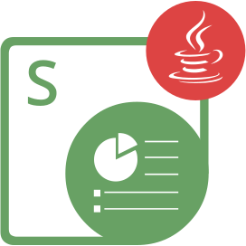

{}

**Witamy w Aspose.Slides for Node.js via Java**

Aspose.Slides for Node.js via Java jest biblioteką klas, która umożliwia aplikacjom odczytywanie i zapisywanie dokumentów PowerPoint® bez użycia Microsoft PowerPoint®.

Aspose.Slides for Node.js via Java jest pierwszym i jedynym komponentem, który zapewnia funkcjonalność zarządzania dokumentami PowerPoint®.

Aspose.Slides for Node.js via Java oferuje wiele kluczowych funkcji, takich jak zarządzanie tekstem, kształtami, tabelami i animacjami, dodawanie dźwięku i wideo do slajdów, podgląd slajdów, eksportowanie slajdów do formatu SVG, PDF i wiele innych.

{}

## Zasoby Aspose.Slides for Node.js via Java

{}

Aspose.Slides for Node.js via Java został przeniesiony z Aspose.Slides for Java, więc możesz korzystać z ich dokumentacji i referencji API.

{}

Oto linki do przydatnych zasobów:

- [Dokumentacja online Aspose.Slides for Node.js via Java](/slides/pl/nodejs-java/developer-guide/)
- [Funkcje Aspose.Slides for Node.js via Java](/slides/pl/nodejs-java/features-overview/)
- [Ograniczenia i różnice API Aspose.Slides for Node.js via Java](/slides/pl/nodejs-java/limitations-and-api-differences/)
- [Informacje o wydaniu Aspose.Slides for Node.js via Java](https://releases.aspose.com/slides/pl/nodejs-java/release-notes/)
- [Strona produktu Aspose.Slides for Node.js via Java](https://products.aspose.com/slides/pl/nodejs-java/)
- [Pobierz pakiet Aspose.Slides for Node.js via Java](https://releases.aspose.com/slides/pl/nodejs-java/)
- [Instalacja Aspose.Slides for Node.js via Java](/slides/pl/nodejs-java/installation/)
- [Referencja API Aspose.Slides for Node.js via Java](https://reference.aspose.com/slides/pl/nodejs-java/)
- [Darmowe forum wsparcia Aspose.Slides for Node.js via Java](https://forum.aspose.com/c/slides/pl/)
- [Płatny helpdesk wsparcia Aspose.Slides for Node.js via Java](https://helpdesk.aspose.com/)