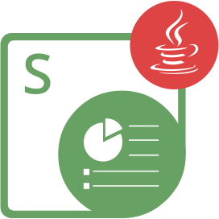

Aspose.Slides for Node.js via Java jest biblioteką służącą do tworzenia, odczytywania, edytowania i konwertowania prezentacji PowerPoint oraz OpenDocument w aplikacjach Node.js, bez Microsoft PowerPoint.

Ładuje i zapisuje pliki PPT, PPTX, PPS, POT oraz ODP, w tym warianty z makrami i szablony, oraz eksportuje do PDF, XPS, HTML, SVG, TIFF, Markdown i obrazów.

<div style="clear:both"></div>

------

<div class="row">
<div class="col-md-4">
<p><b>Rozpocznij</b></p>
<hr>
<p>POCZĄTKI</p>
<ul>
<li><a href="/slides/pl/nodejs-java/installation/">Instalacja</a></li>
<li><a href="/slides/pl/nodejs-java/create-presentation/">Utwórz swoją pierwszą prezentację</a></li>
<li><a href="/slides/pl/nodejs-java/getting-started/">Przewodnik wprowadzający</a></li>
</ul>
<p>EWALUACJA</p>
<ul>
<li><a href="/slides/pl/nodejs-java/supported-file-formats/">Obsługiwane formaty plików</a></li>
<li><a href="/slides/pl/nodejs-java/evaluate-aspose-slides/">Ograniczenia wersji próbnej</a></li>
<li><a href="/slides/pl/nodejs-java/licensing/">Licencjonowanie</a></li>
</ul>
</div>
<div class="col-md-4">
<p><b>Budowanie z Slides</b></p>
<hr>
<p>CZĘSTE ZADANIA</p>
<ul>
<li><a href="/slides/pl/nodejs-java/open-presentation/">Otwórz prezentację</a></li>
<li><a href="/slides/pl/nodejs-java/save-presentation/">Zapisz prezentację</a></li>
<li><a href="/slides/pl/nodejs-java/convert-powerpoint-to-pdf/">Konwertuj do PDF</a></li>
<li><a href="/slides/pl/nodejs-java/convert-slide/">Renderuj slajdy jako obrazy</a></li>
<li><a href="/slides/pl/nodejs-java/manage-text/">Edytuj tekst i kształty</a></li>
</ul>
<p>PRZEPŁYWY PRACY SLIDES</p>
<ul>
<li><a href="/slides/pl/nodejs-java/powerpoint-charts/">Wykresy</a></li>
<li><a href="/slides/pl/nodejs-java/powerpoint-animation/">Animacje</a></li>
<li><a href="/slides/pl/nodejs-java/manage-media-files/">Audio i wideo</a></li>
<li><a href="/slides/pl/nodejs-java/presentation-design/">Projektowanie slajdów</a></li>
<li><a href="/slides/pl/nodejs-java/merge-presentation/">Scalanie prezentacji</a></li>
</ul>
<p>PRZYKŁADY</p>
<ul>
<li><a href="/slides/pl/nodejs-java/examples/">Przykłady według elementu slajdu</a></li>
</ul>
</div>
<div class="col-md-4">
<p><b>Referencje i wsparcie</b></p>
<hr>
<p>REFERENCJE</p>
<ul>
<li><a href="https://reference.aspose.com/slides/pl/nodejs-java/">Referencja API</a></li>
<li><a href="https://releases.aspose.com/slides/pl/nodejs-java/release-notes/">Uwagi do wydania</a></li>
<li><a href="/slides/pl/nodejs-java/known-issues/">Znane problemy</a></li>
<li><a href="https://releases.aspose.com/slides/pl/nodejs-java/">Pobierz</a></li>
</ul>
<p>WSPARCIE</p>
<ul>
<li><a href="https://forum.aspose.com/c/slides/pl/11">Darmowe forum wsparcia</a></li>
<li><a href="https://helpdesk.aspose.com/">Płatny helpdesk wsparcia</a></li>
</ul>
</div>
</div>

------

## **Twoja pierwsza prezentacja**

Oprócz Node.js w wersji 20 lub nowszej, pakiet wymaga Java Development Kit (JDK), Pythona oraz zestawu narzędzi do kompilacji C++, ponieważ npm kompiluje most `java` podczas instalacji. Zobacz [Installation](/slides/pl/nodejs-java/installation/) po kroki dla każdego systemu operacyjnego. Następnie utwórz projekt i zainstaluj pakiet z npm:

```bash
mkdir hello-slides
cd hello-slides
npm init -y
npm install aspose.slides.via.java
```

Zapisz ten kod jako *hello.js* w folderze projektu:

```javascript
const asposeSlides = require("aspose.slides.via.java");

const presentation = new asposeSlides.Presentation();
try {
    const slide = presentation.getSlides().get_Item(0);
    const shape = slide.getShapes().addAutoShape(asposeSlides.ShapeType.Rectangle, 50, 50, 400, 100);
    shape.getTextFrame().setText("Hello, Aspose.Slides!");
    presentation.save("hello.pptx", asposeSlides.SaveFormat.Pptx);
} finally {
    presentation.dispose();
}

// Aspose.Slides działa w wirtualnej maszynie Java, która utrzymuje działanie Node.js, więc należy jawnie zakończyć proces.
process.exit(0);
```

Uruchom go za pomocą `node hello.js`. Skrypt zapisuje *hello.pptx* z jednym slajdem zawierającym pole tekstowe. Bez licencji, zapisany plik zawiera znak wodny wersji próbnej — zobacz [Licensing](/slides/pl/nodejs-java/licensing/). Aby dowiedzieć się więcej o sposobach tworzenia i wypełniania prezentacji, zobacz [Create Presentations](/slides/pl/nodejs-java/create-presentation/).