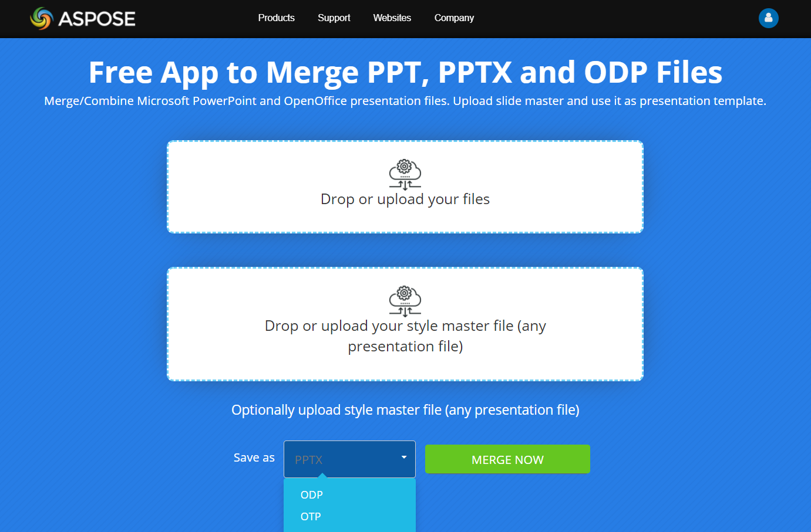

## **Przegląd**

Aspose.Slides umożliwia scalanie prezentacji poprzez klonowanie slajdów z jednej prezentacji do drugiej. Ten artykuł wyjaśnia, jak scalać całe prezentacje lub wybrane slajdy, używać mastera slajdów lub konkretnego układu podczas scalania, obsługiwać prezentacje o różnych rozmiarach slajdów oraz dodawać scalone slajdy do sekcji prezentacji. Omówione są również praktyczne uwagi dotyczące scalanej zawartości, w tym notatki prelegenta, komentarze, pliki źródłowe zabezpieczone hasłem oraz wykorzystanie wątków.

## **Scalanie prezentacji**

Kiedy scalasz jedną prezentację z drugą, w praktyce łączysz ich slajdy w jednej prezentacji, aby uzyskać jeden plik.

{}

Większość programów do prezentacji (PowerPoint lub OpenOffice) nie posiada funkcji umożliwiających użytkownikom łączenie prezentacji w taki sposób. 

[**Aspose.Slides dla Node.js via Java**](https://products.aspose.com/slides/pl/nodejs-java/), jednak umożliwia scalanie prezentacji na różne sposoby. Możesz scalić prezentacje wraz ze wszystkimi ich kształtami, stylami, tekstami, formatowaniem, komentarzami, animacjami itp., nie martwiąc się o utratę jakości lub danych.

**Zobacz także**

[**Klonowanie slajdów**](https://docs.aspose.com/slides/pl/nodejs-java/clone-slides/).

{}

### **Co można scalać**

* pełne prezentacje. Wszystkie slajdy z prezentacji trafiają do jednej prezentacji
* określone slajdy. Wybrane slajdy trafiają do jednej prezentacji
* prezentacje w jednym formacie (PPT do PPT, PPTX do PPTX itp.) oraz w różnych formatach (PPT do PPTX, PPTX do ODP itp.) względem siebie. 

### **Opcje scalania**

Możesz zastosować opcje, które określają, czy  

* każdy slajd w prezentacji wynikowej zachowuje unikalny styl  
* określony styl jest używany dla wszystkich slajdów w prezentacji wynikowej.  

Aby scalić prezentacje, Aspose.Slides udostępnia metody [addClone](https://reference.aspose.com/slides/pl/nodejs-java/aspose.slides/SlideCollection#addClone-aspose.slides.ISlide-) (z klasy [SlideCollection](https://reference.aspose.com/slides/pl/nodejs-java/aspose.slides/SlideCollection)). Istnieje kilka implementacji metod `addClone`, które definiują parametry procesu scalania prezentacji. Każdy obiekt Presentation posiada kolekcję [Slides](https://reference.aspose.com/slides/pl/nodejs-java/aspose.slides/Presentation#getSlides--), dzięki czemu możesz wywołać metodę `addClone` z prezentacji, do której chcesz scalić slajdy.

Metoda `addClone` zwraca obiekt `Slide`, który jest klonem slajdu źródłowego. Slajdy w prezentacji wyjściowej są po prostu kopią slajdów ze źródła. Dlatego możesz wprowadzać zmiany w wynikowych slajdach (na przykład zastosować style lub opcje formatowania albo układy) bez obaw, że wpłyną one na prezentacje źródłowe. 

## **Scalanie prezentacji** 

Aspose.Slides udostępnia metodę [**AddClone(ISlide)**](https://reference.aspose.com/slides/pl/nodejs-java/aspose.slides/SlideCollection#addClone-aspose.slides.ISlide-), która pozwala łączyć slajdy, zachowując ich układy i style (parametry domyślne).

Ten kod JavaScript pokazuje, jak scalić prezentacje:

```javascript
let pres1 = new aspose.slides.Presentation("pres1.pptx");
try {
    let pres2 = new aspose.slides.Presentation("pres2.pptx");
    try {
        for (let i = 0; i < pres2.getSlides().size(); i++) {
            let slide = pres2.getSlides().get_Item(i);
            pres1.getSlides().addClone(slide);
        }
    } finally {
        if (pres2 != null) {
            pres2.dispose();
        }
    }
    pres1.save("combined.pptx", aspose.slides.SaveFormat.Pptx);
} finally {
    if (pres1 != null) {
        pres1.dispose();
    }
}
```

## **Scalanie prezentacji z masterem slajdów**

Aspose.Slides udostępnia metodę [**AddClone(ISlide, IMasterSlide, boolean)**](https://reference.aspose.com/slides/pl/nodejs-java/aspose.slides/SlideCollection#addClone-aspose.slides.ISlide-aspose.slides.IMasterSlide-boolean-), która pozwala łączyć slajdy, stosując szablon mastera slajdów. Dzięki temu, w razie potrzeby, możesz zmienić styl slajdów w prezentacji wynikowej.

Ten kod w JavaScript demonstruje opisaną operację:

```javascript
let pres1 = new aspose.slides.Presentation("pres1.pptx");
try {
    let pres2 = new aspose.slides.Presentation("pres2.pptx");
    try {
        for (let i = 0; i < pres2.getSlides().size(); i++) {
            let slide = pres2.getSlides().get_Item(i);
            pres1.getSlides().addClone(slide, pres2.getMasters().get_Item(0), true);
        }
    } finally {
        if (pres2 != null) {
            pres2.dispose();
        }
    }
    pres1.save("combined.pptx", aspose.slides.SaveFormat.Pptx);
} finally {
    if (pres1 != null) {
        pres1.dispose();
    }
}
```

{} 

Układ slajdu dla mastera jest określany automatycznie. Gdy nie można wyznaczyć odpowiedniego układu, a parametr `allowCloneMissingLayout` metody `addClone` jest ustawiony na `true`, używany jest układ slajdu źródłowego. W przeciwnym razie zostanie rzucony [PptxEditException](https://reference.aspose.com/slides/pl/nodejs-java/aspose.slides/PptxEditException). 

{}

Jeśli chcesz, aby slajdy w prezentacji wynikowej miały inny układ, użyj zamiast tego metody [addClone(ISlide, ILayoutSlide)](https://reference.aspose.com/slides/pl/nodejs-java/aspose.slides/SlideCollection#addClone-aspose.slides.ISlide-aspose.slides.ILayoutSlide-).

## **Scalanie konkretnych slajdów z prezentacji**

Scalanie konkretnych slajdów z wielu prezentacji jest przydatne przy tworzeniu niestandardowych zestawów slajdów. Aspose.Slides dla Node.js via Java pozwala wybrać i zaimportować tylko potrzebne slajdy. API zachowuje formatowanie, układ i projekty oryginalnych slajdów.

Poniższy kod JavaScript tworzy nową prezentację, dodaje slajdy tytułowe z dwóch innych prezentacji i zapisuje wynik do pliku:

```js
function getTitleSlide(presentation) {
  for (let i = 0; i < presentation.getSlides().size(); i++) {
    let slide = presentation.getSlides().get_Item(i);
    if (slide.getLayoutSlide().getLayoutType() == aspose.slides.SlideLayoutType.Title) {
      return slide;
    }
  }
  return null;
}
```
```js
let presentation = new aspose.slides.Presentation();
let presentation1 = new aspose.slides.Presentation("presentation1.pptx");
let presentation2 = new aspose.slides.Presentation("presentation2.pptx");
try {
    presentation.getSlides().removeAt(0);
    
    let slide1 = getTitleSlide(presentation1);

    if (slide1 != null)
        presentation.getSlides().addClone(slide1);

    let slide2 = getTitleSlide(presentation2);

    if (slide2 != null)
        presentation.getSlides().addClone(slide2);

    presentation.save("combined.pptx", aspose.slides.SaveFormat.Pptx);
} finally {
    presentation2.dispose();
    presentation1.dispose();
    presentation.dispose();
}
```

## **Scalanie prezentacji z układem slajdu**

Ten kod JavaScript pokazuje, jak łączyć slajdy z prezentacji, stosując wybrany układ slajdu, aby uzyskać jedną prezentację wynikową:

```javascript
let pres1 = new aspose.slides.Presentation("pres1.pptx");
try {
    let pres2 = new aspose.slides.Presentation("pres2.pptx");
    try {
        for (let i = 0; i < pres2.getSlides().size(); i++) {
            let slide = pres2.getSlides().get_Item(i);
            pres1.getSlides().addClone(slide, pres2.getLayoutSlides().get_Item(0));
        }
    } finally {
        if (pres2 != null) {
            pres2.dispose();
        }
    }
    pres1.save("combined.pptx", aspose.slides.SaveFormat.Pptx);
} finally {
    if (pres1 != null) {
        pres1.dispose();
    }
}
```

## **Scalanie prezentacji o różnych rozmiarach slajdów**

{} 

Nie można scalać prezentacji o różnych rozmiarach slajdów. 

{}

Aby scalić dwie prezentacje o różnych rozmiarach slajdów, musisz zmienić rozmiar jednej z nich, aby dopasować go do rozmiaru drugiej.

Przykładowy kod demonstruje opisaną operację:

```javascript
let pres1 = new aspose.slides.Presentation("pres1.pptx");
try {
    let pres2 = new aspose.slides.Presentation("pres2.pptx");
    try {
        pres2.getSlideSize().setSize(pres1.getSlideSize().getSize().getWidth(), pres1.getSlideSize().getSize().getHeight(), aspose.slides.SlideSizeScaleType.EnsureFit);
        for (let i = 0; i < pres2.getSlides().size(); i++) {
            let slide = pres2.getSlides().get_Item(i);
            pres1.getSlides().addClone(slide);
        }
    } finally {
        if (pres2 != null) {
            pres2.dispose();
        }
    }
    pres1.save("combined.pptx", aspose.slides.SaveFormat.Pptx);
} finally {
    if (pres1 != null) {
        pres1.dispose();
    }
}
```

## **Scalanie slajdów w sekcję prezentacji**

Ten kod JavaScript pokazuje, jak scalić konkretny slajd do sekcji w prezentacji:

```javascript
let pres1 = new aspose.slides.Presentation("pres1.pptx");
try {
    let pres2 = new aspose.slides.Presentation("pres2.pptx");
    try {
        for (let i = 0; i < pres2.getSlides().size(); i++) {
            let slide = pres2.getSlides().get_Item(i);
            pres1.getSlides().addClone(slide, pres1.getSections().get_Item(0));
        }
    } finally {
        if (pres2 != null) {
            pres2.dispose();
        }
    }
    pres1.save("combined.pptx", aspose.slides.SaveFormat.Pptx);
} finally {
    if (pres1 != null) {
        pres1.dispose();
    }
}
```

Slajd jest dodawany na końcu sekcji. 

## **FAQ**

**Czy notatki prelegenta są zachowywane podczas scalania?**

Tak. Podczas klonowania slajdów Aspose.Slides przenosi wszystkie elementy slajdu, w tym notatki, formatowanie i animacje.

**Czy komentarze i ich autorzy są przenoszeni?**

Komentarze, jako część treści slajdu, są kopiowane wraz ze slajdem. Etykiety autorów komentarzy są zachowywane jako obiekty komentarzy w powstałej prezentacji.

**Co jeśli źródłowa prezentacja jest zabezpieczona hasłem?**

Należy ją [otworzyć przy użyciu hasła](/slides/pl/nodejs-java/password-protected-presentation/) za pomocą [LoadOptions.setPassword](https://reference.aspose.com/slides/pl/nodejs-java/aspose.slides/loadoptions/setpassword/); po załadowaniu te slajdy mogą być bezpiecznie sklonowane do pliku niechronionego (lub również chronionego).

**Jak bezpieczna jest operacja scalania względem wątków?**

Nie używaj tej samej instancji [Presentation](https://reference.aspose.com/slides/pl/nodejs-java/aspose.slides/presentation/) z [wielu wątków](/slides/pl/nodejs-java/multithreading/). Zalecana zasada to „jeden dokument — jeden wątek”; różne pliki mogą być przetwarzane równocześnie w oddzielnych wątkach.

## **Zobacz także**

Aspose udostępnia [DARMOWY kreator kolaży online](https://products.aspose.app/slides/pl/collage). Korzystając z tej usługi, możesz scalać obrazy [JPG do JPG](https://products.aspose.app/slides/pl/collage/jpg) lub PNG do PNG, tworzyć [siatki zdjęć](https://products.aspose.app/slides/pl/collage/photo-grid) i wiele więcej.

Sprawdź [Aspose DARMOWY internetowy łączenie](https://products.aspose.app/slides/pl/merger). Pozwala łączyć prezentacje PowerPoint w tym samym formacie (np. PPT do PPT, PPTX do PPTX) lub w różnych formatach (np. PPT do PPTX, PPTX do ODP).

[](https://products.aspose.app/slides/pl/merger)