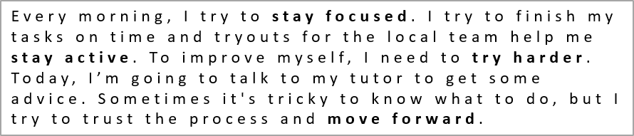

## **Przegląd**

Ten artykuł pokazuje, jak formatować tekst w prezentacjach PowerPoint i OpenDocument przy użyciu Aspose.Slides dla Node.js poprzez Java. Obejmuje kolory tła, przezroczystość, odstępy między znakami, właściwości czcionki, obrót, odstępy akapitów, zachowanie autofit, kotwiczenie tekstu, tabulatory i ustawienia języka.

O ile nie podano inaczej, przykłady używają [sample.pptx](sample.pptx). Pierwszy kształt na jej pierwszym slajdzie jest polem tekstowym, a jego pierwszy akapit zawiera tekst pokazany poniżej. Indeksy slajdów i kształtów są zerowo‑indeksowane. Przykłady wybierające pogrubione fragmenty używają efektywnego formatowania, w tym dziedziczonego formatowania pogrubienia:


Aby znaleźć i podświetlić dosłowny tekst lub dopasowania wyrażeń regularnych, zobacz [Wyszukiwanie i zamiana tekstu](/slides/pl/nodejs-java/search-and-replace-text/).

## **Ustaw kolor tła tekstu**

Użyj [ParagraphFormat.getDefaultPortionFormat](https://reference.aspose.com/slides/nodejs-java/aspose.slides/paragraphformat/#getDefaultPortionFormat--) aby ustawić domyślny kolor podświetlenia dla akapitu lub użyj [BasePortionFormat.getHighlightColor](https://reference.aspose.com/slides/nodejs-java/aspose.slides/baseportionformat/#getHighlightColor--) dla poszczególnych fragmentów tekstu.

Po następującym przykładzie ustawia jasnoszare podświetlenie jako domyślne dla pierwszego akapitu. Jawne kolory podświetlenia w poszczególnych fragmentach mają pierwszeństwo względem tego domyślnego:

```javascript
const aspose = { slides: require("aspose.slides.via.java") };
const java = require("java");

const presentation = new aspose.slides.Presentation("sample.pptx");
try {
    const slide = presentation.getSlides().get_Item(0);

    const autoShape = slide.getShapes().get_Item(0);
    const paragraph = autoShape.getTextFrame().getParagraphs().get_Item(0);

    // Ustaw kolor podświetlenia dla całego akapitu.
    paragraph.getParagraphFormat().getDefaultPortionFormat().getHighlightColor().setColor(java.getStaticFieldValue("java.awt.Color", "LIGHT_GRAY"));

    presentation.save("gray_paragraph.pptx", aspose.slides.SaveFormat.Pptx);
} finally {
    presentation.dispose();
}
```

Wynik:


Przykład kodu poniżej pokazuje, jak ustawić kolor tła dla **fragmentów tekstu z pogrubioną czcionką**:

```javascript
const aspose = { slides: require("aspose.slides.via.java") };
const java = require("java");

const presentation = new aspose.slides.Presentation("sample.pptx");
try {
    const slide = presentation.getSlides().get_Item(0);

    const autoShape = slide.getShapes().get_Item(0);
    const paragraph = autoShape.getTextFrame().getParagraphs().get_Item(0);
    const portions = paragraph.getPortions();
    const portionCount = portions.getCount();

    for (let portionIndex = 0; portionIndex < portionCount; portionIndex++) {
        const portion = portions.get_Item(portionIndex);
        if (portion.getPortionFormat().getEffective().getFontBold()) {
            // Ustaw kolor podświetlenia dla fragmentu tekstu.
            portion.getPortionFormat().getHighlightColor().setColor(java.getStaticFieldValue("java.awt.Color", "LIGHT_GRAY"));
        }
    }

    presentation.save("gray_text_portions.pptx", aspose.slides.SaveFormat.Pptx);
} finally {
    presentation.dispose();
}
```

Wynik:


## **Wyrównaj akapity tekstu**

Użyj [ParagraphFormat.setAlignment](https://reference.aspose.com/slides/nodejs-java/aspose.slides/paragraphformat/#setAlignment-int-) aby ustawić wyrównanie akapitu w ramce tekstowej. Wartość może być wyśrodkowana, wyrównana do lewej, do prawej, justowana i tak dalej.

Ten przykład kodu pokazuje, jak wyrównać akapit do **środka**:

```javascript
const aspose = { slides: require("aspose.slides.via.java") };

const presentation = new aspose.slides.Presentation("sample.pptx");
try {
    const slide = presentation.getSlides().get_Item(0);

    const autoShape = slide.getShapes().get_Item(0);
    const paragraph = autoShape.getTextFrame().getParagraphs().get_Item(0);

    // Ustaw wyrównanie akapitu do środka.
    paragraph.getParagraphFormat().setAlignment(aspose.slides.TextAlignment.Center);

    presentation.save("aligned_paragraph.pptx", aspose.slides.SaveFormat.Pptx);
} finally {
    presentation.dispose();
}
```

Wynik:


## **Wyrównaj czcionki w linii**

Użyj [ParagraphFormat.setFontAlignment](https://reference.aspose.com/slides/nodejs-java/aspose.slides/paragraphformat/#setFontAlignment-int-) aby pionowo wyrównać fragmenty tekstu o różnych rozmiarach czcionki w jednej linii. To ustawienie ma zastosowanie do całego akapitu i kontroluje wyrównanie w każdej z jego linii.

Poniższy samodzielny przykład tworzy cztery oznaczone pola tekstowe na jednym slajdzie. Każdy akapit zawiera ten sam tekst w rozmiarach 18, 36 i 54 punktów, przy różnym wyrównaniu czcionki. Używa Arial, wyłącza autofit i zawijanie oraz utrzymuje ramki tekstowe wystarczająco duże dla jednej linii.

```javascript
const aspose = { slides: require("aspose.slides.via.java") };
const java = require("java");

const presentation = new aspose.slides.Presentation();
try {
    const slide = presentation.getSlides().get_Item(0);

    const alignments = [aspose.slides.FontAlignment.Baseline, aspose.slides.FontAlignment.Top, aspose.slides.FontAlignment.Center, aspose.slides.FontAlignment.Bottom];
    const alignmentNames = ["Baseline", "Top", "Center", "Bottom"];
    const fontSizes = [18, 36, 54];

    for (let i = 0; i < alignments.length; i++) {
        const shape = slide.getShapes().addAutoShape(aspose.slides.ShapeType.Rectangle, 30, 20 + i * 130, 660, 120);
        shape.getFillFormat().setFillType(java.newByte(aspose.slides.FillType.NoFill));
        shape.getLineFormat().getFillFormat().setFillType(java.newByte(aspose.slides.FillType.NoFill));

        const textFrame = shape.getTextFrame();
        textFrame.getTextFrameFormat().setAnchoringType(java.newByte(aspose.slides.TextAnchorType.Top));
        textFrame.getTextFrameFormat().setAutofitType(java.newByte(aspose.slides.TextAutofitType.None));
        textFrame.getTextFrameFormat().setWrapText(java.newByte(aspose.slides.NullableBool.False));

        const label = textFrame.getParagraphs().get_Item(0);
        label.setText(alignmentNames[i]);
        label.getParagraphFormat().setAlignment(aspose.slides.TextAlignment.Left);
        label.getParagraphFormat().getDefaultPortionFormat().setFontHeight(14);
        label.getParagraphFormat().getDefaultPortionFormat().setLatinFont(new aspose.slides.FontData("Arial"));
        label.getParagraphFormat().getDefaultPortionFormat().getFillFormat().setFillType(java.newByte(aspose.slides.FillType.Solid));
        label.getParagraphFormat().getDefaultPortionFormat().getFillFormat().getSolidFillColor().setColor(java.getStaticFieldValue("java.awt.Color", "GRAY"));

        const paragraph = new aspose.slides.Paragraph();
        paragraph.getParagraphFormat().setFontAlignment(alignments[i]);
        paragraph.getParagraphFormat().setAlignment(aspose.slides.TextAlignment.Left);
        paragraph.getParagraphFormat().getDefaultPortionFormat().setLatinFont(new aspose.slides.FontData("Arial"));
        paragraph.getParagraphFormat().getDefaultPortionFormat().getFillFormat().setFillType(java.newByte(aspose.slides.FillType.Solid));
        paragraph.getParagraphFormat().getDefaultPortionFormat().getFillFormat().getSolidFillColor().setColor(java.getStaticFieldValue("java.awt.Color", "BLACK"));

        for (const fontSize of fontSizes) {
            const portion = new aspose.slides.Portion("Ag ");
            portion.getPortionFormat().setFontHeight(fontSize);
            paragraph.getPortions().add(portion);
        }

        textFrame.getParagraphs().add(paragraph);
    }

    presentation.save("font_alignment.pptx", aspose.slides.SaveFormat.Pptx);
} finally {
    presentation.dispose();
}
```

Wynik:


Wyrównanie czcionki korzysta z metryk czcionki, więc widoczne krawędzie poszczególnych liter nie muszą dokładnie się pokrywać. Przykład zawiera zarówno wielką literę, jak i znak z dolnym ogonkiem, aby pokazać różnicę między wyrównaniem do linii podstawowej a dolnej. Dostępność czcionek i ich podstawienie, użyte znaki oraz różnica w rozmiarach czcionek wpływają na wynik. Wymiary ramki, marginesy, interlinia, zawijanie i autofit także wpływają na układ; używaj tych samych czcionek i ustawień układu przy porównywaniu trybów.

To ustawienie różni się od [ParagraphFormat.setAlignment](https://reference.aspose.com/slides/nodejs-java/aspose.slides/paragraphformat/#setAlignment-int-), które kontroluje poziome wyrównanie akapitu, oraz od [TextFrameFormat.setAnchoringType](https://reference.aspose.com/slides/nodejs-java/aspose.slides/textframeformat/#setAnchoringType-byte-), które pozycjonuje blok tekstu pionowo w kształcie. Formatowanie indeksu górnego i dolnego za pomocą [BasePortionFormat.setEscapement](https://reference.aspose.com/slides/nodejs-java/aspose.slides/baseportionformat/#setEscapement-float-) przesuwa poszczególne fragmenty względem linii podstawowej zamiast ustawiać wyrównanie czcionki dla linii akapitu.

## **Ustaw przezroczystość tekstu**

Przezroczystość tekstu jest kontrolowana za pomocą składowej alfa koloru przypisanego do [BasePortionFormat.getFillFormat](https://reference.aspose.com/slides/nodejs-java/aspose.slides/baseportionformat/#getFillFormat--). W poniższych przykładach `alpha = 50` oznacza wartość kanału alfa ARGB w skali 0‑255, a nie procent przezroczystości.

Przykład kodu poniżej pokazuje, jak zastosować przezroczystość do **całego akapitu**:

```javascript
const aspose = { slides: require("aspose.slides.via.java") };
const java = require("java");

const alpha = 50;
const transparentBlack = java.newInstanceSync("java.awt.Color", 0, 0, 0, alpha);
const presentation = new aspose.slides.Presentation("sample.pptx");
try {
    const slide = presentation.getSlides().get_Item(0);

    const autoShape = slide.getShapes().get_Item(0);
    const paragraph = autoShape.getTextFrame().getParagraphs().get_Item(0);
    const fillFormat = paragraph.getParagraphFormat().getDefaultPortionFormat().getFillFormat();

    // Ustaw kolor wypełnienia tekstu na kolor przezroczysty.
    fillFormat.setFillType(java.newByte(aspose.slides.FillType.Solid));
    fillFormat.getSolidFillColor().setColor(transparentBlack);

    presentation.save("transparent_paragraph.pptx", aspose.slides.SaveFormat.Pptx);
} finally {
    presentation.dispose();
}
```

Wynik:


Następujący przykład kodu pokazuje, jak zastosować przezroczystość do **fragmentów tekstu z pogrubioną czcionką**:

```javascript
const aspose = { slides: require("aspose.slides.via.java") };
const java = require("java");

const alpha = 50;
const transparentBlack = java.newInstanceSync("java.awt.Color", 0, 0, 0, alpha);
const presentation = new aspose.slides.Presentation("sample.pptx");
try {
    const slide = presentation.getSlides().get_Item(0);

    const autoShape = slide.getShapes().get_Item(0);
    const paragraph = autoShape.getTextFrame().getParagraphs().get_Item(0);
    const portions = paragraph.getPortions();
    const portionCount = portions.getCount();

    for (let portionIndex = 0; portionIndex < portionCount; portionIndex++) {
        const portion = portions.get_Item(portionIndex);
        if (portion.getPortionFormat().getEffective().getFontBold()) {
            const fillFormat = portion.getPortionFormat().getFillFormat();

            // Ustaw przezroczystość fragmentu tekstu.
            fillFormat.setFillType(java.newByte(aspose.slides.FillType.Solid));
            fillFormat.getSolidFillColor().setColor(transparentBlack);
        }
    }

    presentation.save("transparent_text_portions.pptx", aspose.slides.SaveFormat.Pptx);
} finally {
    presentation.dispose();
}
```

Wynik:


## **Ustaw odstęp między znakami w tekście**

Użyj [BasePortionFormat.setSpacing](https://reference.aspose.com/slides/nodejs-java/aspose.slides/baseportionformat/#setSpacing-float-) aby zwiększyć lub zmniejszyć odstępy między znakami w polu tekstowym. Przykłady dodają 3 punkty odstępu; wartości ujemne zwężają tekst.

Poniższy kod JavaScript pokazuje, jak rozszerzyć odstęp między znakami w **całym akapicie**:

```javascript
const aspose = { slides: require("aspose.slides.via.java") };

const presentation = new aspose.slides.Presentation("sample.pptx");
try {
    const slide = presentation.getSlides().get_Item(0);

    const autoShape = slide.getShapes().get_Item(0);
    const paragraph = autoShape.getTextFrame().getParagraphs().get_Item(0);

    // Uwaga: użyj wartości ujemnych, aby skompresować odstęp między znakami.
    paragraph.getParagraphFormat().getDefaultPortionFormat().setSpacing(3); // Rozszerz odstęp między znakami.

    presentation.save("character_spacing_in_paragraph.pptx", aspose.slides.SaveFormat.Pptx);
} finally {
    presentation.dispose();
}
```

Wynik:



Przykład kodu poniżej pokazuje, jak rozszerzyć odstęp między znakami w **fragmentach tekstu z pogrubioną czcionką**:

```javascript
const aspose = { slides: require("aspose.slides.via.java") };

const presentation = new aspose.slides.Presentation("sample.pptx");
try {
    const slide = presentation.getSlides().get_Item(0);

    const autoShape = slide.getShapes().get_Item(0);
    const paragraph = autoShape.getTextFrame().getParagraphs().get_Item(0);
    const portions = paragraph.getPortions();
    const portionCount = portions.getCount();

    for (let portionIndex = 0; portionIndex < portionCount; portionIndex++) {
        const portion = portions.get_Item(portionIndex);
        if (portion.getPortionFormat().getEffective().getFontBold()) {
            // Uwaga: użyj wartości ujemnych, aby skompresować odstęp między znakami.
            portion.getPortionFormat().setSpacing(3); // Rozszerz odstęp między znakami.
        }
    }

    presentation.save("character_spacing_in_text_portions.pptx", aspose.slides.SaveFormat.Pptx);
} finally {
    presentation.dispose();
}
```

Wynik:


### **Wyłącz kerning dla określonych czcionek**

W niektórych przypadkach tekst renderowany przez Aspose.Slides może wyglądać nieco gęściej niż ten sam tekst wyświetlany w PowerPoint. Może się to zdarzyć, ponieważ PowerPoint może ignorować dane kerningu dla niektórych czcionek, nawet jeśli czcionka zawiera prawidłowe informacje o kerningu i kerning jest włączony w ustawieniach PowerPoint.

Aby w takich przypadkach uzyskać wynik renderingowy bliższy PowerPoint, możesz wyłączyć kerning dla fragmentów tekstu używających dotkniętej czcionki. Ustaw [BasePortionFormat.setKerningMinimalSize](https://reference.aspose.com/slides/nodejs-java/aspose.slides/baseportionformat/#setKerningMinimalSize-float-) na wartość większą niż rzeczywisty rozmiar czcionki. Ten przykład wymaga pliku „presentation.pptx” z polem tekstowym jako pierwszym kształtem na pierwszym slajdzie. Sprawdza efektywne nazwy czcionek, w tym dziedziczone, i ustawia próg 100 punktów dla fragmentów używających Roboto. To wyłącza kerning dla dopasowanych fragmentów z rozmiarem czcionki poniżej 100 punktów:

```javascript
const aspose = { slides: require("aspose.slides.via.java") };

const presentation = new aspose.slides.Presentation("presentation.pptx");
try {
    const slide = presentation.getSlides().get_Item(0);

    const autoShape = slide.getShapes().get_Item(0);
    const paragraphs = autoShape.getTextFrame().getParagraphs();
    const paragraphCount = paragraphs.getCount();
    const targetFont = "Roboto";

    for (let paragraphIndex = 0; paragraphIndex < paragraphCount; paragraphIndex++) {
        const portions = paragraphs.get_Item(paragraphIndex).getPortions();
        const portionCount = portions.getCount();

        for (let portionIndex = 0; portionIndex < portionCount; portionIndex++) {
            const portion = portions.get_Item(portionIndex);
            const portionFormat = portion.getPortionFormat().getEffective();
            const latinFont = portionFormat.getLatinFont();
            const eastAsianFont = portionFormat.getEastAsianFont();
            const complexScriptFont = portionFormat.getComplexScriptFont();

            if ((latinFont !== null && latinFont.getFontName() === targetFont) ||
                (eastAsianFont !== null && eastAsianFont.getFontName() === targetFont) ||
                (complexScriptFont !== null && complexScriptFont.getFontName() === targetFont)) {
                portion.getPortionFormat().setKerningMinimalSize(100);
            }
        }
    }

    presentation.save("output.pptx", aspose.slides.SaveFormat.Pptx);
} finally {
    presentation.dispose();
}
```

Dla dopasowanego tekstu poniżej progu to ustawienie wyłącza kerning i może pomóc dopasować renderowanie Aspose.Slides do wizualnego wyjścia PowerPoint dla czcionek dotkniętych tym specyficznym zachowaniem PowerPoint.

## **Zarządzaj właściwościami czcionki tekstu**

Właściwości czcionki można ustawiać na poziomie akapitu za pomocą [ParagraphFormat.getDefaultPortionFormat](https://reference.aspose.com/slides/nodejs-java/aspose.slides/paragraphformat/#getDefaultPortionFormat--) lub na poszczególnych fragmentach za pomocą [PortionFormat](https://reference.aspose.com/slides/nodejs-java/aspose.slides/portionformat/).

Poniższy przykład ustawia domyślną czcionkę pierwszego akapitu na 12‑punktowy Times New Roman z pogrubieniem, kursywą i kropkowanym podkreśleniem. Jawne formatowanie poszczególnych fragmentów ma pierwszeństwo przed tymi domyślnymi:

```javascript
const aspose = { slides: require("aspose.slides.via.java") };
const java = require("java");

const presentation = new aspose.slides.Presentation("sample.pptx");
try {
    const slide = presentation.getSlides().get_Item(0);

    const autoShape = slide.getShapes().get_Item(0);
    const paragraph = autoShape.getTextFrame().getParagraphs().get_Item(0);
    const defaultPortionFormat = paragraph.getParagraphFormat().getDefaultPortionFormat();

    // Ustaw właściwości czcionki dla akapitu.
    defaultPortionFormat.setFontHeight(12);
    defaultPortionFormat.setFontBold(java.newByte(aspose.slides.NullableBool.True));
    defaultPortionFormat.setFontItalic(java.newByte(aspose.slides.NullableBool.True));
    defaultPortionFormat.setFontUnderline(java.newByte(aspose.slides.TextUnderlineType.Dotted));
    defaultPortionFormat.setLatinFont(new aspose.slides.FontData("Times New Roman"));

    presentation.save("font_properties_for_paragraph.pptx", aspose.slides.SaveFormat.Pptx);
} finally {
    presentation.dispose();
}
```

Wynik:


Poniższy przykład stosuje 13‑punktowy Times New Roman, formatowanie kursywą i kropkowane podkreślenie do fragmentów, których efektywne formatowanie jest pogrubione:

```javascript
const aspose = { slides: require("aspose.slides.via.java") };
const java = require("java");

const presentation = new aspose.slides.Presentation("sample.pptx");
try {
    const slide = presentation.getSlides().get_Item(0);

    const autoShape = slide.getShapes().get_Item(0);
    const paragraph = autoShape.getTextFrame().getParagraphs().get_Item(0);
    const portions = paragraph.getPortions();
    const portionCount = portions.getCount();

    for (let portionIndex = 0; portionIndex < portionCount; portionIndex++) {
        const portion = portions.get_Item(portionIndex);
        if (portion.getPortionFormat().getEffective().getFontBold()) {
            const portionFormat = portion.getPortionFormat();

            // Ustaw właściwości czcionki dla fragmentu tekstu.
            portionFormat.setFontHeight(13);
            portionFormat.setFontItalic(java.newByte(aspose.slides.NullableBool.True));
            portionFormat.setFontUnderline(java.newByte(aspose.slides.TextUnderlineType.Dotted));
            portionFormat.setLatinFont(new aspose.slides.FontData("Times New Roman"));
        }
    }

    presentation.save("font_properties_for_text_portions.pptx", aspose.slides.SaveFormat.Pptx);
} finally {
    presentation.dispose();
}
```

Wynik:


## **Ustaw rotację tekstu**

Użyj [TextFrameFormat.setTextVerticalType](https://reference.aspose.com/slides/nodejs-java/aspose.slides/textframeformat/#setTextVerticalType-byte-) aby ustawić predefiniowaną orientację tekstu w kształcie.

Poniższy przykład kodu ustawia orientację tekstu w kształcie na [TextVerticalType.Vertical270](https://reference.aspose.com/slides/nodejs-java/aspose.slides/textverticaltype/), co obraca tekst **o 90 stopni w lewo**:

```javascript
const aspose = { slides: require("aspose.slides.via.java") };
const java = require("java");

const presentation = new aspose.slides.Presentation("sample.pptx");
try {
    const slide = presentation.getSlides().get_Item(0);

    const autoShape = slide.getShapes().get_Item(0);
    autoShape.getTextFrame().getTextFrameFormat().setTextVerticalType(java.newByte(aspose.slides.TextVerticalType.Vertical270));

    presentation.save("text_rotation.pptx", aspose.slides.SaveFormat.Pptx);
} finally {
    presentation.dispose();
}
```

Wynik:


## **Ustaw niestandardowy obrót dla ramek tekstowych**

Użyj [TextFrameFormat.setRotationAngle](https://reference.aspose.com/slides/nodejs-java/aspose.slides/textframeformat/#setRotationAngle-float-) aby ustawić niestandardowy kąt obrotu dla [TextFrame](https://reference.aspose.com/slides/nodejs-java/aspose.slides/textframe/).

Poniższy przykład kodu obraca ramkę tekstową o 3 stopnie zgodnie z ruchem wskazówek zegara w kształcie:

```javascript
const aspose = { slides: require("aspose.slides.via.java") };

const presentation = new aspose.slides.Presentation("sample.pptx");
try {
    const slide = presentation.getSlides().get_Item(0);

    const autoShape = slide.getShapes().get_Item(0);
    autoShape.getTextFrame().getTextFrameFormat().setRotationAngle(3);

    presentation.save("custom_text_rotation.pptx", aspose.slides.SaveFormat.Pptx);
} finally {
    presentation.dispose();
}
```

Wynik:


## **Ustaw interlinię akapitów**

Aspose.Slides udostępnia [ParagraphFormat.setSpaceAfter](https://reference.aspose.com/slides/nodejs-java/aspose.slides/paragraphformat/#setSpaceAfter-float-), [ParagraphFormat.setSpaceBefore](https://reference.aspose.com/slides/nodejs-java/aspose.slides/paragraphformat/#setSpaceBefore-float-) i [ParagraphFormat.setSpaceWithin](https://reference.aspose.com/slides/nodejs-java/aspose.slides/paragraphformat/#setSpaceWithin-float-) aby kontrolować odstępy akapitu. Właściwości te używa się w następujący sposób:

* Użyj wartości dodatniej, aby określić interlinię jako procent wysokości linii.
* Użyj wartości ujemnej, aby określić interlinię w punktach.

Poniższy przykład ustawia odstęp wewnątrz pierwszego akapitu na 200 % wysokości linii (podwójna interlinia):

```javascript
const aspose = { slides: require("aspose.slides.via.java") };

const presentation = new aspose.slides.Presentation("sample.pptx");
try {
    const slide = presentation.getSlides().get_Item(0);

    const autoShape = slide.getShapes().get_Item(0);

    const paragraph = autoShape.getTextFrame().getParagraphs().get_Item(0);
    paragraph.getParagraphFormat().setSpaceWithin(200);

    presentation.save("line_spacing.pptx", aspose.slides.SaveFormat.Pptx);
} finally {
    presentation.dispose();
}
```

Wynik:


## **Kontroluj łamanie linii**

Reguły łamania linii w akapicie są przydatne w wąskich blokach tekstu i prezentacjach mieszających tekst łaciński i wschodnioazjatycki. Następujące metody należą do [ParagraphFormat](https://reference.aspose.com/slides/nodejs-java/aspose.slides/paragraphformat/), więc mają zastosowanie do całego akapitu:

- [setLatinLineBreak](https://reference.aspose.com/slides/nodejs-java/aspose.slides/paragraphformat/#setLatinLineBreak-byte-) kontroluje reguły łamania linii w języku łacińskim. W tekstach mieszanych zmiana tej opcji może również zmienić miejsce, w którym otacza się znakami wschodnioazjatyckimi i interpunkcją.
- [setEastAsianLineBreak](https://reference.aspose.com/slides/nodejs-java/aspose.slides/paragraphformat/#setEastAsianLineBreak-byte-) kontroluje reguły łamania linii w językach wschodnioazjatyckich, w tym ograniczenia dotyczące znaków na początku i końcu linii.

Reguły te nie zastępują [TextFrameFormat.setWrapText](https://reference.aspose.com/slides/nodejs-java/aspose.slides/textframeformat/#setWrapText-byte-), które włącza automatyczne zawijanie w ramce tekstowej. Oddziałują na układ, gdy zachodzi zawijanie; nie wstawiają znaków końca linii. Jawny podział linii wymusza nową linię w akapicie niezależnie od dostępnej szerokości.

Poniższy samodzielny przykład tworzy wąski blok tekstowy zawierający chiński i łaciński tekst. Ustawia oba ustawienia łamania linii explicite i zapisuje „line_breaking.pptx”. Aby eksperymentować z którąkolwiek regułą, zmień odpowiednią wartość, pozostawiając pozostałe ustawienia bez zmian. Przykład używa 24‑punktowego Arial i SimSun, szerokości ramki 160 punktów i zerowych poziomych marginesów ramki tekstowej. [TextFrameFormat.setAutofitType](https://reference.aspose.com/slides/nodejs-java/aspose.slides/textframeformat/#setAutofitType-byte-) jest wywoływany z [TextAutofitType.None](https://reference.aspose.com/slides/nodejs-java/aspose.slides/textautofittype/) aby rozmiar tekstu i wymiary ramki pozostały stałe.

```javascript
const aspose = { slides: require("aspose.slides.via.java") };
const java = require("java");

const presentation = new aspose.slides.Presentation();
try {
    const slide = presentation.getSlides().get_Item(0);

    const shape = slide.getShapes().addAutoShape(aspose.slides.ShapeType.Rectangle, 50, 50, 160, 300);
    shape.getFillFormat().setFillType(java.newByte(aspose.slides.FillType.NoFill));

    const textFrame = shape.getTextFrame();
    textFrame.getTextFrameFormat().setWrapText(java.newByte(aspose.slides.NullableBool.True));
    textFrame.getTextFrameFormat().setAutofitType(java.newByte(aspose.slides.TextAutofitType.None));
    textFrame.getTextFrameFormat().setMarginLeft(0);
    textFrame.getTextFrameFormat().setMarginRight(0);

    const paragraph = textFrame.getParagraphs().get_Item(0);
    paragraph.setText("中文排版测试，PowerPoint 中文演示。");

    const format = paragraph.getParagraphFormat();
    format.setAlignment(aspose.slides.TextAlignment.Left);
    format.getDefaultPortionFormat().setFontHeight(24);
    const latinFont = new aspose.slides.FontData("Arial");
    format.getDefaultPortionFormat().setLatinFont(latinFont);
    const eastAsianFont = new aspose.slides.FontData("SimSun");
    format.getDefaultPortionFormat().setEastAsianFont(eastAsianFont);
    format.getDefaultPortionFormat().getFillFormat().setFillType(java.newByte(aspose.slides.FillType.Solid));
    const textColor = java.getStaticFieldValue("java.awt.Color", "BLACK");
    format.getDefaultPortionFormat().getFillFormat().getSolidFillColor().setColor(textColor);
    format.setLatinLineBreak(java.newByte(aspose.slides.NullableBool.False));
    format.setEastAsianLineBreak(java.newByte(aspose.slides.NullableBool.True));

    presentation.save("line_breaking.pptx", aspose.slides.SaveFormat.Pptx);
} finally {
    presentation.dispose();
}
```

## **Kontroluj wiszącą interpunkcję**

[ParagraphFormat.setHangingPunctuation](https://reference.aspose.com/slides/nodejs-java/aspose.slides/paragraphformat/#setHangingPunctuation-byte-) pozwala dopuszczalnej interpunkcji wystawać poza prawą krawędź linii tekstu zamiast zajmować następną linię. Ma zastosowanie do całego akapitu i różni się od wcięcia wiszącego.

Poniższy samodzielny przykład włącza wiszącą interpunkcję w ramce tekstowej o szerokości 100 punktów i zapisuje „hanging_punctuation.pptx”. Przy 24‑punktowym Arial i zerowych poziomych marginesach ramki tekstowej, końcowa kropka pozostaje po słowie „sentence” i wystaje poza prawą krawędź tekstu. Ustaw właściwość na [NullableBool.False](https://reference.aspose.com/slides/nodejs-java/aspose.slides/nullablebool/) aby porównać: przy tych ustawieniach kropka zajmuje oddzielną linię. Zawijanie jest włączone, a autofit wyłączony, aby szerokość pozostała stała.

```javascript
const aspose = { slides: require("aspose.slides.via.java") };
const java = require("java");

const presentation = new aspose.slides.Presentation();
try {
    const slide = presentation.getSlides().get_Item(0);

    const shape = slide.getShapes().addAutoShape(aspose.slides.ShapeType.Rectangle, 50, 50, 100, 200);
    shape.getFillFormat().setFillType(java.newByte(aspose.slides.FillType.NoFill));

    const textFrame = shape.getTextFrame();
    textFrame.getTextFrameFormat().setWrapText(java.newByte(aspose.slides.NullableBool.True));
    textFrame.getTextFrameFormat().setAutofitType(java.newByte(aspose.slides.TextAutofitType.None));
    textFrame.getTextFrameFormat().setMarginLeft(0);
    textFrame.getTextFrameFormat().setMarginRight(0);

    const paragraph = textFrame.getParagraphs().get_Item(0);
    paragraph.setText("Simple text, next sentence.");

    const format = paragraph.getParagraphFormat();
    format.setAlignment(aspose.slides.TextAlignment.Left);
    format.getDefaultPortionFormat().setFontHeight(24);
    const latinFont = new aspose.slides.FontData("Arial");
    format.getDefaultPortionFormat().setLatinFont(latinFont);
    format.getDefaultPortionFormat().getFillFormat().setFillType(java.newByte(aspose.slides.FillType.Solid));
    const textColor = java.getStaticFieldValue("java.awt.Color", "BLACK");
    format.getDefaultPortionFormat().getFillFormat().getSolidFillColor().setColor(textColor);
    format.setHangingPunctuation(java.newByte(aspose.slides.NullableBool.True));

    presentation.save("hanging_punctuation.pptx", aspose.slides.SaveFormat.Pptx);
} finally {
    presentation.dispose();
}
```

Nie każdy znak interpunkcyjny może wisieć. [Warunki czcionki i układu opisane powyżej](#control-line-breaking) również mają zastosowanie do tego porównania: zmiana czcionki, dostępnej szerokości, marginesów lub ustawień autofit może usunąć widoczną różnicę.

## **Ustaw typ autofitu dla ramek tekstowych**

[TextFrameFormat.setAutofitType](https://reference.aspose.com/slides/nodejs-java/aspose.slides/textframeformat/#setAutofitType-byte-) określa, jak tekst zachowuje się, gdy przekracza granice swojego kontenera. Użyj go, aby kontrolować, czy tekst się zmniejsza, wypływa poza obszar lub automatycznie zmienia rozmiar kształtu. Poniższy przykład konfiguruje kształt, aby zmieniał rozmiar tak, aby dopasować się do tekstu i zapisuje wynik do „autofit_type.pptx”.

```javascript
const aspose = { slides: require("aspose.slides.via.java") };
const java = require("java");

const presentation = new aspose.slides.Presentation("sample.pptx");
try {
    const slide = presentation.getSlides().get_Item(0);

    const autoShape = slide.getShapes().get_Item(0);
    autoShape.getTextFrame().getTextFrameFormat().setAutofitType(java.newByte(aspose.slides.TextAutofitType.Shape));

    presentation.save("autofit_type.pptx", aspose.slides.SaveFormat.Pptx);
} finally {
    presentation.dispose();
}
```

Aby policzyć linie po automatycznym zawijaniu i zobaczyć, jak zmiana szerokości tekstu lub kształtu wpływa na wynik, zobacz [Count Rendered Lines](/slides/pl/nodejs-java/manage-paragraph/). Same liczenie linii nie wskazuje, czy tekst wypływa poza swój kontener.

## **Ustaw kotwicę ramek tekstowych**

[TextFrameFormat.setAnchoringType](https://reference.aspose.com/slides/nodejs-java/aspose.slides/textframeformat/#setAnchoringType-byte-) określa, jak tekst jest pozycjonowany pionowo wewnątrz kształtu, na przykład u góry, w środku lub na dole. Poniższy przykład kotwiczy tekst na dole pierwszego kształtu i zapisuje wynik do „text_anchor.pptx”.

```javascript
const aspose = { slides: require("aspose.slides.via.java") };
const java = require("java");

const presentation = new aspose.slides.Presentation("sample.pptx");
try {
    const slide = presentation.getSlides().get_Item(0);

    const autoShape = slide.getShapes().get_Item(0);
    autoShape.getTextFrame().getTextFrameFormat().setAnchoringType(java.newByte(aspose.slides.TextAnchorType.Bottom));

    presentation.save("text_anchor.pptx", aspose.slides.SaveFormat.Pptx);
} finally {
    presentation.dispose();
}
```

## **Ustaw tabulację tekstu**

Użyj [ParagraphFormat.setDefaultTabSize](https://reference.aspose.com/slides/nodejs-java/aspose.slides/paragraphformat/#setDefaultTabSize-float-) i [ParagraphFormat.getTabs](https://reference.aspose.com/slides/nodejs-java/aspose.slides/paragraphformat/#getTabs--) aby skonfigurować tabulatory w akapicie. Poniższy przykład ustawia domyślny odstęp tabulacji na 100 punktów i dodaje tabulację wyrównaną do lewej na 30 punktach. Te ustawienia wpływają na tekst zawierający znaki tabulacji.

```javascript
const aspose = { slides: require("aspose.slides.via.java") };
const java = require("java");

const presentation = new aspose.slides.Presentation("sample.pptx");
try {
    const slide = presentation.getSlides().get_Item(0);

    const autoShape = slide.getShapes().get_Item(0);

    const paragraph = autoShape.getTextFrame().getParagraphs().get_Item(0);
    paragraph.getParagraphFormat().setDefaultTabSize(100);
    paragraph.getParagraphFormat().getTabs().add(30, java.newByte(aspose.slides.TabAlignment.Left));

    presentation.save("paragraph_tabs.pptx", aspose.slides.SaveFormat.Pptx);
} finally {
    presentation.dispose();
}
```

Wynik:


## **Ustaw język korekty**

Aspose.Slides udostępnia [BasePortionFormat.setLanguageId](https://reference.aspose.com/slides/nodejs-java/aspose.slides/baseportionformat/#setLanguageId-java.lang.String-), które pozwala ustawić język korekty dla fragmentu tekstu. Język korekty określa język używany do sprawdzania pisowni i gramatyki w PowerPoint.

Poniższy przykład wymaga pliku „presentation.pptx” z polem tekstowym jako pierwszym kształtem na pierwszym slajdzie oraz co najmniej jednym akapitem. Zastępuje zawartość pierwszego akapitu tekstem „1。”, ustawia SimSun jako czcionkę i przypisuje język korekty chiński uproszczony (`zh-CN`). Zapisuje wynik do „proofing_language.pptx”:

```javascript
const aspose = { slides: require("aspose.slides.via.java") };

const presentation = new aspose.slides.Presentation("presentation.pptx");
try {
    const slide = presentation.getSlides().get_Item(0);

    const autoShape = slide.getShapes().get_Item(0);

    const paragraph = autoShape.getTextFrame().getParagraphs().get_Item(0);
    paragraph.getPortions().clear();

    const font = new aspose.slides.FontData("SimSun");
    const textPortion = new aspose.slides.Portion();
    textPortion.getPortionFormat().setComplexScriptFont(font);
    textPortion.getPortionFormat().setEastAsianFont(font);
    textPortion.getPortionFormat().setLatinFont(font);

    // Ustaw Id języka korekty.
    textPortion.getPortionFormat().setLanguageId("zh-CN");

    textPortion.setText("1。");
    paragraph.getPortions().add(textPortion);

    presentation.save("proofing_language.pptx", aspose.slides.SaveFormat.Pptx);
} finally {
    presentation.dispose();
}
```

## **Ustaw domyślny język**

Użyj [LoadOptions.setDefaultTextLanguage](https://reference.aspose.com/slides/nodejs-java/aspose.slides/loadoptions/#setDefaultTextLanguage-java.lang.String-) aby określić domyślny język tekstu tworzonego podczas ładowania lub tworzenia prezentacji. Poniższy przykład tworzy prezentację z amerykańskim angielskim jako domyślnym językiem tekstu, dodaje pole tekstowe i wypisuje `en-US` dla jego pierwszego fragmentu tekstu.

```javascript
const aspose = { slides: require("aspose.slides.via.java") };

const loadOptions = new aspose.slides.LoadOptions();
loadOptions.setDefaultTextLanguage("en-US");

const presentation = new aspose.slides.Presentation(loadOptions);
try {
    const slide = presentation.getSlides().get_Item(0);

    // Dodaj nowy prostokątny kształt z tekstem.
    const shape = slide.getShapes().addAutoShape(aspose.slides.ShapeType.Rectangle, 20, 20, 150, 50);
    shape.getTextFrame().setText("Sample text");

    // Sprawdź język pierwszego fragmentu.
    const portion = shape.getTextFrame().getParagraphs().get_Item(0).getPortions().get_Item(0);
    console.log(portion.getPortionFormat().getLanguageId());
} finally {
    presentation.dispose();
}
```

## **Ustaw domyślny styl tekstu**

Aby zastosować domyślne formatowanie tekstu na poziomie prezentacji, użyj [Presentation.getDefaultTextStyle](https://reference.aspose.com/slides/nodejs-java/aspose.slides/presentation/#getDefaultTextStyle--).

Poniższy przykład ustawia 14‑punktową pogrubioną czcionkę jako domyślną dla akapitów najwyższego poziomu w nowej prezentacji i zapisuje ją do „default_text_style.pptx”. Tekst może dziedziczyć te domyślne ustawienia, chyba że zostaną one nadpisane bardziej szczegółowym formatowaniem.

```javascript
const aspose = { slides: require("aspose.slides.via.java") };
const java = require("java");

const presentation = new aspose.slides.Presentation();
try {
    // Pobierz format akapitu najwyższego poziomu.
    const paragraphFormat = presentation.getDefaultTextStyle().getLevel(0);

    if (paragraphFormat !== null) {
        paragraphFormat.getDefaultPortionFormat().setFontHeight(14);
        paragraphFormat.getDefaultPortionFormat().setFontBold(java.newByte(aspose.slides.NullableBool.True));
    }

    presentation.save("default_text_style.pptx", aspose.slides.SaveFormat.Pptx);
} finally {
    presentation.dispose();
}
```

## **Wyodrębnij tekst z efektem wielkich liter**

W PowerPoint zastosowanie efektu czcionki **All Caps** powoduje, że tekst wyświetlany jest wielkimi literami na slajdzie, nawet jeśli został wpisany małymi literami. Gdy pobierasz taki fragment tekstu przy użyciu Aspose.Slides, biblioteka zwraca tekst dokładnie taki, jaki został wpisany. Aby dopasować wyświetlany tekst, sprawdź [TextCapType](https://reference.aspose.com/slides/nodejs-java/aspose.slides/textcaptype/) i skonwertuj zwrócony ciąg na wielkie litery, gdy wartość to `All`.

Ten przykład wymaga pliku „sample2.pptx” z polem tekstowym jako pierwszym kształtem na pierwszym slajdzie. Pierwszy fragment pierwszego akapitu zawiera „Hello, Aspose!” z zastosowanym efektem All Caps, jak pokazano poniżej.


Poniższy przykład kodu pokazuje, jak wyodrębnić tekst z zastosowanym efektem **All Caps**:

```javascript
const aspose = { slides: require("aspose.slides.via.java") };

const presentation = new aspose.slides.Presentation("sample2.pptx");
try {
    const slide = presentation.getSlides().get_Item(0);
    
    const autoShape = slide.getShapes().get_Item(0);
    const textPortion = autoShape.getTextFrame().getParagraphs().get_Item(0).getPortions().get_Item(0);

    console.log("Original text: " + textPortion.getText());

    const textFormat = textPortion.getPortionFormat().getEffective();
    if (textFormat.getTextCapType() === aspose.slides.TextCapType.All) {
        const text = textPortion.getText().toUpperCase();
        console.log("All-Caps effect: " + text);
    }
} finally {
    presentation.dispose();
}
```

Wyjście:

```text
Original text: Hello, Aspose!
All-Caps effect: HELLO, ASPOSE!
```

## **FAQ**

**Jak mogę modyfikować tekst w tabeli na slajdzie?**

Aby zmodyfikować tekst w tabeli na slajdzie, użyj [Table](https://reference.aspose.com/slides/nodejs-java/aspose.slides/table/). Iteruj przez komórki i aktualizuj każdą komórkę za pomocą [Cell.getTextFrame](https://reference.aspose.com/slides/nodejs-java/aspose.slides/cell/#getTextFrame--) oraz formatowanie akapitu za pomocą [Paragraph.getParagraphFormat](https://reference.aspose.com/slides/nodejs-java/aspose.slides/paragraph/#getParagraphFormat--).

**Jak zastosować gradientowy kolor do tekstu na slajdzie PowerPoint?**

Aby zastosować gradientowy kolor do tekstu, użyj [BasePortionFormat.getFillFormat](https://reference.aspose.com/slides/nodejs-java/aspose.slides/baseportionformat/#getFillFormat--). Ustaw [FillFormat.setFillType](https://reference.aspose.com/slides/nodejs-java/aspose.slides/fillformat/#setFillType-byte-) na [FillType.Gradient](https://reference.aspose.com/slides/nodejs-java/aspose.slides/filltype/) i skonfiguruj przystanki gradientu, kierunek oraz przezroczystość.