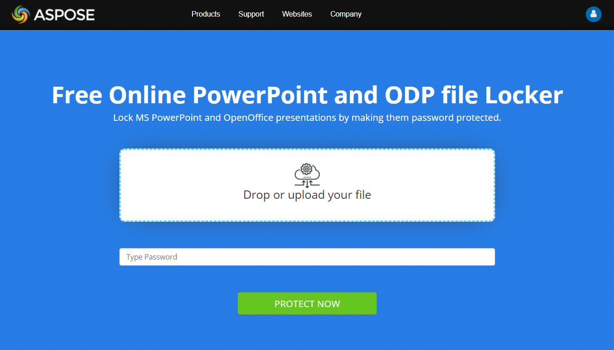

## **Wprowadzenie**

Gdy zabezpieczasz prezentację hasłem, oznacza to, że ustawiasz hasło wymuszające określone ograniczenia na prezentacji. Aby usunąć ograniczenia, należy wprowadzić hasło. Prezentacja zabezpieczona hasłem jest uważana za zablokowaną prezentację.

Zazwyczaj możesz ustawić hasło, aby wymusić te ograniczenia na prezentacji:

- **Modyfikacja**

  Jeśli chcesz, aby tylko wybrani użytkownicy mogli modyfikować Twoją prezentację, możesz ustawić ograniczenie modyfikacji. Ograniczenie to zapobiega osobom modyfikowanie, zmienianie lub kopiowanie elementów w prezentacji (chyba że podadzą hasło).

  Jednak w tym przypadku, nawet bez hasła, użytkownik będzie mógł uzyskać dostęp do dokumentu i otworzyć go. W trybie tylko do odczytu użytkownik może przeglądać zawartość — hiperłącza, animacje, efekty i inne — w prezentacji, ale nie może kopiować elementów ani zapisywać prezentacji.

- **Otwieranie**

  Jeśli chcesz, aby tylko wybrani użytkownicy mogli otworzyć Twoją prezentację, możesz ustawić ograniczenie otwierania. Ograniczenie to zapobiega osobom nawet przeglądanie zawartości prezentacji (chyba że podadzą hasło).

  Technicznie ograniczenie otwierania również zapobiega modyfikacji prezentacji: gdy użytkownicy nie mogą otworzyć prezentacji, nie mogą jej zmodyfikować ani wprowadzać zmian.

  **Uwaga** że gdy zabezpieczasz prezentację hasłem, aby uniemożliwić otwieranie, plik prezentacji zostaje zaszyfrowany.

## **Jak zabezpieczyć prezentację hasłem online**

1. Przejdź do naszej strony [**Aspose.Slides Lock**](https://products.aspose.app/slides/pl/lock).

   

2. Kliknij **Drop or upload your files**.

3. Wybierz plik, który chcesz zabezpieczyć hasłem, na swoim komputerze.

4. Wprowadź preferowane hasło do ochrony edycji; wprowadź preferowane hasło do ochrony podglądu.

5. Jeśli chcesz, aby użytkownicy widzieli Twoją prezentację jako ostateczną kopię, zaznacz pole wyboru **Mark as final**.

6. Kliknij **PROTECT NOW.**

7. Kliknij **DOWNLOAD NOW.**

## **Ochrona hasłem prezentacji w Aspose.Slides**
**Obsługiwane formaty**

Aspose.Slides obsługuje ochronę hasłem, szyfrowanie i podobne operacje dla prezentacji w następujących formatach:

- PPTX i PPT – Microsoft PowerPoint Presentation
- ODP – OpenDocument Presentation
- OTP – OpenDocument Presentation Template

**Obsługiwane operacje**

Aspose.Slides umożliwia użycie ochrony hasłem w prezentacjach w celu zapobiegania modyfikacjom na następujące sposoby:

- Szyfrowanie prezentacji
- Ustawianie ochrony przed zapisem w prezentacji

**Inne operacje**

Aspose.Slides umożliwia wykonywanie innych zadań związanych z ochroną hasłem i szyfrowaniem w następujący sposób:

- Odszyfrowywanie prezentacji; otwieranie zaszyfrowanej prezentacji
- Usuwanie szyfrowania; wyłączanie ochrony hasłem
- Usuwanie ochrony przed zapisem z prezentacji
- Pobieranie właściwości zaszyfrowanej prezentacji
- Sprawdzanie, czy prezentacja jest zaszyfrowana
- Sprawdzanie, czy prezentacja jest zabezpieczona hasłem.

## **Szyfrowanie prezentacji**

Możesz zaszyfrować prezentację, ustawiając hasło. Następnie, aby zmodyfikować zablokowaną prezentację, użytkownik musi podać hasło.

Aby zaszyfrować lub zabezpieczyć prezentację hasłem, musisz użyć metody encrypt (z [ProtectionManager](https://reference.aspose.com/slides/pl/nodejs-java/aspose.slides/ProtectionManager)) aby ustawić hasło dla prezentacji. Przekazujesz hasło do metody encrypt i używasz metody save, aby zapisać teraz zaszyfrowaną prezentację.

Ten przykładowy kod pokazuje, jak zaszyfrować prezentację:

```javascript
var presentation = new aspose.slides.Presentation("pres.pptx");
try {
    presentation.getProtectionManager().encrypt("123123");
    presentation.save("encrypted-pres.pptx", aspose.slides.SaveFormat.Pptx);
} finally {
    if (presentation != null) {
        presentation.dispose();
    }
}
```

## **Ustawianie ochrony przed zapisem w prezentacji**

Możesz dodać znacznik „Do not modify” do prezentacji. W ten sposób informujesz użytkowników, że nie chcesz, aby wprowadzali zmiany w prezentacji.

**Uwaga** że proces ochrony przed zapisem nie szyfruje prezentacji. Dlatego użytkownicy — jeśli naprawdę tego chcą — mogą zmodyfikować prezentację, ale aby zapisać zmiany, będą musieli utworzyć prezentację pod inną nazwą.

Aby ustawić ochronę przed zapisem, musisz użyć metody [setWriteProtection](https://reference.aspose.com/slides/pl/nodejs-java/aspose.slides/ProtectionManager#setWriteProtection-java.lang.String-). Ten przykładowy kod pokazuje, jak ustawić ochronę przed zapisem w prezentacji:

```javascript
var presentation = new aspose.slides.Presentation("pres.pptx");
try {
    presentation.getProtectionManager().setWriteProtection("123123");
    presentation.save("write-protected-pres.pptx", aspose.slides.SaveFormat.Pptx);
} finally {
    if (presentation != null) {
        presentation.dispose();
    }
}
```

## **Odszyfrowywanie prezentacji; otwieranie zaszyfrowanej prezentacji**

Aspose.Slides umożliwia wczytanie zaszyfrowanego pliku, przekazując jego hasło. Aby odszyfrować prezentację, musisz wywołać metodę [removeEncryption](https://reference.aspose.com/slides/pl/nodejs-java/aspose.slides/ProtectionManager#removeEncryption--) bez parametrów. Następnie będziesz musiał podać poprawne hasło, aby wczytać prezentację.

Ten przykładowy kod pokazuje, jak odszyfrować prezentację:

```javascript
var loadOptions = new aspose.slides.LoadOptions();
loadOptions.setPassword("123123");
var presentation = new aspose.slides.Presentation("pres.pptx", loadOptions);
try {
    // pracuj z odszyfrowaną prezentacją
} finally {
    if (presentation != null) {
        presentation.dispose();
    }
}
```

## **Usuwanie szyfrowania; wyłączanie ochrony hasłem**

Możesz usunąć szyfrowanie lub ochronę hasłem w prezentacji. Dzięki temu użytkownicy mogą uzyskać dostęp do prezentacji lub modyfikować ją bez ograniczeń.

Aby usunąć szyfrowanie lub ochronę hasłem, musisz wywołać metodę [removeEncryption](https://reference.aspose.com/slides/pl/nodejs-java/aspose.slides/ProtectionManager#removeEncryption--). Ten przykładowy kod pokazuje, jak usunąć szyfrowanie z prezentacji:

```javascript
var loadOptions = new aspose.slides.LoadOptions();
loadOptions.setPassword("123123");
var presentation = new aspose.slides.Presentation("pres.pptx", loadOptions);
try {
    presentation.getProtectionManager().removeEncryption();
    presentation.save("encryption-removed.pptx", aspose.slides.SaveFormat.Pptx);
} finally {
    if (presentation != null) {
        presentation.dispose();
    }
}
```

## **Usuwanie ochrony przed zapisem z prezentacji**

Możesz użyć Aspose.Slides, aby usunąć ochronę przed zapisem zastosowaną w pliku prezentacji. Dzięki temu użytkownicy mogą modyfikować prezentację dowolnie i nie otrzymują ostrzeżeń przy wykonywaniu takich zadań.

Możesz usunąć ochronę przed zapisem z prezentacji, używając metody [removeWriteProtection](https://reference.aspose.com/slides/pl/nodejs-java/aspose.slides/ProtectionManager#removeWriteProtection--). Ten przykładowy kod pokazuje, jak usunąć ochronę przed zapisem z prezentacji:

```javascript
var presentation = new aspose.slides.Presentation("pres.pptx");
try {
    presentation.getProtectionManager().removeWriteProtection();
    presentation.save("write-protection-removed.pptx", aspose.slides.SaveFormat.Pptx);
} finally {
    if (presentation != null) {
        presentation.dispose();
    }
}
```

## **Pobieranie właściwości zaszyfrowanej prezentacji**

Typowo użytkownicy mają problem z uzyskaniem właściwości dokumentu zaszyfrowanej lub zabezpieczonej hasłem prezentacji. Aspose.Slides oferuje jednak mechanizm, który pozwala zabezpieczyć prezentację hasłem, jednocześnie umożliwiając użytkownikom dostęp do jej właściwości.

**Uwaga** że gdy Aspose.Slides szyfruje prezentację, właściwości dokumentu prezentacji są domyślnie również zabezpieczone hasłem. Jeśli jednak potrzebujesz, aby właściwości prezentacji były dostępne (nawet po zaszyfrowaniu), Aspose.Slides umożliwia dokładnie to.

Jeśli chcesz, aby użytkownicy zachowali możliwość dostępu do właściwości prezentacji, którą zaszyfrowałeś, możesz ustawić właściwość [encryptDocumentProperties](https://reference.aspose.com/slides/pl/nodejs-java/aspose.slides/ProtectionManager#getEncryptDocumentProperties--) na `true`. Ten przykładowy kod pokazuje, jak szyfrować prezentację, jednocześnie umożliwiając dostęp do jej właściwości dokumentu:

```javascript
var presentation = new aspose.slides.Presentation("pres.pptx");
try {
    presentation.getProtectionManager().setEncryptDocumentProperties(true);
    presentation.getProtectionManager().encrypt("123123");
} finally {
    if (presentation != null) {
        presentation.dispose();
    }
}
```

## **Sprawdzanie, czy prezentacja jest zabezpieczona hasłem przed jej wczytaniem**

Zanim wczytasz prezentację, możesz chcieć sprawdzić i potwierdzić, że prezentacja nie została zabezpieczona hasłem. Dzięki temu unikasz błędów i podobnych problemów, które pojawiają się, gdy wczytuje się prezentację zabezpieczoną hasłem bez podania hasła.

Ten kod JavaScript pokazuje, jak zbadać prezentację, aby sprawdzić, czy jest zabezpieczona hasłem (bez wczytywania samej prezentacji):

```javascript
var presentationInfo = aspose.slides.PresentationFactory.getInstance().getPresentationInfo("example.pptx");
console.log("The presentation is password protected: " + presentationInfo.isPasswordProtected());
```

## **Sprawdzanie, czy prezentacja jest zaszyfrowana**

Aspose.Slides umożliwia sprawdzenie, czy prezentacja jest zaszyfrowana. Aby wykonać to zadanie, możesz użyć właściwości [isEncrypted](https://reference.aspose.com/slides/pl/nodejs-java/aspose.slides/ProtectionManager#isEncrypted--), która zwraca `true`, jeśli prezentacja jest zaszyfrowana, lub `false`, jeśli nie jest zaszyfrowana.

Ten przykładowy kod pokazuje, jak sprawdzić, czy prezentacja jest zaszyfrowana:

```javascript
var presentation = new aspose.slides.Presentation("pres.pptx");
try {
    var isEncrypted = presentation.getProtectionManager().isEncrypted();
} finally {
    if (presentation != null) {
        presentation.dispose();
    }
}
```

## **Sprawdzanie, czy prezentacja jest chroniona przed zapisem**

Aspose.Slides umożliwia sprawdzenie, czy prezentacja jest chroniona przed zapisem. Aby wykonać to zadanie, możesz użyć właściwości [isWriteProtected](https://reference.aspose.com/slides/pl/nodejs-java/aspose.slides/ProtectionManager#isWriteProtected--), która zwraca `true`, jeśli prezentacja jest zabezpieczona przed zapisem, lub `false`, jeśli nie jest zabezpieczona.

Ten przykładowy kod pokazuje, jak sprawdzić, czy prezentacja jest chroniona przed zapisem:

```javascript
var presentation = new aspose.slides.Presentation("pres.pptx");
try {
    var isEncrypted = presentation.getProtectionManager().isWriteProtected();
} finally {
    if (presentation != null) {
        presentation.dispose();
    }
}
```

## **Walidacja lub potwierdzenie, że określone hasło zostało użyte do zabezpieczenia prezentacji**

Możesz chcieć sprawdzić i potwierdzić, że określone hasło zostało użyte do zabezpieczenia dokumentu prezentacji. Aspose.Slides udostępnia narzędzia do walidacji hasła.

Ten przykładowy kod pokazuje, jak zwalidować hasło:

```javascript
var presentation = new aspose.slides.Presentation("pres.pptx");
try {
    // sprawdź, czy "pass" jest zgodny
    var isWriteProtected = presentation.getProtectionManager().checkWriteProtection("my_password");
} finally {
    if (presentation != null) {
        presentation.dispose();
    }
}
```

Zwraca on `true`, jeśli prezentacja została zaszyfrowana przy użyciu określonego hasła. W przeciwnym razie zwraca `false`.

{} 
- [Digital Signature in PowerPoint](/slides/pl/net/digital-signature-in-powerpoint/)
{}

## **FAQ**

**Jakie metody szyfrowania są obsługiwane przez Aspose.Slides?**

Aspose.Slides obsługuje nowoczesne metody szyfrowania, w tym algorytmy oparte na AES, zapewniając wysoki poziom bezpieczeństwa danych Twoich prezentacji.

**Co się dzieje, jeśli wprowadzono nieprawidłowe hasło przy próbie otwarcia prezentacji?**

Zostaje wyrzucony wyjątek, informujący, że dostęp do prezentacji został odmówiony. Pomaga to zapobiegać nieautoryzowanemu dostępowi i chroni zawartość prezentacji.

**Czy istnieją jakieś implikacje wydajnościowe przy pracy z prezentacjami zabezpieczonymi hasłem?**

Proces szyfrowania i odszyfrowywania może wprowadzić niewielkie opóźnienie podczas operacji otwierania i zapisywania. W większości przypadków wpływ na wydajność jest minimalny i nie wpływa znacząco na całkowity czas przetwarzania zadań związanych z prezentacją.