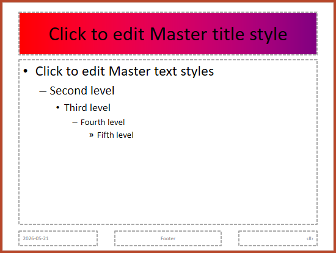

## **Przegląd**

**Slide master** definiuje wspólne ustawienia projektu dla grupy slajdów. Może zawierać wspólne kształty, logotypy, tła, style tekstu, ustawienia motywu oraz stopki. W programie PowerPoint edycja slide mastera jest typowym sposobem zachowania spójności prezentacji bez powtarzania tego samego formatowania na każdym slajdzie.

Aspose.Slides for Node.js via Java obsługuje ten sam model. Prezentacja może zawierać jedną lub więcej master‑slajdów, a każdy master‑slajd może zawierać kilka layout‑slajdów. Zwykłe slajdy zazwyczaj nie odwołują się bezpośrednio do master‑slajdu. Zamiast tego używają layout‑slajdu, który należy do master‑slajdu.

Hierarchia wygląda następująco:

1. **Slide master** – definiuje wspólny projekt i motyw.  
1. **Layout slide** – definiuje konkretne rozmieszczenie placeholderów i formatowanie na poziomie układu.  
1. **Normal slide** – zawiera rzeczywistą treść prezentacji i używa jednego layout‑slajdu.


W Aspose.Slides master‑slajd jest reprezentowany przez klasę [MasterSlide](https://reference.aspose.com/slides/pl/nodejs-java/aspose.slides/masterslide/). Wszystkie master‑slajdy w prezentacji są dostępne przez kolekcję `Presentation.getMasters()`.

{}

Gdy ta sama własność jest zdefiniowana na więcej niż jednym poziomie, wygrywa poziom bardziej szczegółowy. Na przykład, jeśli master‑slajd i layout‑slajd definiują tło, slajdy oparte na tym układzie używają tła z layout‑slajdu. Więcej informacji o layout‑slajdach znajdziesz w artykule [Apply or Change Slide Layouts](/nodejs-java/slide-layout/).

{}

## **Dostęp do master‑slajdów**

W PowerPoint możesz otworzyć widok Slide Master wybierając **View** > **Slide Master**.


W Aspose.Slides użyj kolekcji `getMasters()`, aby uzyskać dostęp do master‑slajdów:

```javascript
var aspose = aspose || {};
aspose.slides = require("aspose.slides.via.java");

let presentation = new aspose.slides.Presentation("presentation.pptx");
try {
    let firstMasterSlide = presentation.getMasters().get_Item(0);
    let masterSlideCount = presentation.getMasters().size();
    let firstMasterLayoutSlideCount = firstMasterSlide.getLayoutSlides().size();

    console.log("Master slides: " + masterSlideCount);
    console.log("Layouts in the first master: " + firstMasterLayoutSlideCount);
} finally {
    presentation.dispose();
}
```

Możesz także pobrać master‑slajd używany przez zwykły slajd poprzez jego layout:

```javascript
var aspose = aspose || {};
aspose.slides = require("aspose.slides.via.java");

let presentation = new aspose.slides.Presentation("presentation.pptx");
try {
    let slide = presentation.getSlides().get_Item(0);
    let layoutSlide = slide.getLayoutSlide();
    let masterSlide = layoutSlide.getMasterSlide();
    let masterSlideName = masterSlide.getName();

    console.log(masterSlideName);
} finally {
    presentation.dispose();
}
```

## **Co zawiera master‑slajd**

Master‑slajd jest obiektem podobnym do slajdu. Dziedziczy wspólne zachowanie slajdu z [BaseSlide](https://reference.aspose.com/slides/pl/nodejs-java/aspose.slides/baseslide/), więc udostępnia wiele takich samych właściwości wykorzystywanych przez zwykłe i layout‑slajdy. Członkowie specyficzni dla master‑slajdu są wymienieni na stronie API [MasterSlide](https://reference.aspose.com/slides/pl/nodejs-java/aspose.slides/masterslide/).

Typowo używane członki master‑slajdu obejmują:

| Członek | Cel |
| --- | --- |
| `getBackground()` | Ustawia tło na poziomie master‑slajdu. |
| `getShapes()` | Przechowuje kształty umieszczone na masterze, takie jak logotypy, ramki obrazów i współdzielony tekst. |
| `getLayoutSlides()` | Przechowuje layout‑slajdy należące do mastera. |
| `getThemeManager()` | Udostępnia dostęp do API motywu mastera. |
| `getHeaderFooterManager()` | Kontroluje nagłówki, stopki, daty i numery slajdów dla mastera i jego layout‑slajdów. |
| `getDependingSlides()` | Zwraca zwykłe slajdy, które zależą od mastera poprzez ich layouty. |

## **Dodanie obrazu do master‑slajdu**

Gdy dodasz obraz do master‑slajdu, pojawi się on na slajdach korzystających z layoutów tego mastera. Jest to przydatne przy logotypach, znakach wodnych, dekoracyjnych pasach i innych powtarzalnych elementach wizualnych.

Poniższy przykład dodaje logo do pierwszego master‑slajdu:

```javascript
var aspose = aspose || {};
aspose.slides = require("aspose.slides.via.java");

let presentation = new aspose.slides.Presentation("presentation.pptx");
try {
    let masterSlide = presentation.getMasters().get_Item(0);
    let logo = aspose.slides.Images.fromFile("logo.png");

    try {
        let logoImage = presentation.getImages().addImage(logo);

        masterSlide.getShapes().addPictureFrame(
            aspose.slides.ShapeType.Rectangle,
            20,
            20,
            80,
            80,
            logoImage);
    } finally {
        logo.dispose();
    }

    presentation.save("presentation-with-logo.pptx", aspose.slides.SaveFormat.Pptx);
} finally {
    presentation.dispose();
}
```

Więcej informacji o ramkach obrazów znajdziesz w artykule [Picture Frame](/nodejs-java/picture-frame/).

## **Praca z placeholderami**

Placeholdery są zazwyczaj definiowane na layout‑slajdach. Master‑slajd zapewnia wspólny styl i motyw, które te layouty dziedziczą, a każdy layout decyduje, które placeholdery są dostępne i gdzie są umieszczone.

W PowerPoint polecenia placeholderów są dostępne w widoku Slide Master.


Aby dodać nowe placeholdery przy użyciu Aspose.Slides, pracuj z layout‑slajdem należącym do mastera:

```javascript
var aspose = aspose || {};
aspose.slides = require("aspose.slides.via.java");
const java = require("java");

let presentation = new aspose.slides.Presentation("presentation.pptx");
try {
    let masterSlide = presentation.getMasters().get_Item(0);
    let blankLayoutType = java.newByte(aspose.slides.SlideLayoutType.Blank);
    let blankLayoutSlide = masterSlide.getLayoutSlides().getByType(blankLayoutType);

    if (blankLayoutSlide === null) {
        blankLayoutSlide = masterSlide.getLayoutSlides().add(blankLayoutType, "Blank");
    }

    blankLayoutSlide.getPlaceholderManager().addTextPlaceholder(60, 120, 600, 80);

    presentation.getSlides().addEmptySlide(blankLayoutSlide);
    presentation.save("presentation-with-placeholder.pptx", aspose.slides.SaveFormat.Pptx);
} finally {
    presentation.dispose();
}
```

Możesz także sformatować istniejące już na master‑slajdzie kształty placeholderów. Poniższy przykład znajduje placeholder tytułu i stosuje liniowy gradient wypełnienia:

```javascript
var aspose = aspose || {};
aspose.slides = require("aspose.slides.via.java");
const java = require("java");

let presentation = new aspose.slides.Presentation("presentation.pptx");
try {
    let masterSlide = presentation.getMasters().get_Item(0);
    let titlePlaceholder = null;
    let masterShapes = masterSlide.getShapes();
    let masterShapeCount = masterShapes.size();

    for (let masterShapeIndex = 0; masterShapeIndex < masterShapeCount; masterShapeIndex++) {
        let shape = masterShapes.get_Item(masterShapeIndex);

        if (java.instanceOf(shape, "com.aspose.slides.AutoShape")) {
            let placeholder = shape.getPlaceholder();

            if (placeholder !== null && placeholder.getType() === aspose.slides.PlaceholderType.Title) {
                titlePlaceholder = shape;
                break;
            }
        }
    }

    if (titlePlaceholder !== null) {
        let gradientFillType = java.newByte(aspose.slides.FillType.Gradient);
        let linearGradientShape = java.newByte(aspose.slides.GradientShape.Linear);
        let redGradientColor = java.newInstanceSync("java.awt.Color", 255, 0, 0);
        let purpleGradientColor = java.newInstanceSync("java.awt.Color", 128, 0, 128);

        titlePlaceholder.getFillFormat().setFillType(gradientFillType);
        titlePlaceholder.getFillFormat().getGradientFormat().setGradientShape(linearGradientShape);
        titlePlaceholder.getFillFormat().getGradientFormat().getGradientStops().add(0.0, redGradientColor);
        titlePlaceholder.getFillFormat().getGradientFormat().getGradientStops().add(1.0, purpleGradientColor);
    }

    presentation.save("presentation-title-style.pptx", aspose.slides.SaveFormat.Pptx);
} finally {
    presentation.dispose();
}
```



Więcej opcji formatowania placeholderów i tekstu znajdziesz w artykułach [Set Prompt Text in Placeholder](/nodejs-java/manage-placeholder/) oraz [Text Formatting](/nodejs-java/text-formatting/).

## **Zmiana tła master‑slajdu**

Tło mastera jest dziedziczone przez layouty i slajdy, które go nie nadpisują. Poniższy przykład ustawia jednolite tło kolorystyczne dla pierwszego master‑slajdu:

```javascript
var aspose = aspose || {};
aspose.slides = require("aspose.slides.via.java");
const java = require("java");

let presentation = new aspose.slides.Presentation("presentation.pptx");
try {
    let masterSlide = presentation.getMasters().get_Item(0);
    let ownBackgroundType = java.newByte(aspose.slides.BackgroundType.OwnBackground);
    let solidFillType = java.newByte(aspose.slides.FillType.Solid);
    let masterBackgroundColor = java.getStaticFieldValue("java.awt.Color", "GREEN");

    masterSlide.getBackground().setType(ownBackgroundType);
    masterSlide.getBackground().getFillFormat().setFillType(solidFillType);
    masterSlide.getBackground().getFillFormat().getSolidFillColor().setColor(masterBackgroundColor);

    presentation.save("presentation-master-background.pptx", aspose.slides.SaveFormat.Pptx);
} finally {
    presentation.dispose();
}
```

Związane tematy: [Presentation Background](/nodejs-java/presentation-background/) oraz [Presentation Theme](/nodejs-java/presentation-theme/).

## **Klonowanie master‑slajdu do innej prezentacji**

Użyj `MasterSlideCollection.addClone`, aby skopiować master‑slajd do innej prezentacji. Skopiowany master może być następnie używany przez layouty i slajdy w prezentacji docelowej.

```javascript
var aspose = aspose || {};
aspose.slides = require("aspose.slides.via.java");

let sourcePresentation = new aspose.slides.Presentation("source.pptx");
let destinationPresentation = new aspose.slides.Presentation("destination.pptx");
try {
    let sourceMasterSlide = sourcePresentation.getMasters().get_Item(0);
    let clonedMasterSlide = destinationPresentation.getMasters().addClone(sourceMasterSlide);

    destinationPresentation.save("destination-with-master.pptx", aspose.slides.SaveFormat.Pptx);
} finally {
    sourcePresentation.dispose();
    destinationPresentation.dispose();
}
```

Jeśli potrzebujesz sklonować zwykłe slajdy wraz z ich masterem, zobacz [Clone Slides](/nodejs-java/clone-slides/).

## **Dodawanie wielu master‑slajdów**

Prezentacja może zawierać wiele master‑slajdów. Jest to przydatne, gdy różne sekcje wymagają odmiennych elementów graficznych, struktury stron lub ustawień motywu.


Poniższy przykład klonuje domyślny master, nadaje klonowi inne tło, tworzy layout pod tym sklonowanym masterem i dodaje nowy slajd oparty na tym layoutcie:

```javascript
var aspose = aspose || {};
aspose.slides = require("aspose.slides.via.java");
const java = require("java");

let presentation = new aspose.slides.Presentation("presentation.pptx");
try {
    let defaultMasterSlide = presentation.getMasters().get_Item(0);
    let sectionMasterSlide = presentation.getMasters().addClone(defaultMasterSlide);
    let ownBackgroundType = java.newByte(aspose.slides.BackgroundType.OwnBackground);
    let solidFillType = java.newByte(aspose.slides.FillType.Solid);
    let sectionMasterBackgroundColor = java.getStaticFieldValue("java.awt.Color", "LIGHT_GRAY");

    sectionMasterSlide.getBackground().setType(ownBackgroundType);
    sectionMasterSlide.getBackground().getFillFormat().setFillType(solidFillType);
    sectionMasterSlide.getBackground().getFillFormat().getSolidFillColor().setColor(sectionMasterBackgroundColor);

    let blankLayoutType = java.newByte(aspose.slides.SlideLayoutType.Blank);
    let sourceBlankLayout = defaultMasterSlide.getLayoutSlides().getByType(blankLayoutType);
    if (sourceBlankLayout === null) {
        sourceBlankLayout = defaultMasterSlide.getLayoutSlides().get_Item(0);
    }

    let sectionBlankLayout = sectionMasterSlide.getLayoutSlides().addClone(sourceBlankLayout);

    presentation.getSlides().addEmptySlide(sectionBlankLayout);
    presentation.save("presentation-with-multiple-masters.pptx", aspose.slides.SaveFormat.Pptx);
} finally {
    presentation.dispose();
}
```

## **Porównywanie master‑slajdów**

Master‑slajdy można porównać metodą `equals` odziedziczoną po [BaseSlide](https://reference.aspose.com/slides/pl/nodejs-java/aspose.slides/baseslide/). Porównanie sprawdza strukturę i statyczną zawartość, taką jak kształty, tekst, formatowanie, animacje i inne ustawienia slajdu. Nie porównuje unikalnych identyfikatorów, takich jak ID slajdu, ani dynamicznych wartości placeholderów, np. bieżącej daty.

```javascript
var aspose = aspose || {};
aspose.slides = require("aspose.slides.via.java");

let firstPresentation = new aspose.slides.Presentation("first.pptx");
let secondPresentation = new aspose.slides.Presentation("second.pptx");
try {
    let firstPresentationMasterCount = firstPresentation.getMasters().size();
    let secondPresentationMasterCount = secondPresentation.getMasters().size();

    for (let firstMasterIndex = 0; firstMasterIndex < firstPresentationMasterCount; firstMasterIndex++) {
        for (let secondMasterIndex = 0; secondMasterIndex < secondPresentationMasterCount; secondMasterIndex++) {
            let firstMasterSlide = firstPresentation.getMasters().get_Item(firstMasterIndex);
            let secondMasterSlide = secondPresentation.getMasters().get_Item(secondMasterIndex);
            let areMasterSlidesEqual = firstMasterSlide.equals(secondMasterSlide);

            if (areMasterSlidesEqual) {
                console.log(
                    "first.pptx master #" + firstMasterIndex +
                    " equals second.pptx master #" + secondMasterIndex);
            }
        }
    }
} finally {
    firstPresentation.dispose();
    secondPresentation.dispose();
}
```

Więcej informacji znajdziesz w artykule [Compare Presentation Slides](/slides/pl/nodejs-java/compare-slides/).

## **Ustawienie widoku Slide Master jako domyślnego widoku**

Użyj metody `setLastView` na [ViewProperties](https://reference.aspose.com/slides/pl/nodejs-java/aspose.slides/viewproperties/), aby kontrolować widok, który PowerPoint otwiera jako pierwszy. Poniższy przykład otwiera prezentację w widoku Slide Master:

```javascript
var aspose = aspose || {};
aspose.slides = require("aspose.slides.via.java");
const java = require("java");

let presentation = new aspose.slides.Presentation("presentation.pptx");
try {
    let slideMasterViewType = java.newByte(aspose.slides.ViewType.SlideMasterView);

    presentation.getViewProperties().setLastView(slideMasterViewType);
    presentation.save("presentation-master-view.pptx", aspose.slides.SaveFormat.Pptx);
} finally {
    presentation.dispose();
}
```

Więcej ustawień widoku znajdziesz w artykule [Save Presentation](/slides/pl/nodejs-java/save-presentation/).

## **Usuwanie nieużywanych master‑slajdów**

Czasami prezentacje zawierają master‑slajdy, które nie są już używane przez żadne zwykłe slajdy. Usunięcie nieużywanych masterów może zmniejszyć rozmiar pliku i uprościć utrzymanie szablonu.

Użyj `removeUnused`, aby usunąć nieużywane mastery z kolekcji `getMasters()`:

```javascript
var aspose = aspose || {};
aspose.slides = require("aspose.slides.via.java");

let presentation = new aspose.slides.Presentation("presentation.pptx");
try {
    presentation.getMasters().removeUnused(true);
    presentation.save("presentation-clean.pptx", aspose.slides.SaveFormat.Pptx);
} finally {
    presentation.dispose();
}
```

Możesz także skorzystać z metody low‑code `Compress.removeUnusedMasterSlides`:

```javascript
var aspose = aspose || {};
aspose.slides = require("aspose.slides.via.java");

let presentation = new aspose.slides.Presentation("presentation.pptx");
try {
    aspose.slides.Compress.removeUnusedMasterSlides(presentation);
    presentation.save("presentation-clean.pptx", aspose.slides.SaveFormat.Pptx);
} finally {
    presentation.dispose();
}
```

## **FAQ**

### Jaka jest różnica między slide masterem a layout‑slajdem?

Slide master definiuje wspólne ustawienia projektu, takie jak motyw, tło, wspólne kształty i style tekstu. Layout‑slajd należy do master‑slajdu i definiuje konkretne rozmieszczenie placeholderów. Zwykły slajd używa layout‑slajdu, więc dziedziczy zarówno z layoutu, jak i z mastera.

### Czy jedna prezentacja może zawierać kilka slide masterów?

Tak. Prezentacja może mieć kilka master‑slajdów. Używaj wielu masterów, gdy różne sekcje wymagają odmiennych systemów wizualnych lub brandingu.

### Czy powinienem dodawać placeholdery do master‑slajdu czy do layout‑slajdu?

W większości przypadków dodawaj placeholdery do layout‑slajdów. Umieść wspólne elementy wizualne i wspólne formatowanie na master‑slajdzie, a placeholdery treści na layoutach, które będą używane przez zwykłe slajdy.

### Czy mogę usunąć master‑slajd, który jest nadal używany?

Nie. Master‑slajd posiadający zależne slajdy nie może być bezpiecznie usunięty bezpośrednio. Najpierw przenieś te slajdy do layoutów pod innym masterem lub użyj metody czyszczenia nieużywanych masterów, która usuwa tylko te, które nie są w użyciu.