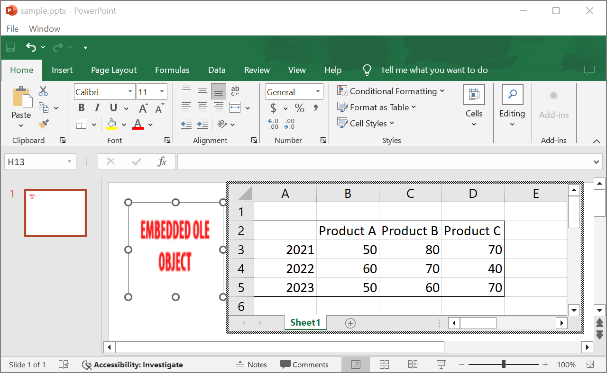

## **Wprowadzenie**

Używając Aspose.Slides for PHP via Java, gdy dodasz [OleObjectFrame](https://reference.aspose.com/slides/pl/php-java/aspose.slides/oleobjectframe/) do slajdu, na wyjściowym slajdzie wyświetlany jest komunikat „EMBEDDED OLE OBJECT”. Ten komunikat jest zamierzony i NIE jest błędem.

Aby uzyskać więcej informacji o pracy z obiektami OLE, zobacz [Zarządzanie OLE](/slides/pl/php-java/manage-ole/). 

## **Wyjaśnienie i rozwiązanie**

Aspose.Slides wyświetla komunikat „EMBEDDED OLE OBJECT”, aby powiadomić, że obiekt OLE został zmieniony i obraz podglądu musi zostać zaktualizowany. 

Na przykład, jeśli dodasz wykres Microsoft Excel jako [OleObjectFrame](https://reference.aspose.com/slides/pl/php-java/aspose.slides/oleobjectframe/) do slajdu (więcej szczegółów znajdziesz w artykule „Zarządzanie OLE”) i otworzysz prezentację w Microsoft PowerPoint, zobaczysz ten obraz na slajdzie:


Jeśli chcesz sprawdzić i potwierdzić, że obiekt OLE został dodany do slajdu, musisz dwukrotnie kliknąć komunikat „EMBEDDED OLE OBJECT” lub kliknąć prawym przyciskiem myszy i wybrać opcję **Object > Edit**.


PowerPoint otwiera następnie osadzony obiekt OLE.



Slajd może nadal wyświetlać komunikat „EMBEDDED OLE OBJECT”. Po kliknięciu obiektu OLE podgląd slajdu zostanie zaktualizowany, a komunikat „EMBEDDED OLE OBJECT” zostanie zastąpiony rzeczywistym obrazem obiektu OLE. 


Teraz możesz zapisać prezentację, aby upewnić się, że obraz obiektu OLE zostanie poprawnie zaktualizowany. Dzięki temu po zapisaniu i ponownym otwarciu prezentacji nie zobaczysz komunikatu „EMBEDDED OLE OBJECT”. 

## **Inne rozwiązania**

### **Rozwiązanie 1: Zastąp komunikat „EMBEDDED OLE OBJECT” obrazem**

Jeśli nie chcesz usuwać komunikatu „EMBEDDED OLE OBJECT” otwierając prezentację w PowerPoint i zapisując ją, możesz zastąpić ten komunikat własnym obrazem podglądu. Poniższe wiersze kodu demonstrują ten proces:

```php
$presentation = new Presentation("embeddedOLE.pptx");
try {
    $slide = $presentation->getSlides()->get_Item(0);
    $oleFrame = $slide->getShapes()->get_Item(0);

    // Dodaj obraz do zasobów prezentacji.
    $image = Images::fromFile("myImage.png");
    $oleImage = $presentation->getImages()->addImage($image);
    $image->dispose();

    // Ustaw tytuł i obraz podglądu obiektu OLE.
    $oleFrame->setSubstitutePictureTitle("My title");
    $oleFrame->getSubstitutePictureFormat()->getPicture()->setImage($oleImage);
    $oleFrame->setObjectIcon(false);

    $presentation->save("embeddedOLE-newImage.pptx", SaveFormat::Pptx);
} finally {
    if (!java_is_null($presentation)) {
        $presentation->dispose();
    }
}
```

Slajd zawierający `OleObjectFrame` zmieni się na następujący:


### **Rozwiązanie 2: Utwórz dodatek dla PowerPoint**

Możesz również stworzyć dodatek dla Microsoft PowerPoint, który aktualizuje wszystkie obiekty OLE podczas otwierania prezentacji w programie.