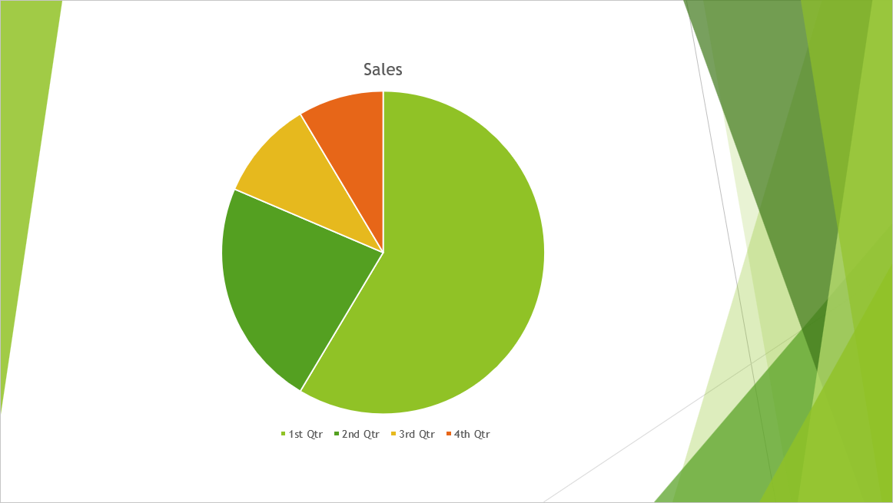

## **Wprowadzenie**

TIFF (**Tagged Image File Format**) jest powszechnie używanym, bezstratnym formatem obrazu rastrowego, znanym z wyjątkowej jakości i szczegółowego zachowania grafiki. Projektanci, fotografowie i wydawcy komputerowi często wybierają TIFF, aby zachować warstwy, dokładność kolorów i pierwotne ustawienia w swoich obrazach.

Korzystając z Aspose.Slides, możesz bez wysiłku konwertować swoje slajdy PowerPoint (PPT, PPTX) oraz slajdy OpenDocument (ODP) bezpośrednio na obrazy TIFF wysokiej jakości, zapewniając, że prezentacje zachowają maksymalną wierność wizualną. 

## **Konwertowanie prezentacji na TIFF**

Korzystając z metody [save](https://reference.aspose.com/slides/pl/php-java/aspose.slides/presentation/#save) udostępnionej przez klasę [Presentation](https://reference.aspose.com/slides/pl/php-java/aspose.slides/presentation/), możesz szybko przekonwertować całą prezentację PowerPoint na TIFF. Powstałe obrazy TIFF odpowiadają domyślnemu rozmiarowi slajdu.

Ten kod demonstruje, jak przekonwertować prezentację PowerPoint na TIFF:

```php
// Utwórz instancję klasy Presentation, która reprezentuje plik prezentacji (PPT, PPTX, ODP, itp.).
$presentation = new Presentation("presentation.pptx");
try {
    // Zapisz prezentację jako TIFF.
    $presentation->save("output.tiff", SaveFormat::Tiff);
} finally {
    $presentation->dispose();
}
```

## **Konwertowanie prezentacji na czarno‑biały TIFF**

Metoda [setBwConversionMode](https://reference.aspose.com/slides/pl/php-java/aspose.slides/tiffoptions/#setBwConversionMode) w klasie [TiffOptions](https://reference.aspose.com/slides/pl/php-java/aspose.slides/tiffoptions/) umożliwia określenie algorytmu używanego przy konwersji kolorowego slajdu lub obrazu na czarno‑biały TIFF. Należy zauważyć, że to ustawienie ma zastosowanie tylko wtedy, gdy metoda [setCompressionType](https://reference.aspose.com/slides/pl/php-java/aspose.slides/tiffoptions/#getCompressionType) jest ustawiona na `CCITT4` lub `CCITT3`.

Załóżmy, że mamy plik „sample.pptx” z następującym slajdem:



Ten kod demonstruje, jak przekonwertować kolorowy slajd na czarno‑biały TIFF:

```php
$tiffOptions = new TiffOptions();
$tiffOptions->setCompressionType(TiffCompressionTypes::CCITT4);
$tiffOptions->setBwConversionMode(BlackWhiteConversionMode::Dithering);

$presentation = new Presentation("sample.pptx");
try {
    $presentation->save("output.tiff", SaveFormat::Tiff, $tiffOptions);
} finally {
    $presentation->dispose();
}
```

Wynik:


## **Konwertowanie prezentacji na TIFF o niestandardowym rozmiarze**

Jeśli potrzebujesz obrazu TIFF o określonych wymiarach, możesz ustawić żądane wartości przy użyciu metod dostępnych w [TiffOptions](https://reference.aspose.com/slides/pl/php-java/aspose.slides/tiffoptions/). Na przykład metoda [setImageSize](https://reference.aspose.com/slides/pl/php-java/aspose.slides/tiffoptions/#getImageSize) umożliwia zdefiniowanie rozmiaru powstałego obrazu.

Ten kod demonstruje, jak przekonwertować prezentację PowerPoint na obrazy TIFF o niestandardowym rozmiarze:

```php
// Utwórz instancję klasy Presentation, która reprezentuje plik prezentacji (PPT, PPTX, ODP, itp.).
$presentation = new Presentation("presentation.pptx");
try {
    $tiffOptions = new TiffOptions();

    // Ustaw typ kompresji.
    $tiffOptions->setCompressionType(TiffCompressionTypes::Default);
    /*
    Typy kompresji:
        Default - Określa domyślny schemat kompresji (LZW).
        None - Określa brak kompresji.
        CCITT3
        CCITT4
        LZW
        RLE
    */

    // Głębokość zależy od typu kompresji i nie może być ustawiona ręcznie.

    // Ustaw DPI obrazu.
    $tiffOptions->setDpiX(200);
    $tiffOptions->setDpiY(200);

    // Ustaw rozmiar obrazu.
    $tiffOptions->setImageSize(new Java("java.awt.Dimension", 1728, 1078));

    $notesOptions = new NotesCommentsLayoutingOptions();
    $notesOptions->setNotesPosition(NotesPositions::BottomFull);
    $tiffOptions->setSlidesLayoutOptions($notesOptions);

    // Zapisz prezentację jako TIFF z określonym rozmiarem.
    $presentation->save("tiff-ImageSize.tiff", SaveFormat::Tiff, $tiffOptions);
} finally {
    $presentation->dispose();
}
```

## **Konwertowanie prezentacji na TIFF z niestandardowym formatem pikseli obrazu**

Korzystając z metody [setPixelFormat](https://reference.aspose.com/slides/pl/php-java/aspose.slides/tiffoptions/#getPixelFormat) klasy [TiffOptions](https://reference.aspose.com/slides/pl/php-java/aspose.slides/tiffoptions/), możesz określić preferowany format pikseli dla powstałego obrazu TIFF.

Ten kod demonstruje, jak przekonwertować prezentację PowerPoint na obraz TIFF z niestandardowym formatem pikseli:

```php
// Utwórz instancję klasy Presentation, która reprezentuje plik prezentacji (PPT, PPTX, ODP, itp.).
$presentation = new Presentation("presentation.pptx");
try {
    $tiffOptions = new TiffOptions();

    $tiffOptions->setPixelFormat(ImagePixelFormat::Format8bppIndexed);
    /*
    ImagePixelFormat zawiera następujące wartości (zgodnie z dokumentacją):
        Format1bppIndexed - 1 bit na piksel, indeksowany.
        Format4bppIndexed - 4 bity na piksel, indeksowany.
        Format8bppIndexed - 8 bitów na piksel, indeksowany.
        Format24bppRgb    - 24 bity na piksel, RGB.
        Format32bppArgb   - 32 bity na piksel, ARGB.
    */

    // Zapisz prezentację jako TIFF z określonym rozmiarem obrazu.
    $presentation->save("Tiff-PixelFormat.tiff", SaveFormat::Tiff, $tiffOptions);
} finally {
    $presentation->dispose();
}
```

{}
Sprawdź [DARMOWY konwerter PowerPoint na plakat](https://products.aspose.app/slides/pl/conversion/convert-ppt-to-poster-online).
{}

## **FAQ**

**Czy mogę konwertować pojedynczy slajd zamiast całej prezentacji PowerPoint na TIFF?**

Tak. Aspose.Slides umożliwia konwertowanie pojedynczych slajdów z prezentacji PowerPoint i OpenDocument na obrazy TIFF osobno.

**Czy istnieje limit liczby slajdów przy konwertowaniu prezentacji na TIFF?**

Nie, Aspose.Slides nie nakłada żadnych ograniczeń na liczbę slajdów. Możesz konwertować prezentacje dowolnego rozmiaru do formatu TIFF.

**Czy animacje i efekty przejść PowerPoint są zachowywane przy konwertowaniu slajdów do TIFF?**

Nie, TIFF jest statycznym formatem obrazu. Dlatego animacje i efekty przejść nie są zachowywane; eksportowane są jedynie statyczne migawki slajdów.