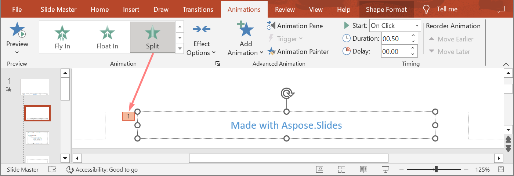

## **Wstęp**

Animacje są efektami wizualnymi, które można zastosować do tekstów, obrazów, kształtów lub [wykresów](https://docs.aspose.com/slides/pl/php-java/animated-charts/). Nadają życie prezentacjom lub ich elementom.

## **Dlaczego używać animacji w prezentacjach?**

* kontrolować przepływ informacji
* podkreślać ważne punkty
* zwiększać zainteresowanie lub uczestnictwo odbiorców
* ułatwiać czytanie lub przyswajanie treści
* przyciągać uwagę czytelników lub widzów do ważnych części w prezentacji

PowerPoint oferuje wiele opcji i narzędzi do animacji oraz efektów animacji w kategoriach **wejścia**, **wyjścia**, **podkreślenia** i **ścieżek ruchu**.

## **Animacje w Aspose.Slides**

* Aspose.Slides udostępnia klasy i typy potrzebne do pracy z animacjami w przestrzeni nazw `Aspose.Slides.Animation`,
* Aspose.Slides oferuje ponad **150 efektów animacji** w wyliczeniu [EffectType](https://reference.aspose.com/slides/pl/php-java/aspose.slides/effecttype). Efekty te są zasadniczo takie same (lub równoważne) jak te używane w programie PowerPoint.

## **Zastosuj animację do pola tekstowego**

Aspose.Slides for PHP via Java umożliwia zastosowanie animacji do tekstu w kształcie.

1. Utwórz instancję klasy [Presentation](https://reference.aspose.com/slides/pl/php-java/aspose.slides/Presentation).
2. Uzyskaj referencję do slajdu za pomocą jego indeksu.
3. Dodaj prostokątną [AutoShape](https://reference.aspose.com/slides/pl/php-java/aspose.slides/autoshape/).
4. Dodaj tekst do [TextFrame](https://reference.aspose.com/slides/pl/php-java/aspose.slides/autoshape/#getTextFrame) `AutoShape`a.
5. Pobierz główną sekwencję efektów.
6. Dodaj efekt animacji do [AutoShape](https://reference.aspose.com/slides/pl/php-java/aspose.slides/autoshape/).
7. Użyj metody `TextAnimation.setBuildType` oraz wartości z wyliczenia `BuildType`.
8. Zapisz prezentację na dysku jako plik PPTX.

Ten kod PHP pokazuje, jak zastosować efekt `Fade` do AutoShape oraz ustawić animację tekstu na wartość *By 1st Level Paragraphs*:

```php
  # Tworzy instancję klasy prezentacji, która reprezentuje plik prezentacji.
  $pres = new Presentation();
  try {
    $sld = $pres->getSlides()->get_Item(0);
    # Dodaje nową AutoShape z tekstem
    $autoShape = $sld->getShapes()->addAutoShape(ShapeType::Rectangle, 20, 20, 150, 100);
    $textFrame = $autoShape->getTextFrame();
    $textFrame->setText("First paragraph \nSecond paragraph \n Third paragraph");
    # Pobiera główną sekwencję slajdu.
    $sequence = $sld->getTimeline()->getMainSequence();
    # Dodaje efekt animacji Fade do kształtu
    $effect = $sequence->addEffect($autoShape, EffectType::Fade, EffectSubType::None, EffectTriggerType::OnClick);
    # Animuje tekst kształtu według paragrafów pierwszego poziomu
    $effect->getTextAnimation()->setBuildType(BuildType::ByLevelParagraphs1);
    # Zapisuje plik PPTX na dysku
    $pres->save($path . "AnimText_out.pptx", SaveFormat::Pptx);
  } finally {
    if (!java_is_null($pres)) {
      $pres->dispose();
    }
  }
```

{} 
Oprócz stosowania animacji do tekstu, możesz także zastosować animacje do pojedynczego [Paragraph](https://reference.aspose.com/slides/pl/php-java/aspose.slides/paragraph/). Zobacz [**Animowany tekst**](/slides/pl/php-java/animated-text/).
{} 

## **Zastosuj animację do PictureFrame**

1. Utwórz instancję klasy [Presentation](https://reference.aspose.com/slides/pl/php-java/aspose.slides/Presentation).
2. Uzyskaj referencję do slajdu za pomocą jego indeksu.
3. Dodaj lub pobierz [PictureFrame](https://reference.aspose.com/slides/pl/php-java/aspose.slides/pictureframe) na slajdzie.
4. Pobierz główną sekwencję efektów.
5. Dodaj efekt animacji do [PictureFrame](https://reference.aspose.com/slides/pl/php-java/aspose.slides/pictureframe).
6. Zapisz prezentację na dysku jako plik PPTX.

```php
  # Tworzy instancję klasy prezentacji, która reprezentuje plik prezentacji.
  $pres = new Presentation();
  try {
    # Ładuje obraz, który ma zostać dodany do kolekcji obrazów prezentacji.
    $picture;
    $image = Images->fromFile("aspose-logo.jpg");
    try {
      $picture = $pres->getImages()->addImage($image);
    } finally {
      if (!java_is_null($image)) {
        $image->dispose();
      }
    }
    # Dodaje ramkę obrazu do slajdu.
    $picFrame = $pres->getSlides()->get_Item(0)->getShapes()->addPictureFrame(ShapeType::Rectangle, 50, 50, 100, 100, $picture);
    # Pobiera główną sekwencję slajdu.
    $sequence = $pres->getSlides()->get_Item(0)->getTimeline()->getMainSequence();
    # Dodaje efekt animacji Fly z lewej strony do ramki obrazu.
    $effect = $sequence->addEffect($picFrame, EffectType::Fly, EffectSubType::Left, EffectTriggerType::OnClick);
    # Zapisuje plik PPTX na dysku.
    $pres->save($path . "AnimImage_out.pptx", SaveFormat::Pptx);
  } catch (JavaException $e) {
  } finally {
    if (!java_is_null($pres)) {
      $pres->dispose();
    }
  }
```

## **Zastosuj animację do kształtu**

1. Utwórz instancję klasy [Presentation](https://reference.aspose.com/slides/pl/php-java/aspose.slides/Presentation).
2. Uzyskaj referencję do slajdu za pomocą jego indeksu.
3. Dodaj prostokątną [AutoShape](https://reference.aspose.com/slides/pl/php-java/aspose.slides/autoshape/).
4. Dodaj kształt ukośny [AutoShape](https://reference.aspose.com/slides/pl/php-java/aspose.slides/autoshape/), który po kliknięciu uruchamia animację.
5. Stwórz sekwencję efektów na kształcie ukośnym.
6. Stwórz niestandardowy `UserPath`.
7. Dodaj polecenia przemieszczania do `UserPath`.
8. Zapisz prezentację na dysku jako plik PPTX.

```php
  # Tworzy instancję klasy Presentation, która reprezentuje plik PPTX.
  $pres = new Presentation();
  try {
    $sld = $pres->getSlides()->get_Item(0);
    # Tworzy efekt PathFootball dla istniejącego kształtu od podstaw.
    $ashp = $sld->getShapes()->addAutoShape(ShapeType::Rectangle, 150, 150, 250, 25);
    $ashp->addTextFrame("Animated TextBox");
    # Dodaje efekt animacji PathFootball
    $pres->getSlides()->get_Item(0)->getTimeline()->getMainSequence()->addEffect($ashp, EffectType::PathFootball, EffectSubType::None, EffectTriggerType::AfterPrevious);
    # Tworzy pewnego rodzaju "przycisk".
    $shapeTrigger = $pres->getSlides()->get_Item(0)->getShapes()->addAutoShape(ShapeType::Bevel, 10, 10, 20, 20);
    # Tworzy sekwencję efektów dla tego przycisku.
    $seqInter = $pres->getSlides()->get_Item(0)->getTimeline()->getInteractiveSequences()->add($shapeTrigger);
    # Tworzy niestandardową ścieżkę użytkownika. Nasz obiekt będzie przemieszczany dopiero po kliknięciu przycisku.
    $fxUserPath = $seqInter->addEffect($ashp, EffectType::PathUser, EffectSubType::None, EffectTriggerType::OnClick);
    # Dodaje polecenia ruchu, ponieważ utworzona ścieżka jest pusta.
    $motionBhv = $fxUserPath->getBehaviors()->get_Item(0);
    $pts = new Point2DFloat[1];
    $pts[0] = new Point2DFloat(0.076, 0.59);
    $motionBhv->getPath()->add(MotionCommandPathType::LineTo, $pts, MotionPathPointsType::Auto, true);
    $pts[0] = new Point2DFloat(-0.076, -0.59);
    $motionBhv->getPath()->add(MotionCommandPathType::LineTo, $pts, MotionPathPointsType::Auto, false);
    $motionBhv->getPath()->add(MotionCommandPathType::End, null, MotionPathPointsType::Auto, false);
    # Zapisuje plik PPTX na dysku
    $pres->save("AnimExample_out.pptx", SaveFormat::Pptx);
  } finally {
    if (!java_is_null($pres)) {
      $pres->dispose();
    }
  }
```

## **Pobierz efekty animacji zastosowane do kształtu**

Poniższe przykłady pokazują, jak użyć metody `getEffectsByShape` z klasy [Sequence](https://reference.aspose.com/slides/pl/php-java/aspose.slides/sequence/) aby uzyskać wszystkie efekty animacji zastosowane do kształtu.

**Przykład 1: Pobierz efekty animacji zastosowane do kształtu na normalnym slajdzie**

Poprzednio nauczyłeś się, jak dodawać efekty animacji do kształtów w prezentacjach PowerPoint. Poniższy przykładowy kod pokazuje, jak uzyskać efekty zastosowane do pierwszego kształtu na pierwszym normalnym slajdzie w prezentacji `AnimExample_out.pptx`.

```php
  $Array = new java_class("java.lang.reflect.Array");
  $presentation = new Presentation("AnimExample_out.pptx");

  try {
    $firstSlide = $presentation->getSlides()->get_Item(0);

    # Pobiera główną sekwencję animacji slajdu.
    $sequence = $firstSlide->getTimeline()->getMainSequence();

    # Pobiera pierwszy kształt na pierwszym slajdzie.
    $shape = $firstSlide->getShapes()->get_Item(0);

    # Pobiera efekty animacji zastosowane do kształtu.
    $shapeEffects = $sequence->getEffectsByShape($shape);

    if (java_values($Array->getLength($shapeEffects)) > 0) {
      echo("The shape " . $shape->getName() . " has " . $Array->getLength($shapeEffects) . " animation effects.");
    }
  } finally {
    if (!java_is_null($presentation)) {
      $presentation->dispose();
    }
  }
```

**Przykład 2: Pobierz wszystkie efekty animacji, w tym dziedziczone z pól zastępczych**

Jeśli kształt na normalnym slajdzie ma pola zastępcze znajdujące się na slajdzie układu i/lub slajdzie głównym, a do tych pól zostały dodane efekty animacji, to wszystkie efekty kształtu będą odtwarzane podczas pokazu slajdów, w tym dziedziczone z pól zastępczych.

Załóżmy, że mamy plik prezentacji PowerPoint `sample.pptx` z jednym slajdem zawierającym jedynie kształt stopki z tekstem "Made with Aspose.Slides" oraz zastosowanym efektem **Random Bars**.


Załóżmy również, że efekt **Split** został zastosowany do pola zastępczego stopki na slajdzie **layout**.



I w końcu, efekt **Fly In** został zastosowany do pola zastępczego stopki na slajdzie **master**.


Poniższy przykładowy kod pokazuje, jak użyć metody `getBasePlaceholder` z klasy [Shape](https://reference.aspose.com/slides/pl/php-java/aspose.slides/shape/) aby uzyskać dostęp do pól zastępczych kształtu i pobrać efekty animacji zastosowane do kształtu stopki, w tym dziedziczone z pól znajdujących się na slajdach layout i master.

```php
$presentation = new Presentation("sample.pptx");

$slide = $presentation->getSlides()->get_Item(0);

// Pobierz efekty animacji kształtu na normalnym slajdzie.
$shape = $slide->getShapes()->get_Item(0);
$shapeEffects = $slide->getTimeline()->getMainSequence()->getEffectsByShape($shape);

// Pobierz efekty animacji pola zastępczego na slajdzie układu.
$layoutShape = $shape->getBasePlaceholder();
$layoutShapeEffects = $slide->getLayoutSlide()->getTimeline()->getMainSequence()->getEffectsByShape($layoutShape);

// Pobierz efekty animacji pola zastępczego na slajdzie głównym.
$masterShape = $layoutShape->getBasePlaceholder();
$masterShapeEffects = $slide->getLayoutSlide()->getMasterSlide()->getTimeline()->getMainSequence()->getEffectsByShape($masterShape);

echo "Main sequence of shape effects:" . PHP_EOL;
printEffects($masterShapeEffects);
printEffects($layoutShapeEffects);
printEffects($shapeEffects);

$presentation->dispose();
```
```php
function printEffects($effects) {
    foreach ($effects as $effect) {
        echo "Type: " . $effect->getType() . ", subtype: " . $effect->getSubtype() . PHP_EOL;
    }
}
```

```text
Main sequence of shape effects:
Type: 47, subtype: 2              // Lot, dół
Type: 134, subtype: 45            // Rozdzielenie, pionowo
Type: 126, subtype: 22            // Losowe paski, poziome
```

## **Zmień metody synchronizacji efektu animacji**

Aspose.Slides for PHP via Java pozwala na zmianę właściwości Timing efektu animacji.

To jest panel Synchronizacji animacji w Microsoft PowerPoint:


Oto powiązania pomiędzy Synchronizacją w PowerPoint a właściwościami [Effect Timing](https://reference.aspose.com/slides/pl/php-java/aspose.slides/effect/#getTiming) :

- Lista rozwijana **Start** w PowerPoint Timing odpowiada metodzie [Timing::getTriggerType](https://reference.aspose.com/slides/pl/php-java/aspose.slides/timing/#getTriggerType).
- **Duration** w PowerPoint Timing odpowiada metodzie [Timing::getDuration](https://reference.aspose.com/slides/pl/php-java/aspose.slides/timing/#getDuration). Czas trwania animacji (w sekundach) to całkowity czas potrzebny na zakończenie jednego cyklu animacji.
- **Delay** w PowerPoint Timing odpowiada metodzie [Timing::getTriggerDelayTime](https://reference.aspose.com/slides/pl/php-java/aspose.slides/timing/#getTriggerDelayTime).

Tak zmieniasz właściwości Synchronizacji efektu:

1. [Zastosuj](#apply-animation-to-shape) lub pobierz efekt animacji.
2. Ustaw nowe potrzebne wartości przy użyciu metody [Effect::getTiming](https://reference.aspose.com/slides/pl/php-java/aspose.slides/effect/#getTiming).
3. Zapisz zmodyfikowany plik PPTX.

```php
  # Tworzy instancję klasy prezentacji, która reprezentuje plik prezentacji.
  $pres = new Presentation("AnimExample_out.pptx");
  try {
    # Pobiera główną sekwencję slajdu.
    $sequence = $pres->getSlides()->get_Item(0)->getTimeline()->getMainSequence();
    # Pobiera pierwszy efekt głównej sekwencji.
    $effect = $sequence->get_Item(0);
    # Zmienia TriggerType efektu na rozpoczęcie po kliknięciu
    $effect->getTiming()->setTriggerType(EffectTriggerType::OnClick);
    # Zmienia Duration efektu
    $effect->getTiming()->setDuration(3.0);
    # Zmienia TriggerDelayTime efektu
    $effect->getTiming()->setTriggerDelayTime(0.5);
    # Zapisuje plik PPTX na dysku
    $pres->save("AnimExample_changed.pptx", SaveFormat::Pptx);
  } finally {
    if (!java_is_null($pres)) {
      $pres->dispose();
    }
  }
```

## **Dźwięk efektu animacji**

Aspose.Slides udostępnia następujące metody umożliwiające pracę z dźwiękami w efektach animacji: 

- [setSound(IAudio value)](https://reference.aspose.com/slides/pl/php-java/aspose.slides/effect/#setSound-com.aspose.slides.IAudio-)
- [setStopPreviousSound(boolean value)](https://reference.aspose.com/slides/pl/php-java/aspose.slides/effect/#setStopPreviousSound-boolean-)

### **Dodaj dźwięk efektu animacji**

Ten kod PHP pokazuje, jak dodać dźwięk do efektu animacji i zatrzymać go, gdy rozpocznie się kolejny efekt:

```php
  $pres = new Presentation("AnimExample_out.pptx");
  try {
    # Dodaje dźwięk do kolekcji audio prezentacji
$Array = new JavaClass("java.lang.reflect.Array");
$Byte = (new JavaClass("java.lang.Byte"))->TYPE;
try {
    $dis = new Java("java.io.DataInputStream", new Java("java.io.FileInputStream", "sampleaudio.wav"));
    $bytes = $Array->newInstance($Byte, $dis->available());
    $dis->readFully($bytes);
} finally {
    if (!java_is_null($dis)) $dis->close();
}
    $effectSound = $pres->getAudios()->addAudio($bytes);

    $firstSlide = $pres->getSlides()->get_Item(0);
    # Pobiera główną sekwencję slajdu.
    $sequence = $firstSlide->getTimeline()->getMainSequence();
    # Pobiera pierwszy efekt głównej sekwencji
    $firstEffect = $sequence->get_Item(0);
    # Sprawdza, czy efekt ma "No Sound"
    if (java_is_null(!$firstEffect->getStopPreviousSound() && $firstEffect->getSound())) {
      # Dodaje dźwięk do pierwszego efektu
      $firstEffect->setSound($effectSound);
    }
    # Pobiera pierwszą interaktywną sekwencję slajdu.
    $interactiveSequence = $firstSlide->getTimeline()->getInteractiveSequences()->get_Item(0);
    # Ustawia flagę efektu "Stop previous sound"
    $interactiveSequence->get_Item(0)->setStopPreviousSound(true);
    # Zapisuje plik PPTX na dysku
    $pres->save("AnimExample_Sound_out.pptx", SaveFormat::Pptx);
  } finally {
    if (!java_is_null($pres)) {
      $pres->dispose();
    }
  }
```

### **Wyodrębnij dźwięk efektu animacji**

1. Utwórz instancję klasy [Presentation](https://reference.aspose.com/slides/pl/php-java/aspose.slides/presentation/).
2. Uzyskaj referencję do slajdu za pomocą jego indeksu. 
3. Pobierz główną sekwencję efektów. 
4. Wyodrębnij metodę [setSound(IAudio value)](https://reference.aspose.com/slides/pl/php-java/aspose.slides/effect/#setSound-com.aspose.slides.IAudio-) osadzoną w każdym efekcie animacji.

Ten kod PHP pokazuje, jak wyodrębnić dźwięk osadzony w efekcie animacji:

```php
  # Tworzy instancję klasy prezentacji, która reprezentuje plik prezentacji.
  $presentation = new Presentation("EffectSound.pptx");
  try {
    $slide = $presentation->getSlides()->get_Item(0);
    # Pobiera główną sekwencję slajdu.
    $sequence = $slide->getTimeline()->getMainSequence();
    foreach($sequence as $effect) {
      if (java_is_null($effect->getSound())) {
        continue;
      }
      # Wyodrębnia dźwięk efektu do tablicy bajtów
      $audio = $effect->getSound()->getBinaryData();
    }
  } finally {
    if (!java_is_null($presentation)) {
      $presentation->dispose();
    }
  }
```

## **Po animacji**

Aspose.Slides for PHP via Java pozwala zmienić właściwość After animation (Po animacji) efektu animacji.

To jest panel Efektu animacji oraz rozszerzone menu w Microsoft PowerPoint:


Lista rozwijana **After animation** w PowerPoint odpowiada następującym metodom: 

- [setAfterAnimationType(int value)](https://reference.aspose.com/slides/pl/php-java/aspose.slides/effect/#setAfterAnimationType) metoda opisująca typ After animation:
  * PowerPoint **More Colors** odpowiada typowi [AfterAnimationType::Color](https://reference.aspose.com/slides/pl/php-java/aspose.slides/afteranimationtype/#Color);
  * PowerPoint **Don't Dim** odpowiada typowi [AfterAnimationType::DoNotDim](https://reference.aspose.com/slides/pl/php-java/aspose.slides/afteranimationtype/#DoNotDim) (domyślny typ After animation);
  * PowerPoint **Hide After Animation** odpowiada typowi [AfterAnimationType::HideAfterAnimation](https://reference.aspose.com/slides/pl/php-java/aspose.slides/afteranimationtype/#HideAfterAnimation);
  * PowerPoint **Hide on Next Mouse Click** odpowiada typowi [AfterAnimationType::HideOnNextMouseClick](https://reference.aspose.com/slides/pl/php-java/aspose.slides/afteranimationtype/#HideOnNextMouseClick);
- [setAfterAnimationColor(IColorFormat value)](https://reference.aspose.com/slides/pl/php-java/aspose.slides/effect/#setAfterAnimationColor) metoda definiująca format koloru po animacji. Działa razem z typem [AfterAnimationType::Color](https://reference.aspose.com/slides/pl/php-java/aspose.slides/afteranimationtype/#Color). Jeśli zmienisz typ na inny, kolor po animacji zostanie usunięty.

```php
  # Tworzy instancję klasy prezentacji, która reprezentuje plik prezentacji
  $pres = new Presentation("AnimImage_out.pptx");
  try {
    $firstSlide = $pres->getSlides()->get_Item(0);
    # Pobiera pierwszy efekt głównej sekwencji
    $firstEffect = $firstSlide->getTimeline()->getMainSequence()->get_Item(0);
    # Zmienia typ po animacji na Color
    $firstEffect->setAfterAnimationType(AfterAnimationType::Color);
    # Ustawia kolor przyciemnienia po animacji
    $firstEffect->getAfterAnimationColor()->setColor(java("java.awt.Color")->BLUE);
    # Zapisuje plik PPTX na dysku
    $pres->save("AnimImage_AfterAnimation.pptx", SaveFormat::Pptx);
  } finally {
    if (!java_is_null($pres)) {
      $pres->dispose();
    }
  }
```

## **Animuj tekst**

Aspose.Slides udostępnia następujące metody umożliwiające pracę z blokiem *Animate text* (Animuj tekst) efektu animacji:

- [setAnimateTextType(int value)](https://reference.aspose.com/slides/pl/php-java/aspose.slides/effect/#setAnimateTextType) opisujący typ animacji tekstu efektu. Tekst kształtu może być animowany:
  - Wszystko naraz ([AnimateTextType::AllAtOnce](https://reference.aspose.com/slides/pl/php-java/aspose.slides/animatetexttype/#AllAtOnce) typ)
  - Słowo po słowie ([AnimateTextType::ByWord](https://reference.aspose.com/slides/pl/php-java/aspose.slides/animatetexttype/#ByWord) typ)
  - Litera po literze ([AnimateTextType::ByLetter](https://reference.aspose.com/slides/pl/php-java/aspose.slides/animatetexttype/#ByLetter) typ)
- [setDelayBetweenTextParts(float value)](https://reference.aspose.com/slides/pl/php-java/aspose.slides/effect/#setDelayBetweenTextParts) ustawia opóźnienie między animowanymi fragmentami tekstu (słowami lub literami). Dodatnia wartość określa procent czasu trwania efektu. Ujemna wartość określa opóźnienie w sekundach.

Tak możesz zmienić właściwości Effect Animate text:

1. [Zastosuj](#apply-animation-to-shape) lub pobierz efekt animacji.
2. Użyj metody [setBuildType(int value)](https://reference.aspose.com/slides/pl/php-java/aspose.slides/textanimation/#setBuildType) i wartości [BuildType::AsOneObject](https://reference.aspose.com/slides/pl/php-java/aspose.slides/buildtype/#AsOneObject), aby wyłączyć tryb animacji *By Paragraphs*.
3. Ustaw nowe wartości przy użyciu metod [setAnimateTextType(int value)](https://reference.aspose.com/slides/pl/php-java/aspose.slides/effect/#setAnimateTextType) i [setDelayBetweenTextParts(float value)](https://reference.aspose.com/slides/pl/php-java/aspose.slides/effect/#setDelayBetweenTextParts).
4. Zapisz zmodyfikowany plik PPTX.

```php
  # Tworzy instancję klasy prezentacji, która reprezentuje plik prezentacji.
  $pres = new Presentation("AnimTextBox_out.pptx");
  try {
    $firstSlide = $pres->getSlides()->get_Item(0);
    # Pobiera pierwszy efekt głównej sekwencji
    $firstEffect = $firstSlide->getTimeline()->getMainSequence()->get_Item(0);
    # Zmienia typ animacji tekstu efektu na "As One Object"
    $firstEffect->getTextAnimation()->setBuildType(BuildType::AsOneObject);
    # Zmienia typ animacji tekstu na "By word"
    $firstEffect->setAnimateTextType(AnimateTextType::ByWord);
    # Ustawia opóźnienie między słowami na 20% czasu trwania efektu
    $firstEffect->setDelayBetweenTextParts(20.0);
    # Zapisuje plik PPTX na dysku
    $pres->save("AnimTextBox_AnimateText.pptx", SaveFormat::Pptx);
  } finally {
    if (!java_is_null($pres)) {
      $pres->dispose();
    }
  }
```

## **FAQ**

**Jak mogę zapewnić zachowanie animacji przy publikowaniu prezentacji w sieci?**

[Export to HTML5](/slides/pl/php-java/export-to-html5/) i włącz [opcje](https://reference.aspose.com/slides/pl/php-java/aspose.slides/html5options/) odpowiedzialne za animacje [kształtów](https://reference.aspose.com/slides/pl/php-java/aspose.slides/html5options/setanimateshapes/) i [przejść](https://reference.aspose.com/slides/pl/php-java/aspose.slides/html5options/setanimatetransitions/). Zwykły HTML nie odtwarza animacji slajdów, natomiast HTML5 tak.

**Jak zmiana kolejności warstw (z-order) kształtów wpływa na animację?**

Animacja i kolejność rysowania są niezależne: efekt kontroluje czas i typ pojawiania się/zanikania, podczas gdy [z-order](https://reference.aspose.com/slides/pl/php-java/aspose.slides/shape/getzorderposition/) określa, co co przykrywa. Widoczny rezultat jest określony ich kombinacją. (To ogólne zachowanie PowerPoint; model efektów i kształtów Aspose.Slides działa zgodnie z tą logiką.)

**Czy istnieją ograniczenia przy konwertowaniu animacji na wideo dla niektórych efektów?**

Ogólnie, [animacje są obsługiwane](/slides/pl/php-java/convert-powerpoint-to-video/), ale w rzadkich przypadkach lub przy niektórych efektach mogą być renderowane inaczej. Zaleca się przetestować używane efekty oraz wersję biblioteki.