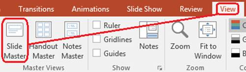

## **Przegląd**

**Mistrz slajdów** definiuje wspólne ustawienia projektu dla grupy slajdów. Może zawierać wspólne kształty, loga, tła, style tekstu, ustawienia motywu i stopki. W programie PowerPoint edytowanie **Mistrza slajdów** jest typowym sposobem utrzymania spójności prezentacji bez powtarzania tego samego formatowania na każdym slajdzie.

Aspose.Slides for Python via Java obsługuje ten sam model. Prezentacja może zawierać jeden lub więcej mistrzów slajdów, a każdy mistrz slajdu może zawierać kilka slajdów układu. Normalne slajdy zazwyczaj nie odwołują się bezpośrednio do mistrza slajdu. Zamiast tego normalny slajd używa slajdu układu, który należy do mistrza slajdu.

Hierarchia jest:

1. **Mistrz slajdów** – określa wspólny projekt i motyw.
1. **Slajd układu** – definiuje określone rozmieszczenie kontrolek zastępczych i formatowanie na poziomie układu.
1. **Normalny slajd** – zawiera rzeczywistą treść prezentacji i używa jednego slajdu układu.


W Aspose.Slides, mistrz slajdu jest reprezentowany przez klasę [MasterSlide](https://reference.aspose.com/slides/pl/python-java/aspose.slides/masterslide/). Wszystkie mistrze slajdów w prezentacji są dostępne poprzez kolekcję [Presentation.getMasters](https://reference.aspose.com/slides/pl/python-java/aspose.slides/presentation/#getMasters), którą reprezentuje [MasterSlideCollection](https://reference.aspose.com/slides/pl/python-java/aspose.slides/masterslidecollection/).

{}
Gdy to samo właściwość jest zdefiniowane na więcej niż jednym poziomie, wygrywa poziom bardziej szczegółowy. Na przykład, jeśli mistrz slajdu i slajd układu oba definiują tło, slajdy oparte na tym układzie używają tła układu. Aby uzyskać więcej informacji o slajdach układu, zobacz [Apply or Change Slide Layouts](/slides/pl/python-java/slide-layout/).
{}

## **Dostęp do mistrzów slajdów**

W programie PowerPoint można otworzyć widok **Mistrz** > **Mistrz slajdów** w zakładce **Widok**.



W Aspose.Slides użyj kolekcji [Presentation.getMasters](https://reference.aspose.com/slides/pl/python-java/aspose.slides/presentation/#getMasters), aby uzyskać dostęp do mistrzów slajdów:

```python
import jpype
import asposeslides

if not jpype.isJVMStarted():
    jpype.startJVM()

from asposeslides.api import Presentation

presentation = Presentation("presentation.pptx")
try:
    first_master_slide = presentation.getMasters().get_Item(0)
    master_slide_count = presentation.getMasters().size()
    first_master_layout_slide_count = first_master_slide.getLayoutSlides().size()

    print(f"Master slides: {master_slide_count}")
    print(f"Layouts in the first master: {first_master_layout_slide_count}")
finally:
    presentation.dispose()
```

Możesz także uzyskać mistrza slajdu używanego przez normalny slajd poprzez jego układ:

```python
import jpype
import asposeslides

if not jpype.isJVMStarted():
    jpype.startJVM()

from asposeslides.api import Presentation

presentation = Presentation("presentation.pptx")
try:
    slide = presentation.getSlides().get_Item(0)
    layout_slide = slide.getLayoutSlide()
    master_slide = layout_slide.getMasterSlide()
    master_slide_name = master_slide.getName()

    print(master_slide_name)
finally:
    presentation.dispose()
```

## **Co zawiera mistrz slajdu**

Mistrz slajdu jest obiektem podobnym do slajdu. Dziedziczy po [BaseSlide](https://reference.aspose.com/slides/pl/python-java/aspose.slides/baseslide/), więc udostępnia wiele tych samych właściwości slajdu używanych przez normalne i układowe slajdy. Członki specyficzne dla mistrza są wymienione na stronie API [MasterSlide](https://reference.aspose.com/slides/pl/python-java/aspose.slides/masterslide/).

Powszechnie używane członki mistrza slajdu obejmują:

| Członek | Cel |
| --- | --- |
| [getBackground](https://reference.aspose.com/slides/pl/python-java/aspose.slides/baseslide/#getBackground) | Ustawia tło slajdu na poziomie mistrza. |
| [getShapes](https://reference.aspose.com/slides/pl/python-java/aspose.slides/baseslide/#getShapes) | Przechowuje kształty umieszczone na mistrzu, takie jak loga, ramki obrazów i współdzielony tekst. |
| [getLayoutSlides](https://reference.aspose.com/slides/pl/python-java/aspose.slides/masterslide/#getLayoutSlides) | Przechowuje slajdy układu należące do mistrza. |
| [getThemeManager](https://reference.aspose.com/slides/pl/python-java/aspose.slides/masterslide/#getThemeManager) | Umożliwia dostęp do interfejsów API motywu mistrza. |
| [getHeaderFooterManager](https://reference.aspose.com/slides/pl/python-java/aspose.slides/masterslide/#getHeaderFooterManager) | Kontroluje nagłówki, stopki, daty i numery slajdów dla mistrza i jego podrzędnych układów. |
| [getDependingSlides](https://reference.aspose.com/slides/pl/python-java/aspose.slides/masterslide/#getDependingSlides) | Zwraca normalne slajdy zależne od mistrza poprzez ich układy. |

## **Dodaj obraz do mistrza slajdu**

Gdy dodasz obraz do mistrza slajdu, pojawia się on na slajdach, które używają układów z tego mistrza. Jest to przydatne dla logotypów, znaków wodnych, dekoracyjnych pasów i innych powtarzających się elementów wizualnych.

Poniższy przykład dodaje logo do pierwszego mistrza slajdu:

```python
import jpype
import asposeslides

if not jpype.isJVMStarted():
    jpype.startJVM()

from asposeslides.api import Images, Presentation, SaveFormat, ShapeType

presentation = Presentation("presentation.pptx")
try:
    master_slide = presentation.getMasters().get_Item(0)
    logo = Images.fromFile("logo.png")
    try:
        logo_image = presentation.getImages().addImage(logo)
        master_slide.getShapes().addPictureFrame(ShapeType.Rectangle, 20, 20, 80, 80, logo_image)
    finally:
        logo.dispose()

    presentation.save("presentation-with-logo.pptx", SaveFormat.Pptx)
finally:
    presentation.dispose()
```

Aby uzyskać więcej informacji o ramach obrazów, zobacz [Picture Frame](/slides/pl/python-java/picture-frame/).

## **Kontroluj widoczność grafiki mistrza**

Użyj [BaseSlide.setShowMasterShapes](https://reference.aspose.com/slides/pl/python-java/aspose.slides/baseslide/#setShowMasterShapes), aby ukryć dziedziczone grafiki mistrza, takie jak loga lub dekoracyjne kształty, bez ich usuwania z mistrza. Przekaż `False` do [Slide.setShowMasterShapes](https://reference.aspose.com/slides/pl/python-java/aspose.slides/slide/#setShowMasterShapes) na slajdzie, który ma pominąć te grafiki, i pozostaw `True` na slajdach, które mają je wyświetlać.

Poniższy samodzielny przykład tworzy niebieski dekoracyjny pas na mistrzu oraz dwa slajdy używające tego samego pustego układu. Pas jest widoczny na pierwszym slajdzie i ukryty na drugim. Nie wymaga żadnej wejściowej prezentacji ani obrazu.

```python
import jpype
import asposeslides

if not jpype.isJVMStarted():
    jpype.startJVM()

from asposeslides.api import FillType, Presentation, SaveFormat, ShapeType, SlideLayoutType

Color = jpype.JClass("java.awt.Color")

presentation = Presentation()
try:
    master_slide = presentation.getMasters().get_Item(0)
    layout_slide = master_slide.getLayoutSlides().getByType(SlideLayoutType.Blank)
    layout_slide.setShowMasterShapes(True)

    slide_height = jpype.JFloat(presentation.getSlideSize().getSize().getHeight())
    band = master_slide.getShapes().addAutoShape(ShapeType.Rectangle, 0, 0, 60, slide_height)
    band_color = Color(70, 130, 180)
    band.getFillFormat().setFillType(FillType.Solid)
    band.getFillFormat().getSolidFillColor().setColor(band_color)
    band.getLineFormat().getFillFormat().setFillType(FillType.NoFill)

    visible_slide = presentation.getSlides().get_Item(0)
    visible_slide.setLayoutSlide(layout_slide)
    visible_slide.getShapes().clear()

    hidden_slide = presentation.getSlides().addEmptySlide(layout_slide)

    visible_slide.setShowMasterShapes(True)
    hidden_slide.setShowMasterShapes(False)

    presentation.save("master-graphics.pptx", SaveFormat.Pptx)
finally:
    presentation.dispose()
```

Przykład używa układu **Blank** dostarczonego z nową prezentacją i usuwa własne placeholdery początkowego slajdu.

### **Wybierz zakres ustawienia**

Normalny slajd używa swojego mistrza poprzez [Slide.getLayoutSlide](https://reference.aspose.com/slides/pl/python-java/aspose.slides/slide/#getLayoutSlide) i [LayoutSlide.getMasterSlide](https://reference.aspose.com/slides/pl/python-java/aspose.slides/layoutslide/#getMasterSlide). Ustawienie właściwości na pojedynczym slajdzie wpływa tylko na ten slajd. Przekazanie `False` do [LayoutSlide.setShowMasterShapes](https://reference.aspose.com/slides/pl/python-java/aspose.slides/layoutslide/#setShowMasterShapes) ukrywa grafikę mistrza dla slajdów korzystających z tego współdzielonego układu, nawet jeśli ich własne ustawienie jest `True`. Aby ukryć grafikę tylko na jednym slajdzie, zmień właściwość slajdu i pozostaw niezmieniony współdzielony układ.

Ustawienie nie jest obsługiwane jako kontrola widoczności na samym mistrzu slajdu. Na mistrzu, [getShowMasterShapes](https://reference.aspose.com/slides/pl/python-java/aspose.slides/masterslide/#getShowMasterShapes) zawsze zwraca `False`, a przekazanie `True` do [setShowMasterShapes](https://reference.aspose.com/slides/pl/python-java/aspose.slides/masterslide/#setShowMasterShapes) powoduje wyjątek. Zastosuj je do normalnego slajdu lub układu.

### **Rozróżnij grafikę od tła**

| Operacja | Efekt |
| --- | --- |
| Ukryj grafikę mistrza | Kontroluje widoczność dziedziczonych kształtów mistrza bez ich usuwania ani zmiany własnych kształtów slajdu. |
| Zmiana wypełnienia tła slajdu | Zmienia kolor, gradient lub obraz tła. Grafika mistrza jest oddzielnym kształtem i może pozostać widoczna nad tym tłem. Zobacz [Presentation Background](/slides/pl/python-java/presentation-background/). |
| Usuń kształt z mistrza | Usuwa współdzielony źródłowy kształt, więc nie jest już dostępny dla żadnego slajdu używającego tego mistrza. |

## **Pracuj z placeholderami**

Placeholdery są zazwyczaj definiowane na slajdach układu. Mistrz slajdu zapewnia wspólny styl i motyw, które te układy dziedziczą, podczas gdy każdy układ decyduje, które placeholdery są dostępne i gdzie są umieszczone.

W PowerPoint polecenia placeholderów są dostępne w widoku **Mistrza slajdów**.


Aby dodać nowe placeholdery w Aspose.Slides, pracuj z slajdem układu należącym do mistrza:

```python
import jpype
import asposeslides

if not jpype.isJVMStarted():
    jpype.startJVM()

from asposeslides.api import Presentation, SaveFormat, SlideLayoutType

presentation = Presentation("presentation.pptx")
try:
    master_slide = presentation.getMasters().get_Item(0)
    blank_layout_slide = master_slide.getLayoutSlides().getByType(SlideLayoutType.Blank)

    if blank_layout_slide is None:
        blank_layout_slide = master_slide.getLayoutSlides().add(SlideLayoutType.Blank, "Blank")

    blank_layout_slide.getPlaceholderManager().addTextPlaceholder(60, 120, 600, 80)

    presentation.getSlides().addEmptySlide(blank_layout_slide)
    presentation.save("presentation-with-placeholder.pptx", SaveFormat.Pptx)
finally:
    presentation.dispose()
```

Możesz także formatować kształty placeholderów, które już istnieją na mistrzu slajdu. Poniższy przykład znajduje placeholder tytułu i stosuje liniowe wypełnienie gradientem:

```python
import jpype
import asposeslides

if not jpype.isJVMStarted():
    jpype.startJVM()

from asposeslides.api import AutoShape, FillType, GradientShape, PlaceholderType, Presentation, SaveFormat

Color = jpype.JClass("java.awt.Color")

presentation = Presentation("presentation.pptx")
try:
    master_slide = presentation.getMasters().get_Item(0)
    title_placeholder = None

    for shape in master_slide.getShapes():
        if isinstance(shape, AutoShape):
            if shape.getPlaceholder() is not None and shape.getPlaceholder().getType() == PlaceholderType.Title:
                title_placeholder = shape
                break

    if title_placeholder is not None:
        red_gradient_color = Color(255, 0, 0)
        purple_gradient_color = Color(128, 0, 128)

        title_placeholder.getFillFormat().setFillType(FillType.Gradient)
        title_placeholder.getFillFormat().getGradientFormat().setGradientShape(GradientShape.Linear)
        title_placeholder.getFillFormat().getGradientFormat().getGradientStops().add(jpype.JFloat(0.0), red_gradient_color)
        title_placeholder.getFillFormat().getGradientFormat().getGradientStops().add(jpype.JFloat(1.0), purple_gradient_color)

    presentation.save("presentation-title-style.pptx", SaveFormat.Pptx)
finally:
    presentation.dispose()
```


Aby uzyskać więcej opcji formatowania placeholderów i tekstu, zobacz [Set Prompt Text in Placeholder](/slides/pl/python-java/manage-placeholder/) i [Text Formatting](/slides/pl/python-java/text-formatting/).

## **Zmień tło mistrza slajdu**

Tło mistrza jest dziedziczone przez układy i slajdy, które go nie nadpisują. Poniższy przykład ustawia jednolity kolor tła dla pierwszego mistrza slajdu:

```python
import jpype
import asposeslides

if not jpype.isJVMStarted():
    jpype.startJVM()

from asposeslides.api import BackgroundType, FillType, Presentation, SaveFormat

Color = jpype.JClass("java.awt.Color")

presentation = Presentation("presentation.pptx")
try:
    master_slide = presentation.getMasters().get_Item(0)
    master_background_color = Color.GREEN

    master_slide.getBackground().setType(BackgroundType.OwnBackground)
    master_slide.getBackground().getFillFormat().setFillType(FillType.Solid)
    master_slide.getBackground().getFillFormat().getSolidFillColor().setColor(master_background_color)

    presentation.save("presentation-master-background.pptx", SaveFormat.Pptx)
finally:
    presentation.dispose()
```

Powiązane tematy znajdują się w sekcjach [Presentation Background](/slides/pl/python-java/presentation-background/) i [Presentation Theme](/slides/pl/python-java/presentation-theme/).

## **Sklonuj mistrza slajdu do innej prezentacji**

Użyj [MasterSlideCollection.addClone](https://reference.aspose.com/slides/pl/python-java/aspose.slides/masterslidecollection/#addClone), aby skopiować mistrza slajdu do innej prezentacji. Skopiowany mistrz może być następnie używany przez układy i slajdy w docelowej prezentacji.

```python
import jpype
import asposeslides

if not jpype.isJVMStarted():
    jpype.startJVM()

from asposeslides.api import Presentation, SaveFormat

source_presentation = Presentation("source.pptx")
destination_presentation = Presentation("destination.pptx")
try:
    source_master_slide = source_presentation.getMasters().get_Item(0)
    cloned_master_slide = destination_presentation.getMasters().addClone(source_master_slide)

    destination_presentation.save("destination-with-master.pptx", SaveFormat.Pptx)
finally:
    source_presentation.dispose()
    destination_presentation.dispose()
```

Jeśli potrzebujesz sklonować normalne slajdy razem z ich mistrzem, zobacz [Clone Slides](/slides/pl/python-java/clone-slides/).

## **Dodaj wiele mistrzów slajdów**

Prezentacja może zawierać wiele mistrzów slajdów. Jest to przydatne, gdy różne sekcje wymagają odmiennych elementów brandingowych, struktury stron lub ustawień motywu.


Poniższy przykład klonuje domyślnego mistrza, nadaje klonowi inne tło, tworzy układ pod tym sklonowanym mistrzem i dodaje nowy slajd oparty na tym układzie:

```python
import jpype
import asposeslides

if not jpype.isJVMStarted():
    jpype.startJVM()

from asposeslides.api import BackgroundType, FillType, Presentation, SaveFormat, SlideLayoutType

Color = jpype.JClass("java.awt.Color")

presentation = Presentation("presentation.pptx")
try:
    default_master_slide = presentation.getMasters().get_Item(0)
    section_master_slide = presentation.getMasters().addClone(default_master_slide)
    section_master_background_color = Color.LIGHT_GRAY

    section_master_slide.getBackground().setType(BackgroundType.OwnBackground)
    section_master_slide.getBackground().getFillFormat().setFillType(FillType.Solid)
    section_master_slide.getBackground().getFillFormat().getSolidFillColor().setColor(section_master_background_color)

    source_blank_layout = default_master_slide.getLayoutSlides().getByType(SlideLayoutType.Blank)
    if source_blank_layout is None:
        source_blank_layout = default_master_slide.getLayoutSlides().get_Item(0)

    section_blank_layout = section_master_slide.getLayoutSlides().addClone(source_blank_layout)

    presentation.getSlides().addEmptySlide(section_blank_layout)
    presentation.save("presentation-with-multiple-masters.pptx", SaveFormat.Pptx)
finally:
    presentation.dispose()
```

## **Porównaj mistrzów slajdów**

Mistrze slajdów można porównać metodą [equals](https://reference.aspose.com/slides/pl/python-java/aspose.slides/baseslide/#equals) dziedziczoną z [BaseSlide](https://reference.aspose.com/slides/pl/python-java/aspose.slides/baseslide/). Porównanie sprawdza strukturę i statyczną zawartość, taką jak kształty, tekst, formatowanie, animacje i inne ustawienia slajdu. Nie porównuje unikalnych identyfikatorów, takich jak ID slajdów, ani dynamicznych wartości placeholderów, takich jak bieżąca data.

```python
import jpype
import asposeslides

if not jpype.isJVMStarted():
    jpype.startJVM()

from asposeslides.api import Presentation

first_presentation = Presentation("first.pptx")
second_presentation = Presentation("second.pptx")
try:
    first_presentation_master_count = first_presentation.getMasters().size()
    second_presentation_master_count = second_presentation.getMasters().size()

    for first_master_index in range(first_presentation_master_count):
        for second_master_index in range(second_presentation_master_count):
            first_master_slide = first_presentation.getMasters().get_Item(first_master_index)
            second_master_slide = second_presentation.getMasters().get_Item(second_master_index)
            are_master_slides_equal = first_master_slide.equals(second_master_slide)

            if are_master_slides_equal:
                print(f"first.pptx master #{first_master_index} equals second.pptx master #{second_master_index}")
finally:
    first_presentation.dispose()
    second_presentation.dispose()
```

Aby uzyskać więcej informacji, zobacz [Compare Presentation Slides](/slides/pl/python-java/compare-slides/).

## **Ustaw widok mistrza slajdu jako domyślny widok**

Użyj metody [setLastView](https://reference.aspose.com/slides/pl/python-java/aspose.slides/viewproperties/#setLastView) na [ViewProperties](https://reference.aspose.com/slides/pl/python-java/aspose.slides/viewproperties/), aby kontrolować widok, który PowerPoint otwiera jako pierwszy. Poniższy przykład otwiera prezentację w widoku Mistrza slajdów:

```python
import jpype
import asposeslides

if not jpype.isJVMStarted():
    jpype.startJVM()

from asposeslides.api import Presentation, SaveFormat, ViewType

presentation = Presentation("presentation.pptx")
try:
    presentation.getViewProperties().setLastView(ViewType.SlideMasterView)
    presentation.save("presentation-master-view.pptx", SaveFormat.Pptx)
finally:
    presentation.dispose()
```

Aby uzyskać więcej ustawień widoku, zobacz [Save Presentation](/slides/pl/python-java/save-presentation/).

## **Usuń nieużywane mistrze slajdów**

Prezentacje czasami zawierają mistrze slajdów, które nie są już używane przez żadne normalne slajdy. Usunięcie nieużywanych mistrzów może zmniejszyć rozmiar pliku i uprościć utrzymanie szablonu.

Użyj [removeUnused](https://reference.aspose.com/slides/pl/python-java/aspose.slides/masterslidecollection/#removeUnused), aby usunąć nieużywane mistrze z kolekcji [Presentation.getMasters](https://reference.aspose.com/slides/pl/python-java/aspose.slides/presentation/#getMasters):

```python
import jpype
import asposeslides

if not jpype.isJVMStarted():
    jpype.startJVM()

from asposeslides.api import Presentation, SaveFormat

presentation = Presentation("presentation.pptx")
try:
    presentation.getMasters().removeUnused(True)
    presentation.save("presentation-clean.pptx", SaveFormat.Pptx)
finally:
    presentation.dispose()
```

Możesz także użyć metody niskokodowej [Compress.removeUnusedMasterSlides](https://reference.aspose.com/slides/pl/python-java/aspose.slides/compress/#removeUnusedMasterSlides):

```python
import jpype
import asposeslides

if not jpype.isJVMStarted():
    jpype.startJVM()

from asposeslides.api import Compress, Presentation, SaveFormat

presentation = Presentation("presentation.pptx")
try:
    Compress.removeUnusedMasterSlides(presentation)
    presentation.save("presentation-clean.pptx", SaveFormat.Pptx)
finally:
    presentation.dispose()
```

## **FAQ**

**Jaka jest różnica między mistrzem slajdu a slajdem układu?**

Mistrz slajdu definiuje wspólne ustawienia projektu, takie jak motyw, tło, wspólne kształty i style tekstu. Slajd układu należy do mistrza slajdu i określa konkretny układ placeholderów. Normalny slajd używa slajdu układu, więc dziedziczy zarówno po układzie, jak i po mistrzu.

**Czy jedna prezentacja może zawierać kilka mistrzów slajdów?**

Tak. Prezentacja może zawierać kilka mistrzów slajdów. Używaj wielu mistrzów, gdy różne sekcje wymagają odmiennych systemów wizualnych lub brandingu.

**Czy powinienem dodawać placeholdery do mistrza slajdu czy do slajdu układu?**

W większości przypadków dodawaj placeholdery do slajdów układu. Umieść współdzielone elementy wizualne i formatowanie na mistrzu slajdu, a placeholdery treści na układach, które będą używane przez normalne slajdy.

**Czy mogę usunąć mistrza slajdu, który jest nadal używany?**

Nie. Mistrz slajdu, który ma zależne slajdy, nie może być bezpiecznie usunięty bezpośrednio. Najpierw przenieś te slajdy do układów pod innym mistrzem lub użyj metody czyszczenia nieużywanych mistrzów, która usuwa tylko mistrze niebędące w użyciu.