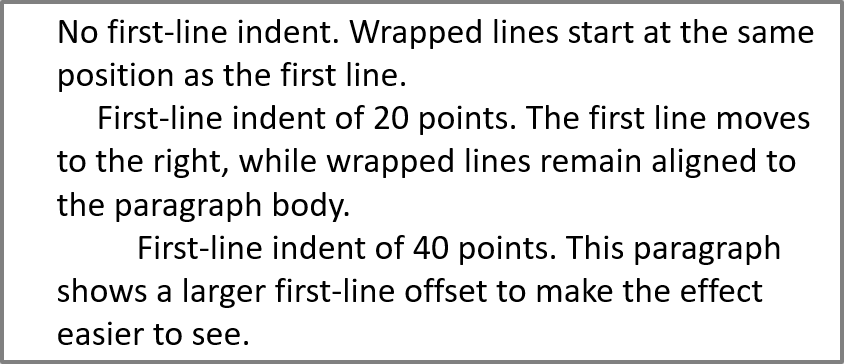

## **Wprowadzenie**

Aspose.Slides udostępnia klasy niezbędne do pracy z tekstem PowerPoint w języku Python.

* Aspose.Slides udostępnia klasę [TextFrame](https://reference.aspose.com/slides/pl/python-net/aspose.slides/textframe/) do tworzenia obiektów ramki tekstowej. Obiekt `TextFrame` może zawierać jeden lub wiele akapitów (każdy akapit jest oddzielony zwrotem karetki).
* Aspose.Slides udostępnia klasę [Paragraph](https://reference.aspose.com/slides/pl/python-net/aspose.slides/paragraph/) do tworzenia obiektów akapitu. Obiekt `Paragraph` może zawierać jedną lub wiele części tekstu.
* Aspose.Slides udostępnia klasę [Portion](https://reference.aspose.com/slides/pl/python-net/aspose.slides/portion/) do tworzenia obiektów części tekstu oraz określania ich właściwości formatowania.

Obiekt `Paragraph` może obsługiwać tekst o różnych właściwościach formatowania dzięki swoim wewnętrznym obiektom `Portion`.

## **Dodawanie wielu akapitów zawierających wiele części**

Poniższe kroki pokazują, jak dodać ramkę tekstową zawierającą trzy akapity, każdy z trzema częściami:

1. Utwórz instancję klasy [Presentation](https://reference.aspose.com/slides/pl/python-net/aspose.slides/presentation/).
1. Uzyskaj odniesienie do docelowego slajdu według jego indeksu.
1. Dodaj prostokątną [AutoShape](https://reference.aspose.com/slides/pl/python-net/aspose.slides/autoshape/) do slajdu.
1. Uzyskaj [TextFrame](https://reference.aspose.com/slides/pl/python-net/aspose.slides/textframe/) powiązany z [AutoShape](https://reference.aspose.com/slides/pl/python-net/aspose.slides/autoshape/).
1. Utwórz dwa obiekty [Paragraph](https://reference.aspose.com/slides/pl/python-net/aspose.slides/paragraph/) i dodaj je do kolekcji akapitów [TextFrame](https://reference.aspose.com/slides/pl/python-net/aspose.slides/textframe/) (razem z domyślnym akapitem daje to trzy akapity).
1. Dla każdego akapitu utwórz trzy obiekty [Portion](https://reference.aspose.com/slides/pl/python-net/aspose.slides/portion/) i dodaj je do kolekcji części tego akapitu.
1. Ustaw tekst dla każdej części.
1. Zastosuj dowolne formatowanie do każdej części tekstu, używając właściwości udostępnionych przez [Portion](https://reference.aspose.com/slides/pl/python-net/aspose.slides/portion/).
1. Zapisz zmodyfikowaną prezentację.

```python
import aspose.slides as slides
import aspose.pydrawing as draw

# Utwórz instancję klasy Presentation, aby stworzyć nowy plik PPTX.
with slides.Presentation() as presentation:

    # Uzyskaj dostęp do pierwszego slajdu.
    slide = presentation.slides[0]

    # Dodaj prostokątną AutoShape.
    shape = slide.shapes.add_auto_shape(slides.ShapeType.RECTANGLE, 50, 150, 300, 150)

    # Uzyskaj dostęp do TextFrame AutoShape.
    text_frame = shape.text_frame

    # Utwórz akapity i części; formatowanie zostanie zastosowane poniżej.
    paragraph0 = text_frame.paragraphs[0]
    portion01 = slides.Portion()
    portion02 = slides.Portion()
    paragraph0.portions.add(portion01)
    paragraph0.portions.add(portion02)

    paragraph1 = slides.Paragraph()
    text_frame.paragraphs.add(paragraph1)
    portion10 = slides.Portion()
    portion11 = slides.Portion()
    portion12 = slides.Portion()
    paragraph1.portions.add(portion10)
    paragraph1.portions.add(portion11)
    paragraph1.portions.add(portion12)

    paragraph2 = slides.Paragraph()
    text_frame.paragraphs.add(paragraph2)
    portion20 = slides.Portion()
    portion21 = slides.Portion()
    portion22 = slides.Portion()
    paragraph2.portions.add(portion20)
    paragraph2.portions.add(portion21)
    paragraph2.portions.add(portion22)

    for i in range(3):
        for j in range(3):
            text_frame.paragraphs[i].portions[j].text = "Portion0" + str(j)
            if j == 0:
                text_frame.paragraphs[i].portions[j].portion_format.fill_format.fill_type = slides.FillType.SOLID
                text_frame.paragraphs[i].portions[j].portion_format.fill_format.solid_fill_color.color = draw.Color.red
                text_frame.paragraphs[i].portions[j].portion_format.font_bold = 1
                text_frame.paragraphs[i].portions[j].portion_format.font_height = 15
            elif j == 1:
                text_frame.paragraphs[i].portions[j].portion_format.fill_format.fill_type = slides.FillType.SOLID
                text_frame.paragraphs[i].portions[j].portion_format.fill_format.solid_fill_color.color = draw.Color.blue
                text_frame.paragraphs[i].portions[j].portion_format.font_italic = 1
                text_frame.paragraphs[i].portions[j].portion_format.font_height = 18

    # Zapisz plik PPTX na dysku.
    presentation.save("paragraphs_and_portions_out.pptx", slides.export.SaveFormat.PPTX)
```

## **Zarządzanie wypunktowaniem akapitu**

Listy wypunktowane pomagają szybko i skutecznie organizować oraz prezentować informacje. Akapity z wypunktowaniem są zazwyczaj łatwiejsze do czytania i zrozumienia.

1. Utwórz instancję klasy [Presentation](https://reference.aspose.com/slides/pl/python-net/aspose.slides/presentation/).
1. Uzyskaj dostęp do docelowego slajdu według jego indeksu.
1. Dodaj [AutoShape](https://reference.aspose.com/slides/pl/python-net/aspose.slides/autoshape/) do slajdu.
1. Uzyskaj dostęp do [TextFrame](https://reference.aspose.com/slides/pl/python-net/aspose.slides/textframe/) kształtu.
1. Usuń domyślny akapit z [TextFrame](https://reference.aspose.com/slides/pl/python-net/aspose.slides/textframe/).
1. Utwórz pierwszy akapit przy użyciu klasy [Paragraph](https://reference.aspose.com/slides/pl/python-net/aspose.slides/paragraph/).
1. Ustaw typ wypunktowania akapitu na `SYMBOL` i określ znak wypunktowania.
1. Ustaw tekst akapitu.
1. Ustaw wcięcie wypunktowania dla akapitu.
1. Ustaw kolor wypunktowania.
1. Ustaw rozmiar wypunktowania (wysokość).
1. Dodaj akapit do kolekcji akapitów [TextFrame](https://reference.aspose.com/slides/pl/python-net/aspose.slides/textframe/).
1. Dodaj drugi akapit i powtórz kroki 7–12.
1. Zapisz prezentację.

```python
import aspose.slides as slides
import aspose.pydrawing as draw

# Utwórz instancję prezentacji.
with slides.Presentation() as presentation:

    # Uzyskaj dostęp do pierwszego slajdu.
    slide = presentation.slides[0]

    # Dodaj i uzyskaj dostęp do AutoShape.
    shape = slide.shapes.add_auto_shape(slides.ShapeType.RECTANGLE, 200, 200, 400, 200)

    # Uzyskaj dostęp do ramki tekstowej utworzonego AutoShape.
    text_frame = shape.text_frame

    # Usuń domyślny akapit.
    text_frame.paragraphs.remove_at(0)

    # Utwórz akapit.
    paragraph = slides.Paragraph()

    # Ustaw styl i znak wypunktowania akapitu.
    paragraph.paragraph_format.bullet.type = slides.BulletType.SYMBOL
    paragraph.paragraph_format.bullet.char = chr(8226)

    # Ustaw tekst akapitu.
    paragraph.text = "Welcome to Aspose.Slides"

    # Ustaw wcięcie wypunktowania.
    paragraph.paragraph_format.indent = 25

    # Ustaw kolor wypunktowania.
    paragraph.paragraph_format.bullet.color.color_type = slides.ColorType.RGB
    paragraph.paragraph_format.bullet.color.color = draw.Color.black
    paragraph.paragraph_format.bullet.is_bullet_hard_color = 1 

    # Ustaw wysokość wypunktowania.
    paragraph.paragraph_format.bullet.height = 100

    # Dodaj akapit do ramki tekstowej.
    text_frame.paragraphs.add(paragraph)

    # Utwórz drugi akapit.
    paragraph2 = slides.Paragraph()

    # Ustaw typ i styl wypunktowania akapitu.
    paragraph2.paragraph_format.bullet.type = slides.BulletType.NUMBERED
    paragraph2.paragraph_format.bullet.numbered_bullet_style = slides.NumberedBulletStyle.BULLET_CIRCLE_NUM_WDBLACK_PLAIN

    # Ustaw tekst akapitu.
    paragraph2.text = "This is numbered bullet"

    # Ustaw wcięcie wypunktowania.
    paragraph2.paragraph_format.indent = 25

    # Ustaw kolor wypunktowania.
    paragraph2.paragraph_format.bullet.color.color_type = slides.ColorType.RGB
    paragraph2.paragraph_format.bullet.color.color = draw.Color.black
    paragraph2.paragraph_format.bullet.is_bullet_hard_color = 1

    # Ustaw wysokość wypunktowania.
    paragraph2.paragraph_format.bullet.height = 100

    # Dodaj akapit do ramki tekstowej.
    text_frame.paragraphs.add(paragraph2)

    # Zapisz prezentację jako plik PPTX.
    presentation.save("bullets_out.pptx", slides.export.SaveFormat.PPTX)
```

## **Zarządzanie wypunktowaniem obrazkowym**

Listy wypunktowane pomagają szybko i skutecznie organizować oraz prezentować informacje. Wypunktowanie obrazkowe jest łatwe do odczytania i zrozumienia.

1. Utwórz instancję klasy [Presentation](https://reference.aspose.com/slides/pl/python-net/aspose.slides/presentation/).
1. Uzyskaj dostęp do docelowego slajdu według jego indeksu.
1. Dodaj [AutoShape](https://reference.aspose.com/slides/pl/python-net/aspose.slides/autoshape/) do slajdu.
1. Uzyskaj dostęp do [TextFrame](https://reference.aspose.com/slides/pl/python-net/aspose.slides/textframe/) kształtu.
1. Usuń domyślny akapit z [TextFrame](https://reference.aspose.com/slides/pl/python-net/aspose.slides/textframe/).
1. Utwórz pierwszy akapit przy użyciu klasy [Paragraph](https://reference.aspose.com/slides/pl/python-net/aspose.slides/paragraph/).
1. Wczytaj obraz do [PPImage](https://reference.aspose.com/slides/pl/python-net/aspose.slides/ppimage/).
1. Ustaw typ wypunktowania na [PPImage](https://reference.aspose.com/slides/pl/python-net/aspose.slides/ppimage/) i przypisz obraz.
1. Ustaw tekst akapitu.
1. Ustaw wcięcie akapitu dla wypunktowania.
1. Ustaw kolor wypunktowania.
1. Ustaw wysokość wypunktowania.
1. Dodaj nowy akapit do kolekcji akapitów [TextFrame](https://reference.aspose.com/slides/pl/python-net/aspose.slides/textframe/).
1. Dodaj drugi akapit i powtórz kroki 8–12.
1. Zapisz prezentację.

```python
import aspose.slides as slides
import aspose.pydrawing as draw

with slides.Presentation() as presentation:

    # Uzyskaj dostęp do pierwszego slajdu.
    slide = presentation.slides[0]

    # Wczytaj obraz wypunktowania.
    image = draw.Bitmap("bullets.png")
    pp_image = presentation.images.add_image(image)

    # Dodaj i uzyskaj dostęp do AutoShape.
    auto_shape = slide.shapes.add_auto_shape(slides.ShapeType.RECTANGLE, 200, 200, 400, 200)

    # Uzyskaj dostęp do TextFrame utworzonego AutoShape.
    text_frame = auto_shape.text_frame

    # Usuń domyślny akapit.
    text_frame.paragraphs.remove_at(0)

    # Utwórz nowy akapit.
    paragraph = slides.Paragraph()
    paragraph.text = "Welcome to Aspose.Slides"

    # Ustaw typ wypunktowania akapitu na Obraz i przypisz obraz.
    paragraph.paragraph_format.bullet.type = slides.BulletType.PICTURE
    paragraph.paragraph_format.bullet.picture.image = pp_image

    # Ustaw wysokość wypunktowania.
    paragraph.paragraph_format.bullet.height = 100

    # Dodaj akapit do ramki tekstowej.
    text_frame.paragraphs.add(paragraph)

    # Zapisz prezentację jako plik PPTX.
    presentation.save("picture_bullets_out.pptx", slides.export.SaveFormat.PPTX)
    # Zapisz prezentację jako plik PPT.
    presentation.save("picture_bullets_out.ppt", slides.export.SaveFormat.PPT)
```

## **Zarządzanie wypunktowaniem wielopoziomowym**

Listy wypunktowane pomagają szybko i skutecznie organizować oraz prezentować informacje. Wypunktowanie wielopoziomowe jest łatwe do odczytania i zrozumienia.

1. Utwórz instancję klasy [Presentation](https://reference.aspose.com/slides/pl/python-net/aspose.slides/presentation/).
1. Uzyskaj dostęp do docelowego slajdu według jego indeksu.
1. Dodaj [AutoShape](https://reference.aspose.com/slides/pl/python-net/aspose.slides/autoshape/) do slajdu.
1. Uzyskaj dostęp do [TextFrame](https://reference.aspose.com/slides/pl/python-net/aspose.slides/textframe/) [AutoShape](https://reference.aspose.com/slides/pl/python-net/aspose.slides/autoshape/).
1. Usuń domyślny akapit z [TextFrame](https://reference.aspose.com/slides/pl/python-net/aspose.slides/textframe/).
1. Utwórz pierwszy akapit przy użyciu [Paragraph](https://reference.aspose.com/slides/pl/python-net/aspose.slides/paragraph/) i ustaw jego głębokość na 0.
1. Utwórz drugi akapit przy użyciu [Paragraph](https://reference.aspose.com/slides/pl/python-net/aspose.slides/paragraph/) i ustaw jego głębokość na 1.
1. Utwórz trzeci akapit przy użyciu [Paragraph](https://reference.aspose.com/slides/pl/python-net/aspose.slides/paragraph/) i ustaw jego głębokość na 2.
1. Utwórz czwarty akapit przy użyciu [Paragraph](https://reference.aspose.com/slides/pl/python-net/aspose.slides/paragraph/) i ustaw jego głębokość na 3.
1. Dodaj nowe akapity do kolekcji akapitów [TextFrame](https://reference.aspose.com/slides/pl/python-net/aspose.slides/textframe/).
1. Zapisz prezentację.

```python
import aspose.slides as slides
import aspose.pydrawing as draw

# Utwórz instancję prezentacji.
with slides.Presentation() as presentation:

    # Uzyskaj dostęp do pierwszego slajdu.
    slide = presentation.slides[0]
    
    # Dodaj AutoShape.
    shape = slide.shapes.add_auto_shape(slides.ShapeType.RECTANGLE, 200, 200, 400, 200)

    # Uzyskaj dostęp do TextFrame utworzonego AutoShape.
    text_frame = auto_shape.text_frame
    
    # Wyczyść domyślny akapit.
    text_frame.paragraphs.clear()

    # Dodaj pierwszy akapit.
    paragraph1 = slides.Paragraph()
    paragraph1.text = "Content"
    paragraph1.paragraph_format.bullet.type = slides.BulletType.SYMBOL
    paragraph1.paragraph_format.bullet.char = chr(8226)
    paragraph1.paragraph_format.default_portion_format.fill_format.fill_type = slides.FillType.SOLID
    paragraph1.paragraph_format.default_portion_format.fill_format.solid_fill_color.color = draw.Color.black
    # Ustaw poziom wypunktowania.
    paragraph1.paragraph_format.depth = 0

    # Dodaj drugi akapit.
    paragraph2 = slides.Paragraph()
    paragraph2.text = "Second Level"
    paragraph2.paragraph_format.bullet.type = slides.BulletType.SYMBOL
    paragraph2.paragraph_format.bullet.char = '-'
    paragraph2.paragraph_format.default_portion_format.fill_format.fill_type = slides.FillType.SOLID
    paragraph2.paragraph_format.default_portion_format.fill_format.solid_fill_color.color = draw.Color.black
    # Ustaw poziom wypunktowania.
    paragraph2.paragraph_format.depth = 1

    # Dodaj trzeci akapit.
    paragraph3 = slides.Paragraph()
    paragraph3.text = "Third Level"
    paragraph3.paragraph_format.bullet.type = slides.BulletType.SYMBOL
    paragraph3.paragraph_format.bullet.char = chr(8226)
    paragraph3.paragraph_format.default_portion_format.fill_format.fill_type = slides.FillType.SOLID
    paragraph3.paragraph_format.default_portion_format.fill_format.solid_fill_color.color = draw.Color.black
    # Ustaw poziom wypunktowania.
    paragraph3.paragraph_format.depth = 2

    # Dodaj czwarty akapit.
    paragraph4 = slides.Paragraph()
    paragraph4.text = "Fourth Level"
    paragraph4.paragraph_format.bullet.type = slides.BulletType.SYMBOL
    paragraph4.paragraph_format.bullet.char = '-'
    paragraph4.paragraph_format.default_portion_format.fill_format.fill_type = slides.FillType.SOLID
    paragraph4.paragraph_format.default_portion_format.fill_format.solid_fill_color.color = draw.Color.black
    # Ustaw poziom wypunktowania.
    paragraph4.paragraph_format.depth = 3

    # Dodaj akapity do kolekcji.
    text_frame.paragraphs.add(paragraph1)
    text_frame.paragraphs.add(paragraph2)
    text_frame.paragraphs.add(paragraph3)
    text_frame.paragraphs.add(paragraph4)

    # Zapisz prezentację jako plik PPTX.
    presentation.save("multilevel_bullets_out.pptx", slides.export.SaveFormat.PPTX)
```

## **Zarządzanie akapitami z niestandardowymi listami numerowanymi**

Klasa [BulletFormat](https://reference.aspose.com/slides/pl/python-net/aspose.slides/bulletformat/) udostępnia właściwość `numbered_bullet_start_with` (oraz inne), umożliwiając kontrolowanie niestandardowego numerowania i formatowania akapitów.

1. Utwórz instancję klasy [Presentation](https://reference.aspose.com/slides/pl/python-net/aspose.slides/presentation/).
1. Uzyskaj dostęp do slajdu, który będzie zawierał akapity.
1. Dodaj [AutoShape](https://reference.aspose.com/slides/pl/python-net/aspose.slides/autoshape/) do slajdu.
1. Uzyskaj dostęp do [TextFrame](https://reference.aspose.com/slides/pl/python-net/aspose.slides/textframe/) kształtu.
1. Usuń domyślny akapit z [TextFrame](https://reference.aspose.com/slides/pl/python-net/aspose.slides/textframe/).
1. Utwórz pierwszy [Paragraph](https://reference.aspose.com/slides/pl/python-net/aspose.slides/paragraph/) i ustaw `numbered_bullet_start_with` na 2.
1. Utwórz drugi [Paragraph](https://reference.aspose.com/slides/pl/python-net/aspose.slides/paragraph/) i ustaw `numbered_bullet_start_with` na 3.
1. Utwórz trzeci [Paragraph](https://reference.aspose.com/slides/pl/python-net/aspose.slides/paragraph/) i ustaw `numbered_bullet_start_with` na 7.
1. Dodaj akapity do kolekcji [TextFrame](https://reference.aspose.com/slides/pl/python-net/aspose.slides/textframe/).
1. Zapisz prezentację.

```python
import aspose.slides as slides

with slides.Presentation() as presentation:

    # Dodaj i uzyskaj dostęp do AutoShape.
    shape = presentation.slides[0].shapes.add_auto_shape(slides.ShapeType.RECTANGLE, 200, 200, 400, 200)

    # Uzyskaj dostęp do TextFrame utworzonego AutoShape.
    text_frame = shape.text_frame

    # Usuń domyślny istniejący akapit.
    text_frame.paragraphs.remove_at(0)

    # Utwórz pierwszy numerowany element (rozpocznij od 2, poziom głębokości 4).
    paragraph1 = slides.Paragraph()
    paragraph1.text = "bullet 2"
    paragraph1.paragraph_format.depth = 4 
    paragraph1.paragraph_format.bullet.numbered_bullet_start_with = 2
    paragraph1.paragraph_format.bullet.type = slides.BulletType.NUMBERED
    text_frame.paragraphs.add(paragraph1)

    # Utwórz drugi numerowany element (rozpocznij od 3, poziom głębokości 4).
    paragraph2 = slides.Paragraph()
    paragraph2.text = "bullet 3"
    paragraph2.paragraph_format.depth = 4
    paragraph2.paragraph_format.bullet.numbered_bullet_start_with = 3 
    paragraph2.paragraph_format.bullet.type = slides.BulletType.NUMBERED  
    text_frame.paragraphs.add(paragraph2)

    # Utwórz trzeci numerowany element (rozpocznij od 7, poziom głębokości 4).
    paragraph5 = slides.Paragraph()
    paragraph5.text = "bullet 7"
    paragraph5.paragraph_format.depth = 4
    paragraph5.paragraph_format.bullet.numbered_bullet_start_with = 7
    paragraph5.paragraph_format.bullet.type = slides.BulletType.NUMBERED
    text_frame.paragraphs.add(paragraph5)

    presentation.save("custom_bullets_out.pptx", slides.export.SaveFormat.PPTX)
```

## **Ustawienie wcięcia pierwszej linii akapitu**

Użyj właściwości [ParagraphFormat.indent](https://reference.aspose.com/slides/pl/python-net/aspose.slides/paragraphformat/indent/), aby kontrolować wcięcie pierwszej linii akapitu. Właściwość ta przesuwa tylko pierwszą linię względem lewego marginesu akapitu. Dodatnia wartość przesuwa pierwszą linię w prawo, podczas gdy pozostałe linie pozostają wyrównane do ciała akapitu.

Użyj [ParagraphFormat.margin_left](https://reference.aspose.com/slides/pl/python-net/aspose.slides/paragraphformat/margin_left/), gdy potrzebujesz przesunąć cały akapit. Użyj [ParagraphFormat.indent](https://reference.aspose.com/slides/pl/python-net/aspose.slides/paragraphformat/indent/), gdy chcesz przesunąć tylko pierwszą linię.

Poniższy przykład tworzy kilka akapitów i stosuje różne wartości `indent`, aby pokazać, jak wcięcie pierwszej linii wpływa na układ akapitu.

1. Utwórz instancję klasy [Presentation](https://reference.aspose.com/slides/pl/python-net/aspose.slides/presentation/).
2. Uzyskaj dostęp do docelowego slajdu.
3. Dodaj prostokątną [AutoShape](https://reference.aspose.com/slides/pl/python-net/aspose.slides/autoshape/) do slajdu.
4. Dodaj pusty [TextFrame](https://reference.aspose.com/slides/pl/python-net/aspose.slides/textframe/) do kształtu i usuń domyślny akapit.
5. Utwórz kilka akapitów i ustaw różne wartości [indent](https://reference.aspose.com/slides/pl/python-net/aspose.slides/paragraphformat/indent/) dla nich.
6. Dodaj akapity do ramki tekstowej.
7. Zapisz zmodyfikowaną prezentację.

```py
import aspose.slides as slides
import aspose.pydrawing as draw

with slides.Presentation() as presentation:
    slide = presentation.slides[0]

    rectangle = slide.shapes.add_auto_shape(slides.ShapeType.RECTANGLE, 50, 50, 420, 220)
    rectangle.fill_format.fill_type = slides.FillType.NO_FILL
    rectangle.line_format.fill_format.fill_type = slides.FillType.SOLID
    rectangle.line_format.fill_format.solid_fill_color.color = draw.Color.gray

    text_frame = rectangle.add_text_frame("")
    text_frame.text_frame_format.autofit_type = slides.TextAutofitType.SHAPE
    text_frame.paragraphs.remove_at(0)

    first_paragraph = slides.Paragraph()
    first_paragraph.paragraph_format.default_portion_format.fill_format.fill_type = slides.FillType.SOLID
    first_paragraph.paragraph_format.default_portion_format.fill_format.solid_fill_color.color = draw.Color.black
    first_paragraph.text = "No first-line indent. Wrapped lines start at the same position as the first line."
    first_paragraph.paragraph_format.margin_left = 20.0
    first_paragraph.paragraph_format.indent = 0.0

    second_paragraph = slides.Paragraph()
    second_paragraph.paragraph_format.default_portion_format.fill_format.fill_type = slides.FillType.SOLID
    second_paragraph.paragraph_format.default_portion_format.fill_format.solid_fill_color.color = draw.Color.black
    second_paragraph.text = "First-line indent of 20 points. The first line moves to the right, while wrapped lines remain aligned to the paragraph body."
    second_paragraph.paragraph_format.margin_left = 20.0
    second_paragraph.paragraph_format.indent = 20.0

    third_paragraph = slides.Paragraph()
    third_paragraph.paragraph_format.default_portion_format.fill_format.fill_type = slides.FillType.SOLID
    third_paragraph.paragraph_format.default_portion_format.fill_format.solid_fill_color.color = draw.Color.black
    third_paragraph.text = "First-line indent of 40 points. This paragraph shows a larger first-line offset to make the effect easier to see."
    third_paragraph.paragraph_format.margin_left = 20.0
    third_paragraph.paragraph_format.indent = 40.0

    text_frame.paragraphs.add(first_paragraph)
    text_frame.paragraphs.add(second_paragraph)
    text_frame.paragraphs.add(third_paragraph)

    presentation.save("paragraph_indent.pptx", slides.export.SaveFormat.PPTX)
```

Wynik:



## **Ustawienie wcięcia wiszącego dla akapitu**

Wcięcie wiszące to układ akapitu, w którym pierwsza linia zaczyna się po lewej stronie pozostałych linii. W Aspose.Slides efekt ten uzyskuje się przy pomocy właściwości [ParagraphFormat.indent](https://reference.aspose.com/slides/pl/python-net/aspose.slides/paragraphformat/indent/). Ustaw `indent` na wartość ujemną, aby przesunąć pierwszą linię w lewo względem ciała akapitu.

W praktyce [ParagraphFormat.margin_left](https://reference.aspose.com/slides/pl/python-net/aspose.slides/paragraphformat/margin_left/) definiuje lewą pozycję ciała akapitu, a [ParagraphFormat.indent](https://reference.aspose.com/slides/pl/python-net/aspose.slides/paragraphformat/indent/) określa pozycję pierwszej linii względem tego marginesu. Aby utworzyć wcięcie wiszące, ustaw dodatnią wartość `margin_left` i ujemną wartość `indent`.

To formatowanie jest przydatne w bibliografiach, odnośnikach, hasłach słownikowych i innych akapitach, w których zawijane linie powinny być wyrównane pod ciałem akapitu, a nie pod pierwszym znakiem pierwszej linii.

1. Utwórz instancję klasy [Presentation](https://reference.aspose.com/slides/pl/python-net/aspose.slides/presentation/).
2. Uzyskaj dostęp do docelowego slajdu.
3. Dodaj prostokątną [AutoShape](https://reference.aspose.com/slides/pl/python-net/aspose.slides/autoshape/) do slajdu.
4. Dodaj pusty [TextFrame](https://reference.aspose.com/slides/pl/python-net/aspose.slides/textframe/) do kształtu i usuń domyślny akapit.
5. Utwórz akapity i ustaw dodatnią wartość [margin_left](https://reference.aspose.com/slides/pl/python-net/aspose.slides/paragraphformat/margin_left/) dla każdego akapitu.
6. Ustaw ujemną wartość [indent](https://reference.aspose.com/slides/pl/python-net/aspose.slides/paragraphformat/indent/), aby uzyskać efekt wcięcia wiszącego.
7. Dodaj akapity do ramki tekstowej.
8. Zapisz zmodyfikowaną prezentację.

```py
with slides.Presentation() as presentation:
    slide = presentation.slides[0]

    rectangle = slide.shapes.add_auto_shape(slides.ShapeType.RECTANGLE, 50, 50, 420, 220)
    rectangle.fill_format.fill_type = slides.FillType.NO_FILL
    rectangle.line_format.fill_format.fill_type = slides.FillType.SOLID
    rectangle.line_format.fill_format.solid_fill_color.color = draw.Color.gray

    text_frame = rectangle.add_text_frame("")
    text_frame.text_frame_format.autofit_type = slides.TextAutofitType.SHAPE
    text_frame.paragraphs.remove_at(0)

    first_paragraph = slides.Paragraph()
    first_paragraph.paragraph_format.default_portion_format.fill_format.fill_type = slides.FillType.SOLID
    first_paragraph.paragraph_format.default_portion_format.fill_format.solid_fill_color.color = draw.Color.black
    first_paragraph.text = "A hanging indent is created by combining a positive left margin with a negative indent. The first line starts to the left, while wrapped lines align with the paragraph body."
    first_paragraph.paragraph_format.margin_left = 40.0
    first_paragraph.paragraph_format.indent = -20.0

    second_paragraph = slides.Paragraph()
    second_paragraph.paragraph_format.default_portion_format.fill_format.fill_type = slides.FillType.SOLID
    second_paragraph.paragraph_format.default_portion_format.fill_format.solid_fill_color.color = draw.Color.black
    second_paragraph.text = "This second example uses a deeper hanging indent so the difference between the first line and the wrapped lines is easier to compare."
    second_paragraph.paragraph_format.margin_left = 60.0
    second_paragraph.paragraph_format.indent = -30.0

    text_frame.paragraphs.add(first_paragraph)
    text_frame.paragraphs.add(second_paragraph)

    presentation.save("hanging_indent.pptx", slides.export.SaveFormat.PPTX)
```

Wynik:


## **Zarządzanie formatem części na końcu akapitu**

Kiedy potrzebujesz kontrolować styl „końca” akapitu (formatowanie stosowane po ostatniej części tekstu), użyj właściwości `end_paragraph_portion_format`. Poniższy przykład stosuje większą czcionkę Times New Roman do końca drugiego akapitu.

1. Utwórz lub otwórz plik [Presentation](https://reference.aspose.com/slides/pl/python-net/aspose.slides/presentation/).
1. Uzyskaj docelowy slajd według indeksu.
1. Dodaj prostokątną [AutoShape](https://reference.aspose.com/slides/pl/python-net/aspose.slides/autoshape/) do slajdu.
1. Użyj [TextFrame](https://reference.aspose.com/slides/pl/python-net/aspose.slides/textframe/) kształtu i utwórz dwa akapity.
1. Utwórz [PortionFormat](https://reference.aspose.com/slides/pl/python-net/aspose.slides/portionformat/) ustawiony na 48‑pt Times New Roman i zastosuj go jako format części końcowej akapitu.
1. Przypisz go do `end_paragraph_portion_format` akapitu (dotyczy końca drugiego akapitu).
1. Zapisz zmodyfikowaną prezentację jako plik PPTX.

```python
import aspose.slides as slides

with slides.Presentation("presentation.pptx") as presentation:
	shape = presentation.slides[0].shapes.add_auto_shape(slides.ShapeType.RECTANGLE, 10, 10, 200, 250)

	paragraph1 = slides.Paragraph()
	paragraph1.portions.add(slides.Portion("Sample text"))

	end_paragraph_portion_format = slides.PortionFormat()
	end_paragraph_portion_format.font_height = 48
	end_paragraph_portion_format.latin_font = slides.FontData("Times New Roman")

	paragraph2 = slides.Paragraph()
	paragraph2.portions.add(slides.Portion("Sample text 2"))
	paragraph2.end_paragraph_portion_format = end_paragraph_portion_format

	shape.text_frame.paragraphs.add(paragraph1)
	shape.text_frame.paragraphs.add(paragraph2)

	presentation.save("presentation.pptx", slides.export.SaveFormat.PPTX)
```

## **Importowanie tekstu HTML do akapitów**

Aspose.Slides oferuje rozbudowaną obsługę importu tekstu HTML do akapitów.

1. Utwórz instancję klasy [Presentation](https://reference.aspose.com/slides/pl/python-net/aspose.slides/presentation/).
1. Uzyskaj dostęp do docelowego slajdu według jego indeksu.
1. Dodaj [AutoShape](https://reference.aspose.com/slides/pl/python-net/aspose.slides/autoshape/) do slajdu.
1. Uzyskaj dostęp do [TextFrame](https://reference.aspose.com/slides/pl/python-net/aspose.slides/textframe/) [AutoShape](https://reference.aspose.com/slides/pl/python-net/aspose.slides/autoshape/).
1. Usuń domyślny akapit z [TextFrame](https://reference.aspose.com/slides/pl/python-net/aspose.slides/textframe/).
1. Odczytaj plik źródłowy HTML.
1. Utwórz pierwszy akapit przy użyciu klasy [Paragraph](https://reference.aspose.com/slides/pl/python-net/aspose.slides/paragraph/).
1. Dodaj zawartość HTML do kolekcji akapitów [TextFrame](https://reference.aspose.com/slides/pl/python-net/aspose.slides/textframe/).
1. Zapisz zmodyfikowaną prezentację.

```python
import aspose.slides as slides

# Utwórz pustą instancję Presentation.
with slides.Presentation() as presentation:

    # Uzyskaj dostęp do pierwszego slajdu prezentacji.
    slide = presentation.slides[0]

    slide_width = presentation.slide_size.size.width
    slide_height = presentation.slide_size.size.height

    # Dodaj AutoShape, aby pomieścić zawartość HTML.
    shape = slide.shapes.add_auto_shape(slides.ShapeType.RECTANGLE, 10, 10, slide_width - 20, slide_height - 10)

    # Wyczyść wszystkie akapity w dodanej ramce tekstowej.
    shape.text_frame.paragraphs.clear()

    # Wczytaj plik HTML.
    with open("file.html", "rt") as html_stream:
        # Dodaj tekst z pliku HTML do ramki tekstowej.
        shape.text_frame.paragraphs.add_from_html(html_stream.read())

    # Zapisz prezentację.
    presentation.save("output.pptx", slides.export.SaveFormat.PPTX)
```

## **Eksportowanie tekstu akapitu do HTML**

Aspose.Slides oferuje rozbudowaną obsługę eksportu tekstu do HTML.

1. Utwórz instancję klasy [Presentation](https://reference.aspose.com/slides/pl/python-net/aspose.slides/presentation/) i wczytaj docelową prezentację.
1. Uzyskaj dostęp do żądanego slajdu według jego indeksu.
1. Wybierz kształt zawierający tekst do eksportu.
1. Uzyskaj dostęp do [TextFrame](https://reference.aspose.com/slides/pl/python-net/aspose.slides/textframe/) kształtu.
1. Otwórz strumień pliku do zapisu wyjścia HTML.
1. Określ indeks początkowy i wyeksportuj wymagane akapity.

```python
import aspose.slides as slides

# Załaduj plik prezentacji.
with slides.Presentation("exporting_HTML_text.pptx") as presentation:
    # Uzyskaj dostęp do pierwszego slajdu prezentacji.
    slide = presentation.slides[0]

    # Docelowy indeks kształtu.
    index = 0

    # Uzyskaj dostęp do kształtu według indeksu.
    shape = slide.shapes[index]

    with open("output.html", "w") as html_stream:
        # Zapisz dane akapitu do HTML, podając indeks początkowego akapitu oraz łączną liczbę akapitów do wyeksportowania.
        html_stream.write(shape.text_frame.paragraphs.export_to_html(0, shape.text_frame.paragraphs.count, None))
```

## **Zapisanie akapitu jako obrazu**

W tej sekcji przedstawiamy dwa przykłady pokazujące, jak zapisać akapit tekstowy, reprezentowany przez klasę [Paragraph](https://reference.aspose.com/slides/pl/python-net/aspose.slides/paragraph/), jako obraz. Oba przykłady obejmują pobranie obrazu kształtu zawierającego akapit przy użyciu metod `get_image` z klasy [Shape](https://reference.aspose.com/slides/pl/python-net/aspose.slides/shape/), wyliczenie granic akapitu w kształcie oraz eksportowanie go jako bitmapy. Podejścia te umożliwiają wyodrębnienie konkretnych fragmentów tekstu z prezentacji PowerPoint i zapisanie ich jako osobne obrazy, co może być przydatne w różnych scenariuszach.

Załóżmy, że mamy plik prezentacji o nazwie sample.pptx z jednym slajdem, gdzie pierwszy kształt jest polem tekstowym zawierającym trzy akapity.


**Przykład 1**

W tym przykładzie uzyskujemy drugi akapit jako obraz. Wykonujemy to, pobierając obraz kształtu z pierwszego slajdu prezentacji, a następnie wyliczamy granice drugiego akapitu w ramce tekstowej kształtu. Akapit jest następnie rysowany na nowej bitmapie, która jest zapisywana w formacie PNG. Metoda ta jest szczególnie przydatna, gdy trzeba zapisać konkretny akapit jako oddzielny obraz, zachowując dokładne wymiary i formatowanie tekstu.

```py
import aspose.slides as slides
import math
import io
from PIL import Image

with slides.Presentation("sample.pptx") as presentation:
    first_shape = presentation.slides[0].shapes[0]

    # Zapisz kształt w pamięci jako bitmapę.
    with first_shape.get_image() as shape_image:
        shape_image_stream = io.BytesIO()
        shape_image.save(shape_image_stream, slides.ImageFormat.PNG)

    # Utwórz bitmapę kształtu z pamięci.
    shape_image_stream.seek(0)
    shape_bitmap = Image.open(shape_image_stream)

    # Oblicz granice drugiego akapitu.
    second_paragraph = first_shape.text_frame.paragraphs[1]
    paragraph_rectangle = second_paragraph.get_rect()

    # Oblicz współrzędne i rozmiar obrazu wyjściowego (minimalny rozmiar - 1x1 piksel).
    image_left = math.floor(paragraph_rectangle.x)
    image_top = math.floor(paragraph_rectangle.y)
    image_right = image_left + max(1, math.ceil(paragraph_rectangle.width))
    image_bottom = image_top + max(1, math.ceil(paragraph_rectangle.height))

    # Przytnij bitmapę kształtu, aby otrzymać tylko bitmapę akapitu.
    paragraph_bitmap = shape_bitmap.crop((image_left, image_top, image_right, image_bottom))

    paragraph_bitmap.save("paragraph.png")
```

Wynik:


**Przykład 2**

W tym przykładzie rozszerzamy poprzednie podejście, dodając współczynniki skalowania obrazu akapitu. Kształt jest pobierany z prezentacji i zapisywany jako obraz ze współczynnikiem skalowania `2`. Dzięki temu uzyskujemy wyższą rozdzielczość przy eksporcie akapitu. Granice akapitu są następnie wyliczane z uwzględnieniem skali. Skalowanie może być szczególnie przydatne, gdy potrzebny jest bardziej szczegółowy obraz, np. do materiałów wysokiej jakości drukowanych.

```py
import aspose.slides as slides
import math
import io
from PIL import Image

image_scale_x = 2
image_scale_y = image_scale_x

with slides.Presentation("sample.pptx") as presentation:
    first_shape = presentation.slides[0].shapes[0]

    # Zapisz kształt w pamięci jako bitmapę.
    with first_shape.get_image(slides.ShapeThumbnailBounds.SHAPE, image_scale_x, image_scale_y) as shape_image:
        shape_image_stream = io.BytesIO()
        shape_image.save(shape_image_stream, slides.ImageFormat.PNG)

    # Utwórz bitmapę kształtu z pamięci.
    shape_image_stream.seek(0)
    shape_bitmap = Image.open(shape_image_stream)

    # Oblicz granice drugiego akapitu.
    second_paragraph = first_shape.text_frame.paragraphs[1]
    paragraph_rectangle = second_paragraph.get_rect()
    paragraph_rectangle.x *= image_scale_x
    paragraph_rectangle.y *= image_scale_y
    paragraph_rectangle.width *= image_scale_x
    paragraph_rectangle.height *= image_scale_y

    # Oblicz współrzędne i rozmiar obrazu wyjściowego (minimalny rozmiar - 1x1 piksel).
    image_left = math.floor(paragraph_rectangle.x)
    image_top = math.floor(paragraph_rectangle.y)
    image_right = image_left + max(1, math.ceil(paragraph_rectangle.width))
    image_bottom = image_top + max(1, math.ceil(paragraph_rectangle.height))

    # Przytnij bitmapę kształtu, aby uzyskać tylko bitmapę akapitu.
    paragraph_bitmap = shape_bitmap.crop((image_left, image_top, image_right, image_bottom))

    paragraph_bitmap.save("paragraph.png")
```

## **FAQ**

**Czy mogę całkowicie wyłączyć zawijanie linii w ramce tekstowej?**

Tak. Użyj ustawienia zawijania ramki tekstowej ([wrap_text](https://reference.aspose.com/slides/pl/python-net/aspose.slides/textframeformat/wrap_text/)), aby wyłączyć zawijanie, dzięki czemu linie nie będą łamane przy krawędziach ramki.

**Jak uzyskać dokładne granice akapitu na slajdzie?**

Możesz pobrać prostokąt ograniczający akapit (a nawet pojedynczą część), aby poznać jego dokładne położenie i rozmiar na slajdzie.

**Gdzie kontrolowane jest wyrównanie akapitu (lewo/prawo/środek/wyjustowanie)?**

[Alignment](https://reference.aspose.com/slides/pl/python-net/aspose.slides/paragraphformat/alignment/) jest ustawieniem na poziomie akapitu w [ParagraphFormat](https://reference.aspose.com/slides/pl/python-net/aspose.slides/paragraphformat/); ma zastosowanie do całego akapitu, niezależnie od formatowania poszczególnych części.

**Czy mogę ustawić język sprawdzania pisowni tylko dla części akapitu (np. jednego słowa)?**

Tak. Język jest ustawiany na poziomie części ([PortionFormat.language_id](https://reference.aspose.com/slides/pl/python-net/aspose.slides/portionformat/language_id/)), więc w jednym akapicie mogą współistnieć różne języki.