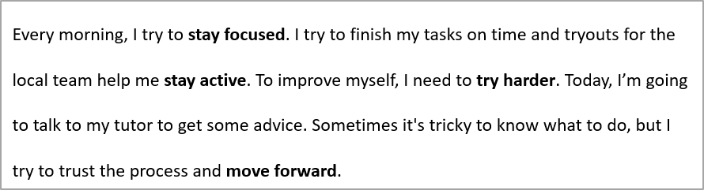

## **Przegląd**

Ten artykuł pokazuje, jak formatować tekst w prezentacjach PowerPoint i OpenDocument przy użyciu Aspose.Slides for Python via .NET. Obejmuje podświetlanie, kolory tła, przezroczystość, odstępy między znakami, właściwości czcionki, rotację, odstępy między akapitami, zachowanie autofit, kotwiczenie tekstu, tabulatory oraz ustawienia języka.

W poniższych przykładach użyjemy pliku o nazwie „sample.pptx”, który zawiera jedną ramkę tekstową na pierwszym slajdzie z następującym tekstem:


## **Podświetlanie tekstu**

Użyj metody [TextFrame.highlight_text](https://reference.aspose.com/slides/pl/python-net/aspose.slides/textframe/highlight_text/) wtedy, gdy potrzebujesz podświetlić tekst pasujący do określonego wzorca w ramce tekstowej. Metoda nakłada kolor podświetlenia na dopasowane fragmenty tekstu i może być używana wraz z [TextSearchOptions](https://reference.aspose.com/slides/pl/python-net/aspose.slides/textsearchoptions/), aby kontrolować sposób wyszukiwania, np. dopasowywać tylko całe wyrazy.

Poniższy przykład kodu podświetla wszystkie wystąpienia znaków **"try"**, a następnie podświetla tylko pełne słowo **"to"**.

```python
import aspose.pydrawing as draw
import aspose.slides as slides

with slides.Presentation("sample.pptx") as presentation:
    # Pobierz pierwszy kształt z pierwszego slajdu.
    shape = presentation.slides[0].shapes[0]

    # Podświetl słowo "try" w kształcie.
    shape.text_frame.highlight_text("try", draw.Color.light_blue)

    search_options = slides.TextSearchOptions()
    search_options.whole_words_only = True

    # Podświetl słowo "to" w kształcie.
    shape.text_frame.highlight_text("to", draw.Color.violet, search_options, None)

    presentation.save("highlighted_text.pptx", slides.export.SaveFormat.PPTX)
```

Wynik:


## **Podświetlanie tekstu przy użyciu wyrażeń regularnych**

Metoda [TextFrame.highlight_regex](https://reference.aspose.com/slides/pl/python-net/aspose.slides/textframe/highlight_regex/) podświetla dopasowania znalezione przez wyrażenie regularne. W Pythonie API to jest dostępne na obiekcie [TextFrame](https://reference.aspose.com/slides/pl/python-net/aspose.slides/textframe/).

Poniższy przykład kodu podświetla wszystkie słowa zawierające **siedem lub więcej znaków**:

```python
import aspose.pydrawing as draw
import aspose.slides as slides

with slides.Presentation("sample.pptx") as presentation:
    shape = presentation.slides[0].shapes[0]

    regex = r"\b[^\s]{7,}\b"

    # Podświetl wszystkie słowa mające siedem lub więcej znaków.
    shape.text_frame.highlight_regex(regex, draw.Color.yellow, None)

    presentation.save("highlighted_text_using_regex.pptx", slides.export.SaveFormat.PPTX)
```

Wynik:


## **Ustawienie koloru tła tekstu**

Użyj [ParagraphFormat.default_portion_format](https://reference.aspose.com/slides/pl/python-net/aspose.slides/paragraphformat/default_portion_format/), aby ustawić domyślny kolor podświetlenia dla akapitu, lub [PortionFormat.highlight_color](https://reference.aspose.com/slides/pl/python-net/aspose.slides/portionformat/highlight_color/) dla poszczególnych fragmentów tekstu.

Poniższy przykład kodu pokazuje, jak ustawić kolor tła dla **całego akapitu**:

```python
import aspose.pydrawing as draw
import aspose.slides as slides

with slides.Presentation("sample.pptx") as presentation:
    auto_shape = presentation.slides[0].shapes[0]
    paragraph = auto_shape.text_frame.paragraphs[0]

    # Ustaw kolor podświetlenia dla całego akapitu.
    paragraph.paragraph_format.default_portion_format.highlight_color.color = draw.Color.light_gray

    presentation.save("gray_paragraph.pptx", slides.export.SaveFormat.PPTX)
```

Wynik:


Poniższy przykład kodu demonstruje, jak ustawić kolor tła dla **fragmentów tekstu z pogrubioną czcionką**:

```python
import aspose.pydrawing as draw
import aspose.slides as slides

with slides.Presentation("sample.pptx") as presentation:
    auto_shape = presentation.slides[0].shapes[0]
    paragraph = auto_shape.text_frame.paragraphs[0]

    for portion in paragraph.portions:
        if portion.portion_format.get_effective().font_bold:
            # Ustaw kolor podświetlenia dla fragmentu tekstu.
            portion.portion_format.highlight_color.color = draw.Color.light_gray

    presentation.save("gray_text_portions.pptx", slides.export.SaveFormat.PPTX)
```

Wynik:


## **Wyrównywanie akapitów tekstu**

Użyj [ParagraphFormat.alignment](https://reference.aspose.com/slides/pl/python-net/aspose.slides/paragraphformat/alignment/), aby ustawić wyrównanie akapitu w ramce tekstowej. Wartość może być wyśrodkowana, wyrównana do lewej, prawej, justowana itp.

Poniższy przykład kodu pokazuje, jak wyrównać akapit do **środka**:

```python
import aspose.slides as slides

with slides.Presentation("sample.pptx") as presentation:
    auto_shape = presentation.slides[0].shapes[0]
    paragraph = auto_shape.text_frame.paragraphs[0]

    # Ustaw wyrównanie akapitu do środka.
    paragraph.paragraph_format.alignment = slides.TextAlignment.CENTER

    presentation.save("aligned_paragraph.pptx", slides.export.SaveFormat.PPTX)
```

Wynik:


## **Ustawienie przezroczystości tekstu**

Przezroczystość tekstu jest kontrolowana przez składnik alfa koloru przypisanego do [PortionFormat.fill_format](https://reference.aspose.com/slides/pl/python-net/aspose.slides/portionformat/fill_format/). W poniższych przykładach `alpha = 50` to wartość kanału alfa ARGB w skali 0‑255, a nie procent przezroczystości.

Poniższy przykład kodu pokazuje, jak zastosować przezroczystość do **całego akapitu**:

```python
import aspose.pydrawing as draw
import aspose.slides as slides

alpha = 50

with slides.Presentation("sample.pptx") as presentation:
    auto_shape = presentation.slides[0].shapes[0]
    paragraph = auto_shape.text_frame.paragraphs[0]

    # Ustaw kolor wypełnienia tekstu na przezroczysty.
    paragraph.paragraph_format.default_portion_format.fill_format.fill_type = slides.FillType.SOLID
    paragraph.paragraph_format.default_portion_format.fill_format.solid_fill_color.color = draw.Color.from_argb(alpha, draw.Color.black)

    presentation.save("transparent_paragraph.pptx", slides.export.SaveFormat.PPTX)
```

Wynik:


Poniższy przykład kodu pokazuje, jak zastosować przezroczystość do **fragmentów tekstu z pogrubioną czcionką**:

```python
import aspose.pydrawing as draw
import aspose.slides as slides

alpha = 50

with slides.Presentation("sample.pptx") as presentation:
    auto_shape = presentation.slides[0].shapes[0]
    paragraph = auto_shape.text_frame.paragraphs[0]

    for portion in paragraph.portions:
        if portion.portion_format.get_effective().font_bold:
            # Ustaw przezroczystość fragmentu tekstu.
            portion.portion_format.fill_format.fill_type = slides.FillType.SOLID
            portion.portion_format.fill_format.solid_fill_color.color = draw.Color.from_argb(alpha, draw.Color.black)

    presentation.save("transparent_text_portions.pptx", slides.export.SaveFormat.PPTX)
```

Wynik:


## **Ustawienie odstępu między znakami w tekście**

Użyj [BasePortionFormat.spacing](https://reference.aspose.com/slides/pl/python-net/aspose.slides/baseportionformat/spacing/), aby rozszerzyć lub zmniejszyć odstępy między znakami w ramce tekstowej.

Poniższy kod Pythona pokazuje, jak rozszerzyć odstęp między znakami w **całym akapicie**:

```python
import aspose.slides as slides

with slides.Presentation("sample.pptx") as presentation:
    auto_shape = presentation.slides[0].shapes[0]
    paragraph = auto_shape.text_frame.paragraphs[0]

    # Uwaga: użyj wartości ujemnych, aby zmniejszyć odstęp między znakami.
    paragraph.paragraph_format.default_portion_format.spacing = 3  # Rozszerz odstęp między znakami.

    presentation.save("character_spacing_in_paragraph.pptx", slides.export.SaveFormat.PPTX)
```

Wynik:


Poniższy przykład kodu pokazuje, jak rozszerzyć odstęp między znakami w **fragmentach tekstu z pogrubioną czcionką**:

```python
import aspose.slides as slides

with slides.Presentation("sample.pptx") as presentation:
    auto_shape = presentation.slides[0].shapes[0]
    paragraph = auto_shape.text_frame.paragraphs[0]

    for portion in paragraph.portions:
        if portion.portion_format.get_effective().font_bold:
            # Uwaga: użyj wartości ujemnych, aby zmniejszyć odstęp między znakami.
            portion.portion_format.spacing = 3  # Rozszerz odstęp między znakami.

    presentation.save("character_spacing_in_text_portions.pptx", slides.export.SaveFormat.PPTX)
```

Wynik:


### **Wyłączenie kerningu dla konkretnych czcionek**

W niektórych przypadkach tekst renderowany przez Aspose.Slides może wyglądać nieco ściślej niż taki sam tekst wyświetlany w PowerPoint. Może to wynikać z tego, że PowerPoint ignoruje dane kerningu dla niektórych czcionek, nawet gdy czcionka zawiera prawidłowe informacje o kerningu i kerning jest włączony w ustawieniach PowerPoint.

Aby w takich sytuacjach uzyskać wynik bardziej zbliżony do PowerPoint, możesz wyłączyć kerning dla fragmentów tekstu używających danej czcionki. Ustaw [PortionFormat.kerning_minimal_size](https://reference.aspose.com/slides/pl/python-net/aspose.slides/baseportionformat/kerning_minimal_size/) na wartość znacznie większą niż rzeczywisty rozmiar czcionki:

```python
import aspose.slides as slides

with slides.Presentation("presentation.pptx") as presentation:
    auto_shape = presentation.slides[0].shapes[0]
    target_font = "Roboto"

    for paragraph in auto_shape.text_frame.paragraphs:
        for portion in paragraph.portions:
            latin_font = portion.portion_format.latin_font
            east_asian_font = portion.portion_format.east_asian_font
            complex_script_font = portion.portion_format.complex_script_font

            if ((latin_font is not None and latin_font.font_name == target_font) or
                    (east_asian_font is not None and east_asian_font.font_name == target_font) or
                    (complex_script_font is not None and complex_script_font.font_name == target_font)):
                portion.portion_format.kerning_minimal_size = 100

    presentation.save("output.pptx", slides.export.SaveFormat.PPTX)
```

To ustawienie zapobiega stosowaniu kerningu do pasujących fragmentów tekstu i może pomóc wyrównać renderowanie Aspose.Slides z wizualnym wyjściem PowerPoint dla czcionek objętych tym zachowaniem specyficznym dla PowerPoint.

## **Zarządzanie właściwościami czcionki tekstu**

Właściwości czcionki można ustawić na poziomie akapitu za pośrednictwem [ParagraphFormat.default_portion_format](https://reference.aspose.com/slides/pl/python-net/aspose.slides/paragraphformat/default_portion_format/) lub na pojedynczych fragmentach za pomocą [PortionFormat](https://reference.aspose.com/slides/pl/python-net/aspose.slides/portionformat/).

Poniższy kod ustawia czcionkę i styl tekstu dla całego akapitu: stosuje rozmiar czcionki, pogrubienie, kursywę, kropkowane podkreślenie oraz czcionkę Times New Roman we wszystkich fragmentach akapitu.

```python
import aspose.slides as slides

with slides.Presentation("sample.pptx") as presentation:
    auto_shape = presentation.slides[0].shapes[0]
    paragraph = auto_shape.text_frame.paragraphs[0]

    # Ustaw właściwości czcionki dla akapitu.
    paragraph.paragraph_format.default_portion_format.font_height = 12
    paragraph.paragraph_format.default_portion_format.font_bold = slides.NullableBool.TRUE
    paragraph.paragraph_format.default_portion_format.font_italic = slides.NullableBool.TRUE
    paragraph.paragraph_format.default_portion_format.font_underline = slides.TextUnderlineType.DOTTED
    paragraph.paragraph_format.default_portion_format.latin_font = slides.FontData("Times New Roman")

    presentation.save("font_properties_for_paragraph.pptx", slides.export.SaveFormat.PPTX)
```

Wynik:


Poniższy przykład kodu stosuje podobne właściwości do **fragmentów tekstu z pogrubioną czcionką**:

```python
import aspose.slides as slides

with slides.Presentation("sample.pptx") as presentation:
    auto_shape = presentation.slides[0].shapes[0]
    paragraph = auto_shape.text_frame.paragraphs[0]

    for portion in paragraph.portions:
        if portion.portion_format.get_effective().font_bold:
            # Ustaw właściwości czcionki dla fragmentu tekstu.
            portion.portion_format.font_height = 13
            portion.portion_format.font_italic = slides.NullableBool.TRUE
            portion.portion_format.font_underline = slides.TextUnderlineType.DOTTED
            portion.portion_format.latin_font = slides.FontData("Times New Roman")

    presentation.save("font_properties_for_text_portions.pptx", slides.export.SaveFormat.PPTX)
```

Wynik:


## **Ustawienie rotacji tekstu**

Użyj [TextFrameFormat.text_vertical_type](https://reference.aspose.com/slides/pl/python-net/aspose.slides/textframeformat/text_vertical_type/), aby ustawić predefiniowaną orientację tekstu w kształcie.

Poniższy przykład kodu ustawia orientację tekstu w kształcie na `VERTICAL270`, co obraca tekst **o 90 stopni przeciwnie do ruchu wskazówek zegara**:

```python
import aspose.slides as slides

with slides.Presentation("sample.pptx") as presentation:
    auto_shape = presentation.slides[0].shapes[0]

    auto_shape.text_frame.text_frame_format.text_vertical_type = slides.TextVerticalType.VERTICAL270

    presentation.save("text_rotation.pptx", slides.export.SaveFormat.PPTX)
```

Wynik:


## **Ustawienie niestandardowej rotacji dla ramek tekstowych**

Użyj [TextFrameFormat.rotation_angle](https://reference.aspose.com/slides/pl/python-net/aspose.slides/textframeformat/rotation_angle/), aby ustawić własny kąt rotacji dla [TextFrame](https://reference.aspose.com/slides/pl/python-net/aspose.slides/textframe/).

Poniższy przykład kodu obraca ramkę tekstową o 3 stopnie zgodnie z ruchem wskazówek zegara w obrębie kształtu:

```python
import aspose.slides as slides

with slides.Presentation("sample.pptx") as presentation:
    auto_shape = presentation.slides[0].shapes[0]

    auto_shape.text_frame.text_frame_format.rotation_angle = 3

    presentation.save("custom_text_rotation.pptx", slides.export.SaveFormat.PPTX)
```

Wynik:


## **Ustawienie interlinii akapitów**

Aspose.Slides udostępnia [ParagraphFormat.space_after](https://reference.aspose.com/slides/pl/python-net/aspose.slides/paragraphformat/space_after/), [ParagraphFormat.space_before](https://reference.aspose.com/slides/pl/python-net/aspose.slides/paragraphformat/space_before/), oraz [ParagraphFormat.space_within](https://reference.aspose.com/slides/pl/python-net/aspose.slides/paragraphformat/space_within/), aby kontrolować odstępy między akapitami. Właściwości te używa się w następujący sposób:

* Użyj dodatniej wartości, aby określić interlinię jako procent wysokości linii.
* Użyj ujemnej wartości, aby określić interlinię w punktach.

Poniższy przykład kodu pokazuje, jak określić interlinię w akapicie:

```python
import aspose.slides as slides

with slides.Presentation("sample.pptx") as presentation:
    auto_shape = presentation.slides[0].shapes[0]
    paragraph = auto_shape.text_frame.paragraphs[0]

    paragraph.paragraph_format.space_within = 200

    presentation.save("line_spacing.pptx", slides.export.SaveFormat.PPTX)
```

Wynik:



## **Ustawienie typu dopasowywania automatycznego dla ramek tekstowych**

[TextFrameFormat.autofit_type](https://reference.aspose.com/slides/pl/python-net/aspose.slides/textframeformat/autofit_type/) określa, jak tekst zachowuje się, gdy przekracza granice swojego kontenera. Użyj go, aby kontrolować, czy tekst ma się zmniejszyć, wyciekać poza ramkę lub automatycznie zmienić rozmiar kształtu.

```python
import aspose.slides as slides

with slides.Presentation("sample.pptx") as presentation:
    auto_shape = presentation.slides[0].shapes[0]

    auto_shape.text_frame.text_frame_format.autofit_type = slides.TextAutofitType.SHAPE

    presentation.save("autofit_type.pptx", slides.export.SaveFormat.PPTX)
```

## **Ustawienie kotwiczenia ramek tekstowych**

[TextFrameFormat.anchoring_type](https://reference.aspose.com/slides/pl/python-net/aspose.slides/textframeformat/anchoring_type/) definiuje, jak tekst jest pozycjonowany w pionie wewnątrz kształtu, np. u góry, w środku lub na dole.

```python
import aspose.slides as slides

with slides.Presentation("sample.pptx") as presentation:
    auto_shape = presentation.slides[0].shapes[0]

    auto_shape.text_frame.text_frame_format.anchoring_type = slides.TextAnchorType.BOTTOM

    presentation.save("text_anchor.pptx", slides.export.SaveFormat.PPTX)
```

## **Ustawienie tabulacji tekstu**

Użyj [ParagraphFormat.default_tab_size](https://reference.aspose.com/slides/pl/python-net/aspose.slides/paragraphformat/default_tab_size/) i [ParagraphFormat.tabs](https://reference.aspose.com/slides/pl/python-net/aspose.slides/paragraphformat/tabs/), aby skonfigurować tabulatory w akapicie.

```python
import aspose.slides as slides

with slides.Presentation("sample.pptx") as presentation:
    auto_shape = presentation.slides[0].shapes[0]
    paragraph = auto_shape.text_frame.paragraphs[0]

    paragraph.paragraph_format.default_tab_size = 100
    paragraph.paragraph_format.tabs.add(30, slides.TabAlignment.LEFT)

    presentation.save("paragraph_tabs.pptx", slides.export.SaveFormat.PPTX)
```

Wynik:


## **Ustawienie języka korekty**

Aspose.Slides udostępnia [PortionFormat.language_id](https://reference.aspose.com/slides/pl/python-net/aspose.slides/portionformat/language_id/), który pozwala ustawić język korekty dla fragmentu tekstu. Język korekty określa, w jakim języku będą przeprowadzane sprawdzanie pisowni i gramatyki w PowerPoint.

Poniższy przykład kodu pokazuje, jak ustawić język korekty dla fragmentu tekstu:

```python
import aspose.slides as slides

with slides.Presentation("presentation.pptx") as presentation:
    auto_shape = presentation.slides[0].shapes[0]

    paragraph = auto_shape.text_frame.paragraphs[0]
    paragraph.portions.clear()

    font = slides.FontData("SimSun")

    text_portion = slides.Portion()
    text_portion.portion_format.complex_script_font = font
    text_portion.portion_format.east_asian_font = font
    text_portion.portion_format.latin_font = font

    # Ustaw identyfikator języka korekty.
    text_portion.portion_format.language_id = "zh-CN"

    text_portion.text = "1."
    paragraph.portions.add(text_portion)

    presentation.save("proofing_language.pptx", slides.export.SaveFormat.PPTX)
```

## **Ustawienie języka domyślnego**

Użyj [LoadOptions.default_text_language](https://reference.aspose.com/slides/pl/python-net/aspose.slides/loadoptions/default_text_language/), aby określić domyślny język dla tekstu tworzonego podczas ładowania lub tworzenia prezentacji.

```python
import aspose.slides as slides

load_options = slides.LoadOptions()
load_options.default_text_language = "en-US"

with slides.Presentation(load_options) as presentation:
    slide = presentation.slides[0]

    # Dodaj nowy prostokątny kształt z tekstem.
    shape = slide.shapes.add_auto_shape(slides.ShapeType.RECTANGLE, 20, 20, 150, 50)
    shape.text_frame.text = "Sample text"

    # Sprawdź język pierwszego fragmentu.
    portion = shape.text_frame.paragraphs[0].portions[0]
    print(portion.portion_format.language_id)
```

## **Ustawienie domyślnego stylu tekstu**

Aby zastosować domyślne formatowanie tekstu na poziomie prezentacji, użyj [Presentation.default_text_style](https://reference.aspose.com/slides/pl/python-net/aspose.slides/presentation/default_text_style/).

Poniższy przykład kodu pokazuje, jak ustawić domyślną pogrubioną czcionkę o rozmiarze 14 pt dla całego tekstu we wszystkich slajdach nowej prezentacji.

```python
import aspose.slides as slides

with slides.Presentation() as presentation:
    # Pobierz format akapitu najwyższego poziomu.
    paragraph_format = presentation.default_text_style.get_level(0)

    if paragraph_format is not None:
        paragraph_format.default_portion_format.font_height = 14
        paragraph_format.default_portion_format.font_bold = slides.NullableBool.TRUE

    presentation.save("default_text_style.pptx", slides.export.SaveFormat.PPTX)
```

## **Wyodrębnianie tekstu z efektem wielkich liter**

W PowerPoint zastosowanie efektu **All Caps** powoduje, że tekst wyświetlany jest wielkimi literami na slajdzie, nawet jeśli został wpisany małymi literami. Gdy pobierasz taki fragment tekstu za pomocą Aspose.Slides, biblioteka zwraca tekst dokładnie tak, jak został wprowadzony. Aby uzyskać wyświetlany tekst, sprawdź [TextCapType](https://reference.aspose.com/slides/pl/python-net/aspose.slides/textcaptype/) i przekształć zwrócony ciąg na wielkie litery, gdy wartość wynosi `ALL`.

Załóżmy, że mamy następującą ramkę tekstową na pierwszym slajdzie pliku sample2.pptx.


Poniższy przykład kodu pokazuje, jak wyodrębnić tekst z zastosowanym efektem **All Caps**:

```python
import aspose.slides as slides

with slides.Presentation("sample2.pptx") as presentation:
    auto_shape = presentation.slides[0].shapes[0]
    text_portion = auto_shape.text_frame.paragraphs[0].portions[0]

    print("Original text:", text_portion.text)

    text_format = text_portion.portion_format.get_effective()
    if text_format.text_cap_type == slides.TextCapType.ALL:
        text = text_portion.text.upper()
        print("All-Caps effect:", text)
```

Output:

```text
Original text: Hello, Aspose!
All-Caps effect: HELLO, ASPOSE!
```

## **FAQ**

**Jak zmodyfikować tekst w tabeli na slajdzie?**

Aby zmodyfikować tekst w tabeli na slajdzie, użyj [Table](https://reference.aspose.com/slides/pl/python-net/aspose.slides/table/). Iteruj po komórkach i aktualizuj każdą komórkę poprzez [Cell.text_frame](https://reference.aspose.com/slides/pl/python-net/aspose.slides/cell/text_frame/) oraz formatowanie akapitu przez [Paragraph.paragraph_format](https://reference.aspose.com/slides/pl/python-net/aspose.slides/paragraph/paragraph_format/).

**Jak zastosować gradientowy kolor tekstu w slajdzie PowerPoint?**

Aby zastosować gradientowy kolor do tekstu, użyj [PortionFormat.fill_format](https://reference.aspose.com/slides/pl/python-net/aspose.slides/portionformat/fill_format/). Ustaw [FillFormat.fill_type](https://reference.aspose.com/slides/pl/python-net/aspose.slides/fillformat/fill_type/) na [FillType.GRADIENT](https://reference.aspose.com/slides/pl/python-net/aspose.slides/filltype/) i skonfiguruj przystanki gradientu, kierunek oraz przezroczystość.