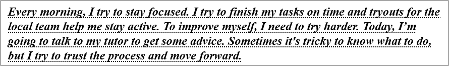

## **Przegląd**

Ten artykuł pokazuje, jak formatować tekst w prezentacjach PowerPoint i OpenDocument przy użyciu Aspose.Slides for Python via .NET. Omówione są kolory tła, przezroczystość, odstępy między znakami, właściwości czcionki, rotacja, odstępy między akapitami, zachowanie autofitu, kotwiczenie tekstu, tabulatory i ustawienia języka.

W poniższych przykładach użyjemy pliku o nazwie "sample.pptx", który zawiera pojedyncze pole tekstowe na pierwszym slajdzie z następującym tekstem:


Aby znaleźć i podświetlić dosłowny tekst lub dopasowania wyrażeń regularnych, zobacz [Wyszukiwanie i zamiana tekstu](/slides/pl/python-net/search-and-replace-text/).

## **Ustaw kolor tła tekstu**

Użyj [ParagraphFormat.default_portion_format](https://reference.aspose.com/slides/pl/python-net/aspose.slides/paragraphformat/default_portion_format/) aby ustawić domyślny kolor podświetlenia dla akapitu lub użyj [PortionFormat.highlight_color](https://reference.aspose.com/slides/pl/python-net/aspose.slides/portionformat/highlight_color/) dla poszczególnych fragmentów tekstu.

Poniższy przykład kodu pokazuje, jak ustawić kolor tła dla **całego akapitu**:

```python
import aspose.pydrawing as draw
import aspose.slides as slides

with slides.Presentation("sample.pptx") as presentation:
    auto_shape = presentation.slides[0].shapes[0]
    paragraph = auto_shape.text_frame.paragraphs[0]

    # Ustaw kolor podświetlenia dla całego akapitu.
    paragraph.paragraph_format.default_portion_format.highlight_color.color = draw.Color.light_gray

    presentation.save("gray_paragraph.pptx", slides.export.SaveFormat.PPTX)
```

Wynik:


Poniższy przykład kodu demonstruje, jak ustawić kolor tła dla **fragmentów tekstu z pogrubioną czcionką**:

```python
import aspose.pydrawing as draw
import aspose.slides as slides

with slides.Presentation("sample.pptx") as presentation:
    auto_shape = presentation.slides[0].shapes[0]
    paragraph = auto_shape.text_frame.paragraphs[0]

    for portion in paragraph.portions:
        if portion.portion_format.get_effective().font_bold:
            # Ustaw kolor podświetlenia dla fragmentu tekstu.
            portion.portion_format.highlight_color.color = draw.Color.light_gray

    presentation.save("gray_text_portions.pptx", slides.export.SaveFormat.PPTX)
```

Wynik:


## **Wyrównaj akapity tekstu**

Użyj [ParagraphFormat.alignment](https://reference.aspose.com/slides/pl/python-net/aspose.slides/paragraphformat/alignment/) aby ustawić wyrównanie akapitu w ramce tekstowej. Wartość może być wyśrodkowana, wyrównana do lewej, do prawej, wyjustowana itp.

Poniższy przykład kodu pokazuje, jak wyrównać akapit do **środka**:

```python
import aspose.slides as slides

with slides.Presentation("sample.pptx") as presentation:
    auto_shape = presentation.slides[0].shapes[0]
    paragraph = auto_shape.text_frame.paragraphs[0]

    # Ustaw wyrównanie akapitu do środka.
    paragraph.paragraph_format.alignment = slides.TextAlignment.CENTER

    presentation.save("aligned_paragraph.pptx", slides.export.SaveFormat.PPTX)
```

Wynik:


## **Ustaw przezroczystość tekstu**

Przezroczystość tekstu jest kontrolowana przez składnik alfa koloru przypisanego do [PortionFormat.fill_format](https://reference.aspose.com/slides/pl/python-net/aspose.slides/portionformat/fill_format/). W poniższych przykładach `alpha = 50` jest wartością kanału alfa ARGB w skali 0‑255, a nie procentem przezroczystości.

Poniższy przykład kodu pokazuje, jak zastosować przezroczystość do **całego akapitu**:

```python
import aspose.pydrawing as draw
import aspose.slides as slides

alpha = 50

with slides.Presentation("sample.pptx") as presentation:
    auto_shape = presentation.slides[0].shapes[0]
    paragraph = auto_shape.text_frame.paragraphs[0]

    # Ustaw kolor wypełnienia tekstu na kolor przezroczysty.
    paragraph.paragraph_format.default_portion_format.fill_format.fill_type = slides.FillType.SOLID
    paragraph.paragraph_format.default_portion_format.fill_format.solid_fill_color.color = draw.Color.from_argb(alpha, draw.Color.black)

    presentation.save("transparent_paragraph.pptx", slides.export.SaveFormat.PPTX)
```

Wynik:


Poniższy przykład kodu pokazuje, jak zastosować przezroczystość do **fragmentów tekstu z pogrubioną czcionką**:

```python
import aspose.pydrawing as draw
import aspose.slides as slides

alpha = 50

with slides.Presentation("sample.pptx") as presentation:
    auto_shape = presentation.slides[0].shapes[0]
    paragraph = auto_shape.text_frame.paragraphs[0]

    for portion in paragraph.portions:
        if portion.portion_format.get_effective().font_bold:
            # Ustaw przezroczystość fragmentu tekstu.
            portion.portion_format.fill_format.fill_type = slides.FillType.SOLID
            portion.portion_format.fill_format.solid_fill_color.color = draw.Color.from_argb(alpha, draw.Color.black)

    presentation.save("transparent_text_portions.pptx", slides.export.SaveFormat.PPTX)
```

Wynik:


## **Ustaw odstęp między znakami w tekście**

Użyj [BasePortionFormat.spacing](https://reference.aspose.com/slides/pl/python-net/aspose.slides/baseportionformat/spacing/) aby rozszerzyć lub zredukować odstępy między znakami w polu tekstowym.

Poniższy kod Pythona pokazuje, jak rozszerzyć odstęp między znakami w **całym akapicie**:

```python
import aspose.slides as slides

with slides.Presentation("sample.pptx") as presentation:
    auto_shape = presentation.slides[0].shapes[0]
    paragraph = auto_shape.text_frame.paragraphs[0]

    # Uwaga: Użyj wartości ujemnych, aby zmniejszyć odstęp między znakami.
    paragraph.paragraph_format.default_portion_format.spacing = 3  # Rozszerz odstęp między znakami.

    presentation.save("character_spacing_in_paragraph.pptx", slides.export.SaveFormat.PPTX)
```

Wynik:


Poniższy przykład kodu pokazuje, jak rozszerzyć odstęp między znakami w **fragmentach tekstu z pogrubioną czcionką**:

```python
import aspose.slides as slides

with slides.Presentation("sample.pptx") as presentation:
    auto_shape = presentation.slides[0].shapes[0]
    paragraph = auto_shape.text_frame.paragraphs[0]

    for portion in paragraph.portions:
        if portion.portion_format.get_effective().font_bold:
            # Uwaga: Użyj wartości ujemnych, aby zmniejszyć odstęp między znakami.
            portion.portion_format.spacing = 3  # Rozszerz odstęp między znakami.

    presentation.save("character_spacing_in_text_portions.pptx", slides.export.SaveFormat.PPTX)
```

Wynik:


### **Wyłącz kerning dla określonych czcionek**

W niektórych przypadkach tekst renderowany przez Aspose.Slides może wyglądać nieco bardziej skompresowanie niż ten sam tekst wyświetlany w PowerPoint. Może się tak zdarzyć, ponieważ PowerPoint może ignorować dane kerningu dla niektórych czcionek, nawet gdy czcionka zawiera prawidłowe informacje o kerningu i kerning jest włączony w ustawieniach PowerPoint.

Aby uzyskać wynik bardziej zbliżony do PowerPoint w takich sytuacjach, możesz wyłączyć kerning dla fragmentów tekstu używających dotkniętej czcionki. Ustaw [BasePortionFormat.kerning_minimal_size](https://reference.aspose.com/slides/pl/python-net/aspose.slides/baseportionformat/kerning_minimal_size/) na wartość znacząco większą niż rzeczywisty rozmiar czcionki:

```python
import aspose.slides as slides

with slides.Presentation("presentation.pptx") as presentation:
    auto_shape = presentation.slides[0].shapes[0]
    target_font = "Roboto"

    for paragraph in auto_shape.text_frame.paragraphs:
        for portion in paragraph.portions:
            latin_font = portion.portion_format.latin_font
            east_asian_font = portion.portion_format.east_asian_font
            complex_script_font = portion.portion_format.complex_script_font

            if ((latin_font is not None and latin_font.font_name == target_font) or
                    (east_asian_font is not None and east_asian_font.font_name == target_font) or
                    (complex_script_font is not None and complex_script_font.font_name == target_font)):
                portion.portion_format.kerning_minimal_size = 100

    presentation.save("output.pptx", slides.export.SaveFormat.PPTX)
```

To ustawienie zapobiega stosowaniu kerningu do pasujących fragmentów tekstu i może pomóc dopasować renderowanie Aspose.Slides do wizualnego efektu PowerPoint dla czcionek podlegających temu zachowaniu specyficznemu dla PowerPoint.

## **Zarządzaj właściwościami czcionki tekstu**

Właściwości czcionki można ustawiać na poziomie akapitu przez [ParagraphFormat.default_portion_format](https://reference.aspose.com/slides/pl/python-net/aspose.slides/paragraphformat/default_portion_format/) lub na poszczególnych fragmentach przez [PortionFormat](https://reference.aspose.com/slides/pl/python-net/aspose.slides/portionformat/).

Poniższy kod ustawia czcionkę i styl tekstu dla całego akapitu: stosuje rozmiar czcionki, pogrubienie, kursywę, kreskowane podkreślenie oraz czcionkę Times New Roman do wszystkich fragmentów w akapicie.

```python
import aspose.slides as slides

with slides.Presentation("sample.pptx") as presentation:
    auto_shape = presentation.slides[0].shapes[0]
    paragraph = auto_shape.text_frame.paragraphs[0]

    # Ustaw właściwości czcionki dla akapitu.
    paragraph.paragraph_format.default_portion_format.font_height = 12
    paragraph.paragraph_format.default_portion_format.font_bold = slides.NullableBool.TRUE
    paragraph.paragraph_format.default_portion_format.font_italic = slides.NullableBool.TRUE
    paragraph.paragraph_format.default_portion_format.font_underline = slides.TextUnderlineType.DOTTED
    paragraph.paragraph_format.default_portion_format.latin_font = slides.FontData("Times New Roman")

    presentation.save("font_properties_for_paragraph.pptx", slides.export.SaveFormat.PPTX)
```

Wynik:



Poniższy przykład kodu stosuje podobne właściwości do **fragmentów tekstu z pogrubioną czcionką**:

```python
import aspose.slides as slides

with slides.Presentation("sample.pptx") as presentation:
    auto_shape = presentation.slides[0].shapes[0]
    paragraph = auto_shape.text_frame.paragraphs[0]

    for portion in paragraph.portions:
        if portion.portion_format.get_effective().font_bold:
            # Ustaw właściwości czcionki dla fragmentu tekstu.
            portion.portion_format.font_height = 13
            portion.portion_format.font_italic = slides.NullableBool.TRUE
            portion.portion_format.font_underline = slides.TextUnderlineType.DOTTED
            portion.portion_format.latin_font = slides.FontData("Times New Roman")

    presentation.save("font_properties_for_text_portions.pptx", slides.export.SaveFormat.PPTX)
```

Wynik:


## **Ustaw rotację tekstu**

Użyj [TextFrameFormat.text_vertical_type](https://reference.aspose.com/slides/pl/python-net/aspose.slides/textframeformat/text_vertical_type/) aby ustawić predefiniowaną orientację tekstu w kształcie.

Poniższy przykład kodu ustawia orientację tekstu w kształcie na `VERTICAL270`, co obraca tekst **o 90 stopni przeciwnie do ruchu wskazówek zegara**:

```python
import aspose.slides as slides

with slides.Presentation("sample.pptx") as presentation:
    auto_shape = presentation.slides[0].shapes[0]

    auto_shape.text_frame.text_frame_format.text_vertical_type = slides.TextVerticalType.VERTICAL270

    presentation.save("text_rotation.pptx", slides.export.SaveFormat.PPTX)
```

Wynik:


## **Ustaw własną rotację dla ramek tekstowych**

Użyj [TextFrameFormat.rotation_angle](https://reference.aspose.com/slides/pl/python-net/aspose.slides/textframeformat/rotation_angle/) aby ustawić własny kąt rotacji dla [TextFrame](https://reference.aspose.com/slides/pl/python-net/aspose.slides/textframe/).

Poniższy przykład kodu obraca ramkę tekstową o 3 stopnie zgodnie z ruchem wskazówek zegara w kształcie:

```python
import aspose.slides as slides

with slides.Presentation("sample.pptx") as presentation:
    auto_shape = presentation.slides[0].shapes[0]

    auto_shape.text_frame.text_frame_format.rotation_angle = 3

    presentation.save("custom_text_rotation.pptx", slides.export.SaveFormat.PPTX)
```

Wynik:


## **Ustaw odstęp wierszy w akapitach**

Aspose.Slides udostępnia [ParagraphFormat.space_after](https://reference.aspose.com/slides/pl/python-net/aspose.slides/paragraphformat/space_after/), [ParagraphFormat.space_before](https://reference.aspose.com/slides/pl/python-net/aspose.slides/paragraphformat/space_before/) i [ParagraphFormat.space_within](https://reference.aspose.com/slides/pl/python-net/aspose.slides/paragraphformat/space_within/) do kontrolowania odstępów między akapitami. Właściwości te stosuje się w następujący sposób:

* Użyj wartości dodatniej, aby określić odstęp wierszy jako procent wysokości wiersza.
* Użyj wartości ujemnej, aby określić odstęp wierszy w punktach.

Poniższy przykład kodu pokazuje, jak określić odstęp wierszy w akapicie:

```python
import aspose.slides as slides

with slides.Presentation("sample.pptx") as presentation:
    auto_shape = presentation.slides[0].shapes[0]
    paragraph = auto_shape.text_frame.paragraphs[0]

    paragraph.paragraph_format.space_within = 200

    presentation.save("line_spacing.pptx", slides.export.SaveFormat.PPTX)
```

Wynik:


## **Ustaw typ dopasowania automatycznego dla ramek tekstowych**

[TextFrameFormat.autofit_type](https://reference.aspose.com/slides/pl/python-net/aspose.slides/textframeformat/autofit_type/) określa, jak tekst zachowuje się, gdy przekracza granice swojego kontenera. Użyj go, aby kontrolować, czy tekst się zmniejsza, wypływa poza ramkę lub automatycznie zmienia rozmiar kształtu.

```python
import aspose.slides as slides

with slides.Presentation("sample.pptx") as presentation:
    auto_shape = presentation.slides[0].shapes[0]

    auto_shape.text_frame.text_frame_format.autofit_type = slides.TextAutofitType.SHAPE

    presentation.save("autofit_type.pptx", slides.export.SaveFormat.PPTX)
```

Aby policzyć linie po automatycznym zawijaniu i zobaczyć, jak zmiana szerokości tekstu lub kształtu wpływa na wynik, zobacz [Count Rendered Lines](/slides/pl/python-net/manage-paragraph/). Same liczenie linii nie wskazuje, czy tekst wypływa poza kontener.

## **Ustaw kotwicę ramek tekstowych**

[TextFrameFormat.anchoring_type](https://reference.aspose.com/slides/pl/python-net/aspose.slides/textframeformat/anchoring_type/) definiuje, jak tekst jest pozycjonowany pionowo wewnątrz kształtu, np. na górze, w środku lub na dole.

```python
import aspose.slides as slides

with slides.Presentation("sample.pptx") as presentation:
    auto_shape = presentation.slides[0].shapes[0]

    auto_shape.text_frame.text_frame_format.anchoring_type = slides.TextAnchorType.BOTTOM

    presentation.save("text_anchor.pptx", slides.export.SaveFormat.PPTX)
```

## **Ustaw tabulację tekstu**

Użyj [ParagraphFormat.default_tab_size](https://reference.aspose.com/slides/pl/python-net/aspose.slides/paragraphformat/default_tab_size/) i [ParagraphFormat.tabs](https://reference.aspose.com/slides/pl/python-net/aspose.slides/paragraphformat/tabs/) aby skonfigurować tabulatory w akapicie.

```python
import aspose.slides as slides

with slides.Presentation("sample.pptx") as presentation:
    auto_shape = presentation.slides[0].shapes[0]
    paragraph = auto_shape.text_frame.paragraphs[0]

    paragraph.paragraph_format.default_tab_size = 100
    paragraph.paragraph_format.tabs.add(30, slides.TabAlignment.LEFT)

    presentation.save("paragraph_tabs.pptx", slides.export.SaveFormat.PPTX)
```

Wynik:


## **Ustaw język korekty**

Aspose.Slides udostępnia [PortionFormat.language_id](https://reference.aspose.com/slides/pl/python-net/aspose.slides/portionformat/language_id/), co pozwala ustawić język korekty dla fragmentu tekstu. Język korekty określa język używany do sprawdzania pisowni i gramatyki w PowerPoint.

Poniższy przykład kodu pokazuje, jak ustawić język korekty dla fragmentu tekstu:

```python
import aspose.slides as slides

with slides.Presentation("presentation.pptx") as presentation:
    auto_shape = presentation.slides[0].shapes[0]

    paragraph = auto_shape.text_frame.paragraphs[0]
    paragraph.portions.clear()

    font = slides.FontData("SimSun")

    text_portion = slides.Portion()
    text_portion.portion_format.complex_script_font = font
    text_portion.portion_format.east_asian_font = font
    text_portion.portion_format.latin_font = font

    # Ustaw Id języka korekty.
    text_portion.portion_format.language_id = "zh-CN"

    text_portion.text = "1。"
    paragraph.portions.add(text_portion)

    presentation.save("proofing_language.pptx", slides.export.SaveFormat.PPTX)
```

## **Ustaw język domyślny**

Użyj [LoadOptions.default_text_language](https://reference.aspose.com/slides/pl/python-net/aspose.slides/loadoptions/default_text_language/) aby zdefiniować domyślny język dla tekstu tworzonego podczas ładowania lub tworzenia prezentacji.

```python
import aspose.slides as slides

load_options = slides.LoadOptions()
load_options.default_text_language = "en-US"

with slides.Presentation(load_options) as presentation:
    slide = presentation.slides[0]

    # Dodaj nowy prostokątny kształt z tekstem.
    shape = slide.shapes.add_auto_shape(slides.ShapeType.RECTANGLE, 20, 20, 150, 50)
    shape.text_frame.text = "Sample text"

    # Sprawdź język pierwszego fragmentu.
    portion = shape.text_frame.paragraphs[0].portions[0]
    print(portion.portion_format.language_id)
```

## **Ustaw domyślny styl tekstu**

Aby zastosować domyślne formatowanie tekstu na poziomie prezentacji, użyj [Presentation.default_text_style](https://reference.aspose.com/slides/pl/python-net/aspose.slides/presentation/default_text_style/).

Poniższy przykład kodu pokazuje, jak ustawić domyślną pogrubioną czcionkę o rozmiarze 14 pt dla całego tekstu we wszystkich slajdach nowej prezentacji.

```python
import aspose.slides as slides

with slides.Presentation() as presentation:
    # Pobierz format akapitu najwyższego poziomu.
    paragraph_format = presentation.default_text_style.get_level(0)

    if paragraph_format is not None:
        paragraph_format.default_portion_format.font_height = 14
        paragraph_format.default_portion_format.font_bold = slides.NullableBool.TRUE

    presentation.save("default_text_style.pptx", slides.export.SaveFormat.PPTX)
```

## **Wyodrębnij tekst z efektem wielkich liter**

W PowerPoint zastosowanie efektu **All Caps** powoduje, że tekst wyświetlany jest wielkimi literami na slajdzie, nawet jeśli został wpisany małymi. Podczas pobierania takiego fragmentu tekstu za pomocą Aspose.Slides biblioteka zwraca dokładnie wprowadzony tekst. Aby dopasować wynik do wyświetlanego tekstu, sprawdź [TextCapType](https://reference.aspose.com/slides/pl/python-net/aspose.slides/textcaptype/) i przekonwertuj zwrócony ciąg na wielkie litery, gdy wartość wynosi `ALL`.

Załóżmy, że mamy następujące pole tekstowe na pierwszym slajdzie pliku sample2.pptx.


Poniższy przykład kodu pokazuje, jak wyodrębnić tekst z zastosowanym efektem **All Caps**:

```python
import aspose.slides as slides

with slides.Presentation("sample2.pptx") as presentation:
    auto_shape = presentation.slides[0].shapes[0]
    text_portion = auto_shape.text_frame.paragraphs[0].portions[0]

    print("Original text:", text_portion.text)

    text_format = text_portion.portion_format.get_effective()
    if text_format.text_cap_type == slides.TextCapType.ALL:
        text = text_portion.text.upper()
        print("All-Caps effect:", text)
```

Output:

```text
Original text: Hello, Aspose!
All-Caps effect: HELLO, ASPOSE!
```

## **FAQ**

**Jak zmodyfikować tekst w tabeli na slajdzie?**

Aby zmodyfikować tekst w tabeli na slajdzie, użyj [Table](https://reference.aspose.com/slides/pl/python-net/aspose.slides/table/). Iteruj przez komórki i aktualizuj każdą komórkę poprzez [Cell.text_frame](https://reference.aspose.com/slides/pl/python-net/aspose.slides/cell/text_frame/) oraz formatowanie akapitu poprzez [Paragraph.paragraph_format](https://reference.aspose.com/slides/pl/python-net/aspose.slides/paragraph/paragraph_format/).

**Jak zastosować gradientowy kolor do tekstu na slajdzie PowerPoint?**

Aby zastosować gradientowy kolor do tekstu, użyj [PortionFormat.fill_format](https://reference.aspose.com/slides/pl/python-net/aspose.slides/portionformat/fill_format/). Ustaw [FillFormat.fill_type](https://reference.aspose.com/slides/pl/python-net/aspose.slides/fillformat/fill_type/) na [FillType.GRADIENT](https://reference.aspose.com/slides/pl/python-net/aspose.slides/filltype/) i skonfiguruj przystanki gradientu, kierunek oraz przezroczystość.