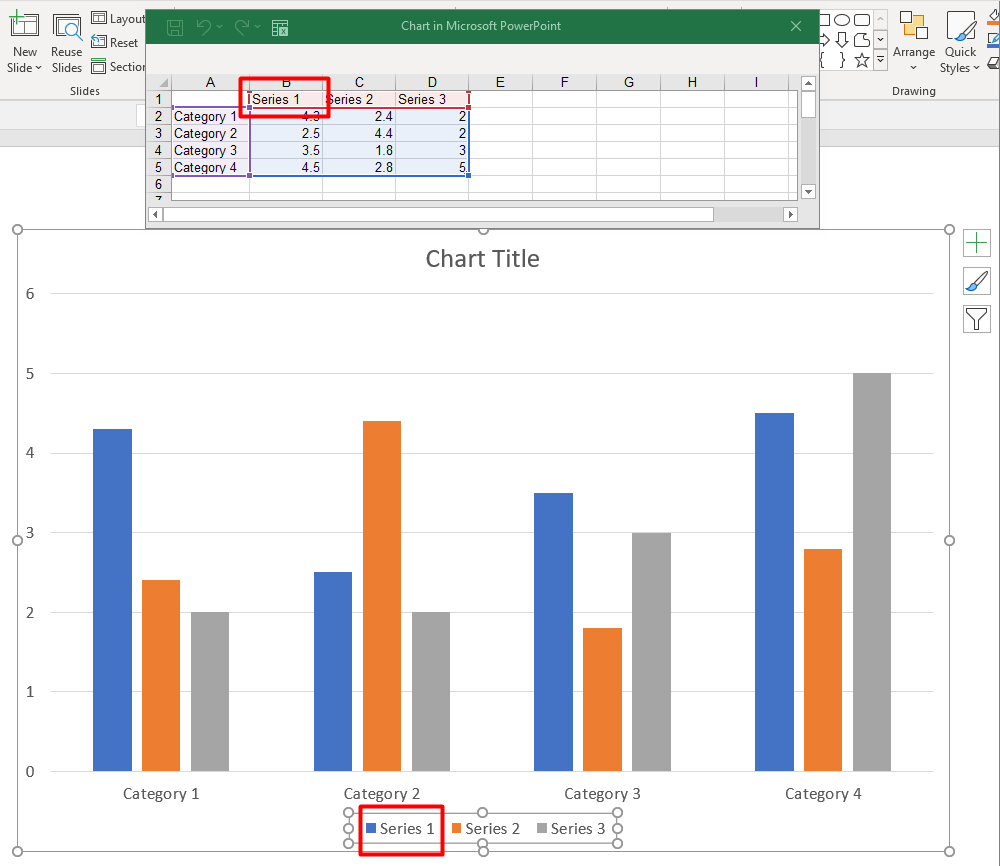

## **Przegląd**

Wykres przechowuje swoje dane wykreślone w skoroszycie danych wykresu. [ChartSeries](https://reference.aspose.com/slides/python-net/aspose.slides.charts/chartseries/) reprezentuje jeden zestaw powiązanych wartości, a każdy [ChartDataPoint](https://reference.aspose.com/slides/python-net/aspose.slides.charts/chartdatapoint/) w serii odnosi się do jednej lub wielu komórek skoroszytu. Obiekty [ChartCategory](https://reference.aspose.com/slides/python-net/aspose.slides.charts/chartcategory/) dostarczają etykiety lub wartości grupujące współdzielone przez serie. Nazwa serii, kategorie i wartości punktów są więc połączone z obiektami [ChartDataCell](https://reference.aspose.com/slides/python-net/aspose.slides.charts/chartdatacell/), a nie przechowywane wyłącznie jako tekst wyświetlany.

Dla typowego wykresu kategorii domyślny skoroszyt używa wiersza 0 dla nazw serii, kolumny 0 dla nazw kategorii oraz pozostałych komórek dla wartości serii. Indeksy arkusza, wiersza i kolumny przekazywane do [ChartDataWorkbook.get_cell](https://reference.aspose.com/slides/python-net/aspose.slides.charts/chartdataworkbook/get_cell/) są zerowe. Ten układ jest przydatny przy tworzeniu wykresu z danymi domyślnymi, ale nie należy zakładać, że każdy istniejący wykres go używa. Dla załadowanej prezentacji należy sprawdzić komórki odwoływane przez serie, kategorie i punkty danych przed zmianą wartości w skoroszycie.

Ustawienia wykresu mają trzy różne zakresy:

- Ustawienia na poziomie serii, takie jak [ChartSeries.format](https://reference.aspose.com/slides/python-net/aspose.slides.charts/chartseries/format/), określają domyślny wygląd wszystkich punktów w jednej serii.
- Ustawienia punktu danych, takie jak [ChartDataPoint.format](https://reference.aspose.com/slides/python-net/aspose.slides.charts/chartdatapoint/format/), nadpisują wygląd serii dla jednego punktu.
- Ustawienia grupy mają zastosowanie do kompatybilnych serii należących do tej samej [ChartSeriesGroup](https://reference.aspose.com/slides/python-net/aspose.slides.charts/chartseriesgroup/). Dostęp do grupy uzyskuje się przez [ChartSeries.parent_series_group](https://reference.aspose.com/slides/python-net/aspose.slides.charts/chartseries/parent_series_group/) w razie potrzeby ustawienia opcji takich jak nakładanie lub szerokość przerwy.

Gdy nie zostanie ustawione wyraźne wypełnienie punktu lub serii, styl wykresu i motyw określają automatyczny wygląd. Gdy istnieje zarówno formatowanie serii, jak i punktu, formatowanie punktu ma pierwszeństwo dla tego punktu.



## **Ustaw nakładanie serii wykresu**

[ChartSeries.overlap](https://reference.aspose.com/slides/python-net/aspose.slides.charts/chartseries/overlap/) informuje, jak bardzo słupki lub kolumny nakładają się w wykresie 2D, w przedziale od ‑100 do 100 procent. Jest to odczytywany projekt ustawienia w grupie serii nadrzędnej. Ustaw [ChartSeriesGroup.overlap](https://reference.aspose.com/slides/python-net/aspose.slides.charts/chartseriesgroup/overlap/), aby zaktualizować wszystkie kompatybilne serie w tej grupie. Opcja ta ma zastosowanie do typów wykresów wyświetlających grupowane słupki lub kolumny; nie wpływa na niepowiązane grupy serii w wykresie kombinowanym.

Poniższy przykład ustawia nakładanie dla grupy, która zawiera pierwszą serię:

```py
import aspose.slides as slides
import aspose.slides.charts as charts

first_slide_index = 0
first_series_index = 0
overlap_percent = 30

with slides.Presentation() as presentation:
    slide = presentation.slides[first_slide_index]

    # Nowy wykres zawiera przykładowe serie, kategorie i wartości.
    chart = slide.shapes.add_chart(charts.ChartType.CLUSTERED_COLUMN, 20, 20, 500, 200)

    series = chart.chart_data.series[first_series_index]
    series.parent_series_group.overlap = overlap_percent

    presentation.save("series_overlap.pptx", slides.export.SaveFormat.PPTX)
```

Wynik:


## **Zmień kolor wypełnienia serii**

Użyj [ChartSeries.format](https://reference.aspose.com/slides/python-net/aspose.slides.charts/chartseries/format/), aby ustawić domyślne wypełnienie dla całej serii. Jeśli punkt ma już wyraźne wypełnienie, jego ustawienie [ChartDataPoint.format](https://reference.aspose.com/slides/python-net/aspose.slides.charts/chartdatapoint/format/) nadpisuje wypełnienie serii dla tego punktu.

Poniższy przykład stosuje jednolite niebieskie wypełnienie do pierwszej serii:

```py
import aspose.pydrawing as drawing
import aspose.slides as slides
import aspose.slides.charts as charts

first_slide_index = 0
first_series_index = 0

with slides.Presentation() as presentation:
    slide = presentation.slides[first_slide_index]

    chart = slide.shapes.add_chart(charts.ChartType.CLUSTERED_COLUMN, 20, 20, 500, 200)

    series = chart.chart_data.series[first_series_index]
    series.format.fill.fill_type = slides.FillType.SOLID
    series.format.fill.solid_fill_color.color = drawing.Color.blue

    presentation.save("series_color.pptx", slides.export.SaveFormat.PPTX)
```

Wynik:


## **Zmień nazwę serii**

Nazwa serii jest przechowywana w skoroszycie danych wykresu i zwykle wyświetlana w legendzie. W domyślnym skoroszycie utworzonym dla wykresu kolumn grupowanych komórka B1 znajduje się w wierszu 0, kolumnie 1 i zawiera nazwę pierwszej serii. Stałe nazwane w poniższym przykładzie czynią tę strukturę wyraźną:

```py
import aspose.slides as slides
import aspose.slides.charts as charts

first_slide_index = 0
worksheet_index = 0
series_name_row_index = 0
first_series_column_index = 1

with slides.Presentation() as presentation:
    slide = presentation.slides[first_slide_index]

    chart = slide.shapes.add_chart(charts.ChartType.CLUSTERED_COLUMN, 20, 20, 500, 200)

    workbook = chart.chart_data.chart_data_workbook
    series_name_cell = workbook.get_cell(worksheet_index, series_name_row_index, first_series_column_index)
    series_name_cell.value = "Revenue"

    presentation.save("series_name.pptx", slides.export.SaveFormat.PPTX)
```

Można także zaktualizować komórkę już odwoływaną przez [ChartSeries.name](https://reference.aspose.com/slides/python-net/aspose.slides.charts/chartseries/name/). To podejście unika zakładania konkretnego wiersza i kolumny w istniejącym wykresie:

```py
import aspose.slides as slides
import aspose.slides.charts as charts

first_slide_index = 0
first_series_index = 0
first_name_cell_index = 0

with slides.Presentation() as presentation:
    slide = presentation.slides[first_slide_index]

    chart = slide.shapes.add_chart(charts.ChartType.CLUSTERED_COLUMN, 20, 20, 500, 200)

    series = chart.chart_data.series[first_series_index]
    series_name_cell = series.name.as_cells[first_name_cell_index]
    series_name_cell.value = "Revenue"

    presentation.save("series_name.pptx", slides.export.SaveFormat.PPTX)
```

Wynik:


### **Utwórz serię z nazwą z wielu komórek**

Złożona nazwa serii jest przydatna, gdy nazwa produktu i okres sprawozdawczy są przechowywane w osobnych komórkach skoroszytu. Na przykład możesz połączyć `Product A` w B1 i `2026` w C1 w jedną nazwę serii, zachowując oba elementy powiązane z ich komórkami źródłowymi.

Użyj [ChartDataWorkbook.get_cell_collection](https://reference.aspose.com/slides/python-net/aspose.slides.charts/chartdataworkbook/get_cell_collection/), aby pobrać zakres nazw, a następnie przekaż tę kolekcję do [ChartSeriesCollection.add](https://reference.aspose.com/slides/python-net/aspose.slides.charts/chartseriescollection/add/). Argument `skip_hidden_cells` kontroluje, czy ukryte komórki są uwzględniane: `True` je wyklucza, `False` uwzględnia. Ten przykład używa `False`, aby włączyć każdą komórkę w zakresie nazw.

Poniższy przykład tworzy prezentację z jedną serią i dwoma punktami danych. Komórki B1:C1 dostarczają tylko nazwę serii; A2:A3 dostarczają etykiety kategorii, a B2:B3 dostarczają wartości liczbowe.

```py
import aspose.slides as slides
import aspose.slides.charts as charts

with slides.Presentation() as presentation:
    slide = presentation.slides[0]

    chart = slide.shapes.add_chart(charts.ChartType.CLUSTERED_COLUMN, 50, 50, 620, 180)

    chart.chart_data.series.clear()
    chart.chart_data.categories.clear()
    chart.has_legend = True

    workbook = chart.chart_data.chart_data_workbook
    workbook.clear(0)

    # Te dwie komórki dostarczają nazwę serii.
    workbook.get_cell(0, 0, 1, "Product A")
    workbook.get_cell(0, 0, 2, "2026")
    name_cells = workbook.get_cell_collection("Sheet1!$B$1:$C$1", False)
    series = chart.chart_data.series.add(name_cells, charts.ChartType.CLUSTERED_COLUMN)

    # Oddzielne komórki dostarczają kategorie i numeryczne punkty danych.
    north_category = workbook.get_cell(0, 1, 0, "North")
    south_category = workbook.get_cell(0, 2, 0, "South")
    chart.chart_data.categories.add(north_category)
    chart.chart_data.categories.add(south_category)
    north_value = workbook.get_cell(0, 1, 1, 120)
    south_value = workbook.get_cell(0, 2, 1, 150)
    series.data_points.add_data_point_for_bar_series(north_value)
    series.data_points.add_data_point_for_bar_series(south_value)

    presentation.save("composite_series_name.pptx", slides.export.SaveFormat.PPTX)
```

Wynikowa nazwa serii to `Product A 2026`, ze spacją między dwiema wartościami komórek. Legenda wyświetla to jako jedną pozycję dla obu kolumn. Poniższy obraz został wygenerowany z zapisanej prezentacji:


## **Pobierz automatyczny kolor wypełnienia serii**

[ChartSeries.get_automatic_series_color](https://reference.aspose.com/slides/python-net/aspose.slides.charts/chartseries/get_automatic_series_color/) zwraca kolor obliczony na podstawie indeksu serii i stylu wykresu. Jest to kolor używany, gdy wypełnienie serii nie zostało wyraźnie określone. Wywołanie metody odczytuje obliczony kolor; nie przypisuje nowego wypełnienia.

Poniższy przykład wypisuje automatyczny kolor każdej domyślnej serii:

```py
import aspose.slides as slides
import aspose.slides.charts as charts

first_slide_index = 0

with slides.Presentation() as presentation:
    slide = presentation.slides[first_slide_index]

    chart = slide.shapes.add_chart(charts.ChartType.CLUSTERED_COLUMN, 20, 20, 500, 200)

    series_count = len(chart.chart_data.series)
    for series_index in range(series_count):
        series = chart.chart_data.series[series_index]
        automatic_color = series.get_automatic_series_color()
        print(f"Series {series_index}: {automatic_color.name}")
```

Przykładowe wyjście dla domyślnego stylu wykresu:

```text
Series 0: ff4f81bd
Series 1: ffc0504d
Series 2: ff9bbb59
```

Dokładne kolory zależą od stylu wykresu i motywu.

## **Ustaw odwrócony kolor wypełnienia dla serii wykresu**

Dla serii słupkowych, kolumnowych i bąbelkowych [ChartSeries.invert_if_negative](https://reference.aspose.com/slides/python-net/aspose.slides.charts/chartseries/invert_if_negative/) może wyświetlać wartości ujemne innym wypełnieniem. Ustaw regularne wypełnienie serii na jednolite, włącz odwracanie i przypisz kolor wartości ujemnej przez [ChartSeries.inverted_solid_fill_color](https://reference.aspose.com/slides/python-net/aspose.slides.charts/chartseries/inverted_solid_fill_color/). Liczby ujemne pozostają niezmienione w skoroszycie; zmienia się jedynie ich kolor wyświetlania.

Poniższy przykład zamienia domyślne dane wykresu na jedną serię. Wiersz 0 arkusza zawiera nazwę serii, kolumna 0 zawiera nazwy kategorii, a kolumna 1 zawiera wartości:

```py
import aspose.pydrawing as drawing
import aspose.slides as slides
import aspose.slides.charts as charts

first_slide_index = 0
worksheet_index = 0
header_row_index = 0
category_column_index = 0
first_series_column_index = 1
first_data_row_index = 1

category_names = ["Category 1", "Category 2", "Category 3"]
series_values = [-20, 50, -30]

with slides.Presentation() as presentation:
    slide = presentation.slides[first_slide_index]

    chart = slide.shapes.add_chart(charts.ChartType.CLUSTERED_COLUMN, 20, 20, 500, 200)
    chart_data = chart.chart_data
    workbook = chart_data.chart_data_workbook

    chart_data.series.clear()
    chart_data.categories.clear()

    series_name_cell = workbook.get_cell(worksheet_index, header_row_index, first_series_column_index, "Series 1")
    series = chart_data.series.add(series_name_cell, chart.type)

    category_count = len(category_names)
    for category_index in range(category_count):
        data_row_index = first_data_row_index + category_index
        category_name = category_names[category_index]
        series_value = series_values[category_index]

        category_cell = workbook.get_cell(worksheet_index, data_row_index, category_column_index, category_name)
        chart_data.categories.add(category_cell)

        value_cell = workbook.get_cell(worksheet_index, data_row_index, first_series_column_index, series_value)
        series.data_points.add_data_point_for_bar_series(value_cell)

    automatic_series_color = series.get_automatic_series_color()
    series.format.fill.fill_type = slides.FillType.SOLID
    series.format.fill.solid_fill_color.color = automatic_series_color
    series.invert_if_negative = True
    series.inverted_solid_fill_color.color = drawing.Color.red

    presentation.save("inverted_solid_fill_color.pptx", slides.export.SaveFormat.PPTX)
```

Wynik:


Możesz włączyć odwracanie dla jednego punktu przez [ChartDataPoint.invert_if_negative](https://reference.aspose.com/slides/python-net/aspose.slides.charts/chartdatapoint/invert_if_negative/). W poniższym przykładzie odwracanie jest wyłączone dla serii i włączone tylko dla wybranego punktu. Punktowi przypisano również wartość ujemną, aby efekt był widoczny:

```py
import aspose.pydrawing as drawing
import aspose.slides as slides
import aspose.slides.charts as charts

first_slide_index = 0
first_series_index = 0
target_data_point_index = 2
negative_value = -30

with slides.Presentation() as presentation:
    slide = presentation.slides[first_slide_index]

    chart = slide.shapes.add_chart(charts.ChartType.CLUSTERED_COLUMN, 20, 20, 500, 200)

    series = chart.chart_data.series[first_series_index]
    automatic_series_color = series.get_automatic_series_color()
    series.format.fill.fill_type = slides.FillType.SOLID
    series.format.fill.solid_fill_color.color = automatic_series_color
    series.inverted_solid_fill_color.color = drawing.Color.red
    series.invert_if_negative = False

    data_point = series.data_points[target_data_point_index]
    data_point.value.as_cell.value = negative_value
    data_point.invert_if_negative = True

    presentation.save("data_point_invert_color_if_negative.pptx", slides.export.SaveFormat.PPTX)
```

## **Wyczyść konkretną wartość punktu danych**

Aby uczynić jeden punkt pustym bez usuwania pozostałych, ustaw jego komórkę w skoroszycie na `None`. Dla wykresu kolumnowego wykreślona wartość jest dostępna przez [ChartDataPoint.value](https://reference.aspose.com/slides/python-net/aspose.slides.charts/chartdatapoint/value/). Punkt danych pozostaje na tej samej pozycji kategorii, ale wykres traktuje jego wartość jako pustą zgodnie z ustawieniami wyświetlania pustych wartości wykresu.

Poniższy przykład usuwa tylko drugi punkt w pierwszej serii:

```py
import aspose.slides as slides
import aspose.slides.charts as charts

first_slide_index = 0
first_series_index = 0
target_data_point_index = 1

with slides.Presentation() as presentation:
    slide = presentation.slides[first_slide_index]

    chart = slide.shapes.add_chart(charts.ChartType.CLUSTERED_COLUMN, 20, 20, 500, 200)

    series = chart.chart_data.series[first_series_index]
    data_point = series.data_points[target_data_point_index]
    data_point.value.as_cell.value = None

    presentation.save("clear_data_point_value.pptx", slides.export.SaveFormat.PPTX)
```

Wykresy punktowe używają oddzielnych komórek X i Y, a wykresy bąbelkowe dodatkowo komórki rozmiaru. Usuń tylko komórkę, która reprezentuje wartość, którą chcesz usunąć. Nie wywołuj [ChartDataPointCollection.clear](https://reference.aspose.com/slides/python-net/aspose.slides.charts/chartdatapointcollection/clear/) gdy chcesz zachować pozostałe punkty, ponieważ metoda ta usuwa wszystkie punkty danych z kolekcji.

## **Kontroluj wyświetlanie pustych komórek**

Ukryte komórki zawierające wartości to osobny przypadek od pustych komórek. Aby uwzględnić lub wykluczyć dane z ukrytych wierszy i kolumn arkusza, zobacz [Include Data from Hidden Rows and Columns](/slides/pl/python-net/chart-workbook/#include-data-from-hidden-rows-and-columns).

Pusta komórka skoroszytu oznacza brak danych; komórka zawierająca `0` oznacza znaną wartość liczbową. Ustaw [ChartDataCell.value](https://reference.aspose.com/slides/python-net/aspose.slides.charts/chartdatacell/value/) na `None`, aby uczynić komórkę pustą. Liczbowe zero pozostaje zero niezależnie od ustawienia pustych komórek.

Użyj [Chart.display_blanks_as](https://reference.aspose.com/slides/python-net/aspose.slides.charts/chart/display_blanks_as/), aby wybrać, jak wykres wyświetla puste komórki. To ustawienie dotyczy całego wykresu. Zmienia sposób wykreślania pustek, nie wypełniając pustej komórki zerem ani wartością interpolowaną.

Poniższy przykład samodzielny tworzy wykres liniowy z jedną serią, usuwa wartość dla Dnia 3 i zapisuje wykres w każdym trybie. Nie wymaga pliku wejściowego. [ChartDataWorkbook](https://reference.aspose.com/slides/python-net/aspose.slides.charts/chartdataworkbook/) używa arkusza 0, kolumny 0 dla etykiet kategorii i kolumny 1 dla wartości; wiersz 0 zawiera nazwę serii. Końcowe dane to `10, 20, empty, 30, 40`.

```py
import aspose.slides as slides
import aspose.slides.charts as charts

with slides.Presentation() as presentation:
    slide = presentation.slides[0]

    chart = slide.shapes.add_chart(charts.ChartType.LINE_WITH_MARKERS, 40, 40, 640, 400)
    chart_data = chart.chart_data
    workbook = chart_data.chart_data_workbook

    chart_data.series.clear()
    chart_data.categories.clear()

    series_name_cell = workbook.get_cell(0, 0, 1, "Measurements")
    series = chart_data.series.add(series_name_cell, chart.type)
    values = [10, 20, 25, 30, 40]

    for i, value in enumerate(values):
        category_cell = workbook.get_cell(0, i + 1, 0, f"Day {i + 1}")
        chart_data.categories.add(category_cell)
        value_cell = workbook.get_cell(0, i + 1, 1, value)
        series.data_points.add_data_point_for_line_series(value_cell)

    # Zostaw Dzień 3 naprawdę pusty, zachowując jego kategorię i punkt danych.
    workbook.get_cell(0, 3, 1).value = None

    modes = [("Gap", charts.DisplayBlanksAsType.GAP), ("Zero", charts.DisplayBlanksAsType.ZERO), ("Span", charts.DisplayBlanksAsType.SPAN)]
    for mode_name, mode in modes:
        chart.display_blanks_as = mode
        presentation.save(f"empty_cells_{mode_name}.pptx", slides.export.SaveFormat.PPTX)
```

Każdy plik wyjściowy przechowuje tryb przypisany przed zapisem: `empty_cells_Gap.pptx`, `empty_cells_Zero.pptx` i `empty_cells_Span.pptx`. Aby zapisać tylko jedną wersję, ustaw żądany tryb i zapisz prezentację raz, zamiast iterować po trybach.

Poniższe porównanie pokazuje te same dane w trzech plikach. Dzień 3 jest pusty w skoroszycie we wszystkich przypadkach:


Widoczny efekt zależy od typu wykresu. Wykres liniowy ułatwia porównanie wszystkich trzech trybów. Wykresy słupkowe i kolumnowe nie mają linii łączącej brakującą kategorię, więc `SPAN` nie może wygenerować segmentu łączenia; brakująca kolumna i kolumna o zerowej wysokości mogą wyglądać podobnie. Podobnie wykres punktowy z samymi znacznikami nie ma linii łączącej. Nie oczekuj trzech odrębnych wyników dla każdego typu wykresu; sprawdź wyjście dla używanego typu.

## **Ustaw szerokość przerwy serii**

Szerokość przerwy to odstęp między sąsiadującymi grupami słupków lub kolumn, wyrażony jako procent szerokości słupka lub kolumny. Podobnie jak nakładanie, należy do grupy serii nadrzędnej, a nie do jednej serii. Ustaw [ChartSeriesGroup.gap_width](https://reference.aspose.com/slides/python-net/aspose.slides.charts/chartseriesgroup/gap_width/) raz dla grupy. Większa wartość tworzy więcej miejsca między grupami; mniejsza wartość powoduje ich zagęszczenie.

Poniższy przykład zmienia szerokość przerwy i zapisuje tylko końcową prezentację:

```py
import aspose.slides as slides
import aspose.slides.charts as charts

first_slide_index = 0
first_series_index = 0
gap_width_percent = 30

with slides.Presentation() as presentation:
    slide = presentation.slides[first_slide_index]

    chart = slide.shapes.add_chart(charts.ChartType.STACKED_COLUMN, 20, 20, 500, 200)

    series = chart.chart_data.series[first_series_index]
    series.parent_series_group.gap_width = gap_width_percent

    presentation.save("gap_width_30.pptx", slides.export.SaveFormat.PPTX)
```

Wynik:


## **FAQ**

**Jakie typy wykresów obsługują serie danych?**

Wszystkie typy wykresów reprezentowane przez wyliczenie [ChartType](https://reference.aspose.com/slides/python-net/aspose.slides.charts/charttype/) używają danych wykresu, ale ich serie nie mają takiej samej struktury wartości ani ustawień. Na przykład wykresy kategorii używają kategorii i wartości, wykresy punktowe używają wartości X i Y, a wykresy bąbelkowe dodają rozmiary bąbelków. Użyj metody tworzenia punktu danych odpowiadającej typowi serii. Opcje takie jak nakładanie i szerokość przerwy mają zastosowanie tylko do kompatybilnych grup słupków lub kolumn.

**Czym jest grupa serii wykresu?**

[ChartSeriesGroup](https://reference.aspose.com/slides/python-net/aspose.slides.charts/chartseriesgroup/) zawiera kompatybilne serie, które współdzielą ustawienia wykreślania na poziomie grupy. Wykres kombinowany może zawierać więcej niż jedną grupę, więc zmiana grupy uzyskanej przez jedną serię niekoniecznie zmieni wszystkie serie w wykresie.

**Czy nowo utworzony wykres zawiera dane domyślne?**

Tak. Domyślnie [ShapeCollection.add_chart](https://reference.aspose.com/slides/python-net/aspose.slides/shapecollection/add_chart/) tworzy przykładowe serie, kategorie i wartości. Możesz edytować te komórki lub wyczyścić zarówno kolekcje serii, jak i kategorii przed dodaniem całkowicie własnego zestawu danych. Istnieje przeciążenie, które może również utworzyć wykres bez danych domyślnych.

**Jak obiekty wykresu są powiązane z komórkami skoroszytu?**

Nazwy serii, etykiety kategorii i wartości punktów danych odwołują się do komórek w [ChartDataWorkbook](https://reference.aspose.com/slides/python-net/aspose.slides.charts/chartdataworkbook/). Zmiana odwoływanej komórki aktualizuje odpowiadający element wykresu. Tworząc własne dane, utrzymuj wiersze kategorii i wiersze wartości serii wyrównane, aby każdy punkt był wykreślony pod zamierzoną kategorią.

**Jak wyczyścić jeden punkt zamiast całej serii?**

Ustaw odpowiednią komórkę wartości na `None`, aby zachować pozycję kategorii punktu jako pusty punkt. Używaj [ChartDataPointCollection.clear](https://reference.aspose.com/slides/python-net/aspose.slides.charts/chartdatapointcollection/clear/) tylko wtedy, gdy chcesz usunąć wszystkie punkty z tej serii. Jeśli również usuwasz kategorie, zaktualizuj wszystkie serie, aby ich wartości pozostały wyrównane z kolekcją kategorii.

**Jak wyświetlane są puste punkty?**

Wynik zależy od typu wykresu i [Chart.display_blanks_as](https://reference.aspose.com/slides/python-net/aspose.slides.charts/chart/display_blanks_as/). Obsługiwane wykresy mogą wyświetlać puste miejsca jako przerwy, jako wartości zero lub łącząc sąsiednie punkty. Wybierz ustawienie odpowiadające znaczeniu brakujących danych w Twojej prezentacji. Zobacz [Kontroluj wyświetlanie pustych komórek](#control-the-display-of-empty-cells) po pełny przykład i porównanie wizualne.

**Jak formatowane są wartości ujemne?**

Dla obsługiwanych serii słupkowych, kolumnowych i bąbelkowych włącz [ChartSeries.invert_if_negative](https://reference.aspose.com/slides/python-net/aspose.slides.charts/chartseries/invert_if_negative/) i ustaw [ChartSeries.inverted_solid_fill_color](https://reference.aspose.com/slides/python-net/aspose.slides.charts/chartseries/inverted_solid_fill_color/). Zachowanie można nadpisać dla pojedynczego punktu za pomocą [ChartDataPoint.invert_if_negative](https://reference.aspose.com/slides/python-net/aspose.slides.charts/chartdatapoint/invert_if_negative/). Właściwości te wpływają na formatowanie, a nie na przechowywane wartości liczbowe.

**Które formatowanie ma pierwszeństwo, gdy zarówno seria, jak i punkt są sformatowane?**

Wyraźne formatowanie punktu danych ma pierwszeństwo dla tego punktu. Inne punkty nadal używają wyraźnego formatu serii lub, gdy format serii nie jest zdefiniowany, automatycznego stylu i motywu wykresu. Właściwości grupy, takie jak nakładanie i szerokość przerwy, kontrolują układ i nie są nadpisaniami formatowania na poziomie punktu.

**Czy istnieje limit liczby serii, które wykres może zawierać?**

Aspose.Slides nie narzuca osobnego stałego limitu liczby serii. W praktyce ograniczenia pliku prezentacji, dostępna pamięć, czas renderowania i czytelność wykresu określają użyteczny limit.

**Co zmienić, gdy kolumny są za blisko siebie lub za daleko od siebie?**

Ustaw [ChartSeriesGroup.gap_width](https://reference.aspose.com/slides/python-net/aspose.slides.charts/chartseriesgroup/gap_width/) w odpowiedniej grupie serii nadrzędnej. Zwiększ wartość, aby poszerzyć przestrzeń między grupami, lub zmniejsz ją, aby przybliżyć grupy do siebie.