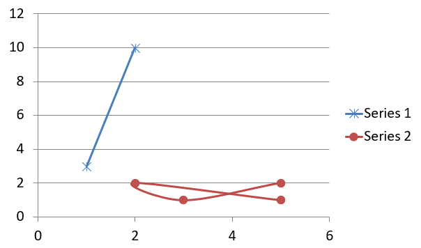

## **Przegląd**

Ten artykuł wyjaśnia, jak tworzyć i dostosowywać wykresy przy użyciu Aspose.Slides for Python via .NET. Nauczysz się, jak dodać wykres do slajdu, wypełnić go danymi oraz sformatować go zgodnie z wymaganiami projektowymi. Przykłady kodu obejmują tworzenie prezentacji i wykresów, konfigurowanie serii, osi i legend oraz integrację generowania wykresów w aplikacjach.

## **Utworzenie wykresu**

Wykresy pomagają ludziom szybko wizualizować dane i uzyskiwać wnioski, które nie są od razu widoczne w tabeli lub arkuszu kalkulacyjnym.

**Dlaczego tworzyć wykresy?**

Używając wykresów, możesz:

* agregować, kondensować lub podsumowywać duże ilości danych na jednym slajdzie w prezentacji;
* ujawniać wzorce i trendy w danych;
* wyciągać wnioski o kierunku i dynamice danych w czasie lub w odniesieniu do określonej jednostki miary;
* identyfikować wartości odstające, aberracje, odchylenia, błędy oraz nieprawidłowe dane;
* przekazywać lub prezentować złożone dane.

W programie PowerPoint możesz tworzyć wykresy za pomocą funkcji *Insert*, która udostępnia szablony do projektowania wielu typów wykresów. Korzystając z Aspose.Slides, możesz tworzyć zarówno zwykłe wykresy (oparte na popularnych typach) jak i wykresy niestandardowe.

{}
Use the [ChartType](https://reference.aspose.com/slides/pl/python-net/aspose.slides.charts/charttype/) enumeration under the [Aspose.Slides.Charts](https://reference.aspose.com/slides/pl/python-net/aspose.slides.charts/) namespace. The values in this enumeration correspond to different chart types.
{}

### **Utworzenie grupowanych wykresów kolumnowych**

Ten fragment wyjaśnia, jak utworzyć grupowane wykresy kolumnowe przy użyciu Aspose.Slides for Python via .NET. Nauczysz się inicjować prezentację, dodać wykres i dostosować jego elementy, takie jak tytuł, dane, serie, kategorie oraz styl. Postępuj zgodnie z poniższymi krokami, aby zobaczyć, jak generowany jest standardowy grupowany wykres kolumnowy:

1. Utwórz instancję klasy [Presentation](https://reference.aspose.com/slides/pl/python-net/aspose.slides/presentation/).
2. Uzyskaj odniesienie do slajdu za pomocą jego indeksu.
3. Dodaj wykres z pewnymi danymi i określ typ `ChartType.CLUSTERED_COLUMN`.
4. Dodaj tytuł do wykresu.
5. Uzyskaj dostęp do arkusza danych wykresu.
6. Wyczyść wszystkie domyślne serie i kategorie.
7. Dodaj nowe serie i kategorie.
8. Dodaj nowe dane wykresu dla serii wykresu.
9. Zastosuj kolor wypełnienia do serii wykresu.
10. Dodaj etykiety do serii wykresu.
11. Zapisz zmodyfikowaną prezentację jako plik PPTX.

Ten kod w języku Python pokazuje, jak utworzyć grupowany wykres kolumnowy:

```py
import aspose.slides.charts as charts
import aspose.slides as slides
import aspose.pydrawing as draw

# Utwórz instancję klasy Presentation, która reprezentuje plik PPTX.
with slides.Presentation() as presentation:

    # Uzyskaj dostęp do pierwszego slajdu.
    slide = presentation.slides[0]

    # Dodaj wykres kolumnowy grupowany z domyślnymi danymi.
    chart = slide.shapes.add_chart(charts.ChartType.CLUSTERED_COLUMN, 20, 20, 500, 300)

    # Ustaw tytuł wykresu.
    chart.chart_title.add_text_frame_for_overriding("Sample Title")
    chart.chart_title.text_frame_for_overriding.text_frame_format.center_text = slides.NullableBool.TRUE
    chart.chart_title.height = 20
    chart.has_title = True

    # Ustaw indeks arkusza danych wykresu.
    worksheet_index = 0

    # Pobierz skoroszyt danych wykresu.
    workbook = chart.chart_data.chart_data_workbook

    # Usuń domyślnie wygenerowane serie i kategorie.
    chart.chart_data.series.clear()
    chart.chart_data.categories.clear()

    # Dodaj nowe serie.
    chart.chart_data.series.add(workbook.get_cell(worksheet_index, 0, 1, "Series 1"), chart.type)
    chart.chart_data.series.add(workbook.get_cell(worksheet_index, 0, 2, "Series 2"), chart.type)

    # Dodaj nowe kategorie.
    chart.chart_data.categories.add(workbook.get_cell(worksheet_index, 1, 0, "Category 1"))
    chart.chart_data.categories.add(workbook.get_cell(worksheet_index, 2, 0, "Category 2"))
    chart.chart_data.categories.add(workbook.get_cell(worksheet_index, 3, 0, "Category 3"))

    # Pobierz pierwszą serię wykresu.
    series = chart.chart_data.series[0]

    # Wypełnij dane serii.
    series.data_points.add_data_point_for_bar_series(workbook.get_cell(worksheet_index, 1, 1, 20))
    series.data_points.add_data_point_for_bar_series(workbook.get_cell(worksheet_index, 2, 1, 50))
    series.data_points.add_data_point_for_bar_series(workbook.get_cell(worksheet_index, 3, 1, 30))

    # Ustaw kolor wypełnienia dla serii.
    series.format.fill.fill_type = slides.FillType.SOLID
    series.format.fill.solid_fill_color.color = draw.Color.red

    # Pobierz drugą serię wykresu.
    series = chart.chart_data.series[1]

    # Wypełnij dane serii.
    series.data_points.add_data_point_for_bar_series(workbook.get_cell(worksheet_index, 1, 2, 30))
    series.data_points.add_data_point_for_bar_series(workbook.get_cell(worksheet_index, 2, 2, 10))
    series.data_points.add_data_point_for_bar_series(workbook.get_cell(worksheet_index, 3, 2, 60))

    # Ustaw kolor wypełnienia dla serii.
    series.format.fill.fill_type = slides.FillType.SOLID
    series.format.fill.solid_fill_color.color = draw.Color.green

    # Ustaw pierwszą etykietę, aby wyświetlała nazwę kategorii.
    label = series.data_points[0].label
    label.data_label_format.show_category_name = True

    label = series.data_points[1].label
    label.data_label_format.show_series_name = True

    # Ustaw serię, aby wyświetlała wartość dla trzeciej etykiety.
    label = series.data_points[2].label
    label.data_label_format.show_value = True
    label.data_label_format.show_series_name = True
    label.data_label_format.separator = "/"
                
    # Zapisz prezentację na dysku jako plik PPTX.
    presentation.save("ClusteredColumnChart.pptx", slides.export.SaveFormat.PPTX)
```

Wynik:


### **Utworzenie wykresów punktowych**

Wykresy punktowe (znane również jako wykresy rozrzutu lub wykresy x‑y) są często używane do sprawdzania wzorców lub wykazywania korelacji między dwiema zmiennymi.

Użyj wykresu punktowego, gdy:

* Masz sparowane dane liczbowe.
* Masz dwie zmienne, które dobrze ze sobą współgrają.
* Chcesz określić, czy dwie zmienne są ze sobą powiązane.
* Masz zmienną niezależną, która ma wiele wartości dla zmiennej zależnej.

Ten kod w języku Python pokazuje, jak utworzyć wykres punktowy z różnymi markerami dla każdej serii:

```py
import aspose.slides.charts as charts
import aspose.slides as slides
import aspose.pydrawing as draw

# Utwórz instancję klasy Presentation.
with slides.Presentation() as presentation:

    # Uzyskaj dostęp do pierwszego slajdu.
    slide = presentation.slides[0]

    # Utwórz domyślny wykres punktowy.
    chart = slide.shapes.add_chart(charts.ChartType.SCATTER_WITH_SMOOTH_LINES, 20, 20, 500, 300)

    # Ustaw indeks arkusza danych wykresu.
    worksheet_index = 0

    # Pobierz skoroszyt danych wykresu.
    workbook = chart.chart_data.chart_data_workbook

    # Usuń domyślną serię.
    chart.chart_data.series.clear()

    # Dodaj nowe serie.
    chart.chart_data.series.add(workbook.get_cell(worksheet_index, 1, 1, "Series 1"), chart.type)
    chart.chart_data.series.add(workbook.get_cell(worksheet_index, 1, 3, "Series 2"), chart.type)

    # Pobierz pierwszą serię wykresu.
    series = chart.chart_data.series[0]

    # Dodaj nowy punkt (1:3) do serii.
    series.data_points.add_data_point_for_scatter_series(workbook.get_cell(worksheet_index, 2, 1, 1), workbook.get_cell(worksheet_index, 2, 2, 3))

    # Dodaj nowy punkt (2:10).
    series.data_points.add_data_point_for_scatter_series(workbook.get_cell(worksheet_index, 3, 1, 2), workbook.get_cell(worksheet_index, 3, 2, 10))

    # Zmień typ serii.
    series.type = charts.ChartType.SCATTER_WITH_STRAIGHT_LINES_AND_MARKERS

    # Zmień znacznik serii wykresu.
    series.marker.size = 10
    series.marker.symbol = charts.MarkerStyleType.STAR

    # Pobierz drugą serię wykresu.
    series = chart.chart_data.series[1]

    # Dodaj nowy punkt (5:2) do serii wykresu.
    series.data_points.add_data_point_for_scatter_series(workbook.get_cell(worksheet_index, 2, 3, 5), workbook.get_cell(worksheet_index, 2, 4, 2))

    # Dodaj nowy punkt (3:1).
    series.data_points.add_data_point_for_scatter_series(workbook.get_cell(worksheet_index, 3, 3, 3), workbook.get_cell(worksheet_index, 3, 4, 1))

    # Dodaj nowy punkt (2:2).
    series.data_points.add_data_point_for_scatter_series(workbook.get_cell(worksheet_index, 4, 3, 2), workbook.get_cell(worksheet_index, 4, 4, 2))

    # Dodaj nowy punkt (5:1).
    series.data_points.add_data_point_for_scatter_series(workbook.get_cell(worksheet_index, 5, 3, 5), workbook.get_cell(worksheet_index, 5, 4, 1))

    # Zmień znacznik serii wykresu.
    series.marker.size = 10
    series.marker.symbol = charts.MarkerStyleType.CIRCLE

    presentation.save("ScatterChart.pptx", slides.export.SaveFormat.PPTX)
```

Wynik:



### **Utworzenie wykresów kołowych**

Wykresy kołowe najlepiej używać do pokazania zależności części do całości w danych, zwłaszcza gdy dane zawierają etykiety kategoryczne z wartościami liczbowymi. Jeśli jednak Twoje dane zawierają wiele części lub etykiet, rozważ użycie wykresu słupkowego.

1. Utwórz instancję klasy [Presentation](https://reference.aspose.com/slides/pl/python-net/aspose.slides/presentation/).
2. Uzyskaj odniesienie do slajdu za pomocą jego indeksu.
3. Dodaj wykres z domyślnymi danymi i określ typ `ChartType.PIE`.
4. Uzyskaj dostęp do skoroszytu danych wykresu ([ChartDataWorkbook](https://reference.aspose.com/slides/pl/python-net/aspose.slides.charts/chartdataworkbook/)).
5. Wyczyść domyślne serie i kategorie.
6. Dodaj nowe serie i kategorie.
7. Dodaj nowe dane wykresu dla serii wykresu.
8. Dodaj nowe punkty do wykresu i zastosuj niestandardowe kolory do sektorów wykresu kołowego.
9. Ustaw etykiety dla serii.
10. Włącz linie prowadzące dla etykiet serii.
11. Ustaw kąt obrotu wykresu kołowego.
12. Zapisz zmodyfikowaną prezentację jako plik PPTX.

Ten kod w języku Python pokazuje, jak utworzyć wykres kołowy:

```py
import aspose.slides.charts as charts
import aspose.slides as slides
import aspose.pydrawing as draw

# Utwórz instancję klasy Presentation, która reprezentuje plik PPTX.
with slides.Presentation() as presentation:

    # Uzyskaj dostęp do pierwszego slajdu.
    slide = presentation.slides[0]

    # Dodaj wykres z domyślnymi danymi.
    chart = slide.shapes.add_chart(charts.ChartType.PIE, 20, 20, 500, 300)

    # Ustaw tytuł wykresu.
    chart.chart_title.add_text_frame_for_overriding("Sample Title")
    chart.chart_title.text_frame_for_overriding.text_frame_format.center_text = slides.NullableBool.TRUE
    chart.chart_title.height = 20
    chart.has_title = True

    # Ustaw indeks arkusza danych wykresu.
    worksheet_index = 0

    # Pobierz skoroszyt danych wykresu.
    workbook = chart.chart_data.chart_data_workbook

    # Usuń domyślnie wygenerowane serie i kategorie.
    chart.chart_data.series.clear()
    chart.chart_data.categories.clear()

    # Dodaj nowe kategorie.
    chart.chart_data.categories.add(workbook.get_cell(0, 1, 0, "First Qtr"))
    chart.chart_data.categories.add(workbook.get_cell(0, 2, 0, "2nd Qtr"))
    chart.chart_data.categories.add(workbook.get_cell(0, 3, 0, "3rd Qtr"))

    # Dodaj nową serię.
    series = chart.chart_data.series.add(workbook.get_cell(0, 0, 1, "Series 1"), chart.type)

    # Wypełnij dane serii.
    series.data_points.add_data_point_for_pie_series(workbook.get_cell(worksheet_index, 1, 1, 20))
    series.data_points.add_data_point_for_pie_series(workbook.get_cell(worksheet_index, 2, 1, 50))
    series.data_points.add_data_point_for_pie_series(workbook.get_cell(worksheet_index, 3, 1, 30))

    # Ustaw kolor sekcji.
    chart.chart_data.series_groups[0].is_color_varied = True

    point = series.data_points[0]
    point.format.fill.fill_type = slides.FillType.SOLID
    point.format.fill.solid_fill_color.color = draw.Color.cyan

    # Ustaw obramowanie sekcji.
    point.format.line.fill_format.fill_type = slides.FillType.SOLID
    point.format.line.fill_format.solid_fill_color.color = draw.Color.gray
    point.format.line.width = 3.0
    point.format.line.style = slides.LineStyle.THIN_THICK
    point.format.line.dash_style = slides.LineDashStyle.DASH_DOT

    point1 = series.data_points[1]
    point1.format.fill.fill_type = slides.FillType.SOLID
    point1.format.fill.solid_fill_color.color = draw.Color.brown

    # Ustaw obramowanie sekcji.
    point1.format.line.fill_format.fill_type = slides.FillType.SOLID
    point1.format.line.fill_format.solid_fill_color.color = draw.Color.blue
    point1.format.line.width = 3.0
    point1.format.line.style = slides.LineStyle.SINGLE
    point1.format.line.dash_style = slides.LineDashStyle.LARGE_DASH_DOT

    point2 = series.data_points[2]
    point2.format.fill.fill_type = slides.FillType.SOLID
    point2.format.fill.solid_fill_color.color = draw.Color.coral

    # Ustaw obramowanie sekcji.
    point2.format.line.fill_format.fill_type = slides.FillType.SOLID
    point2.format.line.fill_format.solid_fill_color.color = draw.Color.red
    point2.format.line.width = 2.0
    point2.format.line.style = slides.LineStyle.THIN_THIN
    point2.format.line.dash_style = slides.LineDashStyle.LARGE_DASH_DOT_DOT

    # Utwórz niestandardowe etykiety dla każdej kategorii w nowej serii.
    label1 = series.data_points[0].label

    label1.data_label_format.show_value = True

    label2 = series.data_points[1].label
    label2.data_label_format.show_value = True
    label2.data_label_format.show_legend_key = True
    label2.data_label_format.show_percentage = True

    label3 = series.data_points[2].label
    label3.data_label_format.show_series_name = True
    label3.data_label_format.show_percentage = True

    # Ustaw serię, aby wyświetlała linie prowadzące dla wykresu.
    series.labels.default_data_label_format.show_leader_lines = True

    # Ustaw kąt obrotu sektorów wykresu kołowego.
    chart.chart_data.series_groups[0].first_slice_angle = 180

    # Zapisz prezentację na dysku jako plik PPTX.
    presentation.save("PieChart.pptx", slides.export.SaveFormat.PPTX)
```

Wynik:


### **Utworzenie wykresów liniowych**

Wykresy liniowe (znane również jako wykresy liniowe) są najlepsze w sytuacjach, gdy chcesz pokazać zmiany wartości w czasie. Dzięki wykresowi liniowemu możesz jednocześnie porównać dużą ilość danych, śledzić zmiany i trendy w czasie, podkreślać anomalie w seriach danych i nie tylko.

1. Utwórz instancję klasy [Presentation](https://reference.aspose.com/slides/pl/python-net/aspose.slides/presentation/).
2. Uzyskaj odniesienie do slajdu za pomocą jego indeksu.
3. Dodaj wykres z domyślnymi danymi i określ typ `ChartType.LINE`.
4. Zapisz zmodyfikowaną prezentację jako plik PPTX.

Ten kod w języku Python pokazuje, jak utworzyć wykres liniowy:

```python
import aspose.slides as slides

with slides.Presentation() as presentation:
    line_chart = presentation.slides[0].shapes.add_chart(slides.charts.ChartType.LINE, 20, 20, 500, 300)
    
    presentation.save("LineChart.pptx", slides.export.SaveFormat.PPTX)
```

Domyślnie punkty na wykresie liniowym są łączone prostymi, ciągłymi liniami. Jeśli chcesz, aby punkty były łączone kreskami, możesz określić preferowany typ kreski w następujący sposób:

```python
import aspose.slides as slides

with slides.Presentation() as presentation:
    line_chart = presentation.slides[0].shapes.add_chart(slides.charts.ChartType.LINE, 10, 50, 600, 350)

    for series in line_chart.chart_data.series:
        series.format.line.dash_style = slides.LineDashStyle.DASH

    presentation.save("LineChart.pptx", slides.export.SaveFormat.PPTX)
```

Wynik:


### **Utworzenie wykresów mapy drzewa**

Wykresy mapy drzewa najlepiej sprawdzają się przy danych sprzedażowych, gdy chcesz pokazać względny rozmiar kategorii danych i szybko zwrócić uwagę na elementy, które wnoszą największy wkład w każdej kategorii.

1. Utwórz instancję klasy [Presentation](https://reference.aspose.com/slides/pl/python-net/aspose.slides/presentation/).
2. Uzyskaj odniesienie do slajdu za pomocą jego indeksu.
3. Dodaj wykres z domyślnymi danymi i określ typ `ChartType.TREEMAP`.
4. Uzyskaj dostęp do skoroszytu danych wykresu ([ChartDataWorkbook](https://reference.aspose.com/slides/pl/python-net/aspose.slides.charts/chartdataworkbook/)).
5. Wyczyść domyślne serie i kategorie.
6. Dodaj nowe serie i kategorie.
7. Dodaj nowe dane wykresu dla serii wykresu.
8. Zapisz zmodyfikowaną prezentację jako plik PPTX.

Ten kod w języku Python pokazuje, jak utworzyć wykres mapy drzewa:

```py
import aspose.slides.charts as charts
import aspose.slides as slides
import aspose.pydrawing as draw

with slides.Presentation() as presentation:
    chart = presentation.slides[0].shapes.add_chart(charts.ChartType.TREEMAP, 20, 20, 500, 300)
    chart.chart_data.categories.clear()
    chart.chart_data.series.clear()

    workbook = chart.chart_data.chart_data_workbook
    workbook.clear(0)

    # Gałąź 1
    leaf = chart.chart_data.categories.add(workbook.get_cell(0, "C1", "Leaf1"))
    leaf.grouping_levels.set_grouping_item(1, "Stem1")
    leaf.grouping_levels.set_grouping_item(2, "Branch1")

    chart.chart_data.categories.add(workbook.get_cell(0, "C2", "Leaf2"))

    leaf = chart.chart_data.categories.add(workbook.get_cell(0, "C3", "Leaf3"))
    leaf.grouping_levels.set_grouping_item(1, "Stem2")

    chart.chart_data.categories.add(workbook.get_cell(0, "C4", "Leaf4"))

    # Gałąź 2
    leaf = chart.chart_data.categories.add(workbook.get_cell(0, "C5", "Leaf5"))
    leaf.grouping_levels.set_grouping_item(1, "Stem3")
    leaf.grouping_levels.set_grouping_item(2, "Branch2")

    chart.chart_data.categories.add(workbook.get_cell(0, "C6", "Leaf6"))

    leaf = chart.chart_data.categories.add(workbook.get_cell(0, "C7", "Leaf7"))
    leaf.grouping_levels.set_grouping_item(1, "Stem4")

    chart.chart_data.categories.add(workbook.get_cell(0, "C8", "Leaf8"))

    series = chart.chart_data.series.add(charts.ChartType.TREEMAP)
    series.labels.default_data_label_format.show_category_name = True
    series.data_points.add_data_point_for_treemap_series(workbook.get_cell(0, "D1", 4))
    series.data_points.add_data_point_for_treemap_series(workbook.get_cell(0, "D2", 5))
    series.data_points.add_data_point_for_treemap_series(workbook.get_cell(0, "D3", 3))
    series.data_points.add_data_point_for_treemap_series(workbook.get_cell(0, "D4", 6))
    series.data_points.add_data_point_for_treemap_series(workbook.get_cell(0, "D5", 9))
    series.data_points.add_data_point_for_treemap_series(workbook.get_cell(0, "D6", 9))
    series.data_points.add_data_point_for_treemap_series(workbook.get_cell(0, "D7", 4))
    series.data_points.add_data_point_for_treemap_series(workbook.get_cell(0, "D8", 3))

    series.parent_label_layout = charts.ParentLabelLayoutType.OVERLAPPING

    presentation.save("TreeMap.pptx", slides.export.SaveFormat.PPTX)
```

Wynik:


### **Utworzenie wykresów giełdowych**

Wykresy giełdowe służą do wyświetlania danych finansowych, takich jak ceny otwarcia, maksymalne, minimalne i zamknięcia, pomagając analizować trendy rynkowe i zmienność. Dostarczają niezbędnych informacji o wynikach akcji, wspierając inwestorów i analityków w podejmowaniu świadomych decyzji.

1. Utwórz instancję klasy [Presentation](https://reference.aspose.com/slides/pl/python-net/aspose.slides/presentation/).
2. Uzyskaj odniesienie do slajdu za pomocą jego indeksu.
3. Dodaj wykres z domyślnymi danymi i określ typ `ChartType.OPEN_HIGH_LOW_CLOSE`.
4. Uzyskaj dostęp do skoroszytu danych wykresu ([ChartDataWorkbook](https://reference.aspose.com/slides/pl/python-net/aspose.slides.charts/chartdataworkbook/)).
5. Wyczyść domyślne serie i kategorie.
6. Dodaj nowe serie i kategorie.
7. Dodaj nowe dane wykresu dla serii wykresu.
8. Określ format linii high‑low.
9. Zapisz zmodyfikowaną prezentację jako plik PPTX.

Ten kod w języku Python pokazuje, jak utworzyć wykres giełdowy:

```py
import aspose.slides.charts as charts
import aspose.slides as slides
import aspose.pydrawing as draw

with slides.Presentation() as presentation:
    chart = presentation.slides[0].shapes.add_chart(charts.ChartType.OPEN_HIGH_LOW_CLOSE, 20, 20, 500, 300, False)

    chart.chart_data.series.clear()
    chart.chart_data.categories.clear()

    workbook = chart.chart_data.chart_data_workbook

    chart.chart_data.categories.add(workbook.get_cell(0, 1, 0, "A"))
    chart.chart_data.categories.add(workbook.get_cell(0, 2, 0, "B"))
    chart.chart_data.categories.add(workbook.get_cell(0, 3, 0, "C"))

    chart.chart_data.series.add(workbook.get_cell(0, 0, 1, "Open"), chart.type)
    chart.chart_data.series.add(workbook.get_cell(0, 0, 2, "High"), chart.type)
    chart.chart_data.series.add(workbook.get_cell(0, 0, 3, "Low"), chart.type)
    chart.chart_data.series.add(workbook.get_cell(0, 0, 4, "Close"), chart.type)

    series = chart.chart_data.series[0]

    series.data_points.add_data_point_for_stock_series(workbook.get_cell(0, 1, 1, 72))
    series.data_points.add_data_point_for_stock_series(workbook.get_cell(0, 2, 1, 25))
    series.data_points.add_data_point_for_stock_series(workbook.get_cell(0, 3, 1, 38))

    series = chart.chart_data.series[1]
    series.data_points.add_data_point_for_stock_series(workbook.get_cell(0, 1, 2, 172))
    series.data_points.add_data_point_for_stock_series(workbook.get_cell(0, 2, 2, 57))
    series.data_points.add_data_point_for_stock_series(workbook.get_cell(0, 3, 2, 57))

    series = chart.chart_data.series[2]
    series.data_points.add_data_point_for_stock_series(workbook.get_cell(0, 1, 3, 12))
    series.data_points.add_data_point_for_stock_series(workbook.get_cell(0, 2, 3, 12))
    series.data_points.add_data_point_for_stock_series(workbook.get_cell(0, 3, 3, 13))

    series = chart.chart_data.series[3]
    series.data_points.add_data_point_for_stock_series(workbook.get_cell(0, 1, 4, 25))
    series.data_points.add_data_point_for_stock_series(workbook.get_cell(0, 2, 4, 38))
    series.data_points.add_data_point_for_stock_series(workbook.get_cell(0, 3, 4, 50))

    chart.chart_data.series_groups[0].up_down_bars.has_up_down_bars = True
    chart.chart_data.series_groups[0].hi_low_lines_format.line.fill_format.fill_type = slides.FillType.SOLID

    for ser in chart.chart_data.series:
        ser.format.line.fill_format.fill_type = slides.FillType.NO_FILL

    presentation.save("StockChart.pptx", slides.export.SaveFormat.PPTX)
```

Wynik:


### **Utworzenie wykresów pudełkowych**

Wykresy pudełkowe służą do wyświetlania rozkładu danych poprzez podsumowanie kluczowych miar statystycznych, takich jak mediana, kwartyle i potencjalne wartości odstające. Są szczególnie przydatne w eksploracyjnej analizie danych i badaniach statystycznych, aby szybko zrozumieć zmienność danych i zidentyfikować ewentualne anomalie.

1. Utwórz instancję klasy [Presentation](https://reference.aspose.com/slides/pl/python-net/aspose.slides/presentation/).
2. Uzyskaj odniesienie do slajdu za pomocą jego indeksu.
3. Dodaj wykres z domyślnymi danymi i określ typ `ChartType.BOX_AND_WHISKER`.
4. Uzyskaj dostęp do skoroszytu danych wykresu ([ChartDataWorkbook](https://reference.aspose.com/slides/pl/python-net/aspose.slides.charts/chartdataworkbook/)).
5. Wyczyść domyślne serie i kategorie.
6. Dodaj nowe serie i kategorie.
7. Dodaj nowe dane wykresu dla serii wykresu.
8. Zapisz zmodyfikowaną prezentację jako plik PPTX.

Ten kod w języku Python pokazuje, jak utworzyć wykres pudełkowy:

```py
import aspose.slides.charts as charts
import aspose.slides as slides
import aspose.pydrawing as draw

with slides.Presentation() as presentation:
    chart = presentation.slides[0].shapes.add_chart(charts.ChartType.BOX_AND_WHISKER, 20, 20, 500, 300)
    chart.chart_data.categories.clear()
    chart.chart_data.series.clear()

    workbook = chart.chart_data.chart_data_workbook
    workbook.clear(0)

    chart.chart_data.categories.add(workbook.get_cell(0, "A1", "Category 1"))
    chart.chart_data.categories.add(workbook.get_cell(0, "A2", "Category 1"))
    chart.chart_data.categories.add(workbook.get_cell(0, "A3", "Category 1"))
    chart.chart_data.categories.add(workbook.get_cell(0, "A4", "Category 1"))
    chart.chart_data.categories.add(workbook.get_cell(0, "A5", "Category 1"))
    chart.chart_data.categories.add(workbook.get_cell(0, "A6", "Category 1"))

    series = chart.chart_data.series.add(charts.ChartType.BOX_AND_WHISKER)

    series.quartile_method = charts.QuartileMethodType.EXCLUSIVE
    series.show_mean_line = True
    series.show_mean_markers = True
    series.show_inner_points = True
    series.show_outlier_points = True

    series.data_points.add_data_point_for_box_and_whisker_series(workbook.get_cell(0, "B1", 15))
    series.data_points.add_data_point_for_box_and_whisker_series(workbook.get_cell(0, "B2", 41))
    series.data_points.add_data_point_for_box_and_whisker_series(workbook.get_cell(0, "B3", 16))
    series.data_points.add_data_point_for_box_and_whisker_series(workbook.get_cell(0, "B4", 10))
    series.data_points.add_data_point_for_box_and_whisker_series(workbook.get_cell(0, "B5", 23))
    series.data_points.add_data_point_for_box_and_whisker_series(workbook.get_cell(0, "B6", 16))

    presentation.save("BoxAndWhiskerChart.pptx", slides.export.SaveFormat.PPTX)
```

### **Utworzenie wykresów lejkowych**

Wykresy lejkowe służą do wizualizacji procesów obejmujących kolejne etapy, w których wolumen danych maleje w miarę przechodzenia z jednego kroku do następnego. Są szczególnie pomocne przy analizie wskaźników konwersji, identyfikacji wąskich gardeł oraz śledzeniu efektywności procesów sprzedaży lub marketingu.

1. Utwórz instancję klasy [Presentation](https://reference.aspose.com/slides/pl/python-net/aspose.slides/presentation/).
2. Uzyskaj odniesienie do slajdu za pomocą jego indeksu.
3. Dodaj wykres z domyślnymi danymi i określ typ `ChartType.FUNNEL`.
4. Zapisz zmodyfikowaną prezentację jako plik PPTX.

Ten kod w języku Python pokazuje, jak utworzyć wykres lejkowy:

```py
import aspose.slides.charts as charts
import aspose.slides as slides
import aspose.pydrawing as draw

with slides.Presentation() as presentation:
    chart = presentation.slides[0].shapes.add_chart(charts.ChartType.FUNNEL, 50, 50, 500, 400)
    chart.chart_data.categories.clear()
    chart.chart_data.series.clear()

    workbook = chart.chart_data.chart_data_workbook
    workbook.clear(0)

    chart.chart_data.categories.add(workbook.get_cell(0, "A1", "Category 1"))
    chart.chart_data.categories.add(workbook.get_cell(0, "A2", "Category 2"))
    chart.chart_data.categories.add(workbook.get_cell(0, "A3", "Category 3"))
    chart.chart_data.categories.add(workbook.get_cell(0, "A4", "Category 4"))
    chart.chart_data.categories.add(workbook.get_cell(0, "A5", "Category 5"))
    chart.chart_data.categories.add(workbook.get_cell(0, "A6", "Category 6"))

    series = chart.chart_data.series.add(charts.ChartType.FUNNEL)

    series.data_points.add_data_point_for_funnel_series(workbook.get_cell(0, "B1", 50))
    series.data_points.add_data_point_for_funnel_series(workbook.get_cell(0, "B2", 100))
    series.data_points.add_data_point_for_funnel_series(workbook.get_cell(0, "B3", 200))
    series.data_points.add_data_point_for_funnel_series(workbook.get_cell(0, "B4", 300))
    series.data_points.add_data_point_for_funnel_series(workbook.get_cell(0, "B5", 400))
    series.data_points.add_data_point_for_funnel_series(workbook.get_cell(0, "B6", 500))

    presentation.save("FunnelChart.pptx", slides.export.SaveFormat.PPTX)
```

Wynik:


### **Utworzenie wykresów promienistych**

Wykresy promieniste służą do wizualizacji danych hierarchicznych, wyświetlając poziomy jako koncentryczne pierścienie. Pomagają ilustrować zależności części do całości i są idealne do reprezentacji zagnieżdżonych kategorii i podkategorii w przejrzystym, kompaktowym formacie.

1. Utwórz instancję klasy [Presentation](https://reference.aspose.com/slides/pl/python-net/aspose.slides/presentation/).
2. Uzyskaj odniesienie do slajdu za pomocą jego indeksu.
3. Dodaj wykres z domyślnymi danymi i określ typ `ChartType.SUNBURST`.
4. Zapisz zmodyfikowaną prezentację jako plik PPTX.

Ten kod w języku Python pokazuje, jak utworzyć wykres promienisty:

```py
import aspose.slides.charts as charts
import aspose.slides as slides
import aspose.pydrawing as draw

with slides.Presentation() as presentation:
    chart = presentation.slides[0].shapes.add_chart(charts.ChartType.SUNBURST, 20, 20, 500, 300)
    chart.chart_data.categories.clear()
    chart.chart_data.series.clear()

    workbook = chart.chart_data.chart_data_workbook
    workbook.clear(0)

    # Gałąź 1
    leaf = chart.chart_data.categories.add(workbook.get_cell(0, "C1", "Leaf1"))
    leaf.grouping_levels.set_grouping_item(1, "Stem1")
    leaf.grouping_levels.set_grouping_item(2, "Branch1")

    chart.chart_data.categories.add(workbook.get_cell(0, "C2", "Leaf2"))

    leaf = chart.chart_data.categories.add(workbook.get_cell(0, "C3", "Leaf3"))
    leaf.grouping_levels.set_grouping_item(1, "Stem2")

    chart.chart_data.categories.add(workbook.get_cell(0, "C4", "Leaf4"))

    # Gałąź 2
    leaf = chart.chart_data.categories.add(workbook.get_cell(0, "C5", "Leaf5"))
    leaf.grouping_levels.set_grouping_item(1, "Stem3")
    leaf.grouping_levels.set_grouping_item(2, "Branch2")

    chart.chart_data.categories.add(workbook.get_cell(0, "C6", "Leaf6"))

    leaf = chart.chart_data.categories.add(workbook.get_cell(0, "C7", "Leaf7"))
    leaf.grouping_levels.set_grouping_item(1, "Stem4")

    chart.chart_data.categories.add(workbook.get_cell(0, "C8", "Leaf8"))

    series = chart.chart_data.series.add(charts.ChartType.SUNBURST)
    series.labels.default_data_label_format.show_category_name = True
    series.data_points.add_data_point_for_sunburst_series(workbook.get_cell(0, "D1", 4))
    series.data_points.add_data_point_for_sunburst_series(workbook.get_cell(0, "D2", 5))
    series.data_points.add_data_point_for_sunburst_series(workbook.get_cell(0, "D3", 3))
    series.data_points.add_data_point_for_sunburst_series(workbook.get_cell(0, "D4", 6))
    series.data_points.add_data_point_for_sunburst_series(workbook.get_cell(0, "D5", 9))
    series.data_points.add_data_point_for_sunburst_series(workbook.get_cell(0, "D6", 9))
    series.data_points.add_data_point_for_sunburst_series(workbook.get_cell(0, "D7", 4))
    series.data_points.add_data_point_for_sunburst_series(workbook.get_cell(0, "D8", 3))

    presentation.save("SunburstChart.pptx", slides.export.SaveFormat.PPTX)
```

Wynik:


### **Utworzenie wykresów histogramu**

Histogramy służą do przedstawiania rozkładu danych liczbowych przez grupowanie wartości w przedziały (bin). Są szczególnie przydatne do identyfikacji wzorców w danych, takich jak częstość, skośność czy rozproszenie, oraz do wykrywania wartości odstających w zestawie danych.

1. Utwórz instancję klasy [Presentation](https://reference.aspose.com/slides/pl/python-net/aspose.slides/presentation/).
2. Uzyskaj odniesienie do slajdu za pomocą jego indeksu.
3. Dodaj wykres z pewnymi danymi i określ typ `ChartType.HISTOGRAM`.
4. Uzyskaj dostęp do skoroszytu danych wykresu ([ChartDataWorkbook](https://reference.aspose.com/slides/pl/python-net/aspose.slides.charts/chartdataworkbook/)).
5. Wyczyść domyślne serie i kategorie.
6. Dodaj nową serię i wypełnij ją punktami danych. Histogram nie posiada kategorii; przedziały są obliczane na podstawie wartości.
7. Zapisz zmodyfikowaną prezentację jako plik PPTX.

Ten kod w języku Python pokazuje, jak utworzyć wykres histogramu:

```py
import aspose.slides.charts as charts
import aspose.slides as slides
import aspose.pydrawing as draw

with slides.Presentation() as presentation:
    chart = presentation.slides[0].shapes.add_chart(charts.ChartType.HISTOGRAM, 20, 20, 500, 300)
    chart.chart_data.categories.clear()
    chart.chart_data.series.clear()

    workbook = chart.chart_data.chart_data_workbook
    workbook.clear(0)

    series = chart.chart_data.series.add(charts.ChartType.HISTOGRAM)
    series.data_points.add_data_point_for_histogram_series(workbook.get_cell(0, "A1", 15))
    series.data_points.add_data_point_for_histogram_series(workbook.get_cell(0, "A2", -41))
    series.data_points.add_data_point_for_histogram_series(workbook.get_cell(0, "A3", 16))
    series.data_points.add_data_point_for_histogram_series(workbook.get_cell(0, "A4", 10))
    series.data_points.add_data_point_for_histogram_series(workbook.get_cell(0, "A5", -23))
    series.data_points.add_data_point_for_histogram_series(workbook.get_cell(0, "A6", 16))

    chart.axes.horizontal_axis.aggregation_type = charts.AxisAggregationType.AUTOMATIC

    presentation.save("HistogramChart.pptx", slides.export.SaveFormat.PPTX)
```

Wynik:


### **Utworzenie wykresów radarowych**

Wykresy radarowe służą do wyświetlania danych wielowymiarowych w dwuwymiarowym formacie, umożliwiając łatwe porównanie kilku zmiennych jednocześnie. Są szczególnie przydatne do identyfikacji wzorców, mocnych i słabych stron w wielu miarach wydajności lub atrybutach.

1. Utwórz instancję klasy [Presentation](https://reference.aspose.com/slides/pl/python-net/aspose.slides/presentation/).
2. Uzyskaj odniesienie do slajdu za pomocą jego indeksu.
3. Dodaj wykres z pewnymi danymi i określ typ `ChartType.RADAR`.
4. Zapisz zmodyfikowaną prezentację jako plik PPTX.

Ten kod w języku Python pokazuje, jak utworzyć wykres radarowy:

```python
import aspose.slides as slides

with slides.Presentation() as presentation:
    presentation.slides[0].shapes.add_chart(slides.charts.ChartType.RADAR, 20, 20, 500, 300)
    presentation.save("RadarChart.pptx", slides.export.SaveFormat.PPTX)
```

Wynik:


### **Utworzenie wykresów wielokategorii**

Wykresy wielokategorii służą do wyświetlania danych obejmujących więcej niż jedną grupę kategoryczną, umożliwiając jednoczesne porównanie wartości w wielu wymiarach. Są szczególnie przydatne, gdy trzeba analizować trendy i zależności w złożonych, wielowarstwowych zbiorach danych.

1. Utwórz instancję klasy [Presentation](https://reference.aspose.com/slides/pl/python-net/aspose.slides/presentation/).
2. Uzyskaj odniesienie do slajdu za pomocą jego indeksu.
3. Dodaj wykres z domyślnymi danymi i określ typ `ChartType.CLUSTERED_COLUMN`.
4. Uzyskaj dostęp do skoroszytu danych wykresu ([ChartDataWorkbook](https://reference.aspose.com/slides/pl/python-net/aspose.slides.charts/chartdataworkbook/)).
5. Wyczyść domyślne serie i kategorie.
6. Dodaj nowe serie i kategorie.
7. Dodaj nowe dane wykresu dla serii wykresu.
8. Zapisz zmodyfikowaną prezentację jako plik PPTX.

Ten kod w języku Python pokazuje, jak utworzyć wykres wielokategorii:

```py
import aspose.slides.charts as charts
import aspose.slides as slides
import aspose.pydrawing as draw

with slides.Presentation() as presentation:
    slide = presentation.slides[0]

    chart = presentation.slides[0].shapes.add_chart(charts.ChartType.CLUSTERED_COLUMN, 20, 20, 500, 300)
    chart.chart_data.series.clear()
    chart.chart_data.categories.clear()

    workbook = chart.chart_data.chart_data_workbook
    workbook.clear(0)

    worksheet_index = 0

    category = chart.chart_data.categories.add(workbook.get_cell(0, "c2", "A"))
    category.grouping_levels.set_grouping_item(1, "Group1")
    category = chart.chart_data.categories.add(workbook.get_cell(0, "c3", "B"))

    category = chart.chart_data.categories.add(workbook.get_cell(0, "c4", "C"))
    category.grouping_levels.set_grouping_item(1, "Group2")
    category = chart.chart_data.categories.add(workbook.get_cell(0, "c5", "D"))

    category = chart.chart_data.categories.add(workbook.get_cell(0, "c6", "E"))
    category.grouping_levels.set_grouping_item(1, "Group3")
    category = chart.chart_data.categories.add(workbook.get_cell(0, "c7", "F"))

    category = chart.chart_data.categories.add(workbook.get_cell(0, "c8", "G"))
    category.grouping_levels.set_grouping_item(1, "Group4")
    category = chart.chart_data.categories.add(workbook.get_cell(0, "c9", "H"))

    # Dodaj serię.
    series = chart.chart_data.series.add(workbook.get_cell(0, "D1", "Series 1"), charts.ChartType.CLUSTERED_COLUMN)

    series.data_points.add_data_point_for_bar_series(workbook.get_cell(worksheet_index, "D2", 10))
    series.data_points.add_data_point_for_bar_series(workbook.get_cell(worksheet_index, "D3", 20))
    series.data_points.add_data_point_for_bar_series(workbook.get_cell(worksheet_index, "D4", 30))
    series.data_points.add_data_point_for_bar_series(workbook.get_cell(worksheet_index, "D5", 40))
    series.data_points.add_data_point_for_bar_series(workbook.get_cell(worksheet_index, "D6", 50))
    series.data_points.add_data_point_for_bar_series(workbook.get_cell(worksheet_index, "D7", 60))
    series.data_points.add_data_point_for_bar_series(workbook.get_cell(worksheet_index, "D8", 70))
    series.data_points.add_data_point_for_bar_series(workbook.get_cell(worksheet_index, "D9", 80))

    # Zapisz prezentację z wykresem.
    presentation.save("MultiCategoryChart.pptx", slides.export.SaveFormat.PPTX)
```

Wynik:


### **Utworzenie wykresów mapowych**

Wykresy mapowe służą do wizualizacji danych geograficznych poprzez mapowanie informacji na konkretne lokalizacje, takie jak kraje, stany lub miasta. Są szczególnie przydatne przy analizie trendów regionalnych, danych demograficznych oraz rozkładów przestrzennych w przejrzysty, wizualnie atrakcyjny sposób.

Ten kod w języku Python pokazuje, jak utworzyć wykres mapowy:

```python
import aspose.slides as slides

with slides.Presentation() as presentation:
    chart = presentation.slides[0].shapes.add_chart(slides.charts.ChartType.MAP, 20, 20, 500, 300)
    presentation.save("mapChart.pptx", slides.export.SaveFormat.PPTX)
```

Wynik:


### **Utworzenie wykresów kombinowanych**

Wykres kombinowany (lub combo chart) łączy dwa lub więcej typów wykresów w jednym diagramie. Umożliwia podkreślenie, porównanie lub analizę różnic między dwoma lub więcej zestawami danych, pomagając zidentyfikować zależności między nimi.


Poniższy kod w języku Python pokazuje, jak utworzyć powyższy wykres kombinowany w prezentacji PowerPoint:

```python
import aspose.slides.charts as charts
import aspose.pydrawing as draw
import aspose.slides as slides

def create_combo_chart():
    with slides.Presentation() as presentation:
        chart = create_chart_with_first_series(presentation.slides[0])

        add_second_series_to_chart(chart)
        add_third_series_to_chart(chart)

        set_primary_axes_format(chart)
        set_secondary_axes_format(chart)

        presentation.save("combo-chart.pptx", slides.export.SaveFormat.PPTX)


def create_chart_with_first_series(slide):
    chart = slide.shapes.add_chart(charts.ChartType.CLUSTERED_COLUMN, 50, 50, 600, 400)

    # Ustaw tytuł wykresu.
    chart.has_title = True
    chart.chart_title.add_text_frame_for_overriding("Chart Title")
    chart.chart_title.overlay = False
    title_paragraph = chart.chart_title.text_frame_for_overriding.paragraphs[0]
    title_format = title_paragraph.paragraph_format.default_portion_format

    title_format.font_bold = slides.NullableBool.FALSE
    title_format.font_height = 18

    # Ustaw legendę wykresu.
    chart.legend.position = charts.LegendPositionType.BOTTOM
    chart.legend.text_format.portion_format.font_height = 12

    # Usuń domyślnie wygenerowane serie i kategorie.
    chart.chart_data.series.clear()
    chart.chart_data.categories.clear()

    worksheet_index = 0
    workbook = chart.chart_data.chart_data_workbook

    # Dodaj nowe kategorie.
    chart.chart_data.categories.add(workbook.get_cell(worksheet_index, 1, 0, "Category 1"))
    chart.chart_data.categories.add(workbook.get_cell(worksheet_index, 2, 0, "Category 2"))
    chart.chart_data.categories.add(workbook.get_cell(worksheet_index, 3, 0, "Category 3"))
    chart.chart_data.categories.add(workbook.get_cell(worksheet_index, 4, 0, "Category 4"))

    # Dodaj pierwszą serię.
    series_name_cell = workbook.get_cell(worksheet_index, 0, 1, "Series 1")
    series = chart.chart_data.series.add(series_name_cell, chart.type)

    series.parent_series_group.overlap = -25
    series.parent_series_group.gap_width = 220

    series.data_points.add_data_point_for_bar_series(workbook.get_cell(worksheet_index, 1, 1, 4.3))
    series.data_points.add_data_point_for_bar_series(workbook.get_cell(worksheet_index, 2, 1, 2.5))
    series.data_points.add_data_point_for_bar_series(workbook.get_cell(worksheet_index, 3, 1, 3.5))
    series.data_points.add_data_point_for_bar_series(workbook.get_cell(worksheet_index, 4, 1, 4.5))

    return chart


def add_second_series_to_chart(chart):
    workbook = chart.chart_data.chart_data_workbook
    worksheet_index = 0

    series_name_cell = workbook.get_cell(worksheet_index, 0, 2, "Series 2")
    series = chart.chart_data.series.add(series_name_cell, charts.ChartType.CLUSTERED_COLUMN)

    series.parent_series_group.overlap = -25
    series.parent_series_group.gap_width = 220

    series.data_points.add_data_point_for_bar_series(workbook.get_cell(worksheet_index, 1, 2, 2.4))
    series.data_points.add_data_point_for_bar_series(workbook.get_cell(worksheet_index, 2, 2, 4.4))
    series.data_points.add_data_point_for_bar_series(workbook.get_cell(worksheet_index, 3, 2, 1.8))
    series.data_points.add_data_point_for_bar_series(workbook.get_cell(worksheet_index, 4, 2, 2.8))


def add_third_series_to_chart(chart):
    workbook = chart.chart_data.chart_data_workbook
    worksheet_index = 0

    series_name_cell = workbook.get_cell(worksheet_index, 0, 3, "Series 3")
    series = chart.chart_data.series.add(series_name_cell, charts.ChartType.LINE)

    series.data_points.add_data_point_for_line_series(workbook.get_cell(worksheet_index, 1, 3, 2.0))
    series.data_points.add_data_point_for_line_series(workbook.get_cell(worksheet_index, 2, 3, 2.0))
    series.data_points.add_data_point_for_line_series(workbook.get_cell(worksheet_index, 3, 3, 3.0))
    series.data_points.add_data_point_for_line_series(workbook.get_cell(worksheet_index, 4, 3, 5.0))

    series.plot_on_second_axis = True


def set_primary_axes_format(chart):
    # Ustaw oś poziomą.
    horizontal_axis = chart.axes.horizontal_axis
    horizontal_axis.text_format.portion_format.font_height = 12.0
    horizontal_axis.format.line.fill_format.fill_type = slides.FillType.NO_FILL

    set_axis_title(horizontal_axis, "X Axis")

    # Ustaw oś pionową.
    vertical_axis = chart.axes.vertical_axis
    vertical_axis.text_format.portion_format.font_height = 12.0
    vertical_axis.format.line.fill_format.fill_type = slides.FillType.NO_FILL

    set_axis_title(vertical_axis, "Y Axis 1")

    # Ustaw kolor głównych linii siatki pionowej.
    major_grid_lines_format = vertical_axis.major_grid_lines_format.line.fill_format
    major_grid_lines_format.fill_type = slides.FillType.SOLID
    major_grid_lines_format.solid_fill_color.color = draw.Color.from_argb(217, 217, 217)


def set_secondary_axes_format(chart):
    # Ustaw drugorzędną oś poziomą.
    secondary_horizontal_axis = chart.axes.secondary_horizontal_axis
    secondary_horizontal_axis.position = charts.AxisPositionType.BOTTOM
    secondary_horizontal_axis.cross_type = charts.CrossesType.MAXIMUM
    secondary_horizontal_axis.is_visible = False
    secondary_horizontal_axis.major_grid_lines_format.line.fill_format.fill_type = slides.FillType.NO_FILL
    secondary_horizontal_axis.minor_grid_lines_format.line.fill_format.fill_type = slides.FillType.NO_FILL

    # Ustaw drugorzędną oś pionową.
    secondary_vertical_axis = chart.axes.secondary_vertical_axis
    secondary_vertical_axis.position = charts.AxisPositionType.RIGHT
    secondary_vertical_axis.text_format.portion_format.font_height = 12.0
    secondary_vertical_axis.format.line.fill_format.fill_type = slides.FillType.NO_FILL
    secondary_vertical_axis.major_grid_lines_format.line.fill_format.fill_type = slides.FillType.NO_FILL
    secondary_vertical_axis.minor_grid_lines_format.line.fill_format.fill_type = slides.FillType.NO_FILL

    set_axis_title(secondary_vertical_axis, "Y Axis 2")


def set_axis_title(axis, axis_title):
    axis.has_title = True
    axis.title.overlay = False
    title_portion_format = axis.title.add_text_frame_for_overriding(axis_title).paragraphs[0].paragraph_format.default_portion_format
    title_portion_format.font_bold = slides.NullableBool.FALSE
    title_portion_format.font_height = 12.0
```

## **Aktualizacja wykresów**

Aspose.Slides for Python via .NET umożliwia aktualizację danych wykresu, formatowania i stylu, aby prezentacje PowerPoint były aktualne.

1. Utwórz instancję klasy [Presentation](https://reference.aspose.com/slides/pl/python-net/aspose.slides/presentation/) w celu otwarcia prezentacji zawierającej wykres.
2. Uzyskaj odniesienie do slajdu za pomocą jego indeksu.
3. Przejdź przez wszystkie kształty, aby znaleźć wykres.
4. Uzyskaj dostęp do arkusza danych wykresu.
5. Zmodyfikuj serię danych wykresu, zmieniając wartości serii.
6. Dodaj nową serię i wypełnij ją danymi.
7. Zapisz zmodyfikowaną prezentację jako plik PPTX.

Ten kod w języku Python pokazuje, jak zaktualizować wykres:

```py
import aspose.slides.charts as charts
import aspose.slides as slides
import aspose.pydrawing as draw

chart_name = "My chart"

# Utwórz instancję klasy Presentation, która reprezentuje plik PPTX.
with slides.Presentation("ExistingChart.pptx") as presentation:

    # Uzyskaj dostęp do pierwszego slajdu.
    slide = presentation.slides[0]

    for shape in slide.shapes:
        if isinstance(shape, charts.Chart) and shape.name == chart_name:
            chart = shape

            # Ustaw indeks arkusza danych wykresu.
            worksheet_index = 0

            # Pobierz skoroszyt danych wykresu.
            workbook = chart.chart_data.chart_data_workbook

            # Zmień nazwy kategorii wykresu.
            workbook.get_cell(worksheet_index, 1, 0, "Modified Category 1")
            workbook.get_cell(worksheet_index, 2, 0, "Modified Category 2")

            # Pobierz pierwszą serię wykresu.
            series = chart.chart_data.series[0]

            # Zaktualizuj dane serii.
            workbook.get_cell(worksheet_index, 0, 1, "New_Series1")  # Modyfikacja nazwy serii.
            series.data_points[0].value.data = 90
            series.data_points[1].value.data = 123
            series.data_points[2].value.data = 44

            # Pobierz drugą serię wykresu.
            series = chart.chart_data.series[1]

            # Zaktualizuj dane serii.
            workbook.get_cell(worksheet_index, 0, 2, "New_Series2")  # Modyfikacja nazwy serii.
            series.data_points[0].value.data = 23
            series.data_points[1].value.data = 67
            series.data_points[2].value.data = 99

            # Dodaj nową serię.
            series = chart.chart_data.series.add(workbook.get_cell(worksheet_index, 0, 3, "Series 3"), chart.type)

            # Wypełnij dane serii.
            series.data_points.add_data_point_for_bar_series(workbook.get_cell(worksheet_index, 1, 3, 20))
            series.data_points.add_data_point_for_bar_series(workbook.get_cell(worksheet_index, 2, 3, 50))
            series.data_points.add_data_point_for_bar_series(workbook.get_cell(worksheet_index, 3, 3, 30))

            chart.type = charts.ChartType.CLUSTERED_CYLINDER

            # Zapisz prezentację z wykresem.
            presentation.save("ModifiedChart.pptx", slides.export.SaveFormat.PPTX)
```

## **Ustawienie zakresu danych dla wykresu**

Aspose.Slides for Python via .NET pozwala używać określonego zakresu arkusza jako źródła danych dla wykresu. Kontroluje to, które komórki dostarczają serie i kategorie wykresu oraz umożliwia aktualizację wykresu w odpowiedzi na zmiany w arkuszu.

1. Utwórz instancję klasy [Presentation](https://reference.aspose.com/slides/pl/python-net/aspose.slides/presentation/) w celu otwarcia prezentacji zawierającej wykres.
2. Uzyskaj odniesienie do slajdu za pomocą jego indeksu.
3. Przejdź przez wszystkie kształty, aby znaleźć wykres.
4. Uzyskaj dostęp do danych wykresu i ustaw zakres.
5. Zapisz zmodyfikowaną prezentację jako plik PPTX.

Ten kod w języku Python pokazuje, jak ustawić zakres danych dla wykresu:

```py
import aspose.slides.charts as charts
import aspose.slides as slides
import aspose.pydrawing as draw

chart_name = "My chart"

# Utwórz instancję klasy Presentation, która reprezentuje plik PPTX.
with slides.Presentation("ExistingChart.pptx") as presentation:

    # Uzyskaj dostęp do pierwszego slajdu.
    slide = presentation.slides[0]

    for shape in slide.shapes:
        if isinstance(shape, charts.Chart) and shape.name == chart_name:
            chart = shape
            chart.chart_data.set_range("Sheet1!A1:B4")

    presentation.save("DataRange.pptx", slides.export.SaveFormat.PPTX)
```

## **Używanie domyślnych znaczników w wykresach**

Gdy używasz domyślnych znaczników w wykresach, każda seria wykresu automatycznie otrzymuje inny symbol znacznika.

Ten kod w języku Python pokazuje, jak automatycznie ustawić znacznik serii wykresu:

```py
import aspose.slides.charts as charts
import aspose.slides as slides
import aspose.pydrawing as draw

with slides.Presentation() as presentation:
    slide = presentation.slides[0]
    chart = slide.shapes.add_chart(charts.ChartType.LINE_WITH_MARKERS, 10, 10, 400, 400)

    chart.chart_data.series.clear()
    chart.chart_data.categories.clear()

    workbook = chart.chart_data.chart_data_workbook

    series = chart.chart_data.series.add(workbook.get_cell(0, 0, 1, "Series 1"), chart.type)

    chart.chart_data.categories.add(workbook.get_cell(0, 1, 0, "C1"))
    series.data_points.add_data_point_for_line_series(workbook.get_cell(0, 1, 1, 24))

    chart.chart_data.categories.add(workbook.get_cell(0, 2, 0, "C2"))
    series.data_points.add_data_point_for_line_series(workbook.get_cell(0, 2, 1, 23))

    chart.chart_data.categories.add(workbook.get_cell(0, 3, 0, "C3"))
    series.data_points.add_data_point_for_line_series(workbook.get_cell(0, 3, 1, -10))

    chart.chart_data.categories.add(workbook.get_cell(0, 4, 0, "C4"))
    series.data_points.add_data_point_for_line_series(workbook.get_cell(0, 4, 1, None))

    series2 = chart.chart_data.series.add(workbook.get_cell(0, 0, 2, "Series 2"), chart.type)

    # Wypełnij dane serii.
    series2.data_points.add_data_point_for_line_series(workbook.get_cell(0, 1, 2, 30))
    series2.data_points.add_data_point_for_line_series(workbook.get_cell(0, 2, 2, 10))
    series2.data_points.add_data_point_for_line_series(workbook.get_cell(0, 3, 2, 60))
    series2.data_points.add_data_point_for_line_series(workbook.get_cell(0, 4, 2, 40))

    chart.has_legend = True
    chart.legend.overlay = False

    presentation.save("DefaultMarkersInChart.pptx", slides.export.SaveFormat.PPTX)
```

## **FAQ**

**Jakie typy wykresów są obsługiwane przez Aspose.Slides for Python via .NET?**

Aspose.Slides for Python via .NET obsługuje szeroką gamę typów wykresów, w tym słupkowe, liniowe, kołowe, powierzchniowe, punktowe, histogramy, radarowe i wiele innych. Ta elastyczność pozwala wybrać najbardziej odpowiedni typ wykresu do potrzeb wizualizacji danych.

**Jak dodać nowy wykres do slajdu?**

Aby dodać wykres, najpierw tworzysz instancję klasy [Presentation](https://reference.aspose.com/slides/pl/python-net/aspose.slides/presentation/), pobierasz żądany slajd za pomocą jego indeksu, a następnie wywołujesz metodę dodawania wykresu, określając typ wykresu i początkowe dane. Proces ten integruje wykres bezpośrednio w twojej prezentacji.

**Jak mogę zaktualizować dane wyświetlane w wykresie?**

Możesz zaktualizować dane wykresu, uzyskując dostęp do jego skoroszytu danych ([ChartDataWorkbook](https://reference.aspose.com/slides/pl/python-net/aspose.slides.charts/chartdataworkbook/)), czyszcząc domyślne serie i kategorie, a następnie dodając własne dane. Umożliwia to programowe odświeżenie wykresu, aby odzwierciedlał najnowsze informacje.

**Czy można dostosować wygląd wykresu?**

Tak, Aspose.Slides for Python via .NET zapewnia rozbudowane możliwości dostosowywania. Możesz modyfikować kolory, czcionki, etykiety, legendy oraz inne elementy formatowania, aby dopasować wygląd wykresu do konkretnych wymagań projektowych.