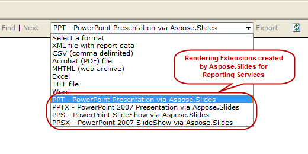

{} 

Ten artykuł pokazuje, jak dostosować napisy opcji renderowania Aspose.Slides dla Reporting Services. 

{} 
## **Przykład**
Podczas instalacji Aspose.Slides dla Reporting Services, w menu rozwijanym opcji eksportu dodawane są 4 dodatkowe opcje eksportu:


## **Jak zmodyfikować tekst napisów**
Domyślne napisy tych rozszerzeń można zmienić, nadpisując domyślne nazwy. Te kroki pokażą, jak zmienić napis z “ **PPT – PowerPoint** **Presentation via** **Aspose.Slides** ” na “ **PowerPoint 97 – 2003 format(PPT)** ”. 

**Krok 1:** Zlokalizuj plik **rsreportserver.config**, który zazwyczaj znajduje się w tym katalogu: 

**OS Root Drive\Program Files\Microsoft SQL Server\MSRS10.MSSQLSERVER\Reporting Services\ReportServer** 

**Krok** **2:** Znajdź te linie w pliku rsreportserver.config: 

``` xml

 <Extension Name="ASPPT" Type="Aspose.Slides.ReportingServices.PptRenderer,Aspose.Slides.ReportingServices"/>


```

**Krok** **3:** Zastąp parametr rozszerzenia następującym: 

**<Extension Name="ASPPT" Type="Aspose.Slides.ReportingServices.PptRenderer,Aspose.Slides.ReportingServices">**

``` xml

         <OverrideNames>

          <Name Language="en-US">PowerPoint 97 - 2003 Format(PPT)</Name>

        </OverrideNames>

</Extension>


```

Opcje eksportu będą teraz wyglądać tak: 

