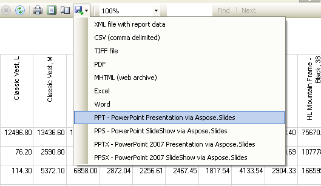

{} 

Ten artykuł naucza, jak ręcznie zintegrować Aspose.Slides for Reporting Services z programem Visual Studio. 

{} 

{} 

**Aspose.Slides for Reporting Services** wymaga zainstalowania **.NET Framework 3.5** na komputerze hosta. 

{}

## **Integracja Aspose.Slides for Reporting Services z Visual Studio**
Zalecamy użycie instalatora MSI do instalacji Aspose.Slides for Reporting Services, ponieważ wykonuje on wszystkie niezbędne zadania instalacyjne i procesy konfiguracji automatycznie. Jednak jeśli instalacja przy użyciu instalatora MSI się nie powiedzie, użyj tego przewodnika. 

Ten artykuł pokazuje również, jak zainstalować Aspose.Slides for Reporting Services na komputerze z Business Intelligence Development Studio. Umożliwi to eksportowanie raportów do formatów Microsoft PowerPoint w czasie projektowania z Microsoft Visual Studio 2005 lub 2008 Report Designer. 

1. Skopiuj Aspose.Slides.ReportingServices.dll do katalogu Visual Studio.

   - Aby zintegrować z Visual Studio 2005 Report Designer, skopiuj **Aspose.Slides.ReportingServices.dll** do katalogu **C:\Program Files\Microsoft Visual Studio 8\Common7\IDE\PrivateAssemblies**.
   - Aby zintegrować z Visual Studio 2008 Report Designer, skopiuj **Aspose.Slides.ReportingServices.dll** do katalogu **C:\Program Files\Microsoft Visual Studio 9.0\Common7\IDE\PrivateAssemblies**.
2. Zarejestruj Aspose.Slides for Reporting Services jako rozszerzenie renderowania. 

3. Otwórz **C:\Program Files\Microsoft Visual Studio <Version>\Common7\IDE\PrivateAssemblies\ RSReportDesigner.config** (gdzie <Version> to “8” dla Visual Studio 2005 lub “9.0” dla Visual Studio 2008) i dodaj te linie do elementu <Render>: 

``` xml

 <Extension Name="ASPPT" Type="Aspose.Slides.ReportingServices.PptRenderer,Aspose.Slides.ReportingServices"/>

<Extension Name="ASPPS" Type="Aspose.Slides.ReportingServices.PpsRenderer,Aspose.Slides.ReportingServices"/>

<Extension Name="ASPPTX" Type="Aspose.Slides.ReportingServices.PptxRenderer,Aspose.Slides.ReportingServices"/>

<Extension Name="ASPPSX" Type="Aspose.Slides.ReportingServices.PpsxRenderer,Aspose.Slides.ReportingServices"/>


```

4. Daj Aspose.Slides for Reporting Services uprawnienia do wykonywania. 
   1. Otwórz **C:\Program Files\Microsoft Visual Studio <Version>\Common7\IDE\PrivateAssemblies\RSPreviewPolicy.config** (gdzie <Version> to “8” dla Visual Studio 2005 lub “9.0” dla Visual Studio 2008).
   1. Dodaj tę linię jako ostatni element w drugim zewnętrznym elemencie <CodeGroup> (który powinien być <CodeGroup class="FirstMatchCodeGroup" version="1" PermissionSetName="Execution" Description="This code group grants MyComputer code Execution permission.">) 

**<CodeGroup>**

``` xml


...

  <CodeGroup>

    ...

    <!--Zacznij tutaj.-->

    <CodeGroup

        class="UnionCodeGroup"

        version="1"

        PermissionSetName="FullTrust"

        Name="Aspose.Slides_for_Reporting_Services"

        Description="This code group grants full trust to the AS4SSRS assembly.">

        <IMembershipCondition

            class="StrongNameMembershipCondition"

            version="1"

            PublicKeyBlob="00240000048000009400000006020000002400005253413100040000010001005542e

            99cecd28842dad186257b2c7b6ae9b5947e51e0b17b4ac6d8cecd3e01c4d20658c5e4ea1b9a6c8f854b2

            d796c4fde740dac65e834167758cff283eed1be5c9a812022b015a902e0b97d4e95569eb8c0971834744

            e633d9cb4c4a6d8eda03c12f486e13a1a0cb1aa101ad94943236384cbbf5c679944b994de9546e493bf" />

    </CodeGroup>

    <!--Zakończ tutaj.-->

  </CodeGroup>

</CodeGroup>


```

5. Zweryfikuj, że Aspose.Slides for Reporting Services został pomyślnie zainstalowany. 
6. Uruchom lub uruchom ponownie Microsoft Visual Studio 2005 lub 2008 Report Designer. Powinieneś zauważyć nowe formaty na liście formatów eksportu.

**Nowe formaty eksportu pojawiają się w Report Designer.** 

