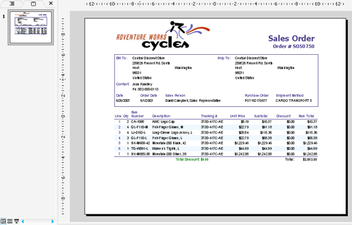

## **Obsługa licencji**
{} 

Możesz pobrać wersję ewaluacyjną **Aspose.Slides for Reporting Services** ze [strony wydań](https://releases.aspose.com/slides/pl/reportingservices/). Wersja ewaluacyjna oferuje te same funkcje, co licencjonowana wersja produktu. Pakiet ewaluacyjny jest identyczny z zakupionym pakietem. Wersja ewaluacyjna po prostu staje się licencjonowana po dodaniu kilku linii kodu (aby zastosować licencję).

Gdy będziesz zadowolony z oceny produktu, możesz [zakupić licencję](https://purchase.aspose.com/buy). Zalecamy zapoznanie się z różnymi typami subskrypcji. Jeśli masz pytania, skontaktuj się z zespołem sprzedaży Aspose.

{} 

## **Licencjonowanie w Aspose.Slides for Reporting Service**

* Wersja ewaluacyjna zostaje licencjonowana po zakupie licencji i dodaniu kilku linii kodu (aby zastosować licencję).  
* Licencja jest plikiem XML w formacie tekstowym, który zawiera szczegóły takie jak nazwa produktu, liczba deweloperów, do których jest licencjonowana, data wygaśnięcia subskrypcji i inne.  
* Plik licencji jest cyfrowo podpisany, więc nie należy go modyfikować. Nawet niezamierzone dodanie dodatkowego znaku końca wiersza do zawartości pliku spowoduje jego unieważnienie.  
* Aby uniknąć ograniczeń związanych z wersją ewaluacyjną, należy ustawić licencję przed użyciem Aspose.Slides for Reporting Service.  

Pobierz licencję na swój komputer i skopiuj ją do folderu **C:\Program Files\Microsoft SQL Server\<Instance>\Reporting Services\ReportServer\bin**, w którym zainstalowany jest **Aspose.Slides.ReportingServices.dll**.  

Aby potwierdzić, że licencja została pomyślnie zainstalowana, wyeksportuj dowolny raport jako prezentację Microsoft PowerPoint. Jeśli dokument nie zawiera znaku wodnego, licencja została aktywowana pomyślnie.  

Gdy w folderze *ReportServer\bin* znajduje się prawidłowy plik Aspose.Slides.ReportingServices.lic, znak wodny wersji ewaluacyjnej nie jest wyświetlany.  

**Tryb ewaluacji**

Aspose.Slides for Reporting Services wstawia znak wodny podczas pracy w trybie ewaluacyjnym (bez licencji)  

{} 

Aby przetestować Aspose.Slides for Reporting Services bez ograniczeń, możesz poprosić o **30‑dniową licencję tymczasową**. Zobacz stronę [Jak uzyskać tymczasową licencję](https://purchase.aspose.com/temporary-license) po więcej informacji.

{}