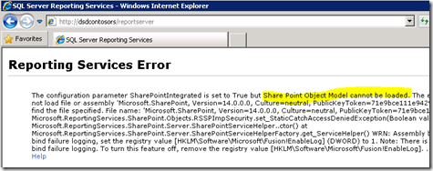

{} 

Naszym pierwszym przystankiem na serwerze RS jest Menedżer konfiguracji usług raportowania. 

{} 
## **Konto usługowe**
Upewnij się, że rozumiesz, jakiego konta usługowego używasz dla usług raportowania. Jeśli napotkasz problemy, mogą one być związane z używanym kontem. Domyślnie jest to Network Service. Zawsze używam kont domenowych przy wdrażaniu nowych wersji, ponieważ to właśnie tam najczęściej pojawiają się problemy. Dla tej konfiguracji na moim serwerze użyłem konta domenowego o nazwie **RSService**. 
## **Adres URL usługi sieciowej**
Będziemy musieli skonfigurować adres URL usługi sieciowej. Jest to wirtualny katalog (vdir) **ReportServer**, w którym hostowane są usługi sieciowe używane przez Reporting Services i z którym będzie się komunikować SharePoint. O ile nie zamierzasz dostosowywać właściwości vdir (np. SSL, porty, nagłówki hosta itp.), powinno wystarczyć kliknięcie przycisku Zastosuj i gotowe. 

**Rysunek 3**: Konfigurowanie adresu URL usługi sieciowej 

Po wykonaniu tej czynności powinieneś zobaczyć następujący rysunek. 

**Rysunek 4**: Pomyślna konfiguracja adresu URL usługi sieciowej 
## **Baza danych**
Musimy utworzyć bazę danych katalogu usług raportowania. Może ona znajdować się na dowolnym silniku baz danych SQL 2008 lub SQL 2008 R2. SQL 11 także się sprawdzi, ale jest wciąż w wersji beta. Ta operacja utworzy domyślnie dwie bazy danych: **ReportServer** i **ReportServerTempDB**. 
Kolejnym ważnym krokiem jest wybranie opcji SharePoint Integrated jako typu bazy danych. Po podjęciu tej decyzji nie można jej zmienić. Zapoznaj się z rysunkami 5, 6 i 7. 

**Rysunek 5**: Tworzenie bazy danych serwera raportów 

**Rysunek 6**: Konfigurowanie serwera baz danych i typu uwierzytelniania 

**Rysunek 7**: Konfigurowanie nazwy i trybu bazy danych 

Jeśli chodzi o poświadczenia, tak serwer raportów będzie się komunikował z serwerem SQL. Odpowiedniemu kontu zostaną przyznane określone uprawnienia w bazie danych katalogu oraz w kilku bazach systemowych poprzez rolę RSExecRole. MSDB jest jedną z baz wykorzystywaną przy subskrypcjach, ponieważ korzystamy z agenta SQL. 

**Rysunek 8**: Konfigurowanie poświadczeń bazy danych serwera raportów 

Po zakończeniu powinien wyglądać tak, jak na poniższym rysunku. 

**Rysunek 9**: Postęp w doprowadzaniu konfiguracji bazy danych serwera raportów do końca 
## **Adres URL Menedżera raportów**
Możemy pominąć adres URL Menedżera raportów, ponieważ nie jest używany w trybie SharePoint Integrated. SharePoint jest naszym front‑endem. Menedżer raportów nie działa. 
## **Klucze szyfrowania**
Wykonaj kopię zapasową kluczy szyfrowania i zapamiętaj, gdzie są przechowywane. Jeśli znajdziesz się w sytuacji, w której musisz przenieść bazę danych lub ją przywrócić, będą Ci potrzebne. 

To wszystko w Menedżerze konfiguracji usług raportowania. Jeśli przejdziesz pod adres URL w zakładce Web Service URL, powinno się wyświetlić coś podobnego do poniższego rysunku. 

**Rysunek 12**: Dostęp do serwera raportów po instalacji 

Co się stało? SharePoint jest zainstalowany na moim WFE i zakończyłem konfigurowanie usług raportowania. W tym przykładzie usługi raportowania i SharePoint działają na różnych maszynach. Gdyby były na tej samej maszynie, nie zobaczyłbyś tego błędu. Technicznie musimy zainstalować SharePoint na serwerze RS, co oznacza również włączenie IIS.