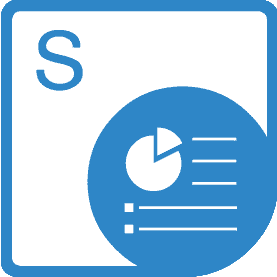

## **Witamy w Aspose.Slides for SharePoint!**

Aspose.Slides for SharePoint to elastyczne rozwiązanie, które umożliwia konwertowanie dokumentów PowerPoint® w obrębie witryn Microsoft SharePoint.

## **Przegląd produktu**

Aspose.Slides for SharePoint obsługuje wiele formatów dokumentów PowerPoint:

- PPT – prezentacja Microsoft PowerPoint 97‑2003
- PPS – pokaz slajdów Microsoft PowerPoint 97‑2003
- POT – szablon Microsoft PowerPoint 97‑2003
- PPTX – prezentacja Office Open XML
- PPSX – pokaz slajdów Office Open XML
- POTX – szablon Office Open XML

Aspose.Slides for SharePoint jest przeznaczony do współpracy z następującymi produktami:

- Windows SharePoint Services 3.0 (WSS)
- Microsoft Office SharePoint Server 2007 (MOSS) Standard
- Microsoft Office SharePoint Server 2007 (MOSS) Enterprise
- Microsoft Office SharePoint Server 2013
- Microsoft Office SharePoint Server 2019

Poza wymaganiami istniejącymi dla powyższych produktów nie ma innych wymagań systemowych.

**Użyj Aspose.Slides for SharePoint do konwertowania dokumentów z biblioteki dokumentów SharePoint** 

