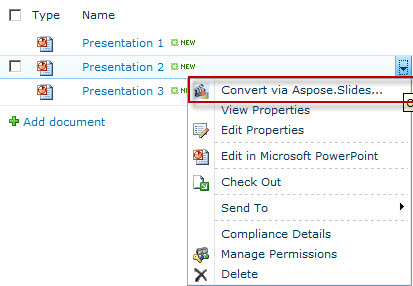

{} 

Kiedy Aspose.Slides for SharePoint zostaje zainstalowany na serwerze SharePoint, dodaje opcję **Convert via Aspose.Slides.SharePoint** do menu prezentacji, jak pokazano poniżej: 

**Instalacja Aspose.Slides for SharePoint dodaje opcję Convert via Aspose.Slides do menu dokumentów** 

{} 
## **Konwertowanie prezentacji**
Aby przekonwertować dokument Microsoft PowerPoint z biblioteki dokumentów SharePoint: 

1. Wybierz dokument Microsoft PowerPoint w bibliotece dokumentów.
2. Kliknij strzałkę w dół, aby wyświetlić menu, i wybierz **Convert via Aspose.Slides.SharePoint**. 

   **Menu pliku Presentation 2 wyświetlające opcję Convert via Aspose.Slides** 

3. Wybierz żądany format wyjściowy w formularzu. Jeśli chcesz, zmień nazwę pliku wyjściowego i folder docelowy.
4. Kliknij **Convert**, aby przekonwertować plik. 

   **Formularz konwersji pozwala wybrać format pliku wyjściowego, nazwę i miejsce docelowe** 

5. Po zakończeniu konwersji wyświetlany jest komunikat o sukcesie. 

   **Konwersja zakończyła się pomyślnie** 

6. Kliknij **Source Library** (aby przejść do katalogu źródłowego) lub **Destination Library** (aby przejść do katalogu, w którym zapisano plik). 

   Skonwertowany dokument pojawia się w bibliotece dokumentów. 

   **Skonwertowany dokument wyświetlany w bibliotece, w której został zapisany** 

