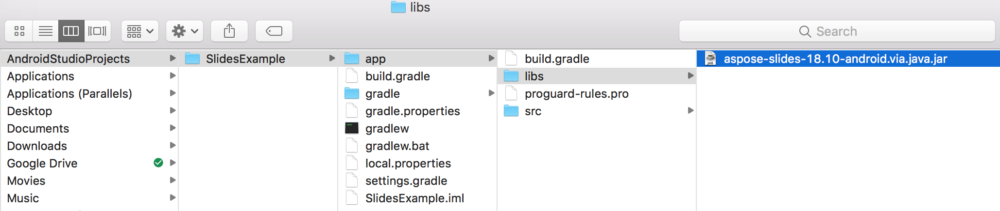
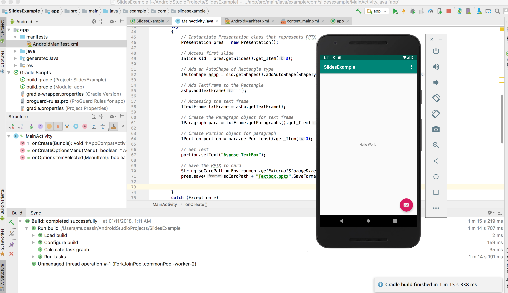

## **Visão geral**

Este artigo explica como instalar Aspose.Slides para Android via Java e adicioná‑lo a um projeto Android. Ele descreve duas opções de instalação: adicionar o arquivo JAR do Aspose.Slides ao projeto manualmente e instalar a biblioteca a partir do repositório Maven.

O artigo também fornece um exemplo passo a passo que mostra como criar um novo aplicativo Android no Android Studio, referenciar a biblioteca Aspose.Slides, criar uma apresentação PowerPoint programaticamente e salvá‑la no formato PPTX. Também inclui notas sobre versionamento e responde a perguntas comuns sobre verificação da integração, gerenciamento do uso de memória e redução do tamanho final do JAR.

## **Instalação**
Anteriormente, Aspose.Slides para Android via Java era distribuído como um único arquivo ZIP contendo o arquivo JAR, demonstrações e a documentação do produto. 

1. Se você quiser usar uma versão anterior à Aspose.Words para Android via Java 18.9, precisará descompactar essa versão de Aspose.Slides.Android.zip no diretório de sua preferência. 
1. Adicione o arquivo JAR extraído ao seu aplicativo usando a configuração Build Path. 
### **Adicionar uma referência ao Aspose.Slides para Android via Java Jar**
1. Baixe a versão mais recente de [Aspose.Slides for Android via Java](https://downloads.aspose.com/slides/pt/androidjava)
1. Copie aspose‑slides‑18.9‑android.via.java.jar para a pasta *libs/* do seu projeto




### **Instalar Aspose.Slides para Android via Java a partir do repositório Maven**
1. Adicione o repositório Maven ao seu **build.gradle**. 
1. Adicione o JAR de [Aspose.Slides for Android via Java](https://releases.aspose.com/java/repo/com/aspose/aspose-slides/) como dependência.

``` java

 // 1. Adicione o repositório Maven ao seu build.gradle 

repositories {

    mavenCentral()

    maven { url "https://releases.aspose.com/java/repo/" }

}

// 2. Adicione o JAR 'Aspose.Slides for Android via Java' como dependência

dependencies {

    ...

    ...

    compile (group: 'com.aspose', name: 'aspose-slides', version: 'XX.XX', classifier: 'android.via.java')

}

```
## **Seu primeiro aplicativo usando Aspose.Slides para Android via Java**
Nesta seção, você aprenderá como iniciar com Aspose.Slides para Android via Java. Pretendemos mostrar como configurar um novo projeto Android do zero, adicionar uma referência ao JAR do Aspose.Slides e criar uma nova apresentação PowerPoint que será salva no disco no formato PPTX. O exemplo aqui usa [Android Studio](https://developer.android.com/studio/index.html) para desenvolvimento e o aplicativo é executado no Android Emulator. Para começar com Aspose.Slides para Android via Java, siga este tutorial passo a passo para criar um app que usa Aspose.Slides para Android via Java:

1. Baixe e instale o [Android Studio](https://developer.android.com/studio/index.html) em qualquer local.
1. Execute o Android Studio.
1. Crie um novo Projeto de Aplicativo Android.


1. Copie aspose‑slides‑XX.XX‑android.via.java.jar para a pasta **libs/** do seu projeto


1. Selecione **Project Section** (no menu Arquivo) e clique na aba **Dependencies**.
   1. Clique no botão “+”. Selecione a opção **file dependency**.
   1. Selecione a biblioteca Aspose.Slides na pasta **libs** e clique em **OK**.


1. Sincronize o projeto com os arquivos Gradle, se necessário. 


1. Para acessar o SDCard, permissões especiais precisam ser adicionadas. Clique no arquivo **AndroidManifest.xml** e escolha a visualização XML. Adicione esta linha ao arquivo `<uses-permission android:name="android.permission.WRITE_EXTERNAL_STORAGE" />`


1. Volte para a seção de código do app e adicione estas importações: 

``` java

 import java.io.File;

import com.aspose.slides.IAutoShape;

import com.aspose.slides.IParagraph;

import com.aspose.slides.IPortion;

import com.aspose.slides.ISlide;

import com.aspose.slides.ITextFrame;

import com.aspose.slides.Presentation;

import com.aspose.slides.SaveFormat;

import com.aspose.slides.ShapeType;

import android.os.Environment; 

```

Agora, insira este código no corpo do método **onCreate** para criar uma nova **Presentation** do zero usando Aspose.Slides e salvá‑la no SDCard no formato PPTX.

``` java

 try

{

    // Instanciar a classe Presentation que representa um PPTX
    Presentation pres = new Presentation();


    // Acessar o primeiro slide
    ISlide sld = pres.getSlides().get_Item(0);


    // Adicionar um AutoShape do tipo Retângulo
    IAutoShape ashp = sld.getShapes().addAutoShape(ShapeType.Rectangle, 150, 75, 150, 50);


    // Adicionar TextFrame ao Retângulo
    ashp.addTextFrame(" ");


    // Acessando o quadro de texto
    ITextFrame txtFrame = ashp.getTextFrame();


    // Criar o objeto Paragraph para o quadro de texto
    IParagraph para = txtFrame.getParagraphs().get_Item(0);


    // Criar o objeto Portion para o parágrafo
    IPortion portion = para.getPortions().get_Item(0);


    // Definir texto
    portion.setText("Aspose TextBox");


    // Salvar o PPTX no cartão
    String sdCardPath = Environment.getExternalStorageDirectory().getPath() + File.separator;
    pres.save(sdCardPath + "Textbox.pptx",SaveFormat.Pptx);
}

catch (Exception e)

{
   e.printStackTrace();
}
```

O código completo deve ficar assim:


1. Execute novamente o aplicativo. Desta vez, o código Aspose.Slides será executado em segundo plano e gerará um documento que será salvo no SDCard.




1. Para visualizar o documento criado, navegue até o menu **Tools**. Escolha **Android** e então selecione **Android Device Monitor**


## **Versionamento**
Desde 2018, o versionamento do Aspose.Slides para Android via Java segue o Aspose.Slides para Java. 

## **FAQ**

**Como posso verificar se o Aspose.Slides foi integrado corretamente?**

Compile seu projeto, instancie uma **Presentation** vazia ([Presentation](https://reference.aspose.com/slides/pt/androidjava/com.aspose.slides/presentation/)) e salve‑a com um novo nome. Se o arquivo for criado sem lançar exceções, a biblioteca foi integrada com sucesso.

**Como posso limitar o consumo de memória ao processar apresentações grandes?**

Aumente os limites de memória da JVM apenas o necessário e feche cada instância de **Presentation** em um bloco `finally` para liberar o cache imediatamente. Isso evita erros de falta de memória e mantém o uso geral de memória previsível durante operações em lote.

**Posso excluir formatos de exportação indesejados para reduzir o tamanho final do JAR?**

As versões atuais do Aspose.Slides são distribuídas como uma única biblioteca monolítica, portanto não é possível desativar exportadores específicos, como PDF ou SVG, no momento da compilação.