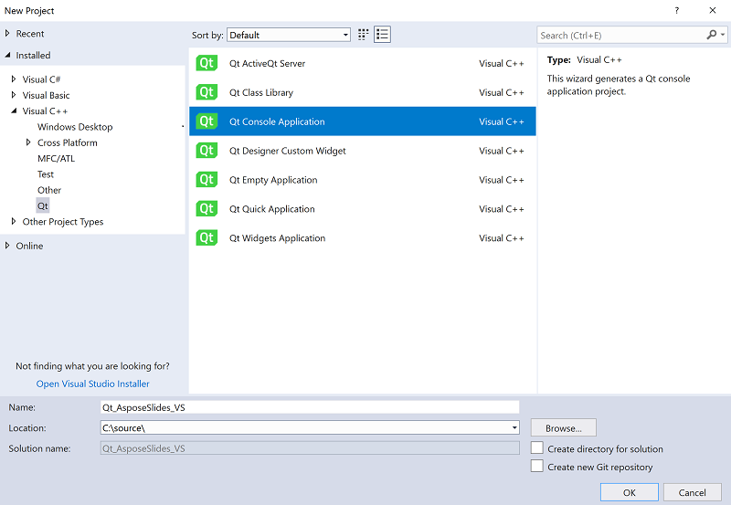

## **Introdução**

Qt é um framework de desenvolvimento de aplicações multiplataforma baseado em C++ que é amplamente usado para desenvolver uma variedade de aplicações desktop, móveis e de sistemas embarcados. Aspose.Slides for C++ pode ser integrado ao Qt para criar e manipular documentos PowerPoint em suas aplicações Qt.

## **Usando Aspose.Slides for C++ no Qt Creator**

Para usar Aspose.Slides for C++ em sua aplicação Qt, baixe a versão mais recente da API na seção [downloads](https://downloads.aspose.com/slides/pt/cpp). Após o download da API, você pode integrar a biblioteca C++ no Qt Creator ou no Visual Studio.

Para integrar e usar a biblioteca Aspose.Slides for C++ em um Aplicativo de Console Qt desenvolvido no Qt Creator, siga os passos abaixo:

- Abra o Qt Creator e crie uma nova *Qt Console Application*.

- Selecione a opção QMake na lista suspensa *Build System*.

- Selecione o kit apropriado e conclua o assistente.
- Copie a pasta aspose-slides-cpp-21.02 do pacote extraído do Aspose.Slides for C++ para a raiz do projeto.

- Para adicionar caminhos às pastas lib e include, clique com o botão direito no projeto no painel esquerdo e selecione *Add Library*.

- Selecione a opção External Library e navegue pelos caminhos das pastas lib um a um.

- Quando terminar, seu arquivo de projeto .pro conterá as seguintes entradas:

- Compile a aplicação e a integração estará concluída.  

{}

Observação: Consulte o [full demo project](https://github.com/aspose-slides/Aspose.Slides-for-C/tree/master/QtDemos/QtCreator/Qt_AsposeSlides_QMake) para mais informações.

{}

## **Usando Aspose.Slides for C++ em Aplicações Qt no Visual Studio**

Para desenvolver uma aplicação Qt usando o Visual Studio, você precisa instalar o [Qt Visual Studio Tools](https://marketplace.visualstudio.com/items?itemName=TheQtCompany.QtVisualStudioTools-19123). Após a instalação, baixe a versão mais recente da API na seção [downloads](https://downloads.aspose.com/slides/pt/cpp) e siga os passos abaixo:

- Abra o Microsoft Visual Studio e crie uma nova *Qt Console Application*.

- Selecione o kit apropriado e conclua o assistente.
- Para integrar e usar a biblioteca Aspose.Slides for C++, clique com o botão direito no projeto e selecione *Manage NuGet Packages...*.

- Encontre e instale o pacote *Aspose.Slides.Cpp* necessário.

- Compile o projeto e a integração estará concluída.  

{}

Observação: Consulte o [full demo project](https://github.com/aspose-slides/Aspose.Slides-for-C/tree/master/QtDemos/Visual%20Studio/Qt_AsposeSlides_VS) para mais informações.

{}