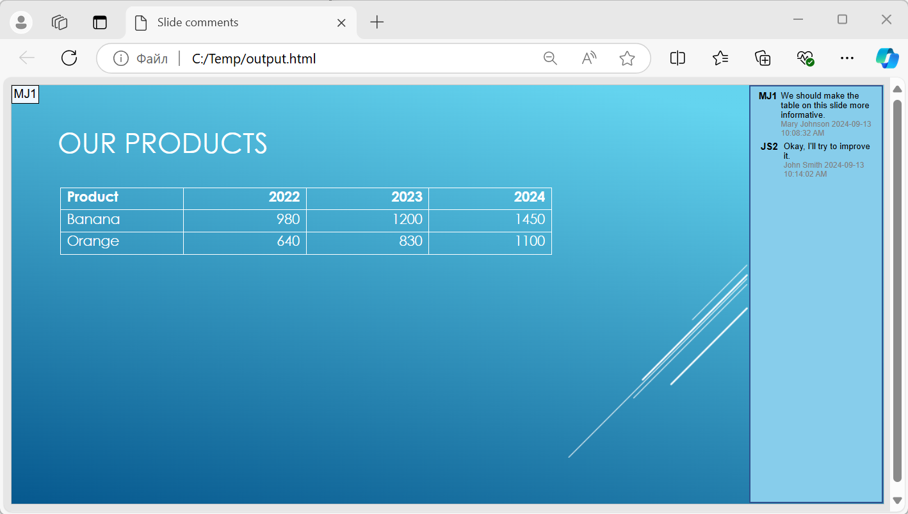

## **Visão geral**

Este artigo explica como converter apresentações do PowerPoint para HTML5 usando Aspose.Slides. Ele cobre a exportação básica para HTML5 sem extensões web ou dependências adicionais, bem como opções para controlar animações de formas e transições de slides. O artigo também mostra o processo padrão de exportação de PowerPoint para HTML, explica como gerar saída HTML5 no modo de visualização de slides e demonstra como incluir comentários no documento exportado configurando seu layout.

## **Exportar PowerPoint para HTML5**

Este código Java mostra como exportar uma apresentação para HTML5 sem extensões web e dependências:

```java
import com.aspose.slides.*;

Presentation pres = new Presentation("pres.pptx");
try {
    pres.save("pres.html", SaveFormat.Html5);
} finally {
    if (pres != null) pres.dispose();
}
```

{} 
Neste caso, você obtém HTML limpo. 
{}

Você pode especificar configurações para animações de formas e transições de slides desta maneira:

```java
import com.aspose.slides.*;

Presentation pres = new Presentation("pres.pptx");
try {
    Html5Options html5Options = new Html5Options();
    html5Options.setAnimateShapes(false);
    html5Options.setAnimateTransitions(false);
    
    pres.save("pres5.html", SaveFormat.Html5, html5Options);
} finally {
    if (pres != null) pres.dispose();
}
```

## **Exportar PowerPoint para HTML**

Este Java demonstra o processo padrão de conversão de PowerPoint para HTML:

```java
import com.aspose.slides.*;

Presentation pres = new Presentation("pres.pptx");
try {
    pres.save("pres.html", SaveFormat.Html);
} finally {
    if (pres != null) pres.dispose();
}
```

Neste caso, o conteúdo da apresentação é renderizado via SVG em um formato como este:

```html
<body>
<div class="slide" name="slide" id="slideslideIface1">
     <svg version="1.1">
         <g> THE SLIDE CONTENT GOES HERE </g>
     </svg>
</div>
</body>
```

{} 
Ao usar este método para exportar PowerPoint para HTML, devido à renderização SVG, você não poderá aplicar estilos ou animar elementos específicos. 
{}

## **Exportar PowerPoint para Visualização de Slides HTML5**

**Aspose.Slides** permite converter uma apresentação do PowerPoint em um documento HTML5 no qual os slides são apresentados em modo de visualização de slides. Nesse caso, ao abrir o arquivo HTML5 resultante em um navegador, você vê a apresentação em modo de visualização de slides em uma página web. 

Este código Java demonstra o processo de exportação de PowerPoint para visualização de slides HTML5:

```java
import com.aspose.slides.*;

Presentation pres = new Presentation("pres.pptx");
try {
    Html5Options html5Options = new Html5Options();
    html5Options.setAnimateShapes(true);
    html5Options.setAnimateTransitions(true);

    pres.save("HTML5-slide-view.html", SaveFormat.Html5, html5Options);
} finally {
    if (pres != null) pres.dispose();
}
```

## **Converter Apresentações em Documentos HTML5 com Comentários**

Comentários no PowerPoint são uma ferramenta que permite aos usuários deixar notas ou feedback nos slides da apresentação. Eles são especialmente úteis em projetos colaborativos, onde várias pessoas podem adicionar sugestões ou observações a elementos específicos dos slides sem alterar o conteúdo principal. Cada comentário exibe o nome do autor, facilitando a identificação de quem fez a observação.

Vamos supor que temos a seguinte apresentação do PowerPoint salva no arquivo "sample.pptx".


Ao converter uma apresentação do PowerPoint para um documento HTML5, você pode especificar facilmente se os comentários da apresentação serão incluídos no documento de saída. Para isso, passe os parâmetros de exibição dos comentários para o método `setSlidesLayoutOptions` da classe [Html5Options](https://reference.aspose.com/slides/pt/java/com.aspose.slides/html5options/) .

O exemplo de código a seguir converte uma apresentação em um documento HTML5 com comentários exibidos à direita dos slides.
```java
import com.aspose.slides.*;

Html5Options html5Options = new Html5Options();

NotesCommentsLayoutingOptions layoutingOptions = new NotesCommentsLayoutingOptions();
layoutingOptions.setCommentsPosition(CommentsPositions.Right);
html5Options.setSlidesLayoutOptions(layoutingOptions);

Presentation presentation = new Presentation("sample.pptx");
presentation.save("output.html", SaveFormat.Html5, html5Options);
presentation.dispose();
```

O documento "output.html" é mostrado na imagem abaixo.



## **Perguntas frequentes**

### Posso controlar se animações de objetos e transições de slides serão reproduzidas em HTML5?

Sim, o HTML5 oferece opções separadas para habilitar ou desabilitar [animações de formas](https://reference.aspose.com/slides/pt/java/com.aspose.slides/html5options/#setAnimateShapes-boolean-) e [transições de slides](https://reference.aspose.com/slides/pt/java/com.aspose.slides/html5options/#setAnimateTransitions-boolean-).

### O suporte a saída de comentários está disponível e onde eles podem ser posicionados em relação ao slide?

Sim, comentários podem ser adicionados em HTML5 e posicionados (por exemplo, à direita do slide) através das [configurações de layout](https://reference.aspose.com/slides/pt/java/com.aspose.slides/html5options/#setSlidesLayoutOptions-com.aspose.slides.ISlidesLayoutOptions-) para notas e comentários.

### Posso ignorar links que invocam JavaScript por questões de segurança ou CSP?

Sim, existe uma [configuração](https://reference.aspose.com/slides/pt/java/com.aspose.slides/saveoptions/#setSkipJavaScriptLinks-boolean-) que permite pular hyperlinks com chamadas JavaScript durante a gravação. Isso ajuda a cumprir políticas de segurança rigorosas.