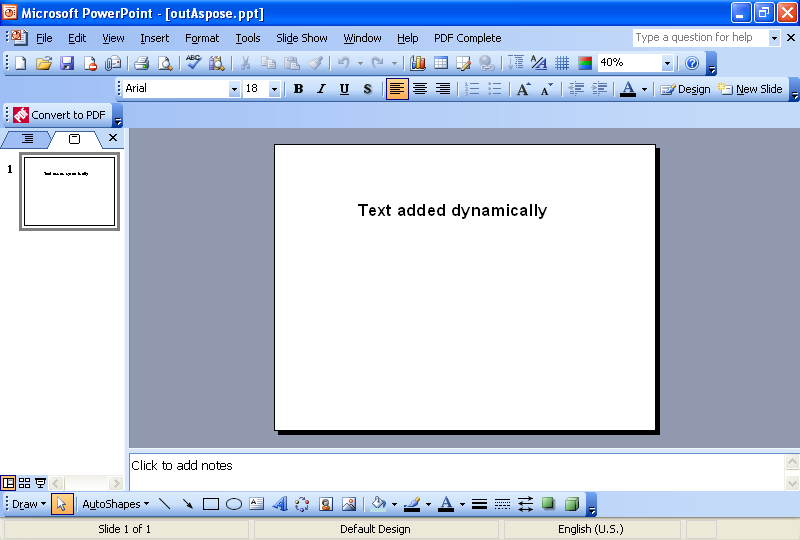

{} 

Uma tarefa comum que os desenvolvedores precisam realizar é adicionar texto aos slides dinamicamente. Este artigo mostra exemplos de código para adicionar texto dinamicamente usando [VSTO](/slides/pt/java/adding-text-dynamically-using-vsto-and-aspose-slides-for-java/) e [Aspose.Slides for Java](/slides/pt/java/adding-text-dynamically-using-vsto-and-aspose-slides-for-java/).

{} 
## **Adicionando Texto Dinamicamente**
Ambos os métodos seguem estas etapas:

1. Criar uma apresentação.
1. Adicionar um slide em branco.
1. Adicionar uma caixa de texto.
1. Definir algum texto.
1. Gravar a apresentação.
## **Exemplo de Código VSTO**
Os trechos de código abaixo resultam em uma apresentação com um slide simples e uma cadeia de texto nele.

**A apresentação criada no VSTO** 


## **Exemplo Aspose.Slides para Java**
Os trechos de código abaixo usam Aspose.Slides para criar uma apresentação com um slide simples e uma cadeia de texto nele.

**A apresentação criada usando Aspose.Slides para Java** 

