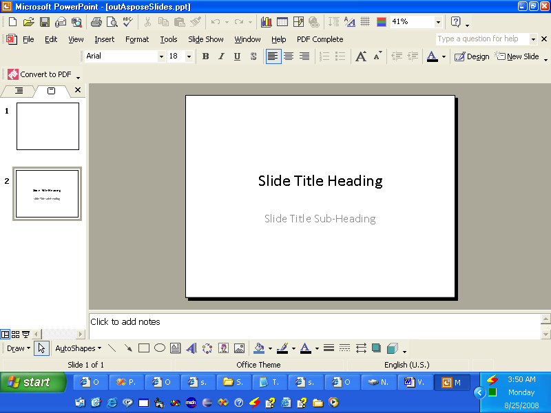

{} 

VSTO foi desenvolvido para permitir que desenvolvedores criem aplicativos que possam ser executados dentro do Microsoft Office. VSTO é baseado em COM, mas está encapsulado dentro de um objeto .NET para que possa ser usado em aplicativos .NET. VSTO precisa de suporte ao framework .NET, bem como do runtime baseado em CLR do Microsoft Office. Embora possa ser usado para criar complementos do Microsoft Office, é quase impossível utilizá‑lo como componente do lado do servidor. Também possui sérios problemas de implantação.

O Aspose.Slides for Java é um componente que pode ser usado para manipular apresentações do Microsoft PowerPoint, assim como o VSTO, mas possui várias vantagens:

- O Aspose.Slides contém apenas código gerenciado e não requer que o runtime do Microsoft Office seja instalado.
- Pode ser usado como componente do lado do cliente ou como componente do lado do servidor.
- A implantação é fácil, pois o Aspose.Slides está contido em um único arquivo jar.

{} 
## **Criando uma Apresentação**
A seguir, dois exemplos de código que ilustram como VSTO e Aspose.Slides for Java podem ser usados para alcançar o mesmo objetivo. O primeiro exemplo é [VSTO](/slides/pt/java/create-a-new-presentation/); [o segundo exemplo](/slides/pt/java/create-a-new-presentation/) usa Aspose.Slides.
### **Exemplo VSTO**
**A saída do VSTO** 


### **Exemplo Aspose.Slides for Java**
**A saída do Aspose.Slides** 

