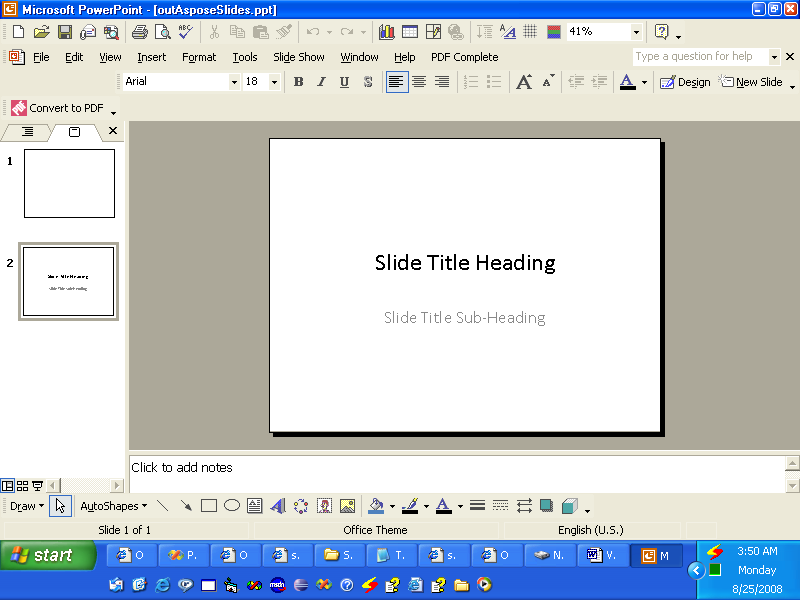

{}

VSTO foi desenvolvido para permitir que desenvolvedores criem aplicações que possam ser executadas dentro do Microsoft Office. VSTO é baseado em COM, mas está encapsulado em um objeto .NET para que possa ser usado em aplicações .NET. VSTO necessita de suporte ao .NET Framework, bem como do runtime baseado em CLR do Microsoft Office. Embora possa ser usado para criar add-ins do Microsoft Office, é quase impossível utilizá‑lo como um componente do lado do servidor. Ele também possui sérios problemas de implantação.

Aspose.Slides for Java é um componente que pode ser usado para manipular apresentações do Microsoft PowerPoint, assim como o VSTO, mas possui várias vantagens:

- Aspose.Slides contém apenas código gerenciado e não requer que o runtime do Microsoft Office esteja instalado.
- Ele pode ser usado como um componente cliente ou como um componente do lado do servidor.
- A implantação é simples, pois o Aspose.Slides está contido em um único arquivo jar.

{} 
## **Criando uma Apresentação**
Abaixo estão dois exemplos de código que ilustram como VSTO e Aspose.Slides for Java podem ser usados para alcançar o mesmo objetivo. O primeiro exemplo é [VSTO](/slides/pt/java/create-a-new-presentation/); [o segundo exemplo](/slides/pt/java/create-a-new-presentation/) usa Aspose.Slides.
### **Exemplo VSTO**
**A saída do VSTO** 


### **Exemplo Aspose.Slides for Java**
**A saída do Aspose.Slides** 

