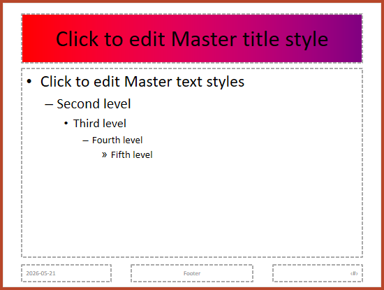

## **Visão geral**

Um **slide master** define configurações de design compartilhadas para um grupo de slides. Ele pode conter formas comuns, logotipos, fundos, estilos de texto, configurações de tema e configurações de rodapé. No PowerPoint, editar um slide master é a maneira usual de manter uma apresentação consistente sem repetir a mesma formatação em cada slide.

Aspose.Slides para Java suporta o mesmo modelo. Uma apresentação pode conter um ou mais slides master, e cada slide master pode conter vários slides de layout. Slides normais geralmente não referenciam um slide master diretamente. Em vez disso, um slide normal usa um slide de layout, e esse slide de layout pertence a um slide master.

A hierarquia é:

1. **Slide master** – define o design e o tema compartilhados.  
1. **Layout slide** – define um arranjo específico de placeholders e formatação de nível de layout.  
1. **Normal slide** – contém o conteúdo real da apresentação e usa um layout slide.


No Aspose.Slides, um slide master é representado pela interface [IMasterSlide](https://reference.aspose.com/slides/pt/java/com.aspose.slides/imasterslide/) . Todos os slides master em uma apresentação estão disponíveis através da coleção [Presentation.getMasters](https://reference.aspose.com/slides/pt/java/com.aspose.slides/presentation/#getMasters--) , que implementa [IMasterSlideCollection](https://reference.aspose.com/slides/pt/java/com.aspose.slides/imasterslidecollection/) .

{}
Quando a mesma propriedade é definida em mais de um nível, o nível mais específico prevalece. Por exemplo, se um slide master e um slide de layout definirem um fundo, os slides baseados nesse layout usarão o fundo do layout. Para mais informações sobre slides de layout, veja [Apply or Change Slide Layouts](/slides/pt/java/slide-layout/) .
{}

## **Acessar Slide Masters**

No PowerPoint, você pode abrir a visualização **Slide Master** a partir de **Exibir** > **Slide Master**.


No Aspose.Slides, use a coleção `getMasters()` para acessar slides master:

```java
Presentation presentation = new Presentation("presentation.pptx");
try {
    IMasterSlide firstMasterSlide = presentation.getMasters().get_Item(0);
    int masterSlideCount = presentation.getMasters().size();
    int firstMasterLayoutSlideCount = firstMasterSlide.getLayoutSlides().size();

    System.out.println("Master slides: " + masterSlideCount);
    System.out.println("Layouts in the first master: " + firstMasterLayoutSlideCount);
} finally {
    presentation.dispose();
}
```

Você também pode obter o slide master usado por um slide normal através de seu layout:

```java
Presentation presentation = new Presentation("presentation.pptx");
try {
    ISlide slide = presentation.getSlides().get_Item(0);
    ILayoutSlide layoutSlide = slide.getLayoutSlide();
    IMasterSlide masterSlide = layoutSlide.getMasterSlide();
    String masterSlideName = masterSlide.getName();

    System.out.println(masterSlideName);
} finally {
    presentation.dispose();
}
```

## **O que um Slide Master contém**

Um slide master é um objeto semelhante a um slide. Ele implementa [IBaseSlide](https://reference.aspose.com/slides/pt/java/com.aspose.slides/ibaseslide/), portanto expõe muitas das mesmas propriedades de slide usadas por slides normais e de layout. Membros específicos de master são listados na página da API [IMasterSlide](https://reference.aspose.com/slides/pt/java/com.aspose.slides/imasterslide/) .

Membros de slide master usados com frequência incluem:

| Membro | Finalidade |
| --- | --- |
| `getBackground()` | Define o fundo do slide no nível master. |
| `getShapes()` | Armazena as formas colocadas no master, como logotipos, quadros de imagem e texto compartilhado. |
| `getLayoutSlides()` | Armazena os slides de layout que pertencem ao master. |
| `getThemeManager()` | fornece acesso às APIs de tema do master. |
| `getHeaderFooterManager()` | controla cabeçalhos, rodapés, datas e números de slide para o master e seus layouts filhos. |
| `getDependingSlides()` | Retorna slides normais que dependem do master através de seus layouts. |

## **Adicionar uma Imagem a um Slide Master**

Quando você adiciona uma imagem a um slide master, ela aparece nos slides que utilizam layouts desse master. Isso é útil para logotipos, marcas d’água, faixas decorativas e outros elementos visuais repetidos.

O exemplo a seguir adiciona um logotipo ao primeiro slide master:

```java
Presentation presentation = new Presentation("presentation.pptx");
try {
    IMasterSlide masterSlide = presentation.getMasters().get_Item(0);
    IImage logo = Images.fromFile("logo.png");

    try {
        IPPImage logoImage = presentation.getImages().addImage(logo);

        masterSlide.getShapes().addPictureFrame(
                ShapeType.Rectangle,
                20,
                20,
                80,
                80,
                logoImage);
    } finally {
        logo.dispose();
    }

    presentation.save("presentation-with-logo.pptx", SaveFormat.Pptx);
} finally {
    presentation.dispose();
}
```

Para obter mais informações sobre quadros de imagem, veja [Picture Frame](/slides/pt/java/picture-frame/) .

## **Trabalhar com Placeholders**

Placeholders são normalmente definidos em slides de layout. O slide master fornece o estilo e o tema compartilhados que esses layouts herdam, enquanto cada layout decide quais placeholders estão disponíveis e onde são posicionados.

No PowerPoint, os comandos de placeholder estão disponíveis na visualização Slide Master.


Para adicionar novos placeholders com Aspose.Slides, trabalhe com o slide de layout que pertence ao master:

```java
Presentation presentation = new Presentation("presentation.pptx");
try {
    IMasterSlide masterSlide = presentation.getMasters().get_Item(0);
    ILayoutSlide blankLayoutSlide = masterSlide.getLayoutSlides().getByType(SlideLayoutType.Blank);

    if (blankLayoutSlide == null) {
        blankLayoutSlide = masterSlide.getLayoutSlides().add(SlideLayoutType.Blank, "Blank");
    }

    blankLayoutSlide.getPlaceholderManager().addTextPlaceholder(60, 120, 600, 80);

    presentation.getSlides().addEmptySlide(blankLayoutSlide);
    presentation.save("presentation-with-placeholder.pptx", SaveFormat.Pptx);
} finally {
    presentation.dispose();
}
```

Você também pode formatar shapes de placeholder que já existem em um slide master. O exemplo a seguir encontra o placeholder de título e aplica um preenchimento de gradiente linear:

```java
Presentation presentation = new Presentation("presentation.pptx");
try {
    IMasterSlide masterSlide = presentation.getMasters().get_Item(0);
    IAutoShape titlePlaceholder = null;

    for (IShape shape : masterSlide.getShapes()) {
        if (shape instanceof IAutoShape) {
            IAutoShape autoShape = (IAutoShape) shape;

            if (autoShape.getPlaceholder() != null &&
                    autoShape.getPlaceholder().getType() == PlaceholderType.Title) {
                titlePlaceholder = autoShape;
                break;
            }
        }
    }

    if (titlePlaceholder != null) {
        Color redGradientColor = new Color(255, 0, 0);
        Color purpleGradientColor = new Color(128, 0, 128);

        titlePlaceholder.getFillFormat().setFillType(FillType.Gradient);
        titlePlaceholder.getFillFormat().getGradientFormat().setGradientShape(GradientShape.Linear);
        titlePlaceholder.getFillFormat().getGradientFormat().getGradientStops().add(0.0f, redGradientColor);
        titlePlaceholder.getFillFormat().getGradientFormat().getGradientStops().add(255.0f, purpleGradientColor);
    }

    presentation.save("presentation-title-style.pptx", SaveFormat.Pptx);
} finally {
    presentation.dispose();
}
```



Para mais opções de formatação de placeholders e texto, veja [Set Prompt Text in Placeholder](/slides/pt/java/manage-placeholder/) e [Text Formatting](/slides/pt/java/text-formatting/) .

## **Alterar o Fundo de um Slide Master**

Um fundo de master é herdado por layouts e slides que não o sobrescrevem. O exemplo a seguir define uma cor de fundo sólida para o primeiro slide master:

```java
Presentation presentation = new Presentation("presentation.pptx");
try {
    IMasterSlide masterSlide = presentation.getMasters().get_Item(0);
    Color masterBackgroundColor = Color.GREEN;

    masterSlide.getBackground().setType(BackgroundType.OwnBackground);
    masterSlide.getBackground().getFillFormat().setFillType(FillType.Solid);
    masterSlide.getBackground().getFillFormat().getSolidFillColor().setColor(masterBackgroundColor);

    presentation.save("presentation-master-background.pptx", SaveFormat.Pptx);
} finally {
    presentation.dispose();
}
```

Para tópicos relacionados, veja [Presentation Background](/slides/pt/java/presentation-background/) e [Presentation Theme](/slides/pt/java/presentation-theme/) .

## **Clonar um Slide Master para outra Apresentação**

Use [IMasterSlideCollection.addClone](https://reference.aspose.com/slides/pt/java/com.aspose.slides/imasterslidecollection/#addClone-com.aspose.slides.IMasterSlide-) para copiar um slide master para outra apresentação. O master copiado pode então ser usado por layouts e slides na apresentação de destino.

```java
Presentation sourcePresentation = new Presentation("source.pptx");
Presentation destinationPresentation = new Presentation("destination.pptx");
try {
    IMasterSlide sourceMasterSlide = sourcePresentation.getMasters().get_Item(0);
    IMasterSlide clonedMasterSlide = destinationPresentation.getMasters().addClone(sourceMasterSlide);

    destinationPresentation.save("destination-with-master.pptx", SaveFormat.Pptx);
} finally {
    sourcePresentation.dispose();
    destinationPresentation.dispose();
}
```

Se precisar clonar slides normais juntamente com seu master, veja [Clone Slides](/slides/pt/java/clone-slides/) .

## **Adicionar Múltiplos Slide Masters**

Uma apresentação pode conter múltiplos slides master. Isso é útil quando diferentes seções requerem branding, estrutura de página ou configurações de tema diferentes.


O exemplo a seguir clona o master padrão, atribui ao clone um fundo diferente, cria um layout sob esse master clonado e adiciona um novo slide baseado naquele layout:

```java
Presentation presentation = new Presentation("presentation.pptx");
try {
    IMasterSlide defaultMasterSlide = presentation.getMasters().get_Item(0);
    IMasterSlide sectionMasterSlide = presentation.getMasters().addClone(defaultMasterSlide);
    Color sectionMasterBackgroundColor = Color.LIGHT_GRAY;

    sectionMasterSlide.getBackground().setType(BackgroundType.OwnBackground);
    sectionMasterSlide.getBackground().getFillFormat().setFillType(FillType.Solid);
    sectionMasterSlide.getBackground().getFillFormat().getSolidFillColor().setColor(sectionMasterBackgroundColor);

    ILayoutSlide sourceBlankLayout = defaultMasterSlide.getLayoutSlides().getByType(SlideLayoutType.Blank);
    if (sourceBlankLayout == null) {
        sourceBlankLayout = defaultMasterSlide.getLayoutSlides().get_Item(0);
    }

    ILayoutSlide sectionBlankLayout = sectionMasterSlide.getLayoutSlides().addClone(sourceBlankLayout);

    presentation.getSlides().addEmptySlide(sectionBlankLayout);
    presentation.save("presentation-with-multiple-masters.pptx", SaveFormat.Pptx);
} finally {
    presentation.dispose();
}
```

## **Comparar Slide Masters**

Slides master podem ser comparados com o método `equals` herdado de [IBaseSlide](https://reference.aspose.com/slides/pt/java/com.aspose.slides/ibaseslide/) . A comparação verifica estrutura e conteúdo estático, como formas, texto, formatação, animações e outras configurações de slide. Não compara identificadores únicos, como IDs de slide, ou valores dinâmicos de placeholders, como a data atual.

```java
Presentation firstPresentation = new Presentation("first.pptx");
Presentation secondPresentation = new Presentation("second.pptx");
try {
    int firstPresentationMasterCount = firstPresentation.getMasters().size();
    int secondPresentationMasterCount = secondPresentation.getMasters().size();

    for (int firstMasterIndex = 0; firstMasterIndex < firstPresentationMasterCount; firstMasterIndex++) {
        for (int secondMasterIndex = 0; secondMasterIndex < secondPresentationMasterCount; secondMasterIndex++) {
            IMasterSlide firstMasterSlide = firstPresentation.getMasters().get_Item(firstMasterIndex);
            IMasterSlide secondMasterSlide = secondPresentation.getMasters().get_Item(secondMasterIndex);
            boolean areMasterSlidesEqual = firstMasterSlide.equals(secondMasterSlide);

            if (areMasterSlidesEqual) {
                System.out.printf(
                        "first.pptx master #%d equals second.pptx master #%d%n",
                        firstMasterIndex,
                        secondMasterIndex);
            }
        }
    }
} finally {
    firstPresentation.dispose();
    secondPresentation.dispose();
}
```

Para mais informações, veja [Compare Presentation Slides](/slides/pt/java/compare-slides/) .

## **Definir a Visualização de Slide Master como a Visualização Padrão**

Use o método `setLastView` em [ViewProperties](https://reference.aspose.com/slides/pt/java/com.aspose.slides/viewproperties/) para controlar a visualização que o PowerPoint abre primeiro. O exemplo a seguir abre a apresentação na visualização Slide Master:

```java
Presentation presentation = new Presentation("presentation.pptx");
try {
    presentation.getViewProperties().setLastView(ViewType.SlideMasterView);
    presentation.save("presentation-master-view.pptx", SaveFormat.Pptx);
} finally {
    presentation.dispose();
}
```

Para mais configurações de visualização, veja [Save Presentation](/slides/pt/java/save-presentation/) .

## **Remover Slides Master Não Utilizados**

Apresentações às vezes contêm slides master que não são mais usados por nenhum slide normal. Remover masters não utilizados pode reduzir o tamanho do arquivo e simplificar a manutenção de modelos.

Use `removeUnused` para remover masters não usados da coleção `getMasters()` :

```java
Presentation presentation = new Presentation("presentation.pptx");
try {
    presentation.getMasters().removeUnused(true);
    presentation.save("presentation-clean.pptx", SaveFormat.Pptx);
} finally {
    presentation.dispose();
}
```

Você também pode usar o método de low-code [Compress.removeUnusedMasterSlides](https://reference.aspose.com/slides/pt/java/com.aspose.slides/compress/#removeUnusedMasterSlides-com.aspose.slides.Presentation-) :

```java
Presentation presentation = new Presentation("presentation.pptx");
try {
    Compress.removeUnusedMasterSlides(presentation);
    presentation.save("presentation-clean.pptx", SaveFormat.Pptx);
} finally {
    presentation.dispose();
}
```

## **FAQ**

**Qual a diferença entre um slide master e um slide de layout?**

Um slide master define configurações de design compartilhadas como tema, fundo, formas comuns e estilos de texto. Um slide de layout pertence a um slide master e define um arranjo específico de placeholders. Um slide normal usa um slide de layout, portanto herda tanto do layout quanto do master.

**Uma apresentação pode conter vários slide masters?**

Sim. Uma apresentação pode conter vários slide masters. Use múltiplos masters quando diferentes seções precisam de sistemas visuais ou branding distintos.

**Devo adicionar placeholders a um slide master ou a um slide de layout?**

Na maioria dos casos, adicione placeholders a slides de layout. Coloque elementos visuais e formatação compartilhada no slide master e coloque os placeholders de conteúdo nos layouts que os slides normais usarão.

**Posso excluir um slide master que ainda está em uso?**

Não. Um slide master que tem slides dependentes não pode ser removido com segurança diretamente. Primeiro mova esses slides para layouts sob outro master ou use um método de limpeza de masters não usados que remove apenas masters que não estão em uso.