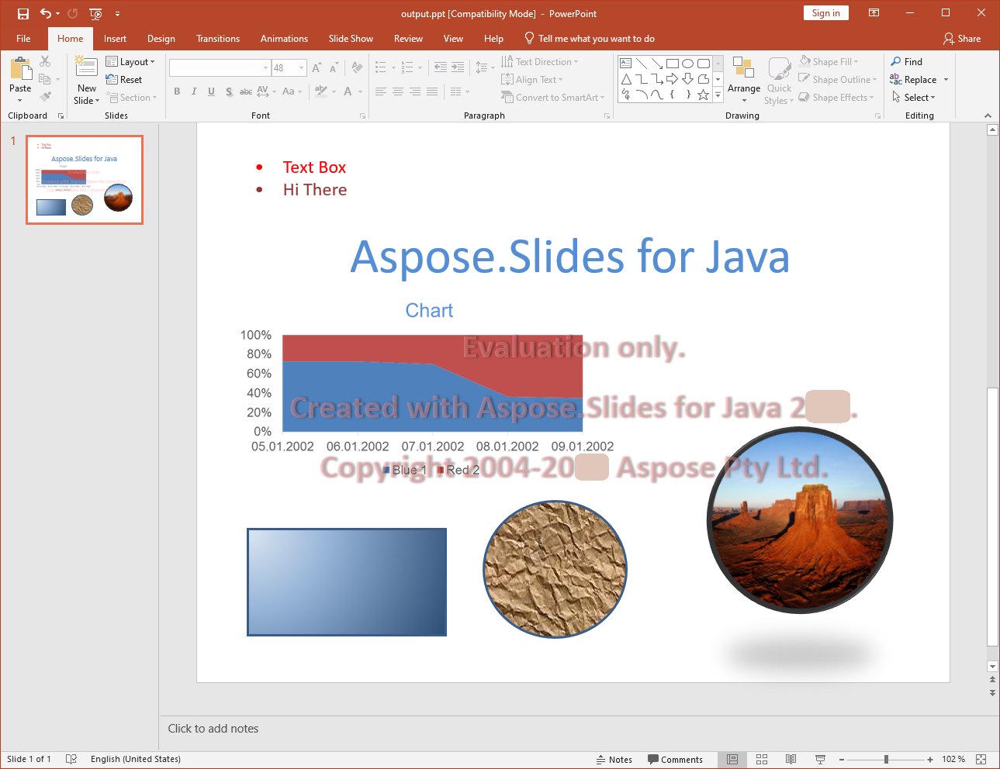

{} 

[PPT](https://en.wikipedia.org/wiki/Microsoft_PowerPoint) é o formato de arquivo de documento de apresentação que pode ser criado, lido, manipulado e gravado por diferentes versões do Microsoft PowerPoint. Este é o formato binário para documentos de apresentação desenvolvido pela Microsoft.

{} 

## **PPT no Aspose.Slides para Java**
Aspose.Slides para Java pode ler arquivos PPT criados pelo software listado abaixo.

- Microsoft PowerPoint 97
- Microsoft PowerPoint 2000
- Microsoft PowerPoint XP
- Microsoft PowerPoint 2003

Da mesma forma, arquivos PPT criados pelo Aspose.Slides para Java podem ser lidos pelo conjunto de softwares acima.

## **Suporte abrangente para PPT**
O Aspose.Slides para Java oferece suporte para quase todos os recursos suportados pelo formato de arquivo de documento PPT. Ele não cobre apenas os recursos básicos e avançados fornecidos pelas diferentes versões do Microsoft PowerPoint para manipulação de documentos PPT, mas também recursos que nem sequer são suportados pelo Microsoft PowerPoint. A principal vantagem de usar a biblioteca de API Aspose.Slides para Java é a facilidade de uso para lidar com esses recursos.

Além das tarefas básicas relacionadas à criação, leitura e gravação de arquivos de documento PPT, há vários recursos fornecidos pelo Aspose.Slides para Java:

- Importar outros formatos de arquivo do Microsoft Office como [objetos OLE em documentos PPT]().
- [Exportar documentos PPT para PDF](/slides/pt/java/convert-powerpoint-ppt-and-pptx-to-pdf/).
- Exportar slides nos documentos PPT para formatos SVG.
- Renderizar slides para qualquer formato de imagem suportado pelo Framework Java.
- Definir o tamanho dos slides em documentos PPT.
- Gerenciar animações em formas.
- Gerenciar apresentações de slides.
- [Formatar texto nos slides]().
- Extrair texto de documentos PPT.
- [Manipular tabelas nos slides]().
- Copiar mestres automaticamente usando [o recurso de clonagem]().
 
**Um arquivo PPT gerado pelo Aspose.Slides para Java e aberto no Microsoft PowerPoint** 

