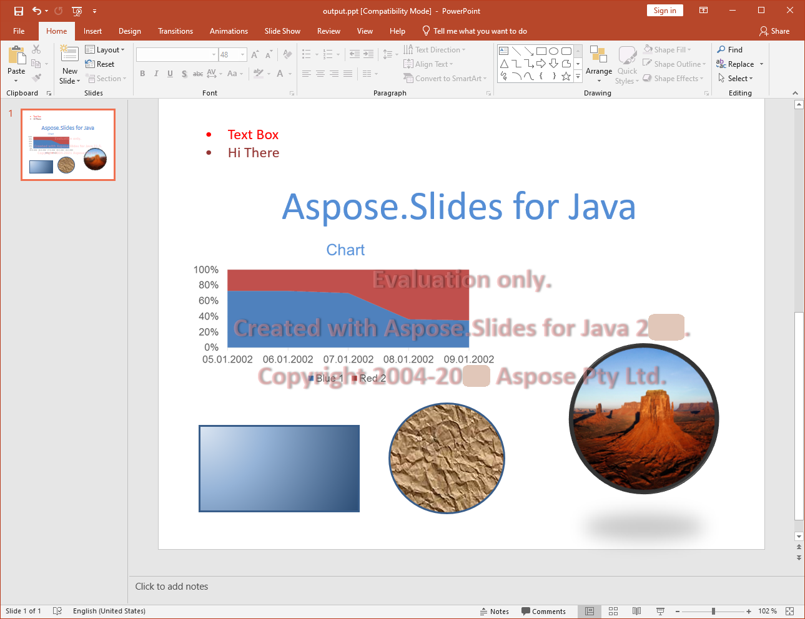

{}
Esta é uma página histórica, mantida para links existentes. Ela não descreve a versão atual do Aspose.Slides for Java. Para os formatos que o Aspose.Slides for Java carrega, importa, salva e renderiza, e a API para cada um, consulte [Supported File Formats](/slides/pt/java/supported-file-formats/). Para comparar PPT com PPTX, veja [Understanding the Difference: PPT vs PPTX](/slides/pt/java/ppt-vs-pptx/).
{}

{}
[PPT](https://en.wikipedia.org/wiki/Microsoft_PowerPoint) é o formato de arquivo de documento de apresentação que pode ser criado, lido, manipulado e escrito por diferentes versões do Microsoft PowerPoint. Este é o formato binário para documentos de apresentação desenvolvidos pela Microsoft.
{}

## **PPT no Aspose.Slides for Java**
O Aspose.Slides for Java pode ler arquivos PPT criados pelo software listado abaixo.

- Microsoft PowerPoint 97
- Microsoft PowerPoint 2000
- Microsoft PowerPoint XP
- Microsoft PowerPoint 2003

Da mesma forma, arquivos PPT criados pelo Aspose.Slides for Java podem ser lidos pelo conjunto de software acima.

## **Suporte abrangente para PPT**
O Aspose.Slides for Java oferece suporte para quase todos os recursos suportados pelo formato de arquivo de documento PPT. Ele não apenas cobre os recursos básicos e avançados fornecidos pelas diferentes versões do Microsoft PowerPoint para manipulação de documentos PPT, mas também recursos que nem mesmo o Microsoft PowerPoint suporta. A principal vantagem de usar a biblioteca de API Aspose.Slides for Java é a facilidade de uso para lidar com esses recursos.

Além das tarefas básicas relacionadas à criação, leitura e gravação de arquivos de documento PPT, há vários recursos fornecidos pelo Aspose.Slides for Java:

- Importar outros formatos de arquivo do Microsoft Office como [OLE objects into PPT documents](/slides/pt/java/manage-ole/).
- [Export PPT documents to PDF](/slides/pt/java/convert-powerpoint-to-pdf/).
- Exportar slides nos documentos PPT para formatos SVG.
- Renderizar slides para qualquer formato de imagem suportado pela estrutura Java.
- Definir o tamanho dos slides em documentos PPT.
- Gerenciar animações em formas.
- Gerenciar apresentações de slides.
- [Format text on slides](/slides/pt/java/text-formatting/).
- Extrair texto de documentos PPT.
- [Handle tables on slides](/slides/pt/java/powerpoint-table/).
- Copiar automaticamente mestres usando [the cloning feature](/slides/pt/java/clone-slides/).

**Um arquivo PPT gerado pelo Aspose.Slides for Java e aberto no Microsoft PowerPoint**

