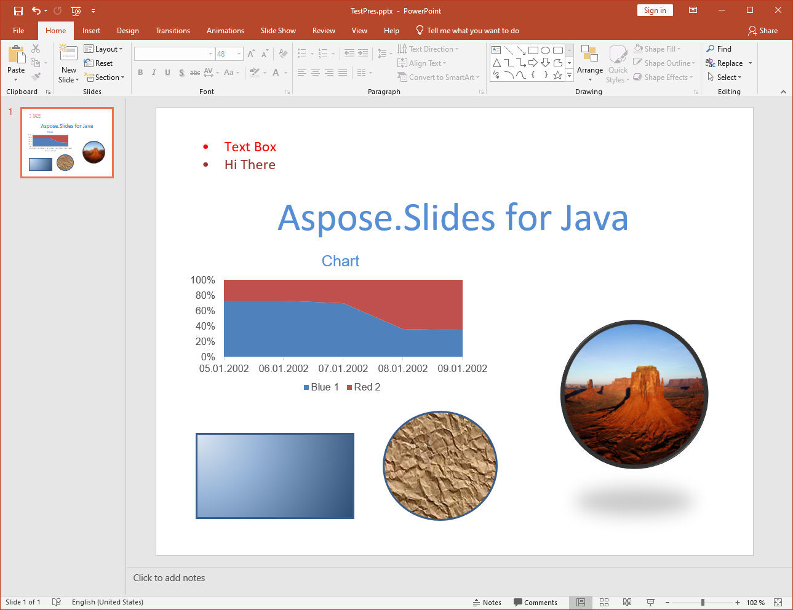

{} 

A conversão de PPT para PPTX é suportada pelo Aspose.Slides para Java. A maioria dos recursos de apresentação - slides mestres, estrutura etc. - são mantidos ao converter de um formato para o outro, mas há [algumas limitações](/slides/pt/java/ppt-to-pptx-conversion/).

{} 
## **Recursos Suportados na Conversão**
O Aspose.Slides para Java oferece suporte parcial para converter o formato de arquivo PPT para PPTX. O suporte à conversão foi recém‑introduzido no Aspose.Slides para Java, portanto tem algumas limitações e funciona melhor para apresentações simples. A principal vantagem que o Aspose.Slides para Java oferece ao converter PPT para PPTX é a facilidade de uso da API. Para ver exemplos de código, leia sobre [Convertendo PPT para PPTX](). Abaixo, as listas explicam quais recursos são suportados e quais não são para a conversão de PPT para PPTX.

**Apresentação PPT de origem**

**Depois da conversão para PPTX**

## **Recursos Suportados**
Os seguintes recursos são suportados para conversão:

- Conversão da estrutura de mestres, layouts e slides.
- Conversão de gráficos.
- Formas agrupadas.
- Conversão de autoshapes, incluindo retângulos e elipses. 
- Formas com geometria personalizada.
- Estilos de preenchimento de texturas e imagens para autoshapes.
- Conversão de placeholders.
- Conversão de linhas e polilinhas.
- Formatos de linha e preenchimento.
- Estilos de preenchimento em gradiente.
- Frames OLE, tabelas, frames de vídeo e áudio, etc.
- Propriedades de animação e apresentação de slides.
- Conversão de texto em quadros de texto e contêineres de texto.