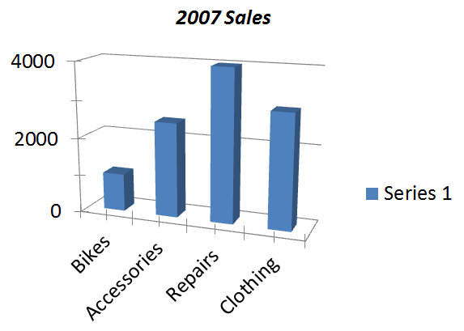

## **Visão geral**

Este artigo demonstra como criar e personalizar gráficos em apresentações do Microsoft PowerPoint programaticamente usando C#. Com Aspose.Slides para .NET, você pode automatizar a geração de gráficos profissionais orientados a dados sem depender do Microsoft Office ou de bibliotecas Interop. A API fornece um conjunto rico de recursos para construir gráficos de colunas, gráficos de pizza, gráficos de linhas e muito mais — tudo com controle total sobre aparência, dados e layout. Seja gerando relatórios, dashboards ou apresentações empresariais, o Aspose.Slides ajuda a entregar visualizações de alta qualidade diretamente de suas aplicações .NET.

## **Exemplo VSTO**

Esta seção demonstra como criar um gráfico em uma apresentação do Microsoft PowerPoint usando **VSTO (Visual Studio Tools for Office)**. Com o VSTO, você pode gerar e personalizar gráficos programaticamente combinando automação do PowerPoint e do Excel. O exemplo fornecido mostra como adicionar um **gráfico de colunas agrupadas 3D**, preenchê‑lo com dados de uma planilha do Excel, ajustar formatação e layout e salvar a apresentação final — tudo a partir de uma aplicação .NET.

1. Crie uma instância de uma apresentação do Microsoft PowerPoint.  
1. Adicione um slide em branco à apresentação.  
1. Adicione um gráfico de colunas agrupadas 3D e acesse‑o.  
1. Crie uma nova instância de uma pasta de trabalho do Microsoft Excel e carregue os dados do gráfico.  
1. Acesse a planilha de dados do gráfico usando a instância da pasta de trabalho do Excel.  
1. Defina o intervalo do gráfico na planilha e remova as séries 2 e 3 do gráfico.  
1. Modifique os dados de categoria do gráfico na planilha de dados.  
1. Modifique os dados da série 1 na planilha de dados.  
1. Acesse o título do gráfico e defina suas propriedades de fonte.  
1. Acesse o eixo de valores do gráfico e defina a unidade principal, unidade secundária, valor máximo e valor mínimo.  
1. Acesse o eixo de profundidade (séries) do gráfico e remova‑‑o — apenas uma série é usada neste exemplo.  
1. Defina os ângulos de rotação do gráfico nos eixos X e Y.  
1. Salve a apresentação.  
1. Feche as instâncias do Microsoft Excel e do PowerPoint.

```c#
EnsurePowerPointIsRunning(true, true);

// Instanciar um objeto de slide.
Microsoft.Office.Interop.PowerPoint.Slide objSlide = null;

// Acessar o primeiro slide da apresentação.
objSlide = objPres.Slides[1];

// Selecionar o primeiro slide e definir seu layout.
objSlide.Select();
objSlide.Layout = Microsoft.Office.Interop.PowerPoint.PpSlideLayout.ppLayoutBlank;

// Adicionar um gráfico padrão ao slide.
objSlide.Shapes.AddChart(Microsoft.Office.Core.XlChartType.xl3DColumn, 20, 30, 400, 300);

// Acessar o gráfico adicionado.
Microsoft.Office.Interop.PowerPoint.Chart ppChart = objSlide.Shapes[1].Chart;

// Acessar os dados do gráfico.
Microsoft.Office.Interop.PowerPoint.ChartData chartData = ppChart.ChartData;

// Criar uma instância da pasta de trabalho do Excel para trabalhar com os dados do gráfico.
Microsoft.Office.Interop.Excel.Workbook dataWorkbook = (Microsoft.Office.Interop.Excel.Workbook)chartData.Workbook;

// Acessar a planilha de dados do gráfico.
Microsoft.Office.Interop.Excel.Worksheet dataSheet = dataWorkbook.Worksheets[1];

// Definir o intervalo de dados para o gráfico.
Microsoft.Office.Interop.Excel.Range tRange = dataSheet.Cells.get_Range("A1", "B5");

// Aplicar o intervalo especificado à tabela de dados do gráfico.
Microsoft.Office.Interop.Excel.ListObject tbl1 = dataSheet.ListObjects["Table1"];
tbl1.Resize(tRange);

// Definir valores para categorias e respectivos dados de série.
((Microsoft.Office.Interop.Excel.Range)(dataSheet.Cells.get_Range("A2"))).FormulaR1C1 = "Bikes";
((Microsoft.Office.Interop.Excel.Range)(dataSheet.Cells.get_Range("A3"))).FormulaR1C1 = "Accessories";
((Microsoft.Office.Interop.Excel.Range)(dataSheet.Cells.get_Range("A4"))).FormulaR1C1 = "Repairs";
((Microsoft.Office.Interop.Excel.Range)(dataSheet.Cells.get_Range("A5"))).FormulaR1C1 = "Clothing";
((Microsoft.Office.Interop.Excel.Range)(dataSheet.Cells.get_Range("B2"))).FormulaR1C1 = "1000";
((Microsoft.Office.Interop.Excel.Range)(dataSheet.Cells.get_Range("B3"))).FormulaR1C1 = "2500";
((Microsoft.Office.Interop.Excel.Range)(dataSheet.Cells.get_Range("B4"))).FormulaR1C1 = "4000";
((Microsoft.Office.Interop.Excel.Range)(dataSheet.Cells.get_Range("B5"))).FormulaR1C1 = "3000";

// Definir o título do gráfico.
ppChart.ChartTitle.Font.Italic = true;
ppChart.ChartTitle.Text = "2007 Sales";
ppChart.ChartTitle.Font.Size = 18;
ppChart.ChartTitle.Font.Color = Color.Black.ToArgb();
ppChart.ChartTitle.Format.Line.Visible = Microsoft.Office.Core.MsoTriState.msoTrue;
ppChart.ChartTitle.Format.Line.ForeColor.RGB = Color.Black.ToArgb();

// Acessar o eixo de valores do gráfico.
Microsoft.Office.Interop.PowerPoint.Axis valaxis = ppChart.Axes(Microsoft.Office.Interop.PowerPoint.XlAxisType.xlValue, Microsoft.Office.Interop.PowerPoint.XlAxisGroup.xlPrimary);

// Definir os valores para as unidades do eixo.
valaxis.MajorUnit = 2000.0F;
valaxis.MinorUnit = 1000.0F;
valaxis.MinimumScale = 0.0F;
valaxis.MaximumScale = 4000.0F;

// Acessar o eixo de profundidade do gráfico.
Microsoft.Office.Interop.PowerPoint.Axis Depthaxis = ppChart.Axes(Microsoft.Office.Interop.PowerPoint.XlAxisType.xlSeriesAxis, Microsoft.Office.Interop.PowerPoint.XlAxisGroup.xlPrimary);
Depthaxis.Delete();

// Definir a rotação do gráfico.
ppChart.Rotation = 20;   // Valor-Y
ppChart.Elevation = 15;  // Valor-X
ppChart.RightAngleAxes = false;

// Salvar a apresentação como um arquivo PPTX.
objPres.SaveAs("VSTO_Sample_Chart.pptx", Microsoft.Office.Interop.PowerPoint.PpSaveAsFileType.ppSaveAsDefault, MsoTriState.msoTrue);

// Fechar a pasta de trabalho e a apresentação.
dataWorkbook.Application.Quit();
objPres.Application.Quit();
```

```c#
public static void EnsurePowerPointIsRunning(bool blnAddPresentation)
{
    EnsurePowerPointIsRunning(blnAddPresentation, false);
}

public static void EnsurePowerPointIsRunning()
{
    EnsurePowerPointIsRunning(false, false);
}

public static void EnsurePowerPointIsRunning(bool blnAddPresentation, bool blnAddSlide)
{
    string strName = null;

    // Tente acessar a propriedade Name. Se lançar uma exceção, inicie uma nova instância do PowerPoint.
    try
    {
        strName = objPPT.Name;
    }
    catch (Exception ex)
    {
        StartPowerPoint();
    }

    // blnAddPresentation é usado para garantir que uma apresentação esteja carregada.
    if (blnAddPresentation == true)
    {
        try
        {
            strName = objPres.Name;
        }
        catch (Exception ex)
        {
            objPres = objPPT.Presentations.Add(MsoTriState.msoTrue);
        }
    }

    // blnAddSlide é usado para garantir que haja pelo menos um slide na apresentação.
    if (blnAddSlide)
    {
        try
        {
            strName = objPres.Slides[1].Name;
        }
        catch (Exception ex)
        {
            Microsoft.Office.Interop.PowerPoint.Slide objSlide = null;
            Microsoft.Office.Interop.PowerPoint.CustomLayout objCustomLayout = null;
            objCustomLayout = objPres.SlideMaster.CustomLayouts[1];
            objSlide = objPres.Slides.AddSlide(1, objCustomLayout);
            objSlide.Layout = Microsoft.Office.Interop.PowerPoint.PpSlideLayout.ppLayoutText;
            objCustomLayout = null;
            objSlide = null;
        }
    }
}
```

O resultado:


## **Exemplo Aspose.Slides para .NET**

O exemplo a seguir mostra como criar um gráfico simples em uma apresentação PowerPoint usando Aspose.Slides para .NET. Este código demonstra como adicionar um **gráfico de colunas agrupadas 3D**, preenchê‑lo com dados de exemplo e personalizar sua aparência. Com apenas algumas linhas de código, você pode gerar gráficos dinamicamente e integrá‑los às suas apresentações sem usar o Microsoft Office.

1. Crie uma instância da classe [Presentation](https://reference.aspose.com/slides/pt/net/aspose.slides/presentation/).  
1. Obtenha uma referência ao primeiro slide.  
1. Adicione um gráfico de colunas agrupadas 3D e acesse‑o.  
1. Acesse os dados do gráfico.  
1. Remova as séries não utilizadas Série 2 e Série 3.  
1. Modifique as categorias do gráfico atualizando os rótulos.  
1. Atualize os valores da Série 1.  
1. Acesse o título do gráfico e defina suas propriedades de fonte.  
1. Configure o eixo de valores do gráfico, incluindo unidade principal, unidade secundária, valores máximo e mínimo.  
1. Defina os ângulos de rotação do gráfico nos eixos X e Y.  
1. Salve a apresentação no formato PPTX.

```cs
// Criar uma apresentação vazia.
using (Presentation presentation = new Presentation())
{
    // Acessar o primeiro slide.
    ISlide slide = presentation.Slides[0];

    // Adicionar um gráfico padrão.
    IChart chart = slide.Shapes.AddChart(ChartType.ClusteredColumn3D, 20, 30, 400, 300);

    // Obter os dados do gráfico.
    IChartData chartData = chart.ChartData;

    // Remover as séries padrão extras.
    chartData.Series.RemoveAt(1);
    chartData.Series.RemoveAt(1);

    // Modificar os nomes das categorias do gráfico.
    chartData.Categories[0].AsCell.Value = "Bikes";
    chartData.Categories[1].AsCell.Value = "Accessories";
    chartData.Categories[2].AsCell.Value = "Repairs";
    chartData.Categories[3].AsCell.Value = "Clothing";

    // Definir o índice da planilha de dados do gráfico.
    int worksheetIndex = 0;

    // Obter a pasta de trabalho dos dados do gráfico.
    IChartDataWorkbook workbook = chart.ChartData.ChartDataWorkbook;

    // Modificar os valores das séries do gráfico.
    chartData.Series[0].DataPoints.AddDataPointForBarSeries(workbook.GetCell(worksheetIndex, 1, 1, 1000));
    chartData.Series[0].DataPoints.AddDataPointForBarSeries(workbook.GetCell(worksheetIndex, 2, 1, 2500));
    chartData.Series[0].DataPoints.AddDataPointForBarSeries(workbook.GetCell(worksheetIndex, 3, 1, 4000));
    chartData.Series[0].DataPoints.AddDataPointForBarSeries(workbook.GetCell(worksheetIndex, 4, 1, 3000));

    // Definir o título do gráfico.
    chart.HasTitle = true;
    chart.ChartTitle.AddTextFrameForOverriding("2007 Sales");
    IPortionFormat format = chart.ChartTitle.TextFrameForOverriding.Paragraphs[0].Portions[0].PortionFormat;
    format.FontItalic = NullableBool.True;
    format.FontHeight = 18;
    format.FillFormat.FillType = FillType.Solid;
    format.FillFormat.SolidFillColor.Color = Color.Black;

    // Definir as opções do eixo.
    chart.Axes.VerticalAxis.IsAutomaticMaxValue = false;
    chart.Axes.VerticalAxis.IsAutomaticMinValue = false;
    chart.Axes.VerticalAxis.IsAutomaticMajorUnit = false;
    chart.Axes.VerticalAxis.IsAutomaticMinorUnit = false;

    chart.Axes.VerticalAxis.MaxValue = 4000.0F;
    chart.Axes.VerticalAxis.MinValue = 0.0F;
    chart.Axes.VerticalAxis.MajorUnit = 2000.0F;
    chart.Axes.VerticalAxis.MinorUnit = 1000.0F;
    chart.Axes.VerticalAxis.TickLabelPosition = TickLabelPositionType.NextTo;

    // Definir a rotação do gráfico.
    chart.Rotation3D.RotationX = 15;
    chart.Rotation3D.RotationY = 20;

    // Salvar a apresentação como um arquivo PPTX.
    presentation.Save("Aspose_Sample_Chart.pptx", SaveFormat.Pptx);
}
```

O resultado:



## **FAQ**

**Posso criar outros tipos de gráficos, como pizza, linha ou barra, com Aspose.Slides?**

Sim. O Aspose.Slides para .NET suporta uma ampla variedade de [tipos de gráfico](/slides/pt/net/create-chart/), incluindo gráficos de pizza, gráficos de linha, gráficos de barra, diagramas de dispersão, gráficos de bolhas e muito mais. Você pode especificar o tipo de gráfico desejado usando a enumeração [ChartType](https://reference.aspose.com/slides/pt/net/aspose.slides.charts/charttype/) ao adicionar um gráfico.

**Posso aplicar estilos ou temas personalizados ao gráfico?**

Sim. Você pode personalizar completamente a aparência do gráfico, incluindo cores, fontes, preenchimentos, contornos, linhas de grade e layout. No entanto, aplicar temas do Office exatamente como vistos no PowerPoint requer definir manualmente estilos individuais.

**Posso exportar o gráfico como imagem separada do slide?**

Sim, o Aspose.Slides permite exportar qualquer forma — incluindo gráficos — como uma imagem separada (por exemplo, PNG, JPEG) usando o método `GetImage` na [shape](https://reference.aspose.com/slides/pt/net/aspose.slides/ishape/) do gráfico.