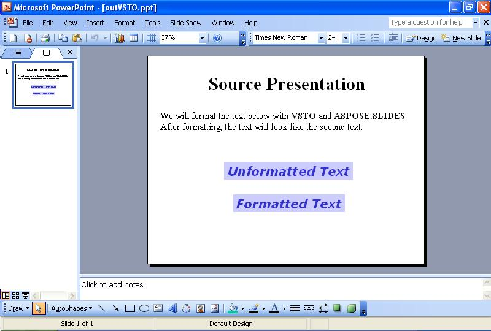

{} 

Às vezes, você precisa formatar o texto em slides programaticamente. Este artigo mostra como ler uma apresentação de exemplo com algum texto no primeiro slide usando [VSTO](/slides/pt/net/format-text-using-vsto-and-aspose-slides-and-net/) e [Aspose.Slides for .NET](/slides/pt/net/format-text-using-vsto-and-aspose-slides-and-net/). O código formata o texto na terceira caixa de texto do slide para que fique igual ao texto na última caixa de texto.

{} 
## **Formatação de Texto**
Os métodos VSTO e Aspose.Slides seguem as etapas a seguir:

1. Abrir a apresentação origem.
1. Acessar o primeiro slide.
1. Acessar a terceira caixa de texto.
1. Alterar a formatação do texto na terceira caixa de texto.
1. Salvar a apresentação no disco.

As capturas de tela abaixo mostram o slide de exemplo antes e depois da execução do código VSTO e Aspose.Slides for .NET.

**A apresentação de entrada** 


### **Exemplo de Código VSTO**
O código abaixo mostra como reformatar o texto em um slide usando VSTO.

**O texto reformulado com VSTO** 




```c#
//Observação: PowerPoint é um namespace que foi definido acima desta forma
//using PowerPoint = Microsoft.Office.Interop.PowerPoint;
PowerPoint.Presentation pres = null;

//Abrir a apresentação
pres = Globals.ThisAddIn.Application.Presentations.Open("c:\\source.ppt",
	Microsoft.Office.Core.MsoTriState.msoFalse,
	Microsoft.Office.Core.MsoTriState.msoFalse,
	Microsoft.Office.Core.MsoTriState.msoTrue);

//Acessar o primeiro slide
PowerPoint.Slide slide = pres.Slides[1];

//Acessar a terceira forma
PowerPoint.Shape shp = slide.Shapes[3];

//Alterar a fonte do texto para Verdana e altura para 32
PowerPoint.TextRange txtRange = shp.TextFrame.TextRange;
txtRange.Font.Name = "Verdana";
txtRange.Font.Size = 32;

//Deixar em negrito
txtRange.Font.Bold = Microsoft.Office.Core.MsoTriState.msoCTrue;

//Aplicar itálico
txtRange.Font.Italic = Microsoft.Office.Core.MsoTriState.msoCTrue;

//Alterar a cor do texto
txtRange.Font.Color.RGB = 0x00CC3333;

//Alterar a cor de fundo da forma
shp.Fill.ForeColor.RGB = 0x00FFCCCC;

//Reposicionar horizontalmente
shp.Left -= 70;

//Gravar a saída no disco
pres.SaveAs("c:\\outVSTO.ppt",
	PowerPoint.PpSaveAsFileType.ppSaveAsPresentation,
	Microsoft.Office.Core.MsoTriState.msoFalse);
```


### **Exemplo Aspose.Slides for .NET**
Para formatar texto com Aspose.Slides, adicione a fonte antes de formatar o texto.

**A apresentação de saída criada com Aspose.Slides** 


```c#
using System.Drawing;
using Aspose.Slides;
using Aspose.Slides.Export;

 //Abrir a apresentação
Presentation pres = new Presentation("source.ppt");

//Acessar o primeiro slide
ISlide slide = pres.Slides[0];

//Acessar a terceira forma
IShape shp = slide.Shapes[2];

//Alterar a fonte do texto para Verdana e altura para 32
ITextFrame tf = ((IAutoShape)shp).TextFrame;
IParagraph para = tf.Paragraphs[0];
IPortion port = para.Portions[0];
port.PortionFormat.LatinFont = new FontData("Verdana");

port.PortionFormat.FontHeight = 32;

//Deixar em negrito
port.PortionFormat.FontBold = NullableBool.True;

//Aplicar itálico
port.PortionFormat.FontItalic = NullableBool.True;

//Alterar a cor do texto
//Definir cor da fonte
port.PortionFormat.FillFormat.FillType = FillType.Solid;
port.PortionFormat.FillFormat.SolidFillColor.Color = Color.FromArgb(0x33, 0x33, 0xCC);

//Alterar a cor de fundo da forma
shp.FillFormat.FillType = FillType.Solid;
shp.FillFormat.SolidFillColor.Color = Color.FromArgb(0xCC, 0xCC, 0xFF);

//Gravar a saída no disco
pres.Save("outAspose.ppt", SaveFormat.Ppt);
```