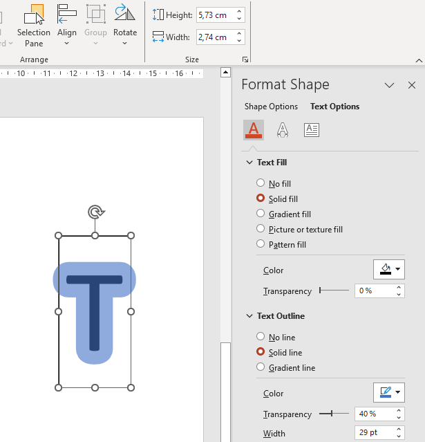

## **Introdução**

O PowerPoint fornece a função de tinta para permitir que você desenhe figuras não padronizadas, que podem ser usadas para realçar outros objetos, mostrar conexões e processos e chamar a atenção para itens específicos em um slide.

Aspose.Slides fornece a interface [Aspose.Slides.Ink](https://reference.aspose.com/slides/pt/net/aspose.slides.ink/), que contém os tipos necessários para criar e gerenciar objetos de tinta.

## **Diferenças entre Objetos Regulares e Objetos de Tinta**

Objetos em um slide do PowerPoint são tipicamente representados por objetos de forma. Um objeto de forma, em sua forma mais simples, é um contêiner que define a área do próprio objeto (sua moldura) juntamente com suas propriedades. Estas incluem o tamanho da área do contêiner, o formato do contêiner, o plano de fundo do contêiner etc. Para mais informações, veja [Shape Layout Format](https://docs.aspose.com/slides/pt/net/shape-manipulations/#access-layout-formats-for-shape).

Entretanto, quando o PowerPoint lida com um objeto de tinta, ele ignora todas as propriedades da moldura do objeto (contêiner) exceto seu tamanho. O tamanho da área do contêiner é determinado pelos valores padrão `width` e `height`:


## **Rastreamentos de Inkshape**

Rastreamento é um elemento básico ou padrão usado para registrar a trajetória de uma caneta enquanto o usuário escreve tinta digital. Os rastreamentos são gravações que descrevem sequências de pontos conectados.

A forma mais simples de codificação especifica as coordenadas X e Y de cada ponto de amostra. Quando todos os pontos conectados são renderizados, eles produzem uma imagem como esta:


## **Propriedades do Pincel para Desenho**

Você pode usar um pincel para desenhar linhas que conectam os pontos dos elementos de rastreamento. O pincel tem sua própria cor e tamanho, correspondentes às propriedades `Brush.Color` e `Brush.Size`.

### **Definir a Cor do Pincel de Tinta**

Este código C# mostra como definir a cor para um pincel:

```c#
using (Presentation pres = new Presentation("pres.pptx"))
{
    IInk ink = (IInk)pres.Slides[0].Shapes[0];
    IInkTrace[] traces = ink.Traces;
    IInkBrush brush = traces[0].Brush;
    Color brushColor = brush.Color;
    brush.Color = Color.Red;
}
```

### **Definir o Tamanho do Pincel de Tinta**

Este código C# mostra como definir o tamanho para um pincel:

```c#
using (Presentation pres = new Presentation("pres.pptx"))
{
    IInk ink = (IInk)pres.Slides[0].Shapes[0];
    IInkTrace[] traces = ink.Traces;
    IInkBrush brush = traces[0].Brush;
    SizeF brushSize = brush.Size;
    brush.Size = new SizeF(5f, 10f);
}
```

Geralmente, a largura e a altura de um pincel não coincidem, portanto o PowerPoint não exibe o tamanho do pincel (a seção de dados fica esmaecida). Mas quando a largura e a altura do pincel coincidem, o PowerPoint exibe seu tamanho desta forma:


Para maior clareza, vamos aumentar a altura do objeto de tinta e revisar as dimensões importantes:


O contêiner (moldura) não considera o tamanho dos pincéis — ele sempre assume que a espessura da linha é zero (veja a imagem final).

Portanto, para determinar a área visível de todo o objeto de tinta, devemos considerar o tamanho do pincel dos objetos de rastreamento. Aqui, o objeto alvo (o objeto de rastreamento de texto manuscrito) foi dimensionado para o tamanho do contêiner (moldura). Quando o tamanho do contêiner (moldura) muda, o tamanho do pincel permanece constante e vice‑versa.


O PowerPoint apresenta o mesmo comportamento ao lidar com textos:



**Leitura adicional**

* Para ler sobre formas em geral, veja a seção [PowerPoint Shapes](https://docs.aspose.com/slides/pt/net/powerpoint-shapes/).
* Para mais informações sobre valores efetivos, veja [Shape Effective Properties](https://docs.aspose.com/slides/pt/net/shape-effective-properties/#get-effective-font-height-value).