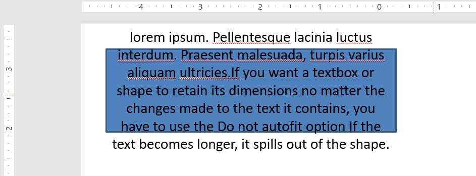

## **Introdução**

Por padrão, ao adicionar uma caixa de texto, o Microsoft PowerPoint usa a configuração **Resize shape to fit text** para a caixa de texto — ele redimensiona automaticamente a caixa de texto para garantir que o texto sempre caiba nela.


* Quando o texto na caixa de texto fica mais longo ou maior, o PowerPoint aumenta automaticamente a caixa de texto — aumentando sua altura — para permitir que contenha mais texto.  
* Quando o texto na caixa de texto fica mais curto ou menor, o PowerPoint reduz automaticamente a caixa de texto — diminuindo sua altura — para eliminar o espaço redundante.

No PowerPoint, estes são os quatro parâmetros ou opções importantes que controlam o comportamento de ajuste automático para uma caixa de texto:

* **Do not Autofit**
* **Shrink text on overflow**
* **Resize shape to fit text**
* **Wrap text in shape**


Aspose.Slides for .NET oferece opções semelhantes — propriedades da classe [TextFrameFormat](https://reference.aspose.com/slides/pt/net/aspose.slides/textframeformat) — que permitem controlar o comportamento de ajuste automático para caixas de texto em apresentações.

## **Redimensionar forma para ajustar texto**

Se você deseja que o texto em uma caixa sempre caiba nessa caixa após alterações no texto, é preciso usar a opção **Resize shape to fit text**. Para especificar essa configuração, defina a propriedade `AutofitType` da classe [TextFrameFormat](https://reference.aspose.com/slides/pt/net/aspose.slides/textframeformat) para `Shape`.


Este código C# mostra como especificar que o texto deve sempre caber em sua caixa em uma apresentação do PowerPoint:

```c#
using (Presentation presentation = new Presentation())
{
    ISlide slide = presentation.Slides[0];
    IAutoShape autoShape = slide.Shapes.AddAutoShape(ShapeType.Rectangle, 30, 30, 350, 100);

    Portion portion = new Portion("lorem ipsum...");
    portion.PortionFormat.FillFormat.SolidFillColor.Color = Color.Black;
    portion.PortionFormat.FillFormat.FillType = FillType.Solid;
    autoShape.TextFrame.Paragraphs[0].Portions.Add(portion);

    ITextFrameFormat textFrameFormat = autoShape.TextFrame.TextFrameFormat;
    textFrameFormat.AutofitType = TextAutofitType.Shape;

    presentation.Save("output_presentation.pptx", SaveFormat.Pptx);
}
```

Se o texto ficar mais longo ou maior, a caixa de texto será redimensionada automaticamente (aumentada em altura) para garantir que todo o texto caiba nela. Se o texto ficar mais curto, o inverso ocorre.

## **Não ajustar automaticamente**

Se você deseja que uma caixa de texto ou forma mantenha suas dimensões independentemente das alterações feitas no texto que contém, é preciso usar a opção **Do not Autofit**. Para especificar essa configuração, defina a propriedade `AutofitType` da classe [TextFrameFormat](https://reference.aspose.com/slides/pt/net/aspose.slides/textframeformat) para `None`.



Este código C# mostra como especificar que uma caixa de texto deve sempre manter suas dimensões em uma apresentação do PowerPoint:

```c#
using (Presentation presentation = new Presentation())
{
    ISlide slide = presentation.Slides[0];
    IAutoShape autoShape = slide.Shapes.AddAutoShape(ShapeType.Rectangle, 30, 30, 350, 100);

    Portion portion = new Portion("lorem ipsum...");
    portion.PortionFormat.FillFormat.SolidFillColor.Color = Color.Black;
    portion.PortionFormat.FillFormat.FillType = FillType.Solid;
    autoShape.TextFrame.Paragraphs[0].Portions.Add(portion);

    ITextFrameFormat textFrameFormat = autoShape.TextFrame.TextFrameFormat;
    textFrameFormat.AutofitType = TextAutofitType.None;

    presentation.Save("output_presentation.pptx", SaveFormat.Pptx);
}
```

Quando o texto fica muito longo para sua caixa, ele transborda.

## **Encolher texto ao exceder**

Se o texto ficar muito longo para sua caixa, a opção **Shrink text on overflow** permite especificar que o tamanho e o espaçamento do texto devem ser reduzidos para que ele caiba na caixa. Para especificar essa configuração, defina a propriedade `AutofitType` da classe [TextFrameFormat](https://reference.aspose.com/slides/pt/net/aspose.slides/textframeformat) para `Normal`.


Este código C# mostra como especificar que o texto deve ser reduzido ao exceder em uma apresentação do PowerPoint:

```c#
using (Presentation presentation = new Presentation())
{
    ISlide slide = presentation.Slides[0];
    IAutoShape autoShape = slide.Shapes.AddAutoShape(ShapeType.Rectangle, 30, 30, 350, 100);

    Portion portion = new Portion("lorem ipsum...");
    portion.PortionFormat.FillFormat.SolidFillColor.Color = Color.Black;
    portion.PortionFormat.FillFormat.FillType = FillType.Solid;
    autoShape.TextFrame.Paragraphs[0].Portions.Add(portion);

    ITextFrameFormat textFrameFormat = autoShape.TextFrame.TextFrameFormat;
    textFrameFormat.AutofitType = TextAutofitType.Normal;

    presentation.Save("output_presentation.pptx", SaveFormat.Pptx);
}
```

{}
Ao usar a opção **Shrink text on overflow**, a configuração é aplicada apenas quando o texto fica muito longo para sua caixa.
{}

## **Quebrar texto**

Se você deseja que o texto em uma forma seja quebrado dentro dessa forma quando o texto ultrapassa a borda da forma (apenas a largura), use o parâmetro **Wrap text in shape**. Para especificar essa configuração, defina a propriedade `WrapText` da classe [TextFrameFormat](https://reference.aspose.com/slides/pt/net/aspose.slides/textframeformat) para `NullableBool.True`.

Este código C# mostra como usar a configuração Wrap Text em uma apresentação do PowerPoint:

```c#
using (Presentation presentation = new Presentation())
{
    ISlide slide = presentation.Slides[0];
    IAutoShape autoShape = slide.Shapes.AddAutoShape(ShapeType.Rectangle, 30, 30, 350, 100);

    Portion portion = new Portion("lorem ipsum...");
    portion.PortionFormat.FillFormat.SolidFillColor.Color = Color.Black;
    portion.PortionFormat.FillFormat.FillType = FillType.Solid;
    autoShape.TextFrame.Paragraphs[0].Portions.Add(portion);

    ITextFrameFormat textFrameFormat = autoShape.TextFrame.TextFrameFormat;
    textFrameFormat.WrapText = NullableBool.True;

    presentation.Save("output_presentation.pptx", SaveFormat.Pptx);
}
```

{} 
Se você definir a propriedade `WrapText` como `NullableBool.False` para uma forma, quando o texto dentro da forma ficar mais longo que a largura da forma, o texto se estenderá além das bordas da forma em uma única linha.
{}

## **FAQ**

**As margens internas do frame de texto afetam o AutoFit?**

Sim. O preenchimento (margens internas) reduz a área utilizável para texto, portanto o AutoFit entra em ação mais cedo — encolhendo a fonte ou redimensionando a forma antes. Verifique e ajuste as margens antes de afinar o AutoFit.

**Como o AutoFit interage com quebras de linha manuais e suaves?**

Quebras forçadas permanecem no lugar, e o AutoFit adapta o tamanho da fonte e o espaçamento ao redor delas. Remover quebras desnecessárias costuma reduzir a agressividade com que o AutoFit precisa encolher o texto.

**Alterar a fonte do tema ou acionar a substituição de fonte afeta os resultados do AutoFit?**

Sim. Substituir por uma fonte com métricas de glifos diferentes altera a largura/altura do texto, o que pode mudar o tamanho final da fonte e a quebra de linha. Após qualquer mudança ou substituição de fonte, revise os slides.