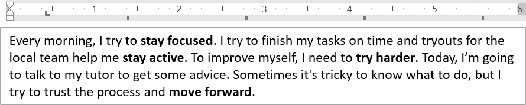

## **Visão geral**

Este artigo demonstra como formatar texto em apresentações PowerPoint e OpenDocument usando Aspose.Slides para .NET. Ele abrange cores de fundo, transparência, espaçamento entre caracteres, propriedades de fonte, rotação, espaçamento de parágrafo, comportamento de ajuste automático, ancoragem de texto, tabulações e configurações de idioma.

Exceto quando indicado de outra forma, os exemplos usam [sample.pptx](sample.pptx). A primeira forma em seu primeiro slide é uma caixa de texto, e seu primeiro parágrafo contém o texto mostrado abaixo. Tanto os índices de slide quanto de forma são baseados em zero. Exemplos que selecionam trechos em negrito usam formatação efetiva, incluindo formatação em negrito herdada:


Para localizar e destacar texto literal ou correspondências de expressão regular, veja [Pesquisar e substituir texto](/slides/pt/net/search-and-replace-text/).

## **Definir cor de fundo do texto**

Use [IParagraphFormat.DefaultPortionFormat](https://reference.aspose.com/slides/net/aspose.slides/iparagraphformat/defaultportionformat/) para definir a cor de realce padrão de um parágrafo, ou use [IBasePortionFormat.HighlightColor](https://reference.aspose.com/slides/net/aspose.slides/ibaseportionformat/highlightcolor/) para porções de texto individuais.

O exemplo a seguir define um realce cinza‑claro como padrão para o primeiro parágrafo. Cores de realce explícitas em porções individuais têm precedência sobre esse padrão:

```cs
using System.Drawing;
using Aspose.Slides;
using Aspose.Slides.Export;

using var presentation = new Presentation("sample.pptx");
var slide = presentation.Slides[0];

var autoShape = (IAutoShape)slide.Shapes[0];
var paragraph = autoShape.TextFrame.Paragraphs[0];

// Defina a cor de realce para todo o parágrafo.
paragraph.ParagraphFormat.DefaultPortionFormat.HighlightColor.Color = Color.LightGray;

presentation.Save("gray_paragraph.pptx", SaveFormat.Pptx);
```

O resultado:


O exemplo de código abaixo demonstra como definir a cor de fundo para **porções de texto com fonte em negrito**:

```cs
using System.Drawing;
using Aspose.Slides;
using Aspose.Slides.Export;

using var presentation = new Presentation("sample.pptx");
var slide = presentation.Slides[0];

var autoShape = (IAutoShape)slide.Shapes[0];
var paragraph = autoShape.TextFrame.Paragraphs[0];

foreach (var portion in paragraph.Portions)
{
    if (portion.PortionFormat.GetEffective().FontBold)
    {
        // Defina a cor de realce para a porção de texto.
        portion.PortionFormat.HighlightColor.Color = Color.LightGray;
    }
}

presentation.Save("gray_text_portions.pptx", SaveFormat.Pptx);
```

O resultado:


## **Alinhar parágrafos de texto**

Use [IParagraphFormat.Alignment](https://reference.aspose.com/slides/net/aspose.slides/iparagraphformat/alignment/) para definir o alinhamento de parágrafo dentro de um quadro de texto. O valor pode ser centralizado, alinhado à esquerda, à direita, justificado etc.

O exemplo de código a seguir mostra como alinhar o parágrafo ao **centro**:

```cs
using Aspose.Slides;
using Aspose.Slides.Export;

using var presentation = new Presentation("sample.pptx");
var slide = presentation.Slides[0];

var autoShape = (IAutoShape)slide.Shapes[0];
var paragraph = autoShape.TextFrame.Paragraphs[0];

// Defina o alinhamento do parágrafo para centralizado.
paragraph.ParagraphFormat.Alignment = TextAlignment.Center;

presentation.Save("aligned_paragraph.pptx", SaveFormat.Pptx);
```

O resultado:


## **Alinhar fontes dentro de uma linha**

Use [IParagraphFormat.FontAlignment](https://reference.aspose.com/slides/net/aspose.slides/iparagraphformat/fontalignment/) para alinhar verticalmente porções de texto com tamanhos de fonte diferentes dentro de uma linha. Essa configuração se aplica a todo o parágrafo e controla o alinhamento dentro de cada uma de suas linhas.

O exemplo autônomo a seguir cria quatro caixas de texto rotuladas em um slide. Cada parágrafo contém o mesmo texto em 18, 36 e 54 pontos, com um alinhamento de fonte diferente. Ele usa Arial, desabilita ajuste automático e quebra de linha, e mantém os quadros de texto grandes o suficiente para uma única linha.

```cs
using System.Drawing;
using Aspose.Slides;
using Aspose.Slides.Export;

using var presentation = new Presentation();
var slide = presentation.Slides[0];

var alignments = new[] { FontAlignment.Baseline, FontAlignment.Top, FontAlignment.Center, FontAlignment.Bottom };
var fontSizes = new[] { 18f, 36f, 54f };

for (var i = 0; i < alignments.Length; i++)
{
    var shape = slide.Shapes.AddAutoShape(ShapeType.Rectangle, 30, 20 + i * 130, 660, 120);
    shape.FillFormat.FillType = FillType.NoFill;
    shape.LineFormat.FillFormat.FillType = FillType.NoFill;

    var textFrame = shape.TextFrame;
    textFrame.TextFrameFormat.AnchoringType = TextAnchorType.Top;
    textFrame.TextFrameFormat.AutofitType = TextAutofitType.None;
    textFrame.TextFrameFormat.WrapText = NullableBool.False;

    var label = textFrame.Paragraphs[0];
    label.Text = alignments[i].ToString();
    label.ParagraphFormat.Alignment = TextAlignment.Left;
    label.ParagraphFormat.DefaultPortionFormat.FontHeight = 14;
    label.ParagraphFormat.DefaultPortionFormat.LatinFont = new FontData("Arial");
    label.ParagraphFormat.DefaultPortionFormat.FillFormat.FillType = FillType.Solid;
    label.ParagraphFormat.DefaultPortionFormat.FillFormat.SolidFillColor.Color = Color.Gray;

    var paragraph = new Paragraph();
    paragraph.ParagraphFormat.FontAlignment = alignments[i];
    paragraph.ParagraphFormat.Alignment = TextAlignment.Left;
    paragraph.ParagraphFormat.DefaultPortionFormat.LatinFont = new FontData("Arial");
    paragraph.ParagraphFormat.DefaultPortionFormat.FillFormat.FillType = FillType.Solid;
    paragraph.ParagraphFormat.DefaultPortionFormat.FillFormat.SolidFillColor.Color = Color.Black;

    foreach (var fontSize in fontSizes)
    {
        var portion = new Portion("Ag ");
        portion.PortionFormat.FontHeight = fontSize;
        paragraph.Portions.Add(portion);
    }

    textFrame.Paragraphs.Add(paragraph);
}

presentation.Save("font_alignment.pptx", SaveFormat.Pptx);
```

O resultado:


O alinhamento de fonte usa métricas tipográficas, de modo que as bordas visíveis de letras individuais nem sempre se alinham exatamente. O exemplo inclui tanto uma letra maiúscula quanto um descendente para mostrar a diferença entre alinhamento de linha de base e inferior. Disponibilidade e substituição de fontes, os caracteres usados e a diferença nos tamanhos de fonte afetam o resultado. As dimensões do quadro, margens, espaçamento entre linhas, quebra de linha e ajuste automático também influenciam o layout; use as mesmas fontes e configurações de layout ao comparar os modos.

Essa configuração difere de [IParagraphFormat.Alignment](https://reference.aspose.com/slides/net/aspose.slides/iparagraphformat/alignment/), que controla o alinhamento horizontal do parágrafo, e de [ITextFrameFormat.AnchoringType](https://reference.aspose.com/slides/net/aspose.slides/itextframeformat/anchoringtype/), que posiciona o bloco de texto verticalmente dentro de sua forma. A formatação de sobrescrito e subscrito através de [IBasePortionFormat.Escapement](https://reference.aspose.com/slides/net/aspose.slides/ibaseportionformat/escapement/) desloca porções individuais em relação à linha de base em vez de definir o alinhamento de fonte para as linhas do parágrafo.

## **Definir transparência para o texto**

A transparência do texto é controlada através do componente alfa da cor atribuída a [IBasePortionFormat.FillFormat](https://reference.aspose.com/slides/net/aspose.slides/ibaseportionformat/fillformat/). Nos exemplos abaixo, `alpha = 50` é um valor alfa ARGB na escala de 0–255, não uma porcentagem de transparência.

O exemplo de código abaixo mostra como aplicar transparência ao **parágrafo inteiro**:

```cs
using System.Drawing;
using Aspose.Slides;
using Aspose.Slides.Export;

var alpha = 50;

using var presentation = new Presentation("sample.pptx");
var slide = presentation.Slides[0];

var autoShape = (IAutoShape)slide.Shapes[0];
var paragraph = autoShape.TextFrame.Paragraphs[0];

// Defina um preenchimento preto semitransparente para o texto.
paragraph.ParagraphFormat.DefaultPortionFormat.FillFormat.FillType = FillType.Solid;
paragraph.ParagraphFormat.DefaultPortionFormat.FillFormat.SolidFillColor.Color = Color.FromArgb(alpha, Color.Black);

presentation.Save("transparent_paragraph.pptx", SaveFormat.Pptx);
```

O resultado:


O código a seguir mostra como aplicar transparência a **porções de texto com fonte em negrito**:

```cs
using System.Drawing;
using Aspose.Slides;
using Aspose.Slides.Export;

var alpha = 50;

using var presentation = new Presentation("sample.pptx");
var slide = presentation.Slides[0];

var autoShape = (IAutoShape)slide.Shapes[0];
var paragraph = autoShape.TextFrame.Paragraphs[0];

foreach (var portion in paragraph.Portions)
{
    if (portion.PortionFormat.GetEffective().FontBold)
    {
        // Defina a transparência da porção de texto.
        portion.PortionFormat.FillFormat.FillType = FillType.Solid;
        portion.PortionFormat.FillFormat.SolidFillColor.Color = Color.FromArgb(alpha, Color.Black);
    }
}

presentation.Save("transparent_text_portions.pptx", SaveFormat.Pptx);
```

O resultado:


## **Definir espaçamento de caracteres para o texto**

Use [IBasePortionFormat.Spacing](https://reference.aspose.com/slides/net/aspose.slides/ibaseportionformat/spacing/) para expandir ou condensar o espaçamento entre caracteres em uma caixa de texto. Os exemplos adicionam 3 pontos de espaçamento; valores negativos condensam o texto.

O código C# a seguir mostra como expandir o espaçamento de caracteres no **parágrafo inteiro**:

```cs
using Aspose.Slides;
using Aspose.Slides.Export;

using var presentation = new Presentation("sample.pptx");
var slide = presentation.Slides[0];

var autoShape = (IAutoShape)slide.Shapes[0];
var paragraph = autoShape.TextFrame.Paragraphs[0];

// Observação: use valores negativos para comprimir o espaçamento entre caracteres.
paragraph.ParagraphFormat.DefaultPortionFormat.Spacing = 3;  // Expandir espaçamento entre caracteres.

presentation.Save("character_spacing_in_paragraph.pptx", SaveFormat.Pptx);
```

O resultado:


O exemplo de código abaixo mostra como expandir o espaçamento de caracteres em **porções de texto com fonte em negrito**:

```cs
using Aspose.Slides;
using Aspose.Slides.Export;

using var presentation = new Presentation("sample.pptx");
var slide = presentation.Slides[0];

var autoShape = (IAutoShape)slide.Shapes[0];
var paragraph = autoShape.TextFrame.Paragraphs[0];

foreach (var portion in paragraph.Portions)
{
    if (portion.PortionFormat.GetEffective().FontBold)
    {
        // Observação: use valores negativos para comprimir o espaçamento entre caracteres.
        portion.PortionFormat.Spacing = 3;  // Expandir espaçamento entre caracteres.
    }
}

presentation.Save("character_spacing_in_text_portions.pptx", SaveFormat.Pptx);
```

O resultado:


### **Desativar kerning para fontes específicas**

Em alguns casos, o texto renderizado por Aspose.Slides pode parecer ligeiramente mais apertado que o mesmo texto exibido no PowerPoint. Isso pode acontecer porque o PowerPoint pode ignorar dados de kerning para certas fontes, mesmo quando a fonte contém informações válidas de kerning e o kerning está habilitado nas configurações do PowerPoint.

Para deixar a saída renderizada mais próxima do PowerPoint nesses casos, você pode desativar o kerning para porções de texto que utilizam a fonte afetada. Defina [IBasePortionFormat.KerningMinimalSize](https://reference.aspose.com/slides/net/aspose.slides/ibaseportionformat/kerningminimalsize/) para um valor maior que o tamanho real da fonte. Esse exemplo requer "presentation.pptx" com uma caixa de texto como a primeira forma no primeiro slide. Ele verifica nomes de fontes efetivas, incluindo fontes herdadas, e define um limite de 100 pontos para porções que usam Roboto. Isso desativa o kerning para as porções correspondentes com tamanho de fonte inferior a 100 pontos:

```cs
using Aspose.Slides;
using Aspose.Slides.Export;

using var presentation = new Presentation("presentation.pptx");
var slide = presentation.Slides[0];

var autoShape = (IAutoShape)slide.Shapes[0];
var targetFont = "Roboto";

foreach (var paragraph in autoShape.TextFrame.Paragraphs)
{
    foreach (var portion in paragraph.Portions)
    {
        var textFormat = portion.PortionFormat.GetEffective();
        
        var usesTargetFont = textFormat.LatinFont?.FontName == targetFont || 
            textFormat.EastAsianFont?.FontName == targetFont || 
            textFormat.ComplexScriptFont?.FontName == targetFont;

        if (usesTargetFont)
        {
            portion.PortionFormat.KerningMinimalSize = 100;
        }
    }
}

presentation.Save("output.pptx", SaveFormat.Pptx);
```

Para textos correspondentes abaixo do limite, essa configuração impede o kerning e pode ajudar a alinhar a renderização do Aspose.Slides com a saída visual do PowerPoint para fontes afetadas por esse comportamento específico do PowerPoint.

## **Gerenciar propriedades de fonte do texto**

As propriedades de fonte podem ser definidas no nível do parágrafo através de [IParagraphFormat.DefaultPortionFormat](https://reference.aspose.com/slides/net/aspose.slides/iparagraphformat/defaultportionformat/) ou em porções individuais através de [IPortionFormat](https://reference.aspose.com/slides/net/aspose.slides/iportionformat/).

O exemplo a seguir define a fonte padrão do primeiro parágrafo como Times New Roman 12 pt com negrito, itálico e sublinhado pontilhado. Formatação explícita em porções individuais tem precedência sobre esses padrões.

```cs
using Aspose.Slides;
using Aspose.Slides.Export;

using var presentation = new Presentation("sample.pptx");
var slide = presentation.Slides[0];

var autoShape = (IAutoShape)slide.Shapes[0];
var paragraph = autoShape.TextFrame.Paragraphs[0];

// Defina as propriedades da fonte para o parágrafo.
var portionFormat = paragraph.ParagraphFormat.DefaultPortionFormat;
portionFormat.FontHeight = 12;
portionFormat.FontBold = NullableBool.True;
portionFormat.FontItalic = NullableBool.True;
portionFormat.FontUnderline = TextUnderlineType.Dotted;
portionFormat.LatinFont = new FontData("Times New Roman");

presentation.Save("font_properties_for_paragraph.pptx", SaveFormat.Pptx);
```

O resultado:


O exemplo a seguir aplica Times New Roman 13 pt, formatação itálica e sublinhado pontilhado a porções cuja formatação efetiva é negrito:

```cs
using Aspose.Slides;
using Aspose.Slides.Export;

using var presentation = new Presentation("sample.pptx");
var slide = presentation.Slides[0];

var autoShape = (IAutoShape)slide.Shapes[0];
var paragraph = autoShape.TextFrame.Paragraphs[0];

foreach (var portion in paragraph.Portions)
{
    if (portion.PortionFormat.GetEffective().FontBold)
    {
        // Defina as propriedades da fonte para a porção de texto.
        portion.PortionFormat.FontHeight = 13;
        portion.PortionFormat.FontItalic = NullableBool.True;
        portion.PortionFormat.FontUnderline = TextUnderlineType.Dotted;
        portion.PortionFormat.LatinFont = new FontData("Times New Roman");
    }
}

presentation.Save("font_properties_for_text_portions.pptx", SaveFormat.Pptx);
```

O resultado:


## **Definir rotação do texto**

Use [ITextFrameFormat.TextVerticalType](https://reference.aspose.com/slides/net/aspose.slides/itextframeformat/textverticaltype/) para definir uma orientação de texto predefinida dentro de uma forma.

O exemplo de código a seguir define a orientação do texto na forma como [TextVerticalType.Vertical270](https://reference.aspose.com/slides/net/aspose.slides/textverticaltype/), que gira o texto **90 graus no sentido anti‑horário**:

```cs
using Aspose.Slides;
using Aspose.Slides.Export;

using var presentation = new Presentation("sample.pptx");
var slide = presentation.Slides[0];

var autoShape = (IAutoShape)slide.Shapes[0];
autoShape.TextFrame.TextFrameFormat.TextVerticalType = TextVerticalType.Vertical270;

presentation.Save("text_rotation.pptx", SaveFormat.Pptx);
```

O resultado:


## **Definir rotação personalizada para quadros de texto**

Use [ITextFrameFormat.RotationAngle](https://reference.aspose.com/slides/net/aspose.slides/itextframeformat/rotationangle/) para definir um ângulo de rotação personalizado para um [ITextFrame](https://reference.aspose.com/slides/net/aspose.slides/itextframe/).

O exemplo de código abaixo gira o quadro de texto 3 graus no sentido horário dentro da forma:

```cs
using Aspose.Slides;
using Aspose.Slides.Export;

using var presentation = new Presentation("sample.pptx");
var slide = presentation.Slides[0];

var autoShape = (IAutoShape)slide.Shapes[0];
autoShape.TextFrame.TextFrameFormat.RotationAngle = 3;

presentation.Save("custom_text_rotation.pptx", SaveFormat.Pptx);
```

O resultado:


## **Definir espaçamento de linha dos parágrafos**

Aspose.Slides fornece [IParagraphFormat.SpaceAfter](https://reference.aspose.com/slides/net/aspose.slides/iparagraphformat/spaceafter/), [IParagraphFormat.SpaceBefore](https://reference.aspose.com/slides/net/aspose.slides/iparagraphformat/spacebefore/) e [IParagraphFormat.SpaceWithin](https://reference.aspose.com/slides/net/aspose.slides/iparagraphformat/spacewithin/) para controlar o espaçamento de parágrafos. Essas propriedades são usadas da seguinte forma:

* Use um valor positivo para especificar o espaçamento de linha como porcentagem da altura da linha.
* Use um valor negativo para especificar o espaçamento de linha em pontos.

O exemplo a seguir define o espaçamento dentro do primeiro parágrafo como 200 % da altura da linha (espaçamento duplo):

```cs
using Aspose.Slides;
using Aspose.Slides.Export;

using var presentation = new Presentation("sample.pptx");
var slide = presentation.Slides[0];

var autoShape = (IAutoShape)slide.Shapes[0];
var paragraph = autoShape.TextFrame.Paragraphs[0];

paragraph.ParagraphFormat.SpaceWithin = 200;

presentation.Save("line_spacing.pptx", SaveFormat.Pptx);
```

O resultado:


## **Controlar quebra de linha**

As regras de quebra de linha de parágrafo são úteis em blocos de texto estreitos e em apresentações que misturam texto latino e asiático oriental. As propriedades a seguir pertencem a [IParagraphFormat](https://reference.aspose.com/slides/net/aspose.slides/iparagraphformat/), portanto se aplicam a um parágrafo inteiro:

- [LatinLineBreak](https://reference.aspose.com/slides/net/aspose.slides/iparagraphformat/latinlinebreak/) controla as regras de quebra de linha latinas. Em texto misto, alterá‑la também pode mudar onde o texto e pontuação asiáticos orientais adjacentes são quebrados.
- [EastAsianLineBreak](https://reference.aspose.com/slides/net/aspose.slides/iparagraphformat/eastasianlinebreak/) controla as regras de quebra de linha asiáticas orientais, incluindo restrições a caracteres no início e no fim de uma linha.

Essas regras não substituem [ITextFrameFormat.WrapText](https://reference.aspose.com/slides/net/aspose.slides/itextframeformat/wraptext/), que habilita a quebra automática dentro de um quadro de texto. Elas influenciam o layout quando a quebra ocorre; não inserem caracteres de quebra de linha. Uma quebra de linha explícita força uma nova linha dentro do parágrafo independentemente da largura disponível.

O exemplo autônomo a seguir cria um bloco de texto estreito contendo chinês e texto latino. Ele define ambas as propriedades de quebra de linha explicitamente e salva "line_breaking.pptx". Para experimentar qualquer regra, altere o valor da propriedade correspondente mantendo a outra configuração fixa. O exemplo usa Arial 24 pt e SimSun com largura de quadro de 160 pt e margens horizontais do quadro de texto zeradas. [ITextFrameFormat.AutofitType](https://reference.aspose.com/slides/net/aspose.slides/itextframeformat/autofittype/) está definido como [TextAutofitType.None](https://reference.aspose.com/slides/net/aspose.slides/textautofittype/) para que o tamanho do texto e as dimensões do quadro permaneçam fixos.

```cs
using System.Drawing;
using Aspose.Slides;
using Aspose.Slides.Export;

using var presentation = new Presentation();
var slide = presentation.Slides[0];

var shape = slide.Shapes.AddAutoShape(ShapeType.Rectangle, 50, 50, 160, 300);
shape.FillFormat.FillType = FillType.NoFill;

var textFrame = shape.TextFrame;
textFrame.TextFrameFormat.WrapText = NullableBool.True;
textFrame.TextFrameFormat.AutofitType = TextAutofitType.None;
textFrame.TextFrameFormat.MarginLeft = 0;
textFrame.TextFrameFormat.MarginRight = 0;

var paragraph = textFrame.Paragraphs[0];
paragraph.Text = "中文排版测试，PowerPoint 中文演示。";

var format = paragraph.ParagraphFormat;
format.Alignment = TextAlignment.Left;
format.DefaultPortionFormat.FontHeight = 24;
format.DefaultPortionFormat.LatinFont = new FontData("Arial");
format.DefaultPortionFormat.EastAsianFont = new FontData("SimSun");
format.DefaultPortionFormat.FillFormat.FillType = FillType.Solid;
format.DefaultPortionFormat.FillFormat.SolidFillColor.Color = Color.Black;
format.LatinLineBreak = NullableBool.False;
format.EastAsianLineBreak = NullableBool.True;

presentation.Save("line_breaking.pptx", SaveFormat.Pptx);
```

## **Controlar pontuação em suspensão**

[IParagraphFormat.HangingPunctuation](https://reference.aspose.com/slides/net/aspose.slides/iparagraphformat/hangingpunctuation/) permite que pontuação elegível se estenda além da borda direita da linha de texto em vez de ocupar a linha seguinte. Ela se aplica a todo o parágrafo e difere de uma identação suspensa.

O exemplo autônomo a seguir habilita pontuação em suspensão em um quadro de texto de 100 pt de largura e salva "hanging_punctuation.pptx". Com Arial 24 pt e margens horizontais do quadro zero, o ponto final final permanece após "sentence" e se estende além da borda direita do texto. Defina a propriedade como [NullableBool.False](https://reference.aspose.com/slides/net/aspose.slides/nullablebool/) para comparar: com essas configurações, o ponto ocupa uma linha separada. A quebra de linha está habilitada e o ajuste automático desativado para manter a largura disponível fixa.

```cs
using System.Drawing;
using Aspose.Slides;
using Aspose.Slides.Export;

using var presentation = new Presentation();
var slide = presentation.Slides[0];

var shape = slide.Shapes.AddAutoShape(ShapeType.Rectangle, 50, 50, 100, 200);
shape.FillFormat.FillType = FillType.NoFill;

var textFrame = shape.TextFrame;
textFrame.TextFrameFormat.WrapText = NullableBool.True;
textFrame.TextFrameFormat.AutofitType = TextAutofitType.None;
textFrame.TextFrameFormat.MarginLeft = 0;
textFrame.TextFrameFormat.MarginRight = 0;

var paragraph = textFrame.Paragraphs[0];
paragraph.Text = "Simple text, next sentence.";

var format = paragraph.ParagraphFormat;
format.Alignment = TextAlignment.Left;
format.DefaultPortionFormat.FontHeight = 24;
format.DefaultPortionFormat.LatinFont = new FontData("Arial");
format.DefaultPortionFormat.FillFormat.FillType = FillType.Solid;
format.DefaultPortionFormat.FillFormat.SolidFillColor.Color = Color.Black;
format.HangingPunctuation = NullableBool.True;

presentation.Save("hanging_punctuation.pptx", SaveFormat.Pptx);
```

Nem toda marca de pontuação pode ficar suspensa. As [condições de fonte e layout descritas acima](#control-line-breaking) também se aplicam a essa comparação: alterar a fonte, largura disponível, margens ou configurações de ajuste automático pode remover a diferença visível.

## **Definir tipo de ajuste automático para quadros de texto**

[ITextFrameFormat.AutofitType](https://reference.aspose.com/slides/net/aspose.slides/itextframeformat/autofittype/) determina como o texto se comporta quando excede os limites de seu contêiner. Use‑o para controlar se o texto encolhe, transborda ou redimensiona a forma automaticamente. O exemplo a seguir configura a forma para redimensionar‑se para ajustar seu texto e salva o resultado em "autofit_type.pptx".

```cs
using Aspose.Slides;
using Aspose.Slides.Export;

using var presentation = new Presentation("sample.pptx");
var slide = presentation.Slides[0];

var autoShape = (IAutoShape)slide.Shapes[0];
autoShape.TextFrame.TextFrameFormat.AutofitType = TextAutofitType.Shape;

presentation.Save("autofit_type.pptx", SaveFormat.Pptx);
```

Para contar linhas após a quebra automática e ver como a largura do texto ou da forma altera o resultado, veja [Count Rendered Lines](/slides/pt/net/manage-paragraph/). A contagem de linhas por si só não indica se o texto transborda seu contêiner.

## **Definir âncora dos quadros de texto**

[ITextFrameFormat.AnchoringType](https://reference.aspose.com/slides/net/aspose.slides/itextframeformat/anchoringtype/) define como o texto é posicionado verticalmente dentro de uma forma, por exemplo, no topo, meio ou fundo. O exemplo a seguir ancora o texto ao fundo da primeira forma e salva o resultado em "text_anchor.pptx".

```cs
using Aspose.Slides;
using Aspose.Slides.Export;

using var presentation = new Presentation("sample.pptx");
var slide = presentation.Slides[0];

var autoShape = (IAutoShape)slide.Shapes[0];
autoShape.TextFrame.TextFrameFormat.AnchoringType = TextAnchorType.Bottom;

presentation.Save("text_anchor.pptx", SaveFormat.Pptx);
```

## **Definir tabulação do texto**

Use [IParagraphFormat.DefaultTabSize](https://reference.aspose.com/slides/net/aspose.slides/iparagraphformat/defaulttabsize/) e [IParagraphFormat.Tabs](https://reference.aspose.com/slides/net/aspose.slides/iparagraphformat/tabs/) para configurar tabulações em um parágrafo. O exemplo a seguir define o intervalo padrão de tabulação para 100 pontos e adiciona uma tabulação à esquerda em 30 pontos. Essas configurações afetam texto contendo caracteres de tabulação.

```cs
using Aspose.Slides;
using Aspose.Slides.Export;

using var presentation = new Presentation("sample.pptx");
var slide = presentation.Slides[0];

var autoShape = (IAutoShape)slide.Shapes[0];
var paragraph = autoShape.TextFrame.Paragraphs[0];
paragraph.ParagraphFormat.DefaultTabSize = 100;
paragraph.ParagraphFormat.Tabs.Add(30, TabAlignment.Left);

presentation.Save("paragraph_tabs.pptx", SaveFormat.Pptx);
```

O resultado:



## **Definir idioma de revisão**

Aspose.Slides fornece [IBasePortionFormat.LanguageId](https://reference.aspose.com/slides/net/aspose.slides/ibaseportionformat/languageid/), que permite definir o idioma de revisão para uma porção de texto. O idioma de revisão determina o idioma usado para verificações ortográficas e gramaticais no PowerPoint.

O exemplo a seguir requer "presentation.pptx" com uma caixa de texto como a primeira forma no primeiro slide e pelo menos um parágrafo. Ele substitui o conteúdo do primeiro parágrafo por "1。", define SimSun como sua fonte e atribui o idioma de revisão Chinês Simplificado (`zh-CN`). Salva o resultado em "proofing_language.pptx":

```cs
using Aspose.Slides;
using Aspose.Slides.Export;

using var presentation = new Presentation("presentation.pptx");
var slide = presentation.Slides[0];

var autoShape = (IAutoShape)slide.Shapes[0];
var paragraph = autoShape.TextFrame.Paragraphs[0];
paragraph.Portions.Clear();

var font = new FontData("SimSun");

var textPortion = new Portion();
textPortion.PortionFormat.ComplexScriptFont = font;
textPortion.PortionFormat.EastAsianFont = font;
textPortion.PortionFormat.LatinFont = font;

// Defina o idioma de revisão para Chinês Simplificado.
textPortion.PortionFormat.LanguageId = "zh-CN";

textPortion.Text = "1。";
paragraph.Portions.Add(textPortion);

presentation.Save("proofing_language.pptx", SaveFormat.Pptx);
```

## **Definir idioma padrão**

Use [LoadOptions.DefaultTextLanguage](https://reference.aspose.com/slides/net/aspose.slides/loadoptions/defaulttextlanguage/) para definir o idioma padrão para texto criado ao carregar ou criar uma apresentação. O exemplo a seguir cria uma apresentação com o inglês dos EUA como idioma padrão de texto, adiciona uma caixa de texto e imprime `en-US` para sua primeira porção de texto.

```cs
using System;
using Aspose.Slides;

var loadOptions = new LoadOptions();
loadOptions.DefaultTextLanguage = "en-US";

using var presentation = new Presentation(loadOptions);
var slide = presentation.Slides[0];

// Adicione uma nova forma retangular com texto.
var shape = slide.Shapes.AddAutoShape(ShapeType.Rectangle, 20, 20, 150, 50);
shape.TextFrame.Text = "Sample text";

// Verifique o idioma da primeira porção.
var portion = shape.TextFrame.Paragraphs[0].Portions[0];
Console.WriteLine(portion.PortionFormat.LanguageId);
```

## **Definir estilo de texto padrão**

Para aplicar formatação de texto padrão ao nível da apresentação, use [IPresentation.DefaultTextStyle](https://reference.aspose.com/slides/net/aspose.slides/ipresentation/defaulttextstyle/).

O exemplo a seguir define uma fonte negrito de 14 pt como padrão para parágrafos de nível superior em uma nova apresentação e salva em "default_text_style.pptx". O texto pode herdar esses padrões, a menos que formatação mais específica os substitua.

```cs
using Aspose.Slides;
using Aspose.Slides.Export;

using var presentation = new Presentation();
// Obtenha o formato de parágrafo de nível superior.
var paragraphFormat = presentation.DefaultTextStyle.GetLevel(0);

if (paragraphFormat != null)
{
    paragraphFormat.DefaultPortionFormat.FontHeight = 14;
    paragraphFormat.DefaultPortionFormat.FontBold = NullableBool.True;
}

presentation.Save("default_text_style.pptx", SaveFormat.Pptx);
```

## **Extrair texto com o efeito todas em maiúsculas**

No PowerPoint, aplicar o efeito de fonte **All Caps** faz o texto aparecer em maiúsculas no slide, mesmo que tenha sido digitado originalmente em minúsculas. Quando você recupera tal porção de texto com Aspose.Slides, a biblioteca devolve o texto exatamente como foi inserido. Para corresponder ao texto exibido, verifique [TextCapType](https://reference.aspose.com/slides/net/aspose.slides/textcaptype/) e converta a string retornada para maiúsculas quando o valor for `All`.

Este exemplo requer "sample2.pptx" com uma caixa de texto como a primeira forma no primeiro slide. Seu primeiro parágrafo contém "Hello, Aspose!" com o efeito All Caps aplicado, como mostrado abaixo.


O exemplo de código abaixo mostra como extrair o texto com o efeito **All Caps** aplicado:

```cs
using System;
using Aspose.Slides;

using var presentation = new Presentation("sample2.pptx");
var slide = presentation.Slides[0];

var autoShape = (IAutoShape)slide.Shapes[0];
var textPortion = autoShape.TextFrame.Paragraphs[0].Portions[0];

Console.WriteLine($"Original text: {textPortion.Text}");

var textFormat = textPortion.PortionFormat.GetEffective();
if (textFormat.TextCapType == TextCapType.All)
{
    var text = textPortion.Text.ToUpper();
    Console.WriteLine($"All-Caps effect: {text}");
}
```

Saída:

```text
Original text: Hello, Aspose!
All-Caps effect: HELLO, ASPOSE!
```

## **FAQ**

**Como modifico texto em uma tabela em um slide?**

Para modificar texto em uma tabela em um slide, use [ITable](https://reference.aspose.com/slides/net/aspose.slides/itable/). Iterate through the cells and update each cell through [ICell.TextFrame](https://reference.aspose.com/slides/net/aspose.slides/icell/textframe/) and paragraph formatting through [IParagraph.ParagraphFormat](https://reference.aspose.com/slides/net/aspose.slides/iparagraph/paragraphformat/).

**Como aplico uma cor degradê ao texto em um slide do PowerPoint?**

Para aplicar uma cor degradê ao texto, use [IBasePortionFormat.FillFormat](https://reference.aspose.com/slides/net/aspose.slides/ibaseportionformat/fillformat/). Set [IFillFormat.FillType](https://reference.aspose.com/slides/net/aspose.slides/ifillformat/filltype/) to [FillType.Gradient](https://reference.aspose.com/slides/net/aspose.slides/filltype/) and configure the gradient stops, direction, and transparency.