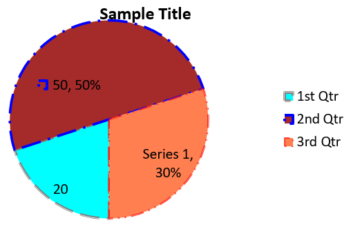

## **Visão geral**

Este artigo fornece um guia abrangente sobre como criar e personalizar gráficos usando Aspose.Slides para .NET. Você aprenderá como adicionar programaticamente um gráfico a um slide, preenchê‑lo com dados e aplicar várias opções de formatação para atender aos seus requisitos de design específicos. Ao longo do artigo, exemplos de código detalhados ilustram cada etapa, desde a inicialização da apresentação e do objeto de gráfico até a configuração de séries, eixos e legendas. Seguindo este guia, você obterá uma compreensão sólida de como integrar a geração dinâmica de gráficos em suas aplicações .NET, simplificando o processo de criação de apresentações orientadas a dados.

## **Criar um Gráfico**

Os gráficos ajudam as pessoas a visualizar rapidamente os dados e obter insights que podem não ser imediatamente evidentes a partir de uma tabela ou planilha.

**Por que criar gráficos?**

* agregar, condensar ou resumir grandes quantidades de dados em um único slide de uma apresentação;
* revelar padrões e tendências nos dados;
* deduzir a direção e o momentum dos dados ao longo do tempo ou em relação a uma unidade de medida específica;
* identificar outliers, aberrações, desvios, erros e dados sem sentido;
* comunicar ou apresentar dados complexos.

No PowerPoint, você pode criar gráficos através da função *Insert*, que fornece modelos para desenhar diversos tipos de gráficos. Usando Aspose.Slides, você pode criar tanto gráficos regulares (baseados em tipos de gráficos populares) quanto gráficos personalizados.

{} 
Use a enumeração [ChartType](https://reference.aspose.com/slides/pt/net/aspose.slides.charts/charttype/) no namespace [Aspose.Slides.Charts](https://reference.aspose.com/slides/pt/net/aspose.slides.charts/). Os valores desta enumeração correspondem a diferentes tipos de gráfico.
{} 

### **Criar Gráficos de Colunas Agrupadas**

Esta seção explica como criar gráficos de colunas agrupadas usando Aspose.Slides para .NET. Você aprenderá a inicializar uma apresentação, adicionar um gráfico e personalizar seus elementos, como título, dados, séries, categorias e estilo. Siga os passos abaixo para ver como um gráfico de colunas agrupadas padrão é gerado:

1. Crie uma instância da classe [Presentation](https://reference.aspose.com/slides/pt/net/aspose.slides/presentation).
1. Obtenha uma referência a um slide usando seu índice.
1. Adicione um gráfico com alguns dados e especifique o tipo `ChartType.ClusteredColumn`.
1. Adicione um título ao gráfico.
1. Acesse a planilha de dados do gráfico.
1. Limpe todas as séries e categorias padrão.
1. Adicione novas séries e categorias.
1. Adicione novos dados ao gráfico para as séries.
1. Aplique uma cor de preenchimento às séries do gráfico.
1. Adicione rótulos às séries do gráfico.
1. Salve a apresentação modificada como um arquivo PPTX.

Este código C# demonstra como criar um gráfico de colunas agrupadas:

```c#
// Instanciar a classe Presentation.
using (Presentation presentation = new Presentation())
{
    // Acessar o primeiro slide.
    ISlide slide = presentation.Slides[0];

    // Adicionar um gráfico de colunas agrupadas com seus dados padrão.
    IChart chart = slide.Shapes.AddChart(ChartType.ClusteredColumn, 20, 20, 500, 300);

    // Definir o título do gráfico.
    chart.ChartTitle.AddTextFrameForOverriding("Sample Title");
    chart.ChartTitle.TextFrameForOverriding.TextFrameFormat.CenterText = NullableBool.True;
    chart.ChartTitle.Height = 20;
    chart.HasTitle = true;

    // Definir a primeira série para mostrar valores.
    chart.ChartData.Series[0].Labels.DefaultDataLabelFormat.ShowValue = true;

    // Definir o índice da planilha de dados do gráfico.
    int worksheetIndex = 0;

    // Obter a pasta de trabalho de dados do gráfico.
    IChartDataWorkbook workbook = chart.ChartData.ChartDataWorkbook;

    // Excluir as séries e categorias geradas por padrão.
    chart.ChartData.Series.Clear();
    chart.ChartData.Categories.Clear();

    // Adicionar novas séries.
    chart.ChartData.Series.Add(workbook.GetCell(worksheetIndex, 0, 1, "Series 1"), chart.Type);
    chart.ChartData.Series.Add(workbook.GetCell(worksheetIndex, 0, 2, "Series 2"), chart.Type);

    // Adicionar novas categorias.
    chart.ChartData.Categories.Add(workbook.GetCell(worksheetIndex, 1, 0, "Category 1"));
    chart.ChartData.Categories.Add(workbook.GetCell(worksheetIndex, 2, 0, "Category 2"));
    chart.ChartData.Categories.Add(workbook.GetCell(worksheetIndex, 3, 0, "Category 3"));

    // Obter a primeira série do gráfico.
    IChartSeries series = chart.ChartData.Series[0];

    // Preencher os dados da série.
    series.DataPoints.AddDataPointForBarSeries(workbook.GetCell(worksheetIndex, 1, 1, 20));
    series.DataPoints.AddDataPointForBarSeries(workbook.GetCell(worksheetIndex, 2, 1, 50));
    series.DataPoints.AddDataPointForBarSeries(workbook.GetCell(worksheetIndex, 3, 1, 30));

    // Definir a cor de preenchimento da série.
    series.Format.Fill.FillType = FillType.Solid;
    series.Format.Fill.SolidFillColor.Color = Color.Red;

    // Obter a segunda série do gráfico.
    series = chart.ChartData.Series[1];

    // Preencher os dados da série.
    series.DataPoints.AddDataPointForBarSeries(workbook.GetCell(worksheetIndex, 1, 2, 30));
    series.DataPoints.AddDataPointForBarSeries(workbook.GetCell(worksheetIndex, 2, 2, 10));
    series.DataPoints.AddDataPointForBarSeries(workbook.GetCell(worksheetIndex, 3, 2, 60));

    // Definir a cor de preenchimento da série.
    series.Format.Fill.FillType = FillType.Solid;
    series.Format.Fill.SolidFillColor.Color = Color.Green;

    // Definir o primeiro rótulo para mostrar o nome da categoria.
    IDataLabel label = series.DataPoints[0].Label;
    label.DataLabelFormat.ShowCategoryName = true;

    label = series.DataPoints[1].Label;
    label.DataLabelFormat.ShowSeriesName = true;

    // Definir a série para mostrar o valor no terceiro rótulo.
    label = series.DataPoints[2].Label;
    label.DataLabelFormat.ShowValue = true;
    label.DataLabelFormat.ShowSeriesName = true;
    label.DataLabelFormat.Separator = "/";

    // Salvar a apresentação no disco como um arquivo PPTX.
    presentation.Save("AsposeChart_out.pptx", SaveFormat.Pptx);
}
```

O resultado:


### **Criar Gráficos de Dispersão**

Gráficos de dispersão (também conhecidos como scatter plots ou gráficos x‑y) são frequentemente usados para verificar padrões ou demonstrar correlações entre duas variáveis.

Use um gráfico de dispersão quando:

* Você tem dados numéricos emparelhados.
* Você tem duas variáveis que combinam bem entre si.
* Você deseja determinar se as duas variáveis estão relacionadas.
* Você tem uma variável independente que possui múltiplos valores para uma variável dependente.

Este código C# mostra como criar um gráfico de dispersão com uma série diferente de marcadores:

```c#
// Instanciar a classe Presentation.
using (Presentation presentation = new Presentation())
{
    // Acessar o primeiro slide.
    ISlide slide = presentation.Slides[0];

    // Criar o gráfico de dispersão padrão.
    IChart chart = slide.Shapes.AddChart(ChartType.ScatterWithSmoothLines, 20, 20, 500, 300);

    // Definir o índice da planilha de dados do gráfico.
    int worksheetIndex = 0;

    // Obter a pasta de trabalho de dados do gráfico.
    IChartDataWorkbook workbook = chart.ChartData.ChartDataWorkbook;

    // Excluir a série padrão.
    chart.ChartData.Series.Clear();

    // Adicionar novas séries.
    chart.ChartData.Series.Add(workbook.GetCell(worksheetIndex, 1, 1, "Series 1"), chart.Type);
    chart.ChartData.Series.Add(workbook.GetCell(worksheetIndex, 1, 3, "Series 2"), chart.Type);

    // Obter a primeira série do gráfico.
    IChartSeries series = chart.ChartData.Series[0];

    // Adicionar um novo ponto (1:3) à série.
    series.DataPoints.AddDataPointForScatterSeries(workbook.GetCell(worksheetIndex, 2, 1, 1), workbook.GetCell(worksheetIndex, 2, 2, 3));

    // Adicionar um novo ponto (2:10).
    series.DataPoints.AddDataPointForScatterSeries(workbook.GetCell(worksheetIndex, 3, 1, 2), workbook.GetCell(worksheetIndex, 3, 2, 10));

    // Alterar o tipo da série.
    series.Type = ChartType.ScatterWithStraightLinesAndMarkers;

    // Alterar o marcador da série do gráfico.
    series.Marker.Size = 10;
    series.Marker.Symbol = MarkerStyleType.Star;

    // Obter a segunda série do gráfico.
    series = chart.ChartData.Series[1];

    // Adicionar um novo ponto (5:2) à série do gráfico.
    series.DataPoints.AddDataPointForScatterSeries(workbook.GetCell(worksheetIndex, 2, 3, 5), workbook.GetCell(worksheetIndex, 2, 4, 2));

    // Adicionar um novo ponto (3:1).
    series.DataPoints.AddDataPointForScatterSeries(workbook.GetCell(worksheetIndex, 3, 3, 3), workbook.GetCell(worksheetIndex, 3, 4, 1));

    // Adicionar um novo ponto (2:2).
    series.DataPoints.AddDataPointForScatterSeries(workbook.GetCell(worksheetIndex, 4, 3, 2), workbook.GetCell(worksheetIndex, 4, 4, 2));

    // Adicionar um novo ponto (5:1).
    series.DataPoints.AddDataPointForScatterSeries(workbook.GetCell(worksheetIndex, 5, 3, 5), workbook.GetCell(worksheetIndex, 5, 4, 1));

    // Alterar o marcador da série do gráfico.
    series.Marker.Size = 10;
    series.Marker.Symbol = MarkerStyleType.Circle;

    // Salvar a apresentação no disco como um arquivo PPTX.
    presentation.Save("AsposeChart_out.pptx", SaveFormat.Pptx);
}
```

O resultado:


### **Criar Gráficos de Pizza**

Gráficos de pizza são mais adequados para mostrar a relação parte‑todo nos dados, especialmente quando os dados contêm rótulos categóricos com valores numéricos. No entanto, se seus dados contiverem muitas partes ou rótulos, você pode considerar usar um gráfico de barras.

1. Crie uma instância da classe [Presentation](https://reference.aspose.com/slides/pt/net/aspose.slides/presentation).
1. Obtenha uma referência a um slide usando seu índice.
1. Adicione um gráfico com dados padrão e especifique o tipo `ChartType.Pie`.
1. Acesse a planilha de dados do gráfico ([IChartDataWorkbook](https://reference.aspose.com/slides/pt/net/aspose.slides.charts/ichartdataworkbook/)).
1. Limpe as séries e categorias padrão.
1. Adicione novas séries e categorias.
1. Adicione novos dados ao gráfico para as séries.
1. Adicione novos pontos ao gráfico e aplique cores personalizadas aos setores do gráfico de pizza.
1. Defina rótulos para as séries.
1. Habilite linhas de conexão para os rótulos das séries.
1. Defina o ângulo de rotação do gráfico de pizza.
1. Salve a apresentação modificada como um arquivo PPTX.

Este código C# mostra como criar um gráfico de pizza:

```c#
// Instanciar a classe Presentation.
using (Presentation presentation = new Presentation())
{
    // Acessar o primeiro slide.
    ISlide slide = presentation.Slides[0];

    // Adicionar um gráfico com seus dados padrão.
    IChart chart = slide.Shapes.AddChart(ChartType.Pie, 20, 20, 500, 300);

    // Definir o título do gráfico.
    chart.ChartTitle.AddTextFrameForOverriding("Sample Title");
    chart.ChartTitle.TextFrameForOverriding.TextFrameFormat.CenterText = NullableBool.True;
    chart.ChartTitle.Height = 20;
    chart.HasTitle = true;

    // Definir a primeira série para mostrar valores.
    chart.ChartData.Series[0].Labels.DefaultDataLabelFormat.ShowValue = true;

    // Definir o índice da planilha de dados do gráfico.
    int worksheetIndex = 0;

    // Obter a pasta de trabalho de dados do gráfico.
    IChartDataWorkbook workbook = chart.ChartData.ChartDataWorkbook;

    // Excluir as séries e categorias geradas por padrão.
    chart.ChartData.Series.Clear();
    chart.ChartData.Categories.Clear();

    // Adicionar novas categorias.
    chart.ChartData.Categories.Add(workbook.GetCell(0, 1, 0, "1st Qtr"));
    chart.ChartData.Categories.Add(workbook.GetCell(0, 2, 0, "2nd Qtr"));
    chart.ChartData.Categories.Add(workbook.GetCell(0, 3, 0, "3rd Qtr"));

    // Adicionar novas séries.
    IChartSeries series = chart.ChartData.Series.Add(workbook.GetCell(0, 0, 1, "Series 1"), chart.Type);

    // Preencher os dados da série.
    series.DataPoints.AddDataPointForPieSeries(workbook.GetCell(worksheetIndex, 1, 1, 20));
    series.DataPoints.AddDataPointForPieSeries(workbook.GetCell(worksheetIndex, 2, 1, 50));
    series.DataPoints.AddDataPointForPieSeries(workbook.GetCell(worksheetIndex, 3, 1, 30));

    // Definir a cor do setor.
    chart.ChartData.SeriesGroups[0].IsColorVaried = true;

    IChartDataPoint point = series.DataPoints[0];
    point.Format.Fill.FillType = FillType.Solid;
    point.Format.Fill.SolidFillColor.Color = Color.Cyan;

    // Definir a borda do setor.
    point.Format.Line.FillFormat.FillType = FillType.Solid;
    point.Format.Line.FillFormat.SolidFillColor.Color = Color.Gray;
    point.Format.Line.Width = 3.0;
    point.Format.Line.Style = LineStyle.ThinThick;
    point.Format.Line.DashStyle = LineDashStyle.LargeDash;

    IChartDataPoint point1 = series.DataPoints[1];
    point1.Format.Fill.FillType = FillType.Solid;
    point1.Format.Fill.SolidFillColor.Color = Color.Brown;

    // Definir a borda do setor.
    point1.Format.Line.FillFormat.FillType = FillType.Solid;
    point1.Format.Line.FillFormat.SolidFillColor.Color = Color.Blue;
    point1.Format.Line.Width = 3.0;
    point1.Format.Line.Style = LineStyle.Single;
    point1.Format.Line.DashStyle = LineDashStyle.LargeDashDot;

    IChartDataPoint point2 = series.DataPoints[2];
    point2.Format.Fill.FillType = FillType.Solid;
    point2.Format.Fill.SolidFillColor.Color = Color.Coral;

    // Definir a borda do setor.
    point2.Format.Line.FillFormat.FillType = FillType.Solid;
    point2.Format.Line.FillFormat.SolidFillColor.Color = Color.Red;
    point2.Format.Line.Width = 2.0;
    point2.Format.Line.Style = LineStyle.ThinThin;
    point2.Format.Line.DashStyle = LineDashStyle.LargeDashDotDot;

    // Criar rótulos personalizados para cada categoria na nova série.
    IDataLabel label1 = series.DataPoints[0].Label;

    label1.DataLabelFormat.ShowValue = true;

    IDataLabel label2 = series.DataPoints[1].Label;
    label2.DataLabelFormat.ShowValue = true;
    label2.DataLabelFormat.ShowLegendKey = true;
    label2.DataLabelFormat.ShowPercentage = true;

    IDataLabel label3 = series.DataPoints[2].Label;
    label3.DataLabelFormat.ShowSeriesName = true;
    label3.DataLabelFormat.ShowPercentage = true;

    // Definir a série para mostrar linhas de conexão no gráfico.
    series.Labels.DefaultDataLabelFormat.ShowLeaderLines = true;

    // Definir o ângulo de rotação dos setores do gráfico de pizza.
    chart.ChartData.SeriesGroups[0].FirstSliceAngle = 180;

    // Salvar a apresentação no disco como um arquivo PPTX.
    presentation.Save("PieChart_out.pptx", SaveFormat.Pptx);
}
```

O resultado:



### **Criar Gráficos de Linha**

Gráficos de linha (também conhecidos como line graphs) são mais adequados para situações em que você deseja demonstrar mudanças de valor ao longo do tempo. Usando um gráfico de linha, você pode comparar uma grande quantidade de dados de uma só vez, rastrear mudanças e tendências ao longo do tempo, destacar anomalias em séries de dados e muito mais.

1. Crie uma instância da classe [Presentation](https://reference.aspose.com/slides/pt/net/aspose.slides/presentation).
1. Obtenha uma referência a um slide usando seu índice.
1. Adicione um gráfico com dados padrão e especifique o tipo `ChartType.Line`.
1. Acesse a planilha de dados do gráfico ([IChartDataWorkbook](https://reference.aspose.com/slides/pt/net/aspose.slides.charts/ichartdataworkbook/)).
1. Limpe as séries e categorias padrão.
1. Adicione novas séries e categorias.
1. Adicione novos dados ao gráfico para as séries.
1. Salve a apresentação modificada como um arquivo PPTX.

Este código C# mostra como criar um gráfico de linha:

```c#
using (Presentation presentation = new Presentation())
{
    IChart lineChart = presentation.Slides[0].Shapes.AddChart(ChartType.Line, 20, 20, 500, 300);

    presentation.Save("lineChart.pptx", SaveFormat.Pptx);
}
```

Por padrão, os pontos em um gráfico de linha são conectados por linhas contínuas retas. Se você quiser que os pontos sejam conectados por linhas tracejadas, pode especificar o tipo de traço desejado da seguinte forma:

```c#
foreach (IChartSeries series in lineChart.ChartData.Series)
{
    series.Format.Line.DashStyle = LineDashStyle.Dash;
}
```

O resultado:


### **Criar Gráficos Tree Map**

Gráficos Tree Map são mais adequados para dados de vendas quando você deseja mostrar o tamanho relativo das categorias de dados e chamar rapidamente a atenção para itens que são grandes contribuidores dentro de cada categoria.

1. Crie uma instância da classe [Presentation](https://reference.aspose.com/slides/pt/net/aspose.slides/presentation).
1. Obtenha uma referência a um slide usando seu índice.
1. Adicione um gráfico com dados padrão e especifique o tipo `ChartType.Treemap`.
1. Acesse a planilha de dados do gráfico ([IChartDataWorkbook](https://reference.aspose.com/slides/pt/net/aspose.slides.charts/ichartdataworkbook/)).
1. Limpe as séries e categorias padrão.
1. Adicione novas séries e categorias.
1. Adicione novos dados ao gráfico para as séries.
1. Salve a apresentação modificada como um arquivo PPTX.

Este código C# mostra como criar um gráfico Tree Map:

```c#
using (Presentation presentation = new Presentation())
{
    IChart chart = presentation.Slides[0].Shapes.AddChart(ChartType.Treemap, 20, 20, 500, 300);
    chart.ChartData.Categories.Clear();
    chart.ChartData.Series.Clear();

    IChartDataWorkbook workbook = chart.ChartData.ChartDataWorkbook;
    workbook.Clear(0);

    // Ramo 1
    IChartCategory leaf = chart.ChartData.Categories.Add(workbook.GetCell(0, "C1", "Leaf1"));
    leaf.GroupingLevels.SetGroupingItem(1, "Stem1");
    leaf.GroupingLevels.SetGroupingItem(2, "Branch1");

    chart.ChartData.Categories.Add(workbook.GetCell(0, "C2", "Leaf2"));

    leaf = chart.ChartData.Categories.Add(workbook.GetCell(0, "C3", "Leaf3"));
    leaf.GroupingLevels.SetGroupingItem(1, "Stem2");

    chart.ChartData.Categories.Add(workbook.GetCell(0, "C4", "Leaf4"));

    // Ramo 2
    leaf = chart.ChartData.Categories.Add(workbook.GetCell(0, "C5", "Leaf5"));
    leaf.GroupingLevels.SetGroupingItem(1, "Stem3");
    leaf.GroupingLevels.SetGroupingItem(2, "Branch2");

    chart.ChartData.Categories.Add(workbook.GetCell(0, "C6", "Leaf6"));

    leaf = chart.ChartData.Categories.Add(workbook.GetCell(0, "C7", "Leaf7"));
    leaf.GroupingLevels.SetGroupingItem(1, "Stem4");

    chart.ChartData.Categories.Add(workbook.GetCell(0, "C8", "Leaf8"));

    IChartSeries series = chart.ChartData.Series.Add(ChartType.Treemap);
    series.Labels.DefaultDataLabelFormat.ShowCategoryName = true;
    series.DataPoints.AddDataPointForTreemapSeries(workbook.GetCell(0, "D1", 4));
    series.DataPoints.AddDataPointForTreemapSeries(workbook.GetCell(0, "D2", 5));
    series.DataPoints.AddDataPointForTreemapSeries(workbook.GetCell(0, "D3", 3));
    series.DataPoints.AddDataPointForTreemapSeries(workbook.GetCell(0, "D4", 6));
    series.DataPoints.AddDataPointForTreemapSeries(workbook.GetCell(0, "D5", 9));
    series.DataPoints.AddDataPointForTreemapSeries(workbook.GetCell(0, "D6", 9));
    series.DataPoints.AddDataPointForTreemapSeries(workbook.GetCell(0, "D7", 4));
    series.DataPoints.AddDataPointForTreemapSeries(workbook.GetCell(0, "D8", 3));

    series.ParentLabelLayout = ParentLabelLayoutType.Overlapping;

    presentation.Save("Treemap.pptx", SaveFormat.Pptx);
}
```

O resultado:


### **Criar Gráficos de Ações**

Gráficos de ações são usados para exibir dados financeiros, como preços de abertura, alta, baixa e fechamento, ajudando a analisar tendências de mercado e volatilidade. Eles oferecem insights essenciais sobre o desempenho de ações, auxiliando investidores e analistas a tomar decisões informadas.

1. Crie uma instância da classe [Presentation](https://reference.aspose.com/slides/pt/net/aspose.slides/presentation).
1. Obtenha uma referência a um slide usando seu índice.
1. Adicione um gráfico com dados padrão e especifique o tipo `ChartType.OpenHighLowClose`.
1. Acesse a planilha de dados do gráfico ([IChartDataWorkbook](https://reference.aspose.com/slides/pt/net/aspose.slides.charts/ichartdataworkbook/)).
1. Limpe as séries e categorias padrão.
1. Adicione novas séries e categorias.
1. Adicione novos dados ao gráfico para as séries.
1. Especifique o formato HiLowLines.
1. Salve a apresentação modificada como um arquivo PPTX.

Este código C# mostra como criar um gráfico de ações:

```c#
using (Presentation presentation = new Presentation())
{
    IChart chart = presentation.Slides[0].Shapes.AddChart(ChartType.OpenHighLowClose, 20, 20, 500, 300, false);

    IChartDataWorkbook workbook = chart.ChartData.ChartDataWorkbook;

    chart.ChartData.Categories.Add(workbook.GetCell(0, 1, 0, "A"));
    chart.ChartData.Categories.Add(workbook.GetCell(0, 2, 0, "B"));
    chart.ChartData.Categories.Add(workbook.GetCell(0, 3, 0, "C"));

    chart.ChartData.Series.Add(workbook.GetCell(0, 0, 1, "Open"), chart.Type);
    chart.ChartData.Series.Add(workbook.GetCell(0, 0, 2, "High"), chart.Type);
    chart.ChartData.Series.Add(workbook.GetCell(0, 0, 3, "Low"), chart.Type);
    chart.ChartData.Series.Add(workbook.GetCell(0, 0, 4, "Close"), chart.Type);

    IChartSeries series = chart.ChartData.Series[0];
    series.DataPoints.AddDataPointForStockSeries(workbook.GetCell(0, 1, 1, 72));
    series.DataPoints.AddDataPointForStockSeries(workbook.GetCell(0, 2, 1, 25));
    series.DataPoints.AddDataPointForStockSeries(workbook.GetCell(0, 3, 1, 38));

    series = chart.ChartData.Series[1];
    series.DataPoints.AddDataPointForStockSeries(workbook.GetCell(0, 1, 2, 172));
    series.DataPoints.AddDataPointForStockSeries(workbook.GetCell(0, 2, 2, 57));
    series.DataPoints.AddDataPointForStockSeries(workbook.GetCell(0, 3, 2, 57));

    series = chart.ChartData.Series[2];
    series.DataPoints.AddDataPointForStockSeries(workbook.GetCell(0, 1, 3, 12));
    series.DataPoints.AddDataPointForStockSeries(workbook.GetCell(0, 2, 3, 12));
    series.DataPoints.AddDataPointForStockSeries(workbook.GetCell(0, 3, 3, 13));

    series = chart.ChartData.Series[3];
    series.DataPoints.AddDataPointForStockSeries(workbook.GetCell(0, 1, 4, 25));
    series.DataPoints.AddDataPointForStockSeries(workbook.GetCell(0, 2, 4, 38));
    series.DataPoints.AddDataPointForStockSeries(workbook.GetCell(0, 3, 4, 50));

    chart.ChartData.SeriesGroups[0].UpDownBars.HasUpDownBars = true;
    chart.ChartData.SeriesGroups[0].HiLowLinesFormat.Line.FillFormat.FillType = FillType.Solid;

    foreach (IChartSeries ser in chart.ChartData.Series)
    {
        ser.Format.Line.FillFormat.FillType = FillType.NoFill;
    }

    chart.Axes.VerticalAxis.MinorGridLinesFormat.Line.FillFormat.FillType = FillType.NoFill;

    presentation.Save("Stock-chart.pptx", SaveFormat.Pptx);
}
```

O resultado:


### **Criar Gráficos Box and Whisker**

Gráficos Box and Whisker são usados para exibir a distribuição de dados resumindo medidas estatísticas chave, como mediana, quartis e possíveis outliers. Eles são particularmente úteis em análises exploratórias de dados e estudos estatísticos para compreender rapidamente a variabilidade dos dados e identificar anomalias.

1. Crie uma instância da classe [Presentation](https://reference.aspose.com/slides/pt/net/aspose.slides/presentation).
1. Obtenha uma referência a um slide usando seu índice.
1. Adicione um gráfico com dados padrão e especifique o tipo `ChartType.BoxAndWhisker`.
1. Acesse a planilha de dados do gráfico ([IChartDataWorkbook](https://reference.aspose.com/slides/pt/net/aspose.slides.charts/ichartdataworkbook/)).
1. Limpe as séries e categorias padrão.
1. Adicione novas séries e categorias.
1. Adicione novos dados ao gráfico para as séries.
1. Salve a apresentação modificada como um arquivo PPTX.

Este código C# mostra como criar um gráfico Box and Whisker:

```c#
using (Presentation presentation = new Presentation())
{
    IChart chart = presentation.Slides[0].Shapes.AddChart(ChartType.BoxAndWhisker, 20, 20, 500, 300);
    chart.ChartData.Categories.Clear();
    chart.ChartData.Series.Clear();

    IChartDataWorkbook workbook = chart.ChartData.ChartDataWorkbook;
    workbook.Clear(0);

    chart.ChartData.Categories.Add(workbook.GetCell(0, "A1", "Category 1"));
    chart.ChartData.Categories.Add(workbook.GetCell(0, "A2", "Category 2"));
    chart.ChartData.Categories.Add(workbook.GetCell(0, "A3", "Category 3"));
    chart.ChartData.Categories.Add(workbook.GetCell(0, "A4", "Category 4"));
    chart.ChartData.Categories.Add(workbook.GetCell(0, "A5", "Category 5"));
    chart.ChartData.Categories.Add(workbook.GetCell(0, "A6", "Category 6"));

    IChartSeries series = chart.ChartData.Series.Add(ChartType.BoxAndWhisker);

    series.QuartileMethod = QuartileMethodType.Exclusive;
    series.ShowMeanLine = true;
    series.ShowMeanMarkers = true;
    series.ShowInnerPoints = true;
    series.ShowOutlierPoints = true;

    series.DataPoints.AddDataPointForBoxAndWhiskerSeries(workbook.GetCell(0, "B1", 15));
    series.DataPoints.AddDataPointForBoxAndWhiskerSeries(workbook.GetCell(0, "B2", 41));
    series.DataPoints.AddDataPointForBoxAndWhiskerSeries(workbook.GetCell(0, "B3", 16));
    series.DataPoints.AddDataPointForBoxAndWhiskerSeries(workbook.GetCell(0, "B4", 10));
    series.DataPoints.AddDataPointForBoxAndWhiskerSeries(workbook.GetCell(0, "B5", 23));
    series.DataPoints.AddDataPointForBoxAndWhiskerSeries(workbook.GetCell(0, "B6", 16));

    presentation.Save("BoxAndWhisker.pptx", SaveFormat.Pptx);
}
```

### **Criar Gráficos Funnel**

Gráficos Funnel são usados para visualizar processos que envolvem etapas sequenciais, onde o volume de dados diminui à medida que avança de uma etapa para a próxima. Eles são especialmente úteis para analisar taxas de conversão, identificar gargalos e monitorar a eficiência de processos de vendas ou marketing.

1. Crie uma instância da classe [Presentation](https://reference.aspose.com/slides/pt/net/aspose.slides/presentation).
1. Obtenha uma referência a um slide usando seu índice.
1. Adicione um gráfico com dados padrão e especifique o tipo `ChartType.Funnel`.
1. Salve a apresentação modificada como um arquivo PPTX.

Este código C# mostra como criar um gráfico funnel:

```c#
using (Presentation presentation = new Presentation("test.pptx"))
{
    IChart chart = presentation.Slides[0].Shapes.AddChart(ChartType.Funnel, 50, 50, 500, 400);
    chart.ChartData.Categories.Clear();
    chart.ChartData.Series.Clear();

    IChartDataWorkbook workbook = chart.ChartData.ChartDataWorkbook;
    workbook.Clear(0);

    chart.ChartData.Categories.Add(workbook.GetCell(0, "A1", "Category 1"));
    chart.ChartData.Categories.Add(workbook.GetCell(0, "A2", "Category 2"));
    chart.ChartData.Categories.Add(workbook.GetCell(0, "A3", "Category 3"));
    chart.ChartData.Categories.Add(workbook.GetCell(0, "A4", "Category 4"));
    chart.ChartData.Categories.Add(workbook.GetCell(0, "A5", "Category 5"));
    chart.ChartData.Categories.Add(workbook.GetCell(0, "A6", "Category 6"));

    IChartSeries series = chart.ChartData.Series.Add(ChartType.Funnel);

    series.DataPoints.AddDataPointForFunnelSeries(workbook.GetCell(0, "B1", 50));
    series.DataPoints.AddDataPointForFunnelSeries(workbook.GetCell(0, "B2", 100));
    series.DataPoints.AddDataPointForFunnelSeries(workbook.GetCell(0, "B3", 200));
    series.DataPoints.AddDataPointForFunnelSeries(workbook.GetCell(0, "B4", 300));
    series.DataPoints.AddDataPointForFunnelSeries(workbook.GetCell(0, "B5", 400));
    series.DataPoints.AddDataPointForFunnelSeries(workbook.GetCell(0, "B6", 500));

    presentation.Save("Funnel.pptx", SaveFormat.Pptx);
}
```

O resultado:


### **Criar Gráficos Sunburst**

Gráficos Sunburst são usados para visualizar dados hierárquicos, exibindo níveis como anéis concêntricos. Eles ajudam a ilustrar relações parte‑todo e são ideais para representar categorias e subcategorias aninhadas de forma clara e compacta.

1. Crie uma instância da classe [Presentation](https://reference.aspose.com/slides/pt/net/aspose.slides/presentation).
1. Obtenha uma referência a um slide usando seu índice.
1. Adicione um gráfico com dados padrão e especifique o tipo `ChartType.Sunburst`.
1. Salve a apresentação modificada como um arquivo PPTX.

Este código C# mostra como criar um gráfico Sunburst:

```c#
using (Presentation presentation = new Presentation())
{
    IChart chart = presentation.Slides[0].Shapes.AddChart(ChartType.Sunburst, 20, 20, 500, 300);
    chart.ChartData.Categories.Clear();
    chart.ChartData.Series.Clear();

    IChartDataWorkbook workbook = chart.ChartData.ChartDataWorkbook;
    workbook.Clear(0);

    // Ramo 1
    IChartCategory leaf = chart.ChartData.Categories.Add(workbook.GetCell(0, "C1", "Leaf1"));
    leaf.GroupingLevels.SetGroupingItem(1, "Stem1");
    leaf.GroupingLevels.SetGroupingItem(2, "Branch1");

    chart.ChartData.Categories.Add(workbook.GetCell(0, "C2", "Leaf2"));

    leaf = chart.ChartData.Categories.Add(workbook.GetCell(0, "C3", "Leaf3"));
    leaf.GroupingLevels.SetGroupingItem(1, "Stem2");

    chart.ChartData.Categories.Add(workbook.GetCell(0, "C4", "Leaf4"));

    // Ramo 2
    leaf = chart.ChartData.Categories.Add(workbook.GetCell(0, "C5", "Leaf5"));
    leaf.GroupingLevels.SetGroupingItem(1, "Stem3");
    leaf.GroupingLevels.SetGroupingItem(2, "Branch2");

    chart.ChartData.Categories.Add(workbook.GetCell(0, "C6", "Leaf6"));

    leaf = chart.ChartData.Categories.Add(workbook.GetCell(0, "C7", "Leaf7"));
    leaf.GroupingLevels.SetGroupingItem(1, "Stem4");

    chart.ChartData.Categories.Add(workbook.GetCell(0, "C8", "Leaf8"));

    IChartSeries series = chart.ChartData.Series.Add(ChartType.Sunburst);
    series.Labels.DefaultDataLabelFormat.ShowCategoryName = true;
    series.DataPoints.AddDataPointForSunburstSeries(workbook.GetCell(0, "D1", 4));
    series.DataPoints.AddDataPointForSunburstSeries(workbook.GetCell(0, "D2", 5));
    series.DataPoints.AddDataPointForSunburstSeries(workbook.GetCell(0, "D3", 3));
    series.DataPoints.AddDataPointForSunburstSeries(workbook.GetCell(0, "D4", 6));
    series.DataPoints.AddDataPointForSunburstSeries(workbook.GetCell(0, "D5", 9));
    series.DataPoints.AddDataPointForSunburstSeries(workbook.GetCell(0, "D6", 9));
    series.DataPoints.AddDataPointForSunburstSeries(workbook.GetCell(0, "D7", 4));
    series.DataPoints.AddDataPointForSunburstSeries(workbook.GetCell(0, "D8", 3));

    presentation.Save("Sunburst.pptx", SaveFormat.Pptx);
}
```

O resultado:


### **Criar Gráficos de Histograma**

Gráficos de histograma são usados para representar a distribuição de dados numéricos agrupando valores em intervalos ou “bins”. Eles são particularmente úteis para identificar padrões de frequência, assimetria e dispersão, além de detectar outliers em um conjunto de dados.

1. Crie uma instância da classe [Presentation](https://reference.aspose.com/slides/pt/net/aspose.slides/presentation).
1. Obtenha uma referência a um slide usando seu índice.
1. Adicione um gráfico com alguns dados e especifique o tipo `ChartType.Histogram`.
1. Acesse a planilha de dados do gráfico ([IChartDataWorkbook](https://reference.aspose.com/slides/pt/net/aspose.slides.charts/ichartdataworkbook/)).
1. Limpe as séries e categorias padrão.
1. Adicione novas séries e categorias.
1. Salve a apresentação modificada como um arquivo PPTX.

Este código C# mostra como criar um gráfico de histograma:

```c#
using (Presentation presentation = new Presentation())
{
    IChart chart = presentation.Slides[0].Shapes.AddChart(ChartType.Histogram, 20, 20, 500, 300);
    chart.ChartData.Categories.Clear();
    chart.ChartData.Series.Clear();

    IChartDataWorkbook workbook = chart.ChartData.ChartDataWorkbook;
    workbook.Clear(0);

    IChartSeries series = chart.ChartData.Series.Add(ChartType.Histogram);
    series.DataPoints.AddDataPointForHistogramSeries(workbook.GetCell(0, "A1", 15));
    series.DataPoints.AddDataPointForHistogramSeries(workbook.GetCell(0, "A2", -41));
    series.DataPoints.AddDataPointForHistogramSeries(workbook.GetCell(0, "A3", 16));
    series.DataPoints.AddDataPointForHistogramSeries(workbook.GetCell(0, "A4", 10));
    series.DataPoints.AddDataPointForHistogramSeries(workbook.GetCell(0, "A5", -23));
    series.DataPoints.AddDataPointForHistogramSeries(workbook.GetCell(0, "A6", 16));

    chart.Axes.HorizontalAxis.AggregationType = AxisAggregationType.Automatic;

    presentation.Save("Histogram.pptx", SaveFormat.Pptx);
}
```

O resultado:


### **Criar Gráficos Radar**

Gráficos radar são usados para exibir dados multivariados em um formato bidimensional, permitindo comparações fáceis de várias variáveis simultaneamente. Eles são particularmente úteis para identificar padrões, pontos fortes e fracos em múltiplas métricas de desempenho ou atributos.

1. Crie uma instância da classe [Presentation](https://reference.aspose.com/slides/pt/net/aspose.slides/presentation).
1. Obtenha uma referência a um slide usando seu índice.
1. Adicione um gráfico com alguns dados e especifique o tipo `ChartType.Radar`.
1. Salve a apresentação modificada como um arquivo PPTX.

Este código C# mostra como criar um gráfico radar:

```c#
using (Presentation presentation = new Presentation())
{
    presentation.Slides[0].Shapes.AddChart(ChartType.Radar, 20, 20, 500, 300);
    presentation.Save("Radar-chart.pptx", SaveFormat.Pptx);
}
```

O resultado:


### **Criar Gráficos Multi‑Categoria**

Gráficos Multi‑Categoria são usados para exibir dados que envolvem mais de um agrupamento categórico, permitindo comparar valores em múltiplas dimensões simultaneamente. Eles são particularmente úteis quando é necessário analisar tendências e relações dentro de conjuntos de dados complexos e multilayered.

1. Crie uma instância da classe [Presentation](https://reference.aspose.com/slides/pt/net/aspose.slides/presentation).
1. Obtenha uma referência a um slide usando seu índice.
1. Adicione um gráfico com dados padrão e especifique o tipo `ChartType.ClusteredColumn`.
1. Acesse a planilha de dados do gráfico ([IChartDataWorkbook](https://reference.aspose.com/slides/pt/net/aspose.slides.charts/ichartdataworkbook/)).
1. Limpe as séries e categorias padrão.
1. Adicione novas séries e categorias.
1. Adicione novos dados ao gráfico para as séries.
1. Salve a apresentação modificada como um arquivo PPTX.

Este código C# mostra como criar um gráfico multicategoria:

```c#
using (Presentation presentation = new Presentation())
{
    ISlide slide = presentation.Slides[0];

    IChart chart = presentation.Slides[0].Shapes.AddChart(ChartType.ClusteredColumn, 20, 20, 500, 300);
    chart.ChartData.Series.Clear();
    chart.ChartData.Categories.Clear();

    IChartDataWorkbook workbook = chart.ChartData.ChartDataWorkbook;
    workbook.Clear(0);

    int worksheetIndex = 0;

    IChartCategory category = chart.ChartData.Categories.Add(workbook.GetCell(0, "c2", "A"));
    category.GroupingLevels.SetGroupingItem(1, "Group1");
    category = chart.ChartData.Categories.Add(workbook.GetCell(0, "c3", "B"));

    category = chart.ChartData.Categories.Add(workbook.GetCell(0, "c4", "C"));
    category.GroupingLevels.SetGroupingItem(1, "Group2");
    category = chart.ChartData.Categories.Add(workbook.GetCell(0, "c5", "D"));

    category = chart.ChartData.Categories.Add(workbook.GetCell(0, "c6", "E"));
    category.GroupingLevels.SetGroupingItem(1, "Group3");
    category = chart.ChartData.Categories.Add(workbook.GetCell(0, "c7", "F"));

    category = chart.ChartData.Categories.Add(workbook.GetCell(0, "c8", "G"));
    category.GroupingLevels.SetGroupingItem(1, "Group4");
    category = chart.ChartData.Categories.Add(workbook.GetCell(0, "c9", "H"));

    // Adicionar uma série.
    IChartSeries series = chart.ChartData.Series.Add(workbook.GetCell(0, "D1", "Series 1"), ChartType.ClusteredColumn);

    series.DataPoints.AddDataPointForBarSeries(workbook.GetCell(worksheetIndex, "D2", 10));
    series.DataPoints.AddDataPointForBarSeries(workbook.GetCell(worksheetIndex, "D3", 20));
    series.DataPoints.AddDataPointForBarSeries(workbook.GetCell(worksheetIndex, "D4", 30));
    series.DataPoints.AddDataPointForBarSeries(workbook.GetCell(worksheetIndex, "D5", 40));
    series.DataPoints.AddDataPointForBarSeries(workbook.GetCell(worksheetIndex, "D6", 50));
    series.DataPoints.AddDataPointForBarSeries(workbook.GetCell(worksheetIndex, "D7", 60));
    series.DataPoints.AddDataPointForBarSeries(workbook.GetCell(worksheetIndex, "D8", 70));
    series.DataPoints.AddDataPointForBarSeries(workbook.GetCell(worksheetIndex, "D9", 80));

    // Salvar a apresentação com o gráfico.
    presentation.Save("AsposeChart_out.pptx", SaveFormat.Pptx);
}
```

O resultado:


### **Criar Gráficos de Mapa**

Gráficos de mapa são usados para visualizar dados geográficos mapeando informações para locais específicos, como países, estados ou cidades. Eles são particularmente úteis para analisar tendências regionais, dados demográficos e distribuições espaciais de forma clara e visualmente atraente.

Este código C# mostra como criar um gráfico de mapa:

```c#
using (Presentation presentation = new Presentation())
{
    IChart chart = presentation.Slides[0].Shapes.AddChart(ChartType.Map, 20, 20, 500, 300);
    presentation.Save("mapChart.pptx", SaveFormat.Pptx);
}
```

O resultado:


### **Criar Gráficos de Combinação**

Um gráfico de combinação (ou combo chart) combina dois ou mais tipos de gráfico em um único gráfico. Este gráfico permite que você destaque, compare ou examine diferenças entre dois ou mais conjuntos de dados, ajudando a identificar relacionamentos entre eles.


O código C# a seguir mostra como criar o gráfico de combinação mostrado acima em uma apresentação PowerPoint:

```c#
private static void CreateComboChart()
{
    using (Presentation presentation = new Presentation())
    {
        IChart chart = CreateChartWithFirstSeries(presentation.Slides[0]);

        AddSecondSeriesToChart(chart);
        AddThirdSeriesToChart(chart);

        SetPrimaryAxesFormat(chart);
        SetSecondaryAxesFormat(chart);

        presentation.Save("combo-chart.pptx", SaveFormat.Pptx);
    }
}

private static IChart CreateChartWithFirstSeries(ISlide slide)
{
    IChart chart = slide.Shapes.AddChart(ChartType.ClusteredColumn, 50, 50, 600, 400);

    // Define o título do gráfico.
    chart.HasTitle = true;
    chart.ChartTitle.AddTextFrameForOverriding("Chart Title");
    chart.ChartTitle.Overlay = false;
    IPortionFormat portionFormat = 
       chart.ChartTitle.TextFrameForOverriding.Paragraphs[0].ParagraphFormat.DefaultPortionFormat;
    portionFormat.FontBold = NullableBool.False;
    portionFormat.FontHeight = 18f;

    // Define a legenda do gráfico.
    chart.Legend.Position = LegendPositionType.Bottom;
    chart.Legend.TextFormat.PortionFormat.FontHeight = 12f;

    // Exclui as séries e categorias geradas por padrão.
    chart.ChartData.Series.Clear();
    chart.ChartData.Categories.Clear();

    int worksheetIndex = 0;
    IChartDataWorkbook workbook = chart.ChartData.ChartDataWorkbook;

    // Adiciona novas categorias.
    chart.ChartData.Categories.Add(workbook.GetCell(worksheetIndex, 1, 0, "Category 1"));
    chart.ChartData.Categories.Add(workbook.GetCell(worksheetIndex, 2, 0, "Category 2"));
    chart.ChartData.Categories.Add(workbook.GetCell(worksheetIndex, 3, 0, "Category 3"));
    chart.ChartData.Categories.Add(workbook.GetCell(worksheetIndex, 4, 0, "Category 4"));

    // Adiciona a primeira série.
    IChartSeries series = chart.ChartData.Series.Add(
        workbook.GetCell(worksheetIndex, 0, 1, "Series 1"), chart.Type);

    series.ParentSeriesGroup.Overlap = -25;
    series.ParentSeriesGroup.GapWidth = 220;

    series.DataPoints.AddDataPointForBarSeries(workbook.GetCell(worksheetIndex, 1, 1, 4.3));
    series.DataPoints.AddDataPointForBarSeries(workbook.GetCell(worksheetIndex, 2, 1, 2.5));
    series.DataPoints.AddDataPointForBarSeries(workbook.GetCell(worksheetIndex, 3, 1, 3.5));
    series.DataPoints.AddDataPointForBarSeries(workbook.GetCell(worksheetIndex, 4, 1, 4.5));

    return chart;
}

private static void AddSecondSeriesToChart(IChart chart)
{
    IChartDataWorkbook workbook = chart.ChartData.ChartDataWorkbook;
    const int worksheetIndex = 0;

    IChartSeries series = chart.ChartData.Series.Add(
        workbook.GetCell(worksheetIndex, 0, 2, "Series 2"), ChartType.ClusteredColumn);

    series.ParentSeriesGroup.Overlap = -25;
    series.ParentSeriesGroup.GapWidth = 220;

    series.DataPoints.AddDataPointForBarSeries(workbook.GetCell(worksheetIndex, 1, 2, 2.4));
    series.DataPoints.AddDataPointForBarSeries(workbook.GetCell(worksheetIndex, 2, 2, 4.4));
    series.DataPoints.AddDataPointForBarSeries(workbook.GetCell(worksheetIndex, 3, 2, 1.8));
    series.DataPoints.AddDataPointForBarSeries(workbook.GetCell(worksheetIndex, 4, 2, 2.8));
}

private static void AddThirdSeriesToChart(IChart chart)
{
    IChartDataWorkbook workbook = chart.ChartData.ChartDataWorkbook;
    const int worksheetIndex = 0;

    IChartSeries series = chart.ChartData.Series.Add(
        workbook.GetCell(worksheetIndex, 0, 3, "Series 3"), ChartType.Line);

    series.DataPoints.AddDataPointForLineSeries(workbook.GetCell(worksheetIndex, 1, 3, 2.0));
    series.DataPoints.AddDataPointForLineSeries(workbook.GetCell(worksheetIndex, 2, 3, 2.0));
    series.DataPoints.AddDataPointForLineSeries(workbook.GetCell(worksheetIndex, 3, 3, 3.0));
    series.DataPoints.AddDataPointForLineSeries(workbook.GetCell(worksheetIndex, 4, 3, 5.0));

    series.PlotOnSecondAxis = true;
}

private static void SetPrimaryAxesFormat(IChart chart)
{
    // Define o eixo horizontal.
    IAxis horizontalAxis = chart.Axes.HorizontalAxis;
    horizontalAxis.TextFormat.PortionFormat.FontHeight = 12f;
    horizontalAxis.Format.Line.FillFormat.FillType = FillType.NoFill;

    SetAxisTitle(horizontalAxis, "X Axis");

    // Define o eixo vertical.
    IAxis verticalAxis = chart.Axes.VerticalAxis;
    verticalAxis.TextFormat.PortionFormat.FontHeight = 12f;
    verticalAxis.Format.Line.FillFormat.FillType = FillType.NoFill;

    SetAxisTitle(verticalAxis, "Y Axis 1");

    // Define a cor das linhas de grade principais verticais.
    ILineFillFormat majorGridLinesFormat = verticalAxis.MajorGridLinesFormat.Line.FillFormat;
    majorGridLinesFormat.FillType = FillType.Solid;
    majorGridLinesFormat.SolidFillColor.Color = Color.FromArgb(217, 217, 217);
}

private static void SetSecondaryAxesFormat(IChart chart)
{
    // Define o eixo horizontal secundário.
    IAxis secondaryHorizontalAxis = chart.Axes.SecondaryHorizontalAxis;
    secondaryHorizontalAxis.Position = AxisPositionType.Bottom;
    secondaryHorizontalAxis.CrossType = CrossesType.Maximum;
    secondaryHorizontalAxis.IsVisible = false;
    secondaryHorizontalAxis.MajorGridLinesFormat.Line.FillFormat.FillType = FillType.NoFill;
    secondaryHorizontalAxis.MinorGridLinesFormat.Line.FillFormat.FillType = FillType.NoFill;

    // Define o eixo vertical secundário.
    IAxis secondaryVerticalAxis = chart.Axes.SecondaryVerticalAxis;
    secondaryVerticalAxis.Position = AxisPositionType.Right;
    secondaryVerticalAxis.TextFormat.PortionFormat.FontHeight = 12f;
    secondaryVerticalAxis.Format.Line.FillFormat.FillType = FillType.NoFill;
    secondaryVerticalAxis.MajorGridLinesFormat.Line.FillFormat.FillType = FillType.NoFill;
    secondaryVerticalAxis.MinorGridLinesFormat.Line.FillFormat.FillType = FillType.NoFill;

    SetAxisTitle(secondaryVerticalAxis, "Y Axis 2");
}

private static void SetAxisTitle(IAxis axis, string axisTitle)
{
    axis.HasTitle = true;
    axis.Title.Overlay = false;
    IPortionFormat titlePortionFormat =
        axis.Title.AddTextFrameForOverriding(axisTitle).Paragraphs[0].ParagraphFormat.DefaultPortionFormat;
    titlePortionFormat.FontBold = NullableBool.False;
    titlePortionFormat.FontHeight = 12f;
}
```

## **Atualizar Gráficos**

Aspose.Slides para .NET permite atualizar gráficos do PowerPoint modificando dados, formatação e estilo do gráfico. Essa funcionalidade simplifica a tarefa de manter apresentações atualizadas com conteúdo dinâmico e garante que os gráficos reflitam com precisão os dados atuais e os padrões visuais.

1. Instancie a classe [Presentation](https://reference.aspose.com/slides/pt/net/aspose.slides/presentation) que representa a apresentação contendo um gráfico.
1. Obtenha uma referência a um slide usando seu índice.
1. Percorra todas as formas para encontrar o gráfico.
1. Acesse a planilha de dados do gráfico.
1. Modifique as séries de dados do gráfico alterando os valores das séries.
1. Adicione uma nova série e preencha seus dados.
1. Salve a apresentação modificada como um arquivo PPTX.

Este código C# mostra como atualizar um gráfico:

```c#
const string chartName = "My chart";

// Instanciar a classe Presentation que representa um arquivo PPTX.
using (Presentation presentation = new Presentation("ExistingChart.pptx"))
{
    // Acessar o primeiro slide.
    ISlide slide = presentation.Slides[0];

    foreach (IShape shape in slide.Shapes)
    {
        if (shape is IChart chart && chart.Name == chartName)
        {
            // Definir o índice da planilha de dados do gráfico.
            int worksheetIndex = 0;

            // Obter a pasta de trabalho de dados do gráfico.
            IChartDataWorkbook workbook = chart.ChartData.ChartDataWorkbook;

            // Alterar os nomes das categorias do gráfico.
            workbook.GetCell(worksheetIndex, 1, 0, "Modified Category 1");
            workbook.GetCell(worksheetIndex, 2, 0, "Modified Category 2");

            // Obter a primeira série do gráfico.
            IChartSeries series = chart.ChartData.Series[0];

            // Atualizar os dados da série.
            workbook.GetCell(worksheetIndex, 0, 1, "New_Series 1"); // Modificando o nome da série.
            series.DataPoints[0].Value.Data = 90;
            series.DataPoints[1].Value.Data = 123;
            series.DataPoints[2].Value.Data = 44;

            // Obter a segunda série do gráfico.
            series = chart.ChartData.Series[1];

            // Atualizar os dados da série.
            workbook.GetCell(worksheetIndex, 0, 2, "New_Series 2"); // Modificando o nome da série.
            series.DataPoints[0].Value.Data = 23;
            series.DataPoints[1].Value.Data = 67;
            series.DataPoints[2].Value.Data = 99;

            // Adicionar uma nova série.
            series = chart.ChartData.Series.Add(workbook.GetCell(worksheetIndex, 0, 3, "Series 3"), chart.Type);

            // Preencher os dados da série.
            series.DataPoints.AddDataPointForBarSeries(workbook.GetCell(worksheetIndex, 1, 3, 20));
            series.DataPoints.AddDataPointForBarSeries(workbook.GetCell(worksheetIndex, 2, 3, 50));
            series.DataPoints.AddDataPointForBarSeries(workbook.GetCell(worksheetIndex, 3, 3, 30));

            chart.Type = ChartType.ClusteredCylinder;
        }
    }

    // Salvar a apresentação com o gráfico.
    presentation.Save("AsposeChartModified_out.pptx", SaveFormat.Pptx);
}
```

## **Definir Intervalo de Dados para um Gráfico**

Aspose.Slides para .NET oferece flexibilidade para definir um intervalo de dados específico de uma planilha como fonte dos dados do seu gráfico. Isso permite mapear diretamente uma parte da sua planilha para o gráfico, controlando quais células contribuem para as séries e categorias do gráfico. Como resultado, você pode atualizar e sincronizar facilmente seus gráficos com as mudanças mais recentes na planilha, garantindo que suas apresentações PowerPoint reflitam informações atuais e precisas.

1. Instancie a classe [Presentation](https://reference.aspose.com/slides/pt/net/aspose.slides/presentation) que representa a apresentação contendo um gráfico.
1. Obtenha uma referência a um slide usando seu índice.
1. Percorra todas as formas para encontrar o gráfico.
1. Acesse os dados do gráfico e defina o intervalo.
1. Salve a apresentação modificada como um arquivo PPTX.

Este código C# mostra como definir o intervalo de dados para um gráfico:

```c#
const string chartName = "My chart";

// Instanciar a classe Presentation que representa um arquivo PPTX.
using (Presentation presentation = new Presentation("ExistingChart.pptx"))
{
    // Acessar o primeiro slide.
    ISlide slide = presentation.Slides[0];

    foreach (IShape shape in slide.Shapes)
    {
        if (shape is IChart chart && chart.Name == chartName)
        {
            chart.ChartData.SetRange("Sheet1!A1:B4");
        }
    }

    presentation.Save("SetDataRange_out.pptx", SaveFormat.Pptx);
}
```

## **Usar Marcadores Padrão em Gráficos**

Quando você usa marcadores padrão em gráficos, cada série de gráfico recebe automaticamente um símbolo de marcador padrão diferente.

Este código C# mostra como definir automaticamente um marcador de série de gráfico:

```c#
using (Presentation presentation = new Presentation())
{
    ISlide slide = presentation.Slides[0];
    IChart chart = slide.Shapes.AddChart(ChartType.LineWithMarkers, 10, 10, 400, 400);

    chart.ChartData.Series.Clear();
    chart.ChartData.Categories.Clear();

    IChartDataWorkbook workbook = chart.ChartData.ChartDataWorkbook;

    IChartSeries series = chart.ChartData.Series.Add(workbook.GetCell(0, 0, 1, "Series 1"), chart.Type);

    chart.ChartData.Categories.Add(workbook.GetCell(0, 1, 0, "C1"));
    series.DataPoints.AddDataPointForLineSeries(workbook.GetCell(0, 1, 1, 24));

    chart.ChartData.Categories.Add(workbook.GetCell(0, 2, 0, "C2"));
    series.DataPoints.AddDataPointForLineSeries(workbook.GetCell(0, 2, 1, 23));

    chart.ChartData.Categories.Add(workbook.GetCell(0, 3, 0, "C3"));
    series.DataPoints.AddDataPointForLineSeries(workbook.GetCell(0, 3, 1, -10));

    chart.ChartData.Categories.Add(workbook.GetCell(0, 4, 0, "C4"));
    series.DataPoints.AddDataPointForLineSeries(workbook.GetCell(0, 4, 1, null));

    IChartSeries series2 = chart.ChartData.Series.Add(workbook.GetCell(0, 0, 2, "Series 2"), chart.Type);

    // Preencher os dados da série.
    series2.DataPoints.AddDataPointForLineSeries(workbook.GetCell(0, 1, 2, 30));
    series2.DataPoints.AddDataPointForLineSeries(workbook.GetCell(0, 2, 2, 10));
    series2.DataPoints.AddDataPointForLineSeries(workbook.GetCell(0, 3, 2, 60));
    series2.DataPoints.AddDataPointForLineSeries(workbook.GetCell(0, 4, 2, 40));

    chart.HasLegend = true;
    chart.Legend.Overlay = false;

    presentation.Save("DefaultMarkersInChart.pptx", SaveFormat.Pptx);
}
```

## **Perguntas frequentes**

**Quais tipos de gráfico são suportados pelo Aspose.Slides para .NET?**

Aspose.Slides para .NET suporta uma ampla variedade de tipos de gráfico, incluindo barra, linha, pizza, área, dispersão, histograma, radar e muitos outros. Essa flexibilidade permite escolher o tipo de gráfico mais adequado para suas necessidades de visualização de dados.

**Como adiciono um novo gráfico a um slide?**

Para adicionar um gráfico, primeiro crie uma instância da classe [Presentation](https://reference.aspose.com/slides/pt/net/aspose.slides/presentation), recupere o slide desejado usando seu índice e, em seguida, chame o método para adicionar um gráfico, especificando o tipo de gráfico e os dados iniciais. Esse processo integra o gráfico diretamente à sua apresentação.

**Como posso atualizar os dados exibidos em um gráfico?**

Você pode atualizar os dados de um gráfico acessando sua planilha de dados ([IChartDataWorkbook](https://reference.aspose.com/slides/pt/net/aspose.slides.charts/ichartdataworkbook/)), limpando quaisquer séries e categorias padrão e, em seguida, adicionando seus dados personalizados. Isso permite atualizar programaticamente o gráfico para refletir os dados mais recentes.

**É possível personalizar a aparência do gráfico?**

Sim, Aspose.Slides para .NET oferece opções extensas de personalização. Você pode modificar cores, fontes, rótulos, legendas e outros elementos de formatação para adaptar a aparência do gráfico aos requisitos de design específicos.