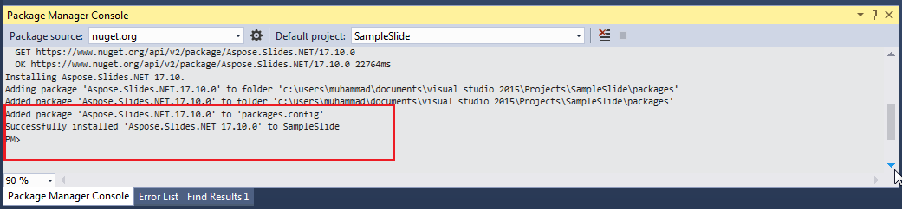

## **Visão geral**

Este artigo explica como instalar o Aspose.Slides para .NET no Windows e macOS. Ele foca na instalação baseada em NuGet e mostra como adicionar a biblioteca a um projeto do Visual Studio, seja pelo Gerenciador de Pacotes NuGet ou pelo Console do Gerenciador de Pacotes no Windows. Também descreve como atualizar o pacote e instalar builds pré‑release quando necessário.

## **Windows**
NuGet oferece o caminho mais fácil para baixar e instalar APIs Aspose para .NET em PCs. 

### **Método 1: Instalar ou atualizar Aspose.Slides pelo Gerenciador de Pacotes NuGet**

1. Abra o Microsoft Visual Studio. 
2. Crie um aplicativo de console simples ou abra um projeto existente. 
3. Acesse **Tools** > **NuGet package manager**.
4. Em **Browse**, procure por *Aspose Slides* no campo de texto. 
{}
5. Clique em **Aspose.Slides.NET** e depois em **Install**. 
   * Se quiser atualizar o Aspose.Slides—supondo que já o tenha instalado—clique em **Update** em vez disso. 

A API selecionada é baixada e referenciada no seu projeto.

### **Método 2: Instalar ou atualizar Aspose.Slides através do Console do Gerenciador de Pacotes**

É assim que você referencia [Aspose.Slides API](https://www.nuget.org/packages/Aspose.Slides.NET/) pelo console do gerenciador de pacotes:

1. Abra o Microsoft Visual Studio. 
2. Crie um aplicativo de console simples ou abra um projeto existente. 
3. Acesse **Tools** > **Library Package Manager** > **Package Manager Console**. 

4. Execute este comando: `Install-Package Aspose.Slides.NET` 

A versão completa mais recente é instalada na sua aplicação. 

* Como alternativa, você pode acrescentar o sufixo `-prerelease` ao comando para especificar que a versão mais recente (incluindo hotfixes) também deve ser instalada.

 A dica **Installing Aspose.Slides.NET** aparece na parte inferior da janela. 

Quando o download for concluído, você verá algumas mensagens de confirmação. 

Se você não estiver familiarizado com a [Aspose EULA](https://about.aspose.com/legal/eula), talvez queira ler a licença referenciada na URL. 

Na sua aplicação, você deverá ver que o Aspose.Slides foi adicionado e referenciado com sucesso. 

No Console do Gerenciador de Pacotes, você pode executar o comando `Update-Package Aspose.Slides.NET` para verificar atualizações do pacote Aspose.Slides. Atualizações (se encontradas) são instaladas automaticamente. Você também pode usar o sufixo `-prerelease` para atualizar a versão mais recente.
#### **Considerações ao executar em um ambiente de servidor compartilhado**
Recomendamos fortemente que você execute todos os componentes Aspose .NET com a permissão **Full Trust**, pois os componentes Aspose às vezes precisam acessar configurações do registro e arquivos localizados fora do diretório virtual—por exemplo, quando os componentes Aspose precisam ler fontes. 

Além disso, os componentes Aspose.NET são baseados nas classes centrais do sistema .NET—e algumas dessas classes também exigem permissão Full Trust para certas operações.

Os provedores de serviço de Internet, que hospedam múltiplas aplicações de diferentes empresas, geralmente aplicam o nível de segurança Medium Trust. No caso do .NET 2.0, esse nível de segurança pode gerar restrições que afetam as operações do Aspose.Slides:

- **RegistryPermission** não está disponível. Isso significa que você não pode acessar o registro, o que é necessário para enumerar fontes instaladas ao renderizar documentos.
- **FileIOPermission** é restrito. Isso significa que você só pode acessar arquivos na hierarquia de diretórios virtuais da sua aplicação. Isso também pode impedir a leitura de fontes durante operações de exportação. 

Pelos motivos acima, recomendamos enfaticamente que você execute o Aspose.Slides com permissões **Full Trust**. Se usar **Medium trust**, pode enfrentar inconsistências—alguns recursos da biblioteca (renderização, por exemplo) podem não funcionar ao executar determinadas tarefas. 

## **macOS**

NuGet oferece o caminho mais fácil para baixar e instalar o Aspose.Slides para .NET em Macs. 

**Instalar pré-requisito**

O namespace `System.Drawing` funciona de maneira diferente no macOS, portanto é necessário instalar mono-libgdiplus. 

> No .NET 5 e versões anteriores, o pacote NuGet [System.Drawing.Common](https://www.nuget.org/packages/System.Drawing.Common/) funciona no Windows, Linux e macOS. Contudo, existem diferenças de plataforma. No Linux e macOS, a funcionalidade GDI+ é implementada pela biblioteca [libgdiplus](https://www.mono-project.com/docs/gui/libgdiplus/). Essa biblioteca não é instalada por padrão na maioria das distribuições Linux e não oferece todo o suporte da funcionalidade GDI+ do Windows e macOS. Também há plataformas onde o libgdiplus não está disponível. Para usar tipos do pacote System.Drawing.Common no Linux e macOS, você deve instalar o libgdiplus separadamente. Para mais informações, veja [Install .NET on Linux](https://docs.microsoft.com/en-us/dotnet/core/install/linux) ou [Install .NET on macOS](https://docs.microsoft.com/en-us/dotnet/core/install/macos#libgdiplus). 

Para instalar o mono-libgdiplus separadamente no seu Mac, consulte [este artigo](https://docs.microsoft.com/en-us/dotnet/core/install/macos#libgdiplus) da documentação .NET. 

### **Instalar Aspose.Slides**

1. Abra o Visual Studio. 
2. Crie um aplicativo de console simples ou abra um projeto existente.
3. Acesse **Project** > **Manage NuGet Packages...**
   
4. Digite *Aspose.Slides* no campo de texto. 
5. Clique em **Aspose.Slides for .NET** e depois em **Add Package**. 
6. Adicione um trecho de código simples.
   * Você pode copiar o código nesta [página](/slides/pt/net/create-presentation/).
7. Execute o aplicativo.
8. Abra a *folder/bin/Debug/presentation_file_name* do seu projeto.

## **FAQ**

**Existe uma versão gratuita ou limitação de avaliação?**

Sim, por padrão o Aspose.Slides funciona em modo de avaliação, o que adiciona marcas d'água e pode ter outras limitações. Para remover restrições, você precisa aplicar uma [license](/slides/pt/net/licensing/).