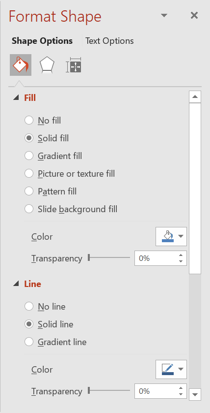

## **Introdução**

No PowerPoint, você pode adicionar formas aos slides. Como as formas são compostas por linhas, pode formatá‑las modificando ou aplicando efeitos às suas bordas. Além disso, pode formatar as formas especificando configurações que controlam como seus interiores são preenchidos.



Aspose.Slides for Node.js via Java fornece classes e métodos que permitem formatar formas usando as mesmas opções disponíveis no PowerPoint.

## **Formatar Linhas**

Usando Aspose.Slides, você pode especificar um estilo de linha personalizado para uma forma. Os passos a seguir descrevem o procedimento:

1. Crie uma instância da classe [Apresentação](https://reference.aspose.com/slides/pt/nodejs-java/aspose.slides/presentation/).
2. Obtenha uma referência a um slide pelo seu índice.
3. Adicione um [AutoShape](https://reference.aspose.com/slides/pt/nodejs-java/aspose.slides/autoshape/) ao slide.
4. Defina o [estilo da linha](https://reference.aspose.com/slides/pt/nodejs-java/aspose.slides/linestyle/) da forma.
5. Defina a espessura da linha.
6. Defina o [estilo tracejado](https://reference.aspose.com/slides/pt/nodejs-java/aspose.slides/linedashstyle/) da linha.
7. Defina a cor da linha da forma.
8. Salve a apresentação modificada como um arquivo PPTX.

O código a seguir demonstra como formatar um `AutoShape` retangular:

```js
// Instancie a classe Presentation que representa um arquivo de apresentação.
let presentation = new aspose.slides.Presentation();
try {
    // Obtenha o primeiro slide.
    let slide = presentation.getSlides().get_Item(0);

    // Adicione uma forma automática do tipo Rectangle.
    let shape = slide.getShapes().addAutoShape(aspose.slides.ShapeType.Rectangle, 50, 150, 150, 75);

    // Defina a cor de preenchimento para a forma Rectangle.
    shape.getFillFormat().setFillType(java.newByte(aspose.slides.FillType.NoFill));

    // Aplique formatação às linhas do Rectangle.
    shape.getLineFormat().setStyle(java.newByte(aspose.slides.LineStyle.ThickThin));
    shape.getLineFormat().setWidth(7);
    shape.getLineFormat().setDashStyle(java.newByte(aspose.slides.LineDashStyle.Dash));

    // Defina a cor para a linha do Rectangle.
    shape.getLineFormat().getFillFormat().setFillType(java.newByte(aspose.slides.FillType.Solid));
    shape.getLineFormat().getFillFormat().getSolidFillColor().setColor(java.getStaticFieldValue("java.awt.Color", "BLUE"));

    // Salve o arquivo PPTX no disco.
    presentation.save("formatted_lines.pptx", aspose.slides.SaveFormat.Pptx);
} finally {
    presentation.dispose();
}
```

O resultado:


## **Aplicar Efeitos de Esboço às Linhas da Forma**

Um efeito de esboço faz com que a linha de uma forma pareça desenhada à mão. Use [Shape.getLineFormat](https://reference.aspose.com/slides/pt/nodejs-java/aspose.slides/shape/) para acessar as configurações da linha, [LineFormat.getSketchFormat](https://reference.aspose.com/slides/pt/nodejs-java/aspose.slides/lineformat/) para acessar as configurações de esboço e [SketchFormat.setSketchType](https://reference.aspose.com/slides/pt/nodejs-java/aspose.slides/sketchformat/) para selecionar um valor da enumeração [LineSketchType](https://reference.aspose.com/slides/pt/nodejs-java/aspose.slides/linesketchtype/).

O código JavaScript a seguir mostra como aplicar o efeito [LineSketchType.Curved](https://reference.aspose.com/slides/pt/nodejs-java/aspose.slides/linesketchtype/), ler o valor atribuído explicitamente e remover o efeito com [LineSketchType.None](https://reference.aspose.com/slides/pt/nodejs-java/aspose.slides/linesketchtype/):

```js
let presentation = new aspose.slides.Presentation();
try {
    let slide = presentation.getSlides().get_Item(0);
    let shape = slide.getShapes().addAutoShape(aspose.slides.ShapeType.Rectangle, 50, 50, 200, 100);

    // Acesse o formato de linha da forma e seu formato de esboço.
    let sketchFormat = shape.getLineFormat().getSketchFormat();

    // Aplique um efeito de esboço.
    sketchFormat.setSketchType(aspose.slides.LineSketchType.Curved);

    // Leia o efeito de esboço atribuído diretamente à forma.
    let explicitSketchType = sketchFormat.getSketchType();
    console.log("Explicit sketch type: " + explicitSketchType);

    // Remova o efeito de esboço.
    sketchFormat.setSketchType(aspose.slides.LineSketchType.None);
} finally {
    presentation.dispose();
}
```

O valor retornado por [SketchFormat.getSketchType](https://reference.aspose.com/slides/pt/nodejs-java/aspose.slides/sketchformat/) representa a configuração atribuída diretamente à forma. Se a formatação da linha puder ser herdada de um tema, slide mestre ou slide de layout, use [LineFormat.getEffective](https://reference.aspose.com/slides/pt/nodejs-java/aspose.slides/lineformat/), chame `getSketchFormat` no objeto retornado e, em seguida, chame seu método `getSketchType`. O valor efetivo reflete a formatação realmente aplicada após a resolução da herança:

```js
let presentation = new aspose.slides.Presentation("presentation.pptx");
try {
    let shape = presentation.getSlides().get_Item(0).getShapes().get_Item(0);
    let lineFormat = shape.getLineFormat();

    let explicitSketchType = lineFormat.getSketchFormat().getSketchType();
    let effectiveLineFormat = lineFormat.getEffective();
    let effectiveSketchType = effectiveLineFormat.getSketchFormat().getSketchType();

    console.log("Explicit sketch type: " + explicitSketchType);
    console.log("Effective sketch type: " + effectiveSketchType);
} finally {
    presentation.dispose();
}
```

## **Formatar Estilos de Junção**

Aqui estão as três opções de tipo de junção:

* Arredondado
* Chanfro
* Bisel

Por padrão, quando o PowerPoint une duas linhas em um ângulo (como no canto de uma forma), ele usa a configuração **Arredondado**. Contudo, se você estiver desenhando uma forma com ângulos agudos, pode preferir a opção **Chanfro**.


O código JavaScript a seguir demonstra como três retângulos (conforme mostrados na imagem acima) foram criados usando as configurações de tipo de junção Chanfro, Bisel e Arredondado:

```js
// Instancie a classe Presentation que representa um arquivo de apresentação.
let presentation = new aspose.slides.Presentation();
try {
    // Obtenha o primeiro slide.
    let slide = presentation.getSlides().get_Item(0);

    // Adicione três formas automáticas do tipo Rectangle.
    let shape1 = slide.getShapes().addAutoShape(aspose.slides.ShapeType.Rectangle, 20, 20, 150, 75);
    let shape2 = slide.getShapes().addAutoShape(aspose.slides.ShapeType.Rectangle, 210, 20, 150, 75);
    let shape3 = slide.getShapes().addAutoShape(aspose.slides.ShapeType.Rectangle, 20, 135, 150, 75);

    // Defina a cor de preenchimento para cada forma retangular.
    shape1.getFillFormat().setFillType(java.newByte(aspose.slides.FillType.Solid));
    shape1.getFillFormat().getSolidFillColor().setColor(java.getStaticFieldValue("java.awt.Color", "BLACK"));
    shape2.getFillFormat().setFillType(java.newByte(aspose.slides.FillType.Solid));
    shape2.getFillFormat().getSolidFillColor().setColor(java.getStaticFieldValue("java.awt.Color", "BLACK"));
    shape3.getFillFormat().setFillType(java.newByte(aspose.slides.FillType.Solid));
    shape3.getFillFormat().getSolidFillColor().setColor(java.getStaticFieldValue("java.awt.Color", "BLACK"));

    // Defina a espessura da linha.
    shape1.getLineFormat().setWidth(15);
    shape2.getLineFormat().setWidth(15);
    shape3.getLineFormat().setWidth(15);

    // Defina a cor para a linha de cada retângulo.
    shape1.getLineFormat().getFillFormat().setFillType(java.newByte(aspose.slides.FillType.Solid));
    shape1.getLineFormat().getFillFormat().getSolidFillColor().setColor(java.getStaticFieldValue("java.awt.Color", "BLUE"));
    shape2.getLineFormat().getFillFormat().setFillType(java.newByte(aspose.slides.FillType.Solid));
    shape2.getLineFormat().getFillFormat().getSolidFillColor().setColor(java.getStaticFieldValue("java.awt.Color", "BLUE"));
    shape3.getLineFormat().getFillFormat().setFillType(java.newByte(aspose.slides.FillType.Solid));
    shape3.getLineFormat().getFillFormat().getSolidFillColor().setColor(java.getStaticFieldValue("java.awt.Color", "BLUE"));

    // Defina o estilo de junção.
    shape1.getLineFormat().setJoinStyle(java.newByte(aspose.slides.LineJoinStyle.Miter));
    shape2.getLineFormat().setJoinStyle(java.newByte(aspose.slides.LineJoinStyle.Bevel));
    shape3.getLineFormat().setJoinStyle(java.newByte(aspose.slides.LineJoinStyle.Round));

    // Adicione texto a cada retângulo.
    shape1.getTextFrame().setText("Miter Join Style");
    shape2.getTextFrame().setText("Bevel Join Style");
    shape3.getTextFrame().setText("Round Join Style");

    // Salve o arquivo PPTX no disco.
    presentation.save("join_styles.pptx", aspose.slides.SaveFormat.Pptx);
} finally {
    presentation.dispose();
}
```

## **Preenchimento Gradiente**

No PowerPoint, o Preenchimento Gradiente é uma opção de formatação que permite aplicar uma mescla contínua de cores a uma forma. Por exemplo, você pode aplicar duas ou mais cores de modo que uma gradualmente se mescle à outra.

Veja como aplicar um preenchimento gradiente a uma forma usando Aspose.Slides:

1. Crie uma instância da classe [Apresentação](https://reference.aspose.com/slides/pt/nodejs-java/aspose.slides/presentation/).
2. Obtenha uma referência a um slide pelo seu índice.
3. Adicione um [AutoShape](https://reference.aspose.com/slides/pt/nodejs-java/aspose.slides/autoshape/) ao slide.
4. Defina o [FillType](https://reference.aspose.com/slides/pt/nodejs-java/aspose.slides/filltype/) da forma como `Gradient`.
5. Adicione suas duas cores preferidas com posições definidas usando os métodos `add` da coleção de paradas de gradiente exposta pela classe [GradientFormat](https://reference.aspose.com/slides/pt/nodejs-java/aspose.slides/gradientformat/).
6. Salve a apresentação modificada como um arquivo PPTX.

```js
// Instancie a classe Presentation que representa um arquivo de apresentação.
let presentation = new aspose.slides.Presentation();
try {
    // Obtenha o primeiro slide.
    let slide = presentation.getSlides().get_Item(0);

    // Adicione uma forma automática do tipo Ellipse.
    let shape = slide.getShapes().addAutoShape(aspose.slides.ShapeType.Ellipse, 50, 50, 150, 75);

    // Aplique formatação de gradiente à elipse.
    shape.getFillFormat().setFillType(java.newByte(aspose.slides.FillType.Gradient));
    shape.getFillFormat().getGradientFormat().setGradientShape(java.newByte(aspose.slides.GradientShape.Linear));

    // Defina a direção do gradiente.
    shape.getFillFormat().getGradientFormat().setGradientDirection(aspose.slides.GradientDirection.FromCorner2);

    // Adicione duas paradas de gradiente.
    shape.getFillFormat().getGradientFormat().getGradientStops().addPresetColor(1.0, aspose.slides.PresetColor.Purple);
    shape.getFillFormat().getGradientFormat().getGradientStops().addPresetColor(0, aspose.slides.PresetColor.Red);

    // Salve o arquivo PPTX no disco.
    presentation.save("gradient_fill.pptx", aspose.slides.SaveFormat.Pptx);
} finally {
    presentation.dispose();
}
```

O resultado:


## **Preenchimento de Padrão**

No PowerPoint, o Preenchimento de Padrão é uma opção de formatação que permite aplicar um desenho bicolor — como pontos, listras, sarja ou quadriculado — a uma forma. Você pode escolher cores personalizadas para o primeiro plano e o plano de fundo do padrão.

Aspose.Slides fornece mais de 45 estilos de padrão predefinidos que podem ser aplicados às formas para melhorar a aparência visual de suas apresentações. Mesmo após selecionar um padrão predefinido, ainda pode especificar as cores exatas que ele deve usar.

Veja como aplicar um preenchimento de padrão a uma forma usando Aspose.Slides:

1. Crie uma instância da classe [Apresentação](https://reference.aspose.com/slides/pt/nodejs-java/aspose.slides/presentation/).
2. Obtenha uma referência a um slide pelo seu índice.
3. Adicione um [AutoShape](https://reference.aspose.com/slides/pt/nodejs-java/aspose.slides/autoshape/) ao slide.
4. Defina o [FillType](https://reference.aspose.com/slides/pt/nodejs-java/aspose.slides/filltype/) da forma como `Pattern`.
5. Escolha um estilo de padrão entre as opções predefinidas.
6. Defina a [Cor de Plano de Fundo](https://reference.aspose.com/slides/pt/nodejs-java/aspose.slides/patternformat/#getBackColor--) do padrão.
7. Defina a [Cor de Primeiro Plano](https://reference.aspose.com/slides/pt/nodejs-java/aspose.slides/patternformat/#getForeColor--) do padrão.
8. Salve a apresentação modificada como um arquivo PPTX.

```js
// Instancie a classe Presentation que representa um arquivo de apresentação.
let presentation = new aspose.slides.Presentation();
try {
    // Obtenha o primeiro slide.
    let slide = presentation.getSlides().get_Item(0);

    // Adicione uma forma automática do tipo Rectangle.
    let shape = slide.getShapes().addAutoShape(aspose.slides.ShapeType.Rectangle, 50, 50, 150, 75);

    // Defina o tipo de preenchimento como Pattern.
    shape.getFillFormat().setFillType(java.newByte(aspose.slides.FillType.Pattern));

    // Defina o estilo de padrão.
    shape.getFillFormat().getPatternFormat().setPatternStyle(java.newByte(aspose.slides.PatternStyle.Trellis));

    // Defina as cores de fundo e de primeiro plano do padrão.
    shape.getFillFormat().getPatternFormat().getBackColor().setColor(java.getStaticFieldValue("java.awt.Color", "LIGHT_GRAY"));
    shape.getFillFormat().getPatternFormat().getForeColor().setColor(java.getStaticFieldValue("java.awt.Color", "YELLOW"));

    // Salve o arquivo PPTX no disco.
    presentation.save("pattern_fill.pptx", aspose.slides.SaveFormat.Pptx);
} finally {
    presentation.dispose();
}
```

O resultado:


## **Preenchimento de Imagem**

No PowerPoint, o Preenchimento de Imagem é uma opção de formatação que permite inserir uma imagem dentro de uma forma — usando efetivamente a imagem como fundo da forma.

Veja como usar Aspose.Slides para aplicar um preenchimento de imagem a uma forma:

1. Crie uma instância da classe [Apresentação](https://reference.aspose.com/slides/pt/nodejs-java/aspose.slides/presentation/).
2. Obtenha uma referência a um slide pelo seu índice.
3. Adicione um [AutoShape](https://reference.aspose.com/slides/pt/nodejs-java/aspose.slides/autoshape/) ao slide.
4. Defina o [FillType](https://reference.aspose.com/slides/pt/nodejs-java/aspose.slides/filltype/) da forma como `Picture`.
5. Defina o modo de preenchimento da imagem como `Tile` (ou outro modo preferido).
6. Crie um objeto [PPImage](https://reference.aspose.com/slides/pt/nodejs-java/aspose.slides/ppimage/) a partir da imagem que deseja usar.
7. Passe a imagem para o método `ISlidesPicture.setImage`.
8. Salve a apresentação modificada como um arquivo PPTX.

Vamos supor que temos um arquivo "lotus.png" com a seguinte imagem:


```js
// Instancie a classe Presentation que representa um arquivo de apresentação.
let presentation = new aspose.slides.Presentation();
try {
    // Obtenha o primeiro slide.
    let slide = presentation.getSlides().get_Item(0);

    // Adicione uma forma automática do tipo Rectangle.
    let shape = slide.getShapes().addAutoShape(aspose.slides.ShapeType.Rectangle, 50, 50, 255, 130);
    
    // Defina o tipo de preenchimento como Picture.
    shape.getFillFormat().setFillType(java.newByte(aspose.slides.FillType.Picture));

    // Defina o modo de preenchimento da imagem.
    shape.getFillFormat().getPictureFillFormat().setPictureFillMode(aspose.slides.PictureFillMode.Tile);

    // Carregue uma imagem e adicione-a aos recursos da apresentação.
    let image = aspose.slides.Images.fromFile("lotus.png");
    let picture = presentation.getImages().addImage(image);
    image.dispose();

    // Defina a imagem.
    shape.getFillFormat().getPictureFillFormat().getPicture().setImage(picture);

    // Salve o arquivo PPTX no disco.
    presentation.save("picture_fill.pptx", aspose.slides.SaveFormat.Pptx);
} finally {
    presentation.dispose();
}
```

O resultado:


### **Imagem em Azulejo como Textura**

Se desejar definir uma imagem em azulejo como textura e personalizar o comportamento de ladrilhamento, use os seguintes métodos da classe [PictureFillFormat](https://reference.aspose.com/slides/pt/nodejs-java/aspose.slides/picturefillformat/):

- [setPictureFillMode](https://reference.aspose.com/slides/pt/nodejs-java/aspose.slides/picturefillformat/#setPictureFillMode): Define o modo de preenchimento da imagem — `Tile` ou `Stretch`.
- [setTileAlignment](https://reference.aspose.com/slides/pt/nodejs-java/aspose.slides/picturefillformat/#setTileAlignment): Especifica o alinhamento dos azulejos dentro da forma.
- [setTileFlip](https://reference.aspose.com/slides/pt/nodejs-java/aspose.slides/picturefillformat/#setTileFlip): Controla se o azulejo é invertido horizontalmente, verticalmente ou ambos.
- [setTileOffsetX](https://reference.aspose.com/slides/pt/nodejs-java/aspose.slides/picturefillformat/#setTileOffsetX): Define o deslocamento horizontal do azulejo (em pontos) a partir da origem da forma.
- [setTileOffsetY](https://reference.aspose.com/slides/pt/nodejs-java/aspose.slides/picturefillformat/#setTileOffsetY): Define o deslocamento vertical do azulejo (em pontos) a partir da origem da forma.
- [setTileScaleX](https://reference.aspose.com/slides/pt/nodejs-java/aspose.slides/picturefillformat/#setTileScaleX): Define a escala horizontal do azulejo como porcentagem.
- [setTileScaleY](https://reference.aspose.com/slides/pt/nodejs-java/aspose.slides/picturefillformat/#setTileScaleY): Define a escala vertical do azulejo como porcentagem.

O exemplo de código a seguir mostra como adicionar uma forma retangular com preenchimento de imagem em azulejo e configurar as opções de azulejo:

```js
// Instancie a classe Presentation que representa um arquivo de apresentação.
let presentation = new aspose.slides.Presentation();
try {
    // Obtenha o primeiro slide.
    let firstSlide = presentation.getSlides().get_Item(0);

    // Adicione uma forma automática retangular.
    let shape = firstSlide.getShapes().addAutoShape(aspose.slides.ShapeType.Rectangle, 50, 50, 190, 95);

    // Defina o tipo de preenchimento da forma como Picture.
    shape.getFillFormat().setFillType(java.newByte(aspose.slides.FillType.Picture));

    // Carregue a imagem e adicione-a aos recursos da apresentação.
    let sourceImage = aspose.slides.Images.fromFile("lotus.png");
    let presentationImage = presentation.getImages().addImage(sourceImage);
    sourceImage.dispose();

    // Atribua a imagem à forma.
    let pictureFillFormat = shape.getFillFormat().getPictureFillFormat();
    pictureFillFormat.getPicture().setImage(presentationImage);

    // Configure o modo de preenchimento da imagem e as propriedades de ladrilhamento.
    pictureFillFormat.setPictureFillMode(aspose.slides.PictureFillMode.Tile);
    pictureFillFormat.setTileOffsetX(-32);
    pictureFillFormat.setTileOffsetY(-32);
    pictureFillFormat.setTileScaleX(50);
    pictureFillFormat.setTileScaleY(50);
    pictureFillFormat.setTileAlignment(java.newByte(aspose.slides.RectangleAlignment.BottomRight));
    pictureFillFormat.setTileFlip(aspose.slides.TileFlip.FlipBoth);

    // Salve o arquivo PPTX no disco.
    presentation.save("tile.pptx", aspose.slides.SaveFormat.Pptx);
} finally {
    presentation.dispose();
}
```

O resultado:


## **Preenchimento de Cor Sólida**

No PowerPoint, o Preenchimento de Cor Sólida é uma opção de formatação que preenche uma forma com uma única cor uniforme. Essa cor de fundo simples é aplicada sem gradientes, texturas ou padrões.

Para aplicar um preenchimento de cor sólida a uma forma usando Aspose.Slides, siga estas etapas:

1. Crie uma instância da classe [Apresentação](https://reference.aspose.com/slides/pt/nodejs-java/aspose.slides/presentation/).
2. Obtenha uma referência a um slide pelo seu índice.
3. Adicione um [AutoShape](https://reference.aspose.com/slides/pt/nodejs-java/aspose.slides/autoshape/) ao slide.
4. Defina o [FillType](https://reference.aspose.com/slides/pt/nodejs-java/aspose.slides/filltype/) da forma como `Solid`.
5. Atribua a cor de preenchimento desejada à forma.
6. Salve a apresentação modificada como um arquivo PPTX.

```js
// Instancie a classe Presentation que representa um arquivo de apresentação.
let presentation = new aspose.slides.Presentation();
try {
    // Obtenha o primeiro slide.
    let slide = presentation.getSlides().get_Item(0);

    // Adicione uma forma automática do tipo Rectangle.
    let shape = slide.getShapes().addAutoShape(aspose.slides.ShapeType.Rectangle, 50, 50, 150, 75);

    // Defina o tipo de preenchimento como Solid.
    shape.getFillFormat().setFillType(java.newByte(aspose.slides.FillType.Solid));

    // Defina a cor de preenchimento.
    shape.getFillFormat().getSolidFillColor().setColor(java.getStaticFieldValue("java.awt.Color", "YELLOW"));

    // Salve o arquivo PPTX no disco.
    presentation.save("solid_color_fill.pptx", aspose.slides.SaveFormat.Pptx);
} finally {
    presentation.dispose();
}
```

O resultado:


## **Definir Transparência**

No PowerPoint, ao aplicar um preenchimento sólido, gradiente, de imagem ou de textura a formas, você também pode definir um nível de transparência para controlar a opacidade do preenchimento. Um valor de transparência maior torna a forma mais translúcida, permitindo que o plano de fundo ou objetos subjacentes fiquem parcialmente visíveis.

Aspose.Slides permite definir o nível de transparência ajustando o valor alfa na cor usada para o preenchimento. Veja como fazer isso:

1. Crie uma instância da classe [Apresentação](https://reference.aspose.com/slides/pt/nodejs-java/aspose.slides/presentation/).
2. Obtenha uma referência a um slide pelo seu índice.
3. Adicione um [AutoShape](https://reference.aspose.com/slides/pt/nodejs-java/aspose.slides/autoshape/) ao slide.
4. Defina o [FillType](https://reference.aspose.com/slides/pt/nodejs-java/aspose.slides/filltype/) como `Solid`.
5. Use `Color` para definir uma cor com transparência (o componente `alpha` controla a transparência).
6. Salve a apresentação.

```js
// Instancie a classe Presentation que representa um arquivo de apresentação.
let presentation = new aspose.slides.Presentation();
try {
    // Obtenha o primeiro slide.
    let slide = presentation.getSlides().get_Item(0);

    // Adicione uma forma automática retangular sólida.
    let solidShape = slide.getShapes().addAutoShape(aspose.slides.ShapeType.Rectangle, 50, 50, 150, 75);

    // Adicione uma forma automática retangular transparente sobre a forma sólida.
    let transparentShape = slide.getShapes().addAutoShape(aspose.slides.ShapeType.Rectangle, 80, 80, 150, 75);
    transparentShape.getFillFormat().setFillType(java.newByte(aspose.slides.FillType.Solid));
    transparentShape.getFillFormat().getSolidFillColor().setColor(java.newInstanceSync("java.awt.Color", 255, 255, 0, 204));

    // Salve o arquivo PPTX no disco.
    presentation.save("shape_transparency.pptx", aspose.slides.SaveFormat.Pptx);
} finally {
    presentation.dispose();
}
```

O resultado:


## **Rotacionar Formas**

Aspose.Slides permite rotacionar formas em apresentações do PowerPoint. Isso pode ser útil ao posicionar elementos visuais com necessidades específicas de alinhamento ou design.

Para rotacionar uma forma em um slide, siga estas etapas:

1. Crie uma instância da classe [Apresentação](https://reference.aspose.com/slides/pt/nodejs-java/aspose.slides/presentation/).
2. Obtenha uma referência a um slide pelo seu índice.
3. Adicione um [AutoShape](https://reference.aspose.com/slides/pt/nodejs-java/aspose.slides/autoshape/) ao slide.
4. Defina a propriedade de rotação da forma para o ângulo desejado.
5. Salve a apresentação.

```js
// Instancie a classe Presentation que representa um arquivo de apresentação.
let presentation = new aspose.slides.Presentation();
try {
    // Obtenha o primeiro slide.
    let slide = presentation.getSlides().get_Item(0);

    // Adicione uma forma automática do tipo Rectangle.
    let shape = slide.getShapes().addAutoShape(aspose.slides.ShapeType.Rectangle, 50, 50, 150, 75);

    // Rotacione a forma em 5 graus.
    shape.setRotation(5);

    // Salve o arquivo PPTX no disco.
    presentation.save("shape_rotation.pptx", aspose.slides.SaveFormat.Pptx);
} finally {
    presentation.dispose();
}
```

O resultado:


## **Adicionar Efeitos de Bisel 3D**

Aspose.Slides permite aplicar efeitos de bisel 3D a formas configurando suas propriedades [ThreeDFormat](https://reference.aspose.com/slides/pt/nodejs-java/aspose.slides/threedformat/).

Para adicionar efeitos de bisel 3D a uma forma, siga estas etapas:

1. Instancie a classe [Apresentação](https://reference.aspose.com/slides/pt/nodejs-java/aspose.slides/presentation/).
2. Obtenha uma referência a um slide pelo seu índice.
3. Adicione um [AutoShape](https://reference.aspose.com/slides/pt/nodejs-java/aspose.slides/autoshape/) ao slide.
4. Configure o [ThreeDFormat](https://reference.aspose.com/slides/pt/nodejs-java/aspose.slides/threedformat/) da forma para definir as configurações de bisel.
5. Salve a apresentação.

```js
// Crie uma instância da classe Presentation.
let presentation = new aspose.slides.Presentation();
try {
    let slide = presentation.getSlides().get_Item(0);

    // Adicione uma forma ao slide.
    let shape = slide.getShapes().addAutoShape(aspose.slides.ShapeType.Ellipse, 50, 50, 100, 100);
    shape.getFillFormat().setFillType(java.newByte(aspose.slides.FillType.Solid));
    shape.getFillFormat().getSolidFillColor().setColor(java.getStaticFieldValue("java.awt.Color", "GREEN"));
    shape.getLineFormat().getFillFormat().setFillType(java.newByte(aspose.slides.FillType.Solid));
    shape.getLineFormat().getFillFormat().getSolidFillColor().setColor(java.getStaticFieldValue("java.awt.Color", "ORANGE"));
    shape.getLineFormat().setWidth(2.0);

    // Defina as propriedades ThreeDFormat da forma.
    shape.getThreeDFormat().setDepth(4);
    shape.getThreeDFormat().getBevelTop().setBevelType(aspose.slides.BevelPresetType.Circle);
    shape.getThreeDFormat().getBevelTop().setHeight(6);
    shape.getThreeDFormat().getBevelTop().setWidth(6);
    shape.getThreeDFormat().getCamera().setCameraType(aspose.slides.CameraPresetType.OrthographicFront);
    shape.getThreeDFormat().getLightRig().setLightType(aspose.slides.LightRigPresetType.ThreePt);
    shape.getThreeDFormat().getLightRig().setDirection(aspose.slides.LightingDirection.Top);

    // Salve a apresentação como um arquivo PPTX.
    presentation.save("3D_bevel_effect.pptx", aspose.slides.SaveFormat.Pptx);
} finally {
    presentation.dispose();
}
```

O resultado:


## **Adicionar Efeitos de Rotação 3D**

Aspose.Slides permite aplicar efeitos de rotação 3D a formas configurando suas propriedades [ThreeDFormat](https://reference.aspose.com/slides/pt/nodejs-java/aspose.slides/threedformat/).

Para aplicar rotação 3D a uma forma:

1. Crie uma instância da classe [Apresentação](https://reference.aspose.com/slides/pt/nodejs-java/aspose.slides/presentation/).
2. Obtenha uma referência a um slide pelo seu índice.
3. Adicione um [AutoShape](https://reference.aspose.com/slides/pt/nodejs-java/aspose.slides/autoshape/) ao slide.
4. Use [setCameraType](https://reference.aspose.com/slides/pt/nodejs-java/aspose.slides/camera/#setCameraType) e [setLightType](https://reference.aspose.com/slides/pt/nodejs-java/aspose.slides/lightrig/#setLightType) para definir a rotação 3D.
5. Salve a apresentação.

```js
// Crie uma instância da classe Presentation.
let presentation = new aspose.slides.Presentation();
try {
    let slide = presentation.getSlides().get_Item(0);

    let autoShape = slide.getShapes().addAutoShape(aspose.slides.ShapeType.Rectangle, 50, 50, 150, 75);
    autoShape.getTextFrame().setText("Hello, Aspose!");

    autoShape.getThreeDFormat().setDepth(6);
    autoShape.getThreeDFormat().getCamera().setRotation(40, 35, 20);
    autoShape.getThreeDFormat().getCamera().setCameraType(aspose.slides.CameraPresetType.IsometricLeftUp);
    autoShape.getThreeDFormat().getLightRig().setLightType(aspose.slides.LightRigPresetType.Balanced);

    // Salve a apresentação como um arquivo PPTX.
    presentation.save("3D_rotation_effect.pptx", aspose.slides.SaveFormat.Pptx);
} finally {
    presentation.dispose();
}
```

O resultado:


## **Redefinir Formatação**

O código Java a seguir mostra como redefinir a formatação de um slide e reverter a posição, tamanho e formatação de todas as formas com marcadores no [LayoutSlide](https://reference.aspose.com/slides/pt/nodejs-java/aspose.slides/layoutslide/) para suas configurações padrão:

```js
let presentation = new aspose.slides.Presentation("sample.pptx");
try {
    for (let i = 0; i < presentation.getSlides().size(); i++) {
        let slide = presentation.getSlides().get_Item(i);
        // Redefina cada forma no slide que possui um placeholder no layout.
        slide.reset();
    }
    presentation.save("reset_formatting.pptx", aspose.slides.SaveFormat.Pptx);
} finally {
    presentation.dispose();
}
```

## **Perguntas Frequentes**

**A formatação de formas afeta o tamanho final do arquivo da apresentação?**

Apenas minimamente. Imagens e mídias incorporadas ocupam a maior parte do espaço do arquivo, enquanto parâmetros de forma como cores, efeitos e gradientes são armazenados como metadados e praticamente não aumentam o tamanho.

**Como posso detectar formas em um slide que compartilham a mesma formatação para poder agrupá‑las?**

Compare as principais propriedades de formatação de cada forma — preenchimento, linha e efeitos. Se todos os valores correspondentes coincidirem, trate seus estilos como idênticos e agrupe logicamente essas formas, facilitando o gerenciamento posterior de estilos.

**Posso salvar um conjunto de estilos de forma personalizados em um arquivo separado para reutilização em outras apresentações?**

Sim. Armazene formas de exemplo com os estilos desejados em um slide‑modelo ou em um arquivo de modelo .POTX. Ao criar uma nova apresentação, abra o modelo, clone as formas estilizadas necessárias e reaplique sua formatação onde for preciso.