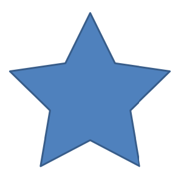

## **Visão geral**

Este artigo explica como personalizar formas de apresentação no Aspose.Slides editando a geometria da forma por meio de pontos de edição e caminhos de geometria. Ele mostra como trabalhar com `GeometryPath` para modificar formas existentes, executar operações básicas de edição de caminho, adicionar ou remover pontos e aplicar a geometria atualizada a uma forma.

Também demonstra como criar formas personalizadas e compostas, construir formas com cantos curvos, determinar se a geometria de uma forma está fechada e converter entre `GeometryPath` e `java.awt.Shape` para cenários adicionais de personalização de geometria.

## **Alterar uma forma usando pontos de edição**

Considere um quadrado. No PowerPoint, usando **pontos de edição**, você pode

* mover o canto do quadrado para dentro ou para fora
* especificar a curvatura de um canto ou ponto
* adicionar novos pontos ao quadrado
* manipular pontos no quadrado, etc.

Essencialmente, você pode executar as tarefas descritas em qualquer forma. Usando pontos de edição, você pode mudar uma forma ou criar uma nova forma a partir de uma forma existente.

## **Dicas de edição de forma**


Antes de começar a editar formas do PowerPoint por meio de pontos de edição, você pode querer considerar estes pontos sobre formas:

* Uma forma (ou seu caminho) pode ser fechada ou aberta.
* Quando uma forma está fechada, ela não possui ponto de início ou fim. Quando uma forma está aberta, ela tem um começo e um fim. 
* Todas as formas consistem em pelo menos 2 pontos âncora ligados entre si por linhas
* Uma linha pode ser reta ou curva. Os pontos âncora determinam a natureza da linha. 
* Os pontos âncora existem como pontos de canto, pontos retos ou pontos suaves:
  * Um ponto de canto é um ponto onde 2 linhas retas se encontram em um ângulo. 
  * Um ponto suave é um ponto onde 2 alças existem em uma linha reta e os segmentos da linha se juntam em uma curva suave. Nesse caso, todas as alças são separadas do ponto âncora por uma distância igual. 
  * Um ponto reto é um ponto onde 2 alças existem em uma linha reta e os segmentos da linha se juntam em uma curva suave. Nesse caso, as alças não precisam estar separadas do ponto âncora por uma distância igual. 
* Movendo ou editando os pontos âncora (o que altera o ângulo das linhas), você pode mudar a aparência de uma forma. 

Para editar formas do PowerPoint por meio de pontos de edição, **Aspose.Slides** fornece a classe [**GeometryPath**](https://reference.aspose.com/slides/pt/nodejs-java/aspose.slides/GeometryPath) e a classe [**GeometryPath**](https://reference.aspose.com/slides/pt/nodejs-java/aspose.slides/GeometryPath).

* Uma instância de [GeometryPath](https://reference.aspose.com/slides/pt/nodejs-java/aspose.slides/GeometryPath) representa o caminho de geometria do objeto [GeometryShape](https://reference.aspose.com/slides/pt/nodejs-java/aspose.slides/GeometryShape).
* Para obter o `GeometryPath` da instância `GeometryShape`, você pode usar o método [GeometryShape.getGeometryPaths](https://reference.aspose.com/slides/pt/nodejs-java/aspose.slides/GeometryShape#getGeometryPaths--).
* Para definir o `GeometryPath` de uma forma, você pode usar estes métodos: [GeometryShape.setGeometryPath](https://reference.aspose.com/slides/pt/nodejs-java/aspose.slides/GeometryShape#setGeometryPath-aspose.slides.IGeometryPath-) para *formas sólidas* e [GeometryShape.setGeometryPaths](https://reference.aspose.com/slides/pt/nodejs-java/aspose.slides/GeometryShape#setGeometryPaths-aspose.slides.IGeometryPath:A-) para *formas compostas*.
* Para adicionar segmentos, você pode usar os métodos em [GeometryPath](https://reference.aspose.com/slides/pt/nodejs-java/aspose.slides/GeometryPath).
* Usando os métodos [GeometryPath.setStroke](https://reference.aspose.com/slides/pt/nodejs-java/aspose.slides/GeometryPath#setStroke-boolean-) e [GeometryPath.setFillMode](https://reference.aspose.com/slides/pt/nodejs-java/aspose.slides/GeometryPath#setFillMode-byte-), você pode definir a aparência de um caminho de geometria.
* Usando o método [GeometryPath.getPathData](https://reference.aspose.com/slides/pt/nodejs-java/aspose.slides/GeometryPath#getPathData--) você pode recuperar o caminho de geometria de um `GeometryShape` como um array de segmentos de caminho.
* Para acessar opções adicionais de personalização da geometria da forma, você pode converter [GeometryPath](https://reference.aspose.com/slides/pt/nodejs-java/aspose.slides/GeometryPath) para [java.awt.Shape](https://docs.oracle.com/javase/7/docs/api/java/awt/Shape.html)
* Use os métodos [geometryPathToGraphicsPath](https://reference.aspose.com/slides/pt/nodejs-java/aspose.slides/ShapeUtil#geometryPathToGraphicsPath-aspose.slides.IGeometryPath-) e [graphicsPathToGeometryPath](https://reference.aspose.com/slides/pt/nodejs-java/aspose.slides/ShapeUtil#graphicsPathToGeometryPath-java.awt.Shape-) (da classe [ShapeUtil](https://reference.aspose.com/slides/pt/nodejs-java/aspose.slides/ShapeUtil)) para converter [GeometryPath](https://reference.aspose.com/slides/pt/nodejs-java/aspose.slides/GeometryPath) em [java.awt.Shape](https://docs.oracle.com/javase/7/docs/api/java/awt/Shape.html) e vice‑versa.

## **Operações simples de edição**

Este código JavaScript mostra como

**Adicionar uma linha** ao final de um caminho

```javascript
lineTo(point);
lineTo(x, y);
```
**Adicionar uma linha** a uma posição especificada em um caminho:

```javascript
lineTo(point, index);
lineTo(x, y, index);
```
**Adicionar uma curva Bezier cúbica** ao final de um caminho:

```javascript
cubicBezierTo(point1, point2, point3);
cubicBezierTo(x1, y1, x2, y2, x3, y3);
```
**Adicionar uma curva Bezier cúbica** à posição especificada em um caminho:

```javascript
cubicBezierTo(point1, point2, point3);
cubicBezierTo(x1, y1, x2, y2, x3, y3);
```
**Adicionar uma curva Bezier quadrática** ao final de um caminho:

```javascript
quadraticBezierTo(point1, point2);
quadraticBezierTo(x1, y1, x2, y2);
```
**Adicionar uma curva Bezier quadrática** a uma posição especificada em um caminho:

```javascript
quadraticBezierTo(point1, point2, index);
quadraticBezierTo(x1, y1, x2, y2, index);
```
**Anexar um arco especificado** a um caminho:

```javascript
arcTo(width, heigth, startAngle, sweepAngle);
```
**Fechar a figura atual** de um caminho:

```javascript
closeFigure();
```
**Definir a posição para o próximo ponto**:

```javascript
moveTo(point);
moveTo(x, y);
```
**Remover o segmento de caminho** em um índice especificado:

```javascript
removeAt(index);
```

## **Adicionar pontos personalizados à forma**
1. Crie uma instância da classe [GeometryShape](https://reference.aspose.com/slides/pt/nodejs-java/aspose.slides/GeometryShape) e defina o tipo [ShapeType.Rectangle](https://reference.aspose.com/slides/pt/nodejs-java/aspose.slides/ShapeType).
2. Obtenha uma instância da classe [GeometryPath](https://reference.aspose.com/slides/pt/nodejs-java/aspose.slides/GeometryPath) a partir da forma.
3. Adicione um novo ponto entre os dois pontos superiores do caminho.
4. Adicione um novo ponto entre os dois pontos inferiores do caminho.
5. Aplique o caminho à forma.

Este código JavaScript mostra como adicionar pontos personalizados a uma forma:

```javascript
var pres = new aspose.slides.Presentation();
try {
    var shape = pres.getSlides().get_Item(0).getShapes().addAutoShape(aspose.slides.ShapeType.Rectangle, 100, 100, 200, 100);
    var geometryPath = shape.getGeometryPaths()[0];
    geometryPath.lineTo(100, 50, 1);
    geometryPath.lineTo(100, 50, 4);
    shape.setGeometryPath(geometryPath);
} finally {
    if (pres != null) {
        pres.dispose();
    }
}
```


## **Remover pontos da forma**

1. Crie uma instância da classe [GeometryShape](https://reference.aspose.com/slides/pt/nodejs-java/aspose.slides/GeometryShape) e defina o tipo [ShapeType.Heart](https://reference.aspose.com/slides/pt/nodejs-java/aspose.slides/ShapeType).
2. Obtenha uma instância da classe [GeometryPath](https://reference.aspose.com/slides/pt/nodejs-java/aspose.slides/GeometryPath) a partir da forma.
3. Remova o segmento do caminho.
4. Aplique o caminho à forma.

Este código JavaScript mostra como remover pontos de uma forma:

```javascript
var pres = new aspose.slides.Presentation();
try {
    var shape = pres.getSlides().get_Item(0).getShapes().addAutoShape(aspose.slides.ShapeType.Heart, 100, 100, 300, 300);
    var path = shape.getGeometryPaths()[0];
    path.removeAt(2);
    shape.setGeometryPath(path);
} finally {
    if (pres != null) {
        pres.dispose();
    }
}
```


## **Criar forma personalizada**

1. Calcule os pontos da forma.
2. Crie uma instância da classe [GeometryPath](https://reference.aspose.com/slides/pt/nodejs-java/aspose.slides/GeometryPath).
3. Preencha o caminho com os pontos.
4. Crie uma instância da classe [GeometryShape](https://reference.aspose.com/slides/pt/nodejs-java/aspose.slides/GeometryShape).
5. Aplique o caminho à forma.

Este JavaScript mostra como criar uma forma personalizada:

```javascript
var points = java.newInstanceSync("java.util.ArrayList");
var R = 100;
var r = 50;
var step = 72;
for (var angle = -90; angle < 270; angle += step) {
    var radians = angle * (java.getStaticFieldValue("java.lang.Math", "PI") / 180.0);
    var x = R * java.callStaticMethodSync("java.lang.Math", "cos", radians);
    var y = R * java.callStaticMethodSync("java.lang.Math", "sin", radians);
    points.add(java.newInstanceSync("com.aspose.slides.Point2DFloat", java.newFloat(x + R), java.newFloat(y + R)));
    radians = (java.getStaticFieldValue("java.lang.Math", "PI") * (angle + (step / 2))) / 180.0;
    x = r * java.callStaticMethodSync("java.lang.Math", "cos", radians);
    y = r * java.callStaticMethodSync("java.lang.Math", "sin", radians);
    points.add(java.newInstanceSync("com.aspose.slides.Point2DFloat", java.newFloat(x + R), java.newFloat(y + R)));
}
var starPath = new aspose.slides.GeometryPath();
starPath.moveTo(points.get(0));
for (var i = 1; i < points.size(); i++) {
    starPath.lineTo(points.get(i));
}
starPath.closeFigure();
var pres = new aspose.slides.Presentation();
try {
    var shape = pres.getSlides().get_Item(0).getShapes().addAutoShape(aspose.slides.ShapeType.Rectangle, 100, 100, R * 2, R * 2);
    shape.setGeometryPath(starPath);
} finally {
    if (pres != null) {
        pres.dispose();
    }
}
```



## **Criar forma composta personalizada**

1. Crie uma instância da classe [GeometryShape](https://reference.aspose.com/slides/pt/nodejs-java/aspose.slides/GeometryShape).
2. Crie a primeira instância da classe [GeometryPath](https://reference.aspose.com/slides/pt/nodejs-java/aspose.slides/GeometryPath).
3. Crie a segunda instância da classe [GeometryPath](https://reference.aspose.com/slides/pt/nodejs-java/aspose.slides/GeometryPath).
4. Aplique os caminhos à forma.

Este código JavaScript mostra como criar uma forma composta personalizada:

```javascript
var pres = new aspose.slides.Presentation();
try {
    var shape = pres.getSlides().get_Item(0).getShapes().addAutoShape(aspose.slides.ShapeType.Rectangle, 100, 100, 200, 100);
    var geometryPath0 = new aspose.slides.GeometryPath();
    geometryPath0.moveTo(0, 0);
    geometryPath0.lineTo(shape.getWidth(), 0);
    geometryPath0.lineTo(shape.getWidth(), shape.getHeight() / 3);
    geometryPath0.lineTo(0, shape.getHeight() / 3);
    geometryPath0.closeFigure();
    var geometryPath1 = new aspose.slides.GeometryPath();
    geometryPath1.moveTo(0, (shape.getHeight() / 3) * 2);
    geometryPath1.lineTo(shape.getWidth(), (shape.getHeight() / 3) * 2);
    geometryPath1.lineTo(shape.getWidth(), shape.getHeight());
    geometryPath1.lineTo(0, shape.getHeight());
    geometryPath1.closeFigure();
    shape.setGeometryPaths(java.newArray("com.aspose.slides.GeometryPath",[geometryPath0, geometryPath1]));
} finally {
    if (pres != null) {
        pres.dispose();
    }
}
```


## **Criar forma personalizada com cantos curvos**

Este código JavaScript mostra como criar uma forma personalizada com cantos curvos (para dentro);

```javascript
var shapeX = 20.0;
var shapeY = 20.0;
var shapeWidth = 300.0;
var shapeHeight = 200.0;
var leftTopSize = 50.0;
var rightTopSize = 20.0;
var rightBottomSize = 40.0;
var leftBottomSize = 10.0;
var pres = new aspose.slides.Presentation();
try {
    var childShape = pres.getSlides().get_Item(0).getShapes().addAutoShape(aspose.slides.ShapeType.Custom, shapeX, shapeY, shapeWidth, shapeHeight);
    var geometryPath = new aspose.slides.GeometryPath();
    var point1 = java.newInstanceSync("com.aspose.slides.Point2DFloat", leftTopSize, 0);
    var point2 = java.newInstanceSync("com.aspose.slides.Point2DFloat", shapeWidth - rightTopSize, 0);
    var point3 = java.newInstanceSync("com.aspose.slides.Point2DFloat", shapeWidth, shapeHeight - rightBottomSize);
    var point4 = java.newInstanceSync("com.aspose.slides.Point2DFloat", leftBottomSize, shapeHeight);
    var point5 = java.newInstanceSync("com.aspose.slides.Point2DFloat", 0, leftTopSize);
    geometryPath.moveTo(point1);
    geometryPath.lineTo(point2);
    geometryPath.arcTo(rightTopSize, rightTopSize, 180, -90);
    geometryPath.lineTo(point3);
    geometryPath.arcTo(rightBottomSize, rightBottomSize, -90, -90);
    geometryPath.lineTo(point4);
    geometryPath.arcTo(leftBottomSize, leftBottomSize, 0, -90);
    geometryPath.lineTo(point5);
    geometryPath.arcTo(leftTopSize, leftTopSize, 90, -90);
    geometryPath.closeFigure();
    childShape.setGeometryPath(geometryPath);
    pres.save("output.pptx", aspose.slides.SaveFormat.Pptx);
} finally {
    if (pres != null) {
        pres.dispose();
    }
}
```

## **Descobrir se a geometria de uma forma está fechada**

Uma forma fechada é definida como aquela em que todos os seus lados se conectam, formando um contorno único sem lacunas. Essa forma pode ser uma figura geométrica simples ou um contorno personalizado complexo. O exemplo de código a seguir mostra como verificar se a geometria de uma forma está fechada:

```java
function isGeometryClosed(geometryShape) 
{
    let isClosed = null;

    geometryShape.getGeometryPaths().forEach(geometryPath => {
        const pathData = geometryPath.getPathData();
        const dataLength = pathData.length;

        if (dataLength === 0) return;

        const lastSegment = pathData[dataLength - 1];
        isClosed = lastSegment.getPathCommand() === aspose.slides.PathCommandType.Close;

        if (!isClosed) return false;
    });

    return isClosed === true;
}
```

## **Converter GeometryPath para java.awt.Shape**

1. Crie uma instância da classe [GeometryShape](https://reference.aspose.com/slides/pt/nodejs-java/aspose.slides/GeometryShape).
2. Crie uma instância da classe [java.awt.Shape](https://docs.oracle.com/javase/7/docs/api/java/awt/Shape.html).
3. Converta a instância [java.awt.Shape](https://docs.oracle.com/javase/7/docs/api/java/awt/Shape.html) para a instância [GeometryPath](https://reference.aspose.com/slides/pt/nodejs-java/aspose.slides/GeometryPath) usando [ShapeUtil](https://reference.aspose.com/slides/pt/nodejs-java/aspose.slides/ShapeUtil).
4. Aplique os caminhos à forma.

Este código JavaScript—uma implementação das etapas acima—demostra o processo de conversão de **GeometryPath** para **GraphicsPath**:

```javascript
var pres = new aspose.slides.Presentation();
try {
    // Cria uma nova forma
    var shape = pres.getSlides().get_Item(0).getShapes().addAutoShape(aspose.slides.ShapeType.Rectangle, 100, 100, 300, 100);
    // Obtém o caminho de geometria da forma
    var originalPath = shape.getGeometryPaths()[0];
    originalPath.setFillMode(aspose.slides.PathFillModeType.None);
    // Cria um novo caminho gráfico com texto
    var graphicsPath;
    var font = java.newInstanceSync("java.awt.Font", "Arial", java.getStaticFieldValue("java.awt.Font", "PLAIN"), 40);
    var text = "Text in shape";
    var img = java.newInstanceSync("BufferedImage", 100, 100, java.getStaticFieldValue("BufferedImage", "TYPE_INT_ARGB"));
    var g2 = img.createGraphics();
    try {
        var glyphVector = font.createGlyphVector(g2.getFontRenderContext(), text);
        graphicsPath = glyphVector.getOutline(20.0, -glyphVector.getVisualBounds().getY() + 10);
    } finally {
        g2.dispose();
    }
    // Converte caminho gráfico para caminho de geometria
    var textPath = aspose.slides.ShapeUtil.graphicsPathToGeometryPath(graphicsPath);
    textPath.setFillMode(aspose.slides.PathFillModeType.Normal);
    // Define a combinação do novo caminho de geometria e do caminho de geometria original na forma
    shape.setGeometryPaths(java.newArray("com.aspose.slides.IGeometryPath", [originalPath, textPath]));
} finally {
    if (pres != null) {
        pres.dispose();
    }
}
```


## **FAQ**

**O que acontecerá com o preenchimento e o contorno após substituir a geometria?**

O estilo permanece associado à forma; apenas o contorno muda. O preenchimento e o contorno são aplicados automaticamente à nova geometria.

**Como girar corretamente uma forma personalizada juntamente com sua geometria?**

Use o método [setRotation](https://reference.aspose.com/slides/pt/nodejs-java/aspose.slides/shape/setrotation/) da forma; a geometria gira com a forma porque está vinculada ao próprio sistema de coordenadas da forma.

**Posso converter uma forma personalizada em uma imagem para “travar” o resultado?**

Sim. Exporte a área do [slide](/slides/pt/nodejs-java/convert-powerpoint-to-png/) necessária ou o próprio [shape](/slides/pt/nodejs-java/create-shape-thumbnails/) para um formato raster; isso simplifica o trabalho posterior com geometrias complexas.