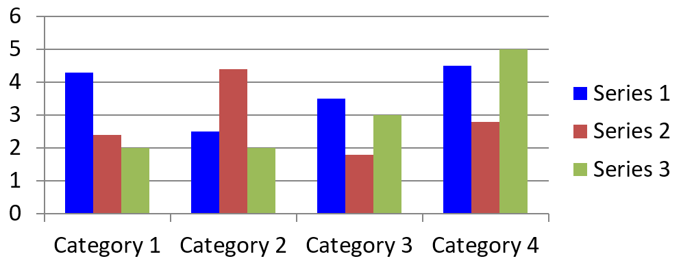

## **Visão geral**

Um gráfico armazena seus dados plotados em uma planilha de dados do gráfico. Um [ChartSeries](https://reference.aspose.com/slides/pt/php-java/aspose.slides/chartseries/) representa um conjunto de valores relacionados, e cada [ChartDataPoint](https://reference.aspose.com/slides/pt/php-java/aspose.slides/chartdatapoint/) da série refere‑se a uma ou mais células da planilha. Objetos [ChartCategory](https://reference.aspose.com/slides/pt/php-java/aspose.slides/chartcategory/) fornecem os rótulos ou valores de agrupamento compartilhados pelas séries. O nome da série, as categorias e os valores dos pontos, portanto, estão ligados a objetos [ChartDataCell](https://reference.aspose.com/slides/pt/php-java/aspose.slides/chartdatacell/) em vez de serem armazenados apenas como texto de exibição.

Para um gráfico de categoria típico, a planilha padrão usa a linha 0 para nomes das séries, a coluna 0 para nomes das categorias e as demais células para os valores das séries. Os índices de planilha, linha e coluna passados para [ChartDataWorkbook.getCell](https://reference.aspose.com/slides/pt/php-java/aspose.slides/chartdataworkbook/#getCell) são baseados em zero. Esse layout é útil ao criar um gráfico com dados padrão, mas não presuma que todo gráfico existente o utilize. Para uma apresentação carregada, inspecione as células referenciadas pelas séries, categorias e pontos de dados antes de alterar os valores da planilha.

As configurações do gráfico têm três escopos diferentes:

- Configurações ao nível da série, como [ChartSeries.getFormat](https://reference.aspose.com/slides/pt/php-java/aspose.slides/chartseries/#getFormat), fornecem a aparência padrão para todos os pontos de uma série.
- Configurações de ponto de dados, como [ChartDataPoint.getFormat](https://reference.aspose.com/slides/pt/php-java/aspose.slides/chartdatapoint/#getFormat), substituem a aparência da série para um ponto específico.
- Configurações de grupo aplicam‑se a séries compatíveis que pertencem ao mesmo [ChartSeriesGroup](https://reference.aspose.com/slides/pt/php-java/aspose.slides/chartseriesgroup/). Acesse o grupo através de [ChartSeries.getParentSeriesGroup](https://reference.aspose.com/slides/pt/php-java/aspose.slides/chartseries/#getParentSeriesGroup) quando precisar definir opções como sobreposição ou largura do intervalo.

Quando nenhum preenchimento explícito de ponto ou série está definido, o estilo e o tema do gráfico determinam a aparência automática. Quando há formatação tanto de série quanto de ponto, a formatação do ponto tem precedência para esse ponto.


## **Definir a sobreposição da série do gráfico**

[ChartSeries.getOverlap](https://reference.aspose.com/slides/pt/php-java/aspose.slides/chartseries/#getOverlap) informa o quanto de barras ou colunas se sobrepõem em um gráfico 2D, de ‑100 a 100 porcento. É uma projeção somente leitura da configuração no grupo de séries pai. Use [ChartSeriesGroup.setOverlap](https://reference.aspose.com/slides/pt/php-java/aspose.slides/chartseriesgroup/#setOverlap) para atualizar todas as séries compatíveis naquele grupo. Essa opção se aplica a tipos de gráfico que exibem barras ou colunas agrupadas; não afeta grupos de séries não relacionados em um gráfico combinado.

O exemplo a seguir define a sobreposição para o grupo que contém a primeira série:

```php
$firstSlideIndex = 0;
$firstSeriesIndex = 0;
$overlapPercent = 30;

$presentation = new Presentation();
try {
    $slide = $presentation->getSlides()->get_Item($firstSlideIndex);

    // O novo gráfico contém séries de exemplo, categorias e valores.
    $chart = $slide->getShapes()->addChart(ChartType::ClusteredColumn, 20, 20, 500, 200);

    $series = $chart->getChartData()->getSeries()->get_Item($firstSeriesIndex);
    $series->getParentSeriesGroup()->setOverlap($overlapPercent);

    $presentation->save("series_overlap.pptx", SaveFormat::Pptx);
} finally {
    if (!java_is_null($presentation)) {
        $presentation->dispose();
    }
}
```

O resultado:


## **Alterar a cor de preenchimento da série**

Use [ChartSeries.getFormat](https://reference.aspose.com/slides/pt/php-java/aspose.slides/chartseries/#getFormat) para definir o preenchimento padrão de toda uma série. Se um ponto já possui um preenchimento explícito, sua configuração [ChartDataPoint.getFormat](https://reference.aspose.com/slides/pt/php-java/aspose.slides/chartdatapoint/#getFormat) substitui o preenchimento da série para esse ponto.

O exemplo a seguir aplica um preenchimento sólido azul à primeira série:

```php
$firstSlideIndex = 0;
$firstSeriesIndex = 0;
$blueColor = java("java.awt.Color")->BLUE;

$presentation = new Presentation();
try {
    $slide = $presentation->getSlides()->get_Item($firstSlideIndex);

    $chart = $slide->getShapes()->addChart(ChartType::ClusteredColumn, 20, 20, 500, 200);

    $series = $chart->getChartData()->getSeries()->get_Item($firstSeriesIndex);
    $series->getFormat()->getFill()->setFillType(FillType::Solid);
    $series->getFormat()->getFill()->getSolidFillColor()->setColor($blueColor);

    $presentation->save("series_color.pptx", SaveFormat::Pptx);
} finally {
    if (!java_is_null($presentation)) {
        $presentation->dispose();
    }
}
```

O resultado:



## **Alterar o nome da série**

Um nome de série é armazenado na planilha de dados do gráfico e normalmente é exibido na legenda. Na planilha padrão criada para um gráfico de colunas agrupadas, a célula B1 está na linha 0, coluna 1 e contém o nome da primeira série. As variáveis nomeadas no exemplo a seguir tornam essa estrutura explícita:

```php
$firstSlideIndex = 0;
$worksheetIndex = 0;
$seriesNameRowIndex = 0;
$firstSeriesColumnIndex = 1;

$presentation = new Presentation();
try {
    $slide = $presentation->getSlides()->get_Item($firstSlideIndex);

    $chart = $slide->getShapes()->addChart(ChartType::ClusteredColumn, 20, 20, 500, 200);

    $workbook = $chart->getChartData()->getChartDataWorkbook();
    $seriesNameCell = $workbook->getCell($worksheetIndex, $seriesNameRowIndex, $firstSeriesColumnIndex);
    $seriesNameCell->setValue("Revenue");

    $presentation->save("series_name.pptx", SaveFormat::Pptx);
} finally {
    if (!java_is_null($presentation)) {
        $presentation->dispose();
    }
}
```

Você também pode atualizar a célula já referenciada por [ChartSeries.getName](https://reference.aspose.com/slides/pt/php-java/aspose.slides/chartseries/#getName). Essa abordagem evita assumir uma linha e coluna específicas em um gráfico existente:

```php
$firstSlideIndex = 0;
$firstSeriesIndex = 0;
$firstNameCellIndex = 0;

$presentation = new Presentation();
try {
    $slide = $presentation->getSlides()->get_Item($firstSlideIndex);

    $chart = $slide->getShapes()->addChart(ChartType::ClusteredColumn, 20, 20, 500, 200);

    $series = $chart->getChartData()->getSeries()->get_Item($firstSeriesIndex);
    $seriesNameCell = $series->getName()->getAsCells()->get_Item($firstNameCellIndex);
    $seriesNameCell->setValue("Revenue");

    $presentation->save("series_name.pptx", SaveFormat::Pptx);
} finally {
    if (!java_is_null($presentation)) {
        $presentation->dispose();
    }
}
```

O resultado:


## **Obter a cor automática de preenchimento da série**

[ChartSeries.getAutomaticSeriesColor](https://reference.aspose.com/slides/pt/php-java/aspose.slides/chartseries/#getAutomaticSeriesColor) devolve a cor calculada a partir do índice da série e do estilo do gráfico. Essa é a cor usada quando o preenchimento da série não foi definido explicitamente. Chamar o método lê a cor calculada; não atribui um novo preenchimento.

O exemplo a seguir exibe a cor automática de cada série padrão:

```php
$firstSlideIndex = 0;

$presentation = new Presentation();
try {
    $slide = $presentation->getSlides()->get_Item($firstSlideIndex);

    $chart = $slide->getShapes()->addChart(ChartType::ClusteredColumn, 20, 20, 500, 200);

    $seriesCount = java_values($chart->getChartData()->getSeries()->size());
    for ($seriesIndex = 0; $seriesIndex < $seriesCount; $seriesIndex++) {
        $series = $chart->getChartData()->getSeries()->get_Item($seriesIndex);
        $automaticColor = $series->getAutomaticSeriesColor();
        $red = java_values($automaticColor->getRed());
        $green = java_values($automaticColor->getGreen());
        $blue = java_values($automaticColor->getBlue());
        echo "Series " . $seriesIndex . ": java.awt.Color[r=" . $red . ",g=" . $green . ",b=" . $blue . "]" . PHP_EOL;
    }
} finally {
    if (!java_is_null($presentation)) {
        $presentation->dispose();
    }
}
```

Saída de exemplo para o estilo de gráfico padrão:

```text
Series 0: java.awt.Color[r=79,g=129,b=189]
Series 1: java.awt.Color[r=192,g=80,b=77]
Series 2: java.awt.Color[r=155,g=187,b=89]
```

As cores exatas dependem do estilo e do tema do gráfico.

## **Definir cor de preenchimento invertida para uma série do gráfico**

Para séries de barra, coluna e bolha, [ChartSeries.setInvertIfNegative](https://reference.aspose.com/slides/pt/php-java/aspose.slides/chartseries/#setInvertIfNegative) pode exibir valores negativos com um preenchimento diferente. Defina o preenchimento regular da série como sólido, habilite a inversão e atribua a cor de valor negativo através de [ChartSeries.getInvertedSolidFillColor](https://reference.aspose.com/slides/pt/php-java/aspose.slides/chartseries/#getInvertedSolidFillColor). Números negativos permanecem inalterados na planilha; apenas sua cor de exibição muda.

O exemplo a seguir substitui os dados padrão do gráfico por uma única série. A linha 0 da planilha contém o nome da série, a coluna 0 contém os nomes das categorias e a coluna 1 contém os valores:

```php
$firstSlideIndex = 0;
$worksheetIndex = 0;
$headerRowIndex = 0;
$categoryColumnIndex = 0;
$firstSeriesColumnIndex = 1;
$firstDataRowIndex = 1;

$categoryNames = ["Category 1", "Category 2", "Category 3"];
$seriesValues = [-20, 50, -30];
$redColor = java("java.awt.Color")->RED;

$presentation = new Presentation();
try {
    $slide = $presentation->getSlides()->get_Item($firstSlideIndex);

    $chart = $slide->getShapes()->addChart(ChartType::ClusteredColumn, 20, 20, 500, 200);
    $chartData = $chart->getChartData();
    $workbook = $chartData->getChartDataWorkbook();

    $chartData->getSeries()->clear();
    $chartData->getCategories()->clear();

    $seriesNameCell = $workbook->getCell($worksheetIndex, $headerRowIndex, $firstSeriesColumnIndex, "Series 1");
    $chartType = $chart->getType();
    $series = $chartData->getSeries()->add($seriesNameCell, $chartType);

    $categoryCount = count($categoryNames);
    for ($categoryIndex = 0; $categoryIndex < $categoryCount; $categoryIndex++) {
        $dataRowIndex = $firstDataRowIndex + $categoryIndex;
        $categoryName = $categoryNames[$categoryIndex];
        $seriesValue = $seriesValues[$categoryIndex];

        $categoryCell = $workbook->getCell($worksheetIndex, $dataRowIndex, $categoryColumnIndex, $categoryName);
        $chartData->getCategories()->add($categoryCell);

        $valueCell = $workbook->getCell($worksheetIndex, $dataRowIndex, $firstSeriesColumnIndex, $seriesValue);
        $series->getDataPoints()->addDataPointForBarSeries($valueCell);
    }

    $automaticSeriesColor = $series->getAutomaticSeriesColor();
    $series->getFormat()->getFill()->setFillType(FillType::Solid);
    $series->getFormat()->getFill()->getSolidFillColor()->setColor($automaticSeriesColor);
    $series->setInvertIfNegative(true);
    $series->getInvertedSolidFillColor()->setColor($redColor);

    $presentation->save("inverted_solid_fill_color.pptx", SaveFormat::Pptx);
} finally {
    if (!java_is_null($presentation)) {
        $presentation->dispose();
    }
}
```

O resultado:


Você pode habilitar a inversão para um ponto através de [ChartDataPoint.setInvertIfNegative](https://reference.aspose.com/slides/pt/php-java/aspose.slides/chartdatapoint/#setInvertIfNegative). No exemplo a seguir, a inversão está desativada para a série e ativada apenas para o ponto selecionado. O ponto também recebe um valor negativo para que o efeito seja visível:

```php
$firstSlideIndex = 0;
$firstSeriesIndex = 0;
$targetDataPointIndex = 2;
$negativeValue = -30;
$redColor = java("java.awt.Color")->RED;

$presentation = new Presentation();
try {
    $slide = $presentation->getSlides()->get_Item($firstSlideIndex);

    $chart = $slide->getShapes()->addChart(ChartType::ClusteredColumn, 20, 20, 500, 200);

    $series = $chart->getChartData()->getSeries()->get_Item($firstSeriesIndex);
    $automaticSeriesColor = $series->getAutomaticSeriesColor();
    $series->getFormat()->getFill()->setFillType(FillType::Solid);
    $series->getFormat()->getFill()->getSolidFillColor()->setColor($automaticSeriesColor);
    $series->getInvertedSolidFillColor()->setColor($redColor);
    $series->setInvertIfNegative(false);

    $dataPoint = $series->getDataPoints()->get_Item($targetDataPointIndex);
    $dataPoint->getValue()->getAsCell()->setValue($negativeValue);
    $dataPoint->setInvertIfNegative(true);

    $presentation->save("data_point_invert_color_if_negative.pptx", SaveFormat::Pptx);
} finally {
    if (!java_is_null($presentation)) {
        $presentation->dispose();
    }
}
```

## **Limpar o valor de um ponto de dados específico**

Para deixar um ponto vazio sem remover os demais, defina sua célula de planilha subjacente como `null`. Para um gráfico de coluna, o valor plotado está disponível através de [ChartDataPoint.getValue](https://reference.aspose.com/slides/pt/php-java/aspose.slides/chartdatapoint/#getValue). O ponto de dados permanece na mesma posição de categoria, mas o gráfico trata seu valor como vazio de acordo com as configurações de valores em branco do gráfico.

O exemplo a seguir limpa apenas o segundo ponto da primeira série:

```php
$firstSlideIndex = 0;
$firstSeriesIndex = 0;
$targetDataPointIndex = 1;

$presentation = new Presentation();
try {
    $slide = $presentation->getSlides()->get_Item($firstSlideIndex);

    $chart = $slide->getShapes()->addChart(ChartType::ClusteredColumn, 20, 20, 500, 200);

    $series = $chart->getChartData()->getSeries()->get_Item($firstSeriesIndex);
    $dataPoint = $series->getDataPoints()->get_Item($targetDataPointIndex);
    $dataPoint->getValue()->getAsCell()->setValue(null);

    $presentation->save("clear_data_point_value.pptx", SaveFormat::Pptx);
} finally {
    if (!java_is_null($presentation)) {
        $presentation->dispose();
    }
}
```

Gráficos de dispersão usam células X e Y separadas, e gráficos de bolha também usam uma célula de tamanho. Limpe apenas a célula que representa o valor que você deseja remover. Não chame [ChartDataPointCollection.clear](https://reference.aspose.com/slides/pt/php-java/aspose.slides/chartdatapointcollection/#clear) quando quiser manter os outros pontos, pois esse método remove todos os pontos de dados da coleção.

## **Controlar a exibição de células vazias**

Uma célula de planilha vazia representa dados ausentes; uma célula contendo `0` representa um valor numérico conhecido. Chame [ChartDataCell::setValue](https://reference.aspose.com/slides/pt/php-java/aspose.slides/chartdatacell/#setValue) com `null` para tornar uma célula vazia. Um zero numérico permanece zero independentemente da configuração de células vazias.

Use [Chart::setDisplayBlanksAs](https://reference.aspose.com/slides/pt/php-java/aspose.slides/chart/#setDisplayBlanksAs) para escolher como o gráfico exibe células vazias. Essa configuração se aplica a todo o gráfico. Ela altera a forma como os vazios são plotados, sem preencher a célula vazia da planilha com zero ou um valor interpolado.

O exemplo autocontido a seguir cria um gráfico de linhas com uma série, limpa o valor do Dia 3 e salva o mesmo gráfico em cada modo. Nenhum arquivo de entrada é necessário. O [ChartDataWorkbook](https://reference.aspose.com/slides/pt/php-java/aspose.slides/chartdataworkbook/) usa a planilha 0, coluna 0 para rótulos de categoria e coluna 1 para valores; a linha 0 contém o nome da série. Os dados finais são `10, 20, empty, 30, 40`.

```php
use aspose\slides\ChartType;
use aspose\slides\DisplayBlanksAsType;
use aspose\slides\Presentation;
use aspose\slides\SaveFormat;

$presentation = new Presentation();
try {
    $slide = $presentation->getSlides()->get_Item(0);

    $chart = $slide->getShapes()->addChart(ChartType::LineWithMarkers, 40, 40, 640, 400);
    $chartData = $chart->getChartData();
    $workbook = $chartData->getChartDataWorkbook();

    $chartData->getSeries()->clear();
    $chartData->getCategories()->clear();

    $seriesNameCell = $workbook->getCell(0, 0, 1, "Measurements");
    $series = $chartData->getSeries()->add($seriesNameCell, $chart->getType());
    $values = [10, 20, 25, 30, 40];

    for ($i = 0; $i < count($values); $i++) {
        $categoryCell = $workbook->getCell(0, $i + 1, 0, "Day " . ($i + 1));
        $chartData->getCategories()->add($categoryCell);
        $valueCell = $workbook->getCell(0, $i + 1, 1, $values[$i]);
        $series->getDataPoints()->addDataPointForLineSeries($valueCell);
    }

    // Deixe o Dia 3 realmente vazio, mantendo sua categoria e ponto de dados.
    $workbook->getCell(0, 3, 1)->setValue(null);

    $modes = [DisplayBlanksAsType::Gap, DisplayBlanksAsType::Zero, DisplayBlanksAsType::Span];
    $modeNames = ["Gap", "Zero", "Span"];
    for ($i = 0; $i < count($modes); $i++) {
        $chart->setDisplayBlanksAs($modes[$i]);
        $presentation->save("empty_cells_" . $modeNames[$i] . ".pptx", SaveFormat::Pptx);
    }
} finally {
    $presentation->dispose();
}
```

Cada arquivo de saída armazena o modo atribuído antes de salvar: `empty_cells_Gap.pptx`, `empty_cells_Zero.pptx` e `empty_cells_Span.pptx`. Para salvar apenas uma versão, atribua o modo desejado e salve a apresentação uma única vez em vez de iterar sobre os modos.

A comparação abaixo mostra os mesmos dados nos três arquivos. O Dia 3 está vazio na planilha em todos os casos:


O efeito visível depende do tipo de gráfico. Um gráfico de linhas facilita a comparação dos três modos. Gráficos de barras e colunas não têm linha para conectar através de uma categoria ausente, de modo que `Span` não pode gerar o segmento de conexão mostrado acima; uma coluna ausente e uma coluna de altura zero também podem parecer iguais. Da mesma forma, um gráfico de dispersão apenas com marcadores não tem linha de conexão. Não espere três resultados distintos para cada tipo de gráfico; verifique a saída para o tipo que você usa.

## **Definir a largura do intervalo da série**

A largura do intervalo é o espaço entre clusters de barras ou colunas adjacentes, expressa como porcentagem da largura da barra ou coluna. Como a sobreposição, ela pertence ao grupo de séries pai, não a uma única série. Chame [ChartSeriesGroup.setGapWidth](https://reference.aspose.com/slides/pt/php-java/aspose.slides/chartseriesgroup/#setGapWidth) uma vez para o grupo. Um valor maior cria mais espaço entre os clusters; um valor menor os torna mais densos.

O exemplo a seguir altera a largura do intervalo e salva apenas a apresentação final:

```php
$firstSlideIndex = 0;
$firstSeriesIndex = 0;
$gapWidthPercent = 30;

$presentation = new Presentation();
try {
    $slide = $presentation->getSlides()->get_Item($firstSlideIndex);

    $chart = $slide->getShapes()->addChart(ChartType::StackedColumn, 20, 20, 500, 200);

    $series = $chart->getChartData()->getSeries()->get_Item($firstSeriesIndex);
    $series->getParentSeriesGroup()->setGapWidth($gapWidthPercent);

    $presentation->save("gap_width_30.pptx", SaveFormat::Pptx);
} finally {
    if (!java_is_null($presentation)) {
        $presentation->dispose();
    }
}
```

O resultado:


## **FAQ**

**Quais tipos de gráfico suportam séries de dados?**

Todos os tipos de gráfico representados pela enumeração [ChartType](https://reference.aspose.com/slides/pt/php-java/aspose.slides/charttype/) utilizam dados de gráfico, mas suas séries não possuem todas a mesma estrutura de valores ou configurações. Por exemplo, gráficos de categoria usam categorias e valores, gráficos de dispersão usam valores X e Y, e gráficos de bolha adicionam tamanhos de bolha. Use o método de criação de ponto de dados que corresponde ao tipo de série. Opções como sobreposição e largura do intervalo aplicam‑se apenas a grupos de barra ou coluna compatíveis.

**O que é um grupo de séries de gráfico?**

Um [ChartSeriesGroup](https://reference.aspose.com/slides/pt/php-java/aspose.slides/chartseriesgroup/) contém séries compatíveis que compartilham configurações de plotagem ao nível de grupo. Um gráfico combinado pode conter mais de um grupo, portanto alterar o grupo alcançado por meio de uma série não altera necessariamente todas as séries do gráfico.

**Um gráfico recém‑criado contém dados padrão?**

Sim. Por padrão, [ShapeCollection.addChart](https://reference.aspose.com/slides/pt/php-java/aspose.slides/shapecollection/#addChart) cria séries, categorias e valores de exemplo. Você pode editar essas células ou limpar tanto as coleções de séries quanto de categorias antes de adicionar um conjunto de dados totalmente personalizado. Uma sobrecarga também pode criar um gráfico sem dados padrão.

**Como os objetos do gráfico são conectados às células da planilha?**

Nomes de série, rótulos de categoria e valores de ponto de dados referenciam células em um [ChartDataWorkbook](https://reference.aspose.com/slides/pt/php-java/aspose.slides/chartdataworkbook/). Alterar uma célula referenciada atualiza o elemento correspondente do gráfico. Ao criar dados personalizados, mantenha as linhas de categoria e as linhas de valores das séries alinhadas para que cada ponto seja plotado sob a categoria pretendida.

**Como limpar um ponto sem remover toda a série?**

Defina a célula de valor relevante como `null` para manter a posição de categoria do ponto como um ponto vazio. Use [ChartDataPointCollection.clear](https://reference.aspose.com/slides/pt/php-java/aspose.slides/chartdatapointcollection/#clear) apenas quando desejar remover todos os pontos daquela série. Se também remover categorias, atualize todas as séries para que seus valores continuem alinhados com a coleção de categorias.

**Como os pontos vazios são exibidos?**

O resultado depende do tipo de gráfico e do valor configurado em [Chart.setDisplayBlanksAs](https://reference.aspose.com/slides/pt/php-java/aspose.slides/chart/#setDisplayBlanksAs). Gráficos compatíveis podem exibir vazios como intervalos, como valores zero ou conectando pontos vizinhos. Escolha a configuração que corresponda ao significado dos dados ausentes em sua apresentação. Consulte [Controlar a exibição de células vazias](#controlar-a-exibição-de-células-vazias) para um exemplo completo e comparação visual.

**Como os valores negativos são formatados?**

Para séries de barra, coluna e bolha suportadas, chame [ChartSeries.setInvertIfNegative](https://reference.aspose.com/slides/pt/php-java/aspose.slides/chartseries/#setInvertIfNegative) e defina a cor retornada por [ChartSeries.getInvertedSolidFillColor](https://reference.aspose.com/slides/pt/php-java/aspose.slides/chartseries/#getInvertedSolidFillColor). Você pode sobrescrever o comportamento para um ponto individual com [ChartDataPoint.setInvertIfNegative](https://reference.aspose.com/slides/pt/php-java/aspose.slides/chartdatapoint/#setInvertIfNegative). Esses métodos afetam a formatação, não os valores numéricos armazenados.

**Qual formatação prevalece quando tanto a série quanto o ponto são formatados?**

A formatação explícita de ponto de dados tem precedência para esse ponto. Outros pontos continuam a usar a formatação explícita da série ou, quando a formatação da série não está definida, o estilo e o tema automáticos do gráfico. Configurações de grupo, como sobreposição e largura do intervalo, controlam o layout e não são sobrescritas por formatação de ponto.

**Existe um limite para o número de séries que um gráfico pode conter?**

Aspose.Slides não impõe um limite fixo separado para a contagem de séries. Na prática, as restrições do arquivo de apresentação, memória disponível, tempo de renderização e legibilidade do gráfico determinam um limite útil.

**O que devo alterar quando as colunas estão muito próximas ou muito afastadas?**

Chame [ChartSeriesGroup.setGapWidth](https://reference.aspose.com/slides/pt/php-java/aspose.slides/chartseriesgroup/#setGapWidth) no grupo de séries pai apropriado. Aumente o valor para ampliar o espaço entre os clusters ou diminua-o para aproximar os clusters.